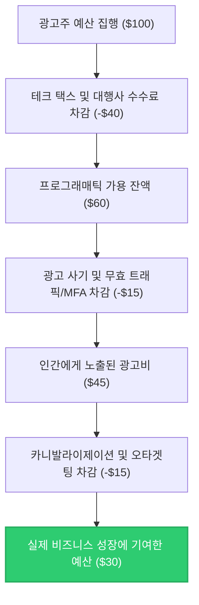

**"우리가 광고비로 100달러를 쓸 때, 실제로 진짜 사람인 소비자에게 도달해 비즈니스 성장을 이끌어내는 돈은 단 30달러 내외에 불과합니다. 나머지 70달러는 중간 거래 수수료, 가짜 봇 트래픽, 어차피 살 사람에게 띄운 무의미한 타겟팅 광고 뒤로 흔적도 없이 사라집니다."**

2025년을 기점으로 글로벌 전체 광고 시장은 사상 최초로 **1조 달러($1T, 한화 약 1,300조 원) 돌파**라는 대기록을 달성했습니다. 이 거대한 자금 흐름의 70% 이상을 디지털 광고가 이끌고 있습니다. 하지만 대시보드에 찍히는 화려한 ROAS와 클릭 수 뒤편에는 마케터들이 외면하고 싶어 하는 거대한 낭비의 블랙홀이 도사리고 있습니다. 

이번 포스트에서는 글로벌 광고비 1조 달러 시대에 마케터의 예산이 구체적으로 어떤 경로를 통해 낭비되고 있는지 관련 통계와 학술 데이터를 기반으로 추정해 봅니다.

---

## 1. 1조 달러 시장의 탄생과 디지털 광고의 지배
글로벌 마케팅 및 매체 대행 그룹인 WPP(GroupM)와 eMarketer 등 주요 리서치 기관들의 발표에 따르면, 글로벌 전체 광고 시장은 2025년 기준 **1조 500억-1조 1,400억 달러** 규모에 달하는 것으로 분석되었습니다. 

여기서 한 가지 짚고 넘어가야 할 사실이 있습니다. 흔히 '디지털 마케팅 시장 $1T'와 '전체 광고 시장 $1T'를 혼용하곤 하지만, 엄밀히 말해 **전체 매체 광고비**가 1조 달러를 돌파한 것이며, 그중 디지털 광고 시장의 비중은 **약 70-75% (약 7,400억-7,800억 달러)** 수준입니다. (단, 기업들이 지출하는 웹사이트 구축, CRM 마케팅 툴 솔루션 구독료, 컨설팅 비용 등 광의의 디지털 마케팅 에코시스템 전체를 합산할 경우 디지털 마케팅 시장 자체만으로도 이미 1조 달러를 훨씬 초과합니다.)

보다 자세한 연도별/기관별 추정치의 편차에 대해서는 [[글로벌 광고 시장 규모 추정치와 기관별 분석 격차]](file:///Users/wook/WookAi/Booklog/content/posts/Marketing/2026-04-29-global-ad-market-size-estimates-gap.md) 포스트에서 다룬 바 있습니다. 

그렇다면 이 천문학적인 디지털 광고 예산 중, 실제로 작동하는 돈은 얼마나 될까요?

---

## 2. 예산을 삼키는 4대 블랙홀

디지털 광고 예산이 최종 소비자에게 도달하기까지 거치는 중간 단계와 그 과정에서 발생하는 손실을 분석해 보면, 낭비의 요인은 크게 4가지로 요약할 수 있습니다.

### ① 테크 택스 (Tech Tax) — 중개 수수료의 덫 (30% - 50% 낭비)
디지털 광고의 대세가 된 프로그래매틱 광고(Programmatic Advertising) 시장에서는 광고주(DSP)와 매체(SSP) 사이에 수많은 애드테크 중개인(Ad Exchange, 데이터 벤더, 부정방지 솔루션 등)이 끼어듭니다. 이들이 떼어가는 수수료를 업계에서는 **'테크 택스(Tech Tax)'**라고 부릅니다.

영국 광고주협회(ISBA)와 PwC가 공동 진행한 공급망 투명성 연구에 따르면, 광고주가 지출한 100달러 중 실제 지면을 제공한 매체(Publisher)에 전달된 금액은 **단 51달러(51%)**에 불과했습니다. 나머지 49%는 기술 수수료로 증발했으며, 심지어 그중 **15%는 추적조차 불가능한 '미지의 델타(Unknown Delta)'**로 분류되었습니다. 이 수수료의 정체에 대해서는 [[DSP와 SSP 사이, 내 예산 절반은 어디로 사라졌나? (Tech Tax의 실체)]](file:///Users/wook/WookAi/Booklog/content/posts/Marketing/2026-05-12-adtech-supply-chain-tech-tax.md)에서 더 상세히 확인하실 수 있습니다.

또한, **미국 광고주협회(ANA)의 2025년 Q2 프로그래매틱 투명성 벤치마크 보고서**에 따르면, ANA 가입 기업들이 프로그래매틱 오픈 마켓을 통해 낭비한 금액만 글로벌 기준으로 **268억 달러(한화 약 35조 원)**에 이릅니다. 이는 2023년 조사($20B) 대비 34%나 급증한 수치입니다.

### ② 광고 사기 및 무효 트래픽 (Ad Fraud & IVT) (10% - 25% 낭비)
두 번째 블랙홀은 인간이 아닌 프로그램이 광고를 보고 클릭하는 광고 사기(Ad Fraud) 영역입니다.
*   **봇 트래픽(Bot Traffic):** 마케팅 소프트웨어 회사들의 분석에 따르면 전체 웹 트래픽의 거의 절반(49.6%)이 봇에 의해 발생하며, 광고 입찰 과정에서도 수많은 악성 봇이 인간 사용자인 척 가장하여 광고 노출과 클릭을 유도하고 예산을 빼앗아 갑니다.
*   **MFA(Made-for-Advertising) 사이트:** 오직 광고 노출 수익만을 얻기 위해 무의미한 낚시성 콘텐츠와 수십 개의 광고 단위로 도배된 가짜 사이트들입니다. ANA 보고서에 따르면 프로그래매틱 오픈 웹 광고 예산의 **15%-21%**가 이러한 MFA 사이트로 흘러 들어가 낭비되고 있습니다.
*   **클릭 인젝션(Click Injection) 및 SDK 스푸핑:** 유저의 실제 오가닉 앱 설치 시점을 탐지해 가짜 광고 클릭 신호를 주입하여 성과를 가로채는 지능형 사기 수법입니다. 

### ③ 잘못된 타겟팅과 카니발라이제이션 (Targeting Trap) (15% - 30% 낭비)
많은 플랫폼이 '초정밀 타겟팅'을 내세우지만, 현실은 다릅니다.
*   **쿠키 종말과 매칭 저하:** 서드파티 쿠키 제한 등으로 인해 타겟팅의 정확도가 떨어져 엉뚱한 타겟에게 노출되는 광고 예산이 막대합니다.
*   **증분성(Incrementality)의 부재:** 광고를 보여주지 않았어도 어차피 구매하거나 앱을 설치했을 고객에게 광고를 노출하여 성과를 가로채는 현상입니다. 대표적으로 **우버(Uber)가 1억 달러의 모바일 퍼포먼스 광고를 완전히 중단했음에도 신규 설치 수에 아무런 변화가 없었던 사건**이 있습니다. 자세한 메커니즘은 [[우버(Uber)의 1억 달러 어트리뷰션 사기 사태 심층 분석]](file:///Users/wook/WookAi/Booklog/content/posts/2026-05-19-uber-100m-attribution-fraud-case.ko.md) 포스트를 참고하십시오.

### ④ 대행사 수수료 및 간접 비용 (Agency Markup) (5% - 15% 낭비)
광고를 집행하고 최적화하는 과정에서 투입되는 대행사 수수료(Agency Fee), 솔루션 라이선스 비용 및 보고서 작성 마크업 등 직접적인 매체 비용 외의 수수료 역시 광고주 예산에서 차감되는 요소입니다.

---

## 3. 종합 예산 낭비 추정: 100달러의 여행
앞서 살펴본 비율들을 종합하여, 마케터가 100달러의 예산을 디지털 광고(특히 프로그래매틱 디스플레이/비디오 영역)에 투자했을 때 최종 생존하는 **'진짜 작동하는 광고비(Working & Human-Viewed Media)'**를 시뮬레이션해 보겠습니다.

1.  **시작 금액:** `$100`
2.  **테크 택스 및 대행사 마크업 차감 (-40%):** DSP/SSP 솔루션 피, 익스체인지 수수료, 데이터 사용료, 대행사 관리비를 떼고 나면 매체사(Publisher) 측으로 송금되는 금액은 `$60` 수준입니다.
3.  **광고 사기 및 무효 트래픽/MFA 차감 (-25%):** 송금된 지면 중 약 25%에 달하는 비용이 봇 트래픽, MFA 사이트 노출, 보이지 않는 광고 스태킹 등으로 증발합니다. 남은 실질 광고비는 `$45` 수준입니다.
4.  **카니발라이제이션 및 오타겟팅 차감 (-33%):** 노출된 광고 중 어차피 오가닉으로 살 고객에게 낭비된 예산이나, 잘못 설정된 타겟으로 인한 유실액(약 15달러)을 뺍니다.
5.  **비즈니스 성장에 순수하게 기여한 최종 금액 (Working & Incremental Media):** **`약 $30`**

즉, 보수적으로 추정해도 디지털 광고비의 **20%-40%는 기술적 낭비(사기/수수료)로 무조건 소실**되며, 비즈니스 성과적 측면에서의 **'무의미한 낭비'까지 합산하면 최대 60%-70%의 광고비가 공중분해**되고 있는 셈입니다. 

이를 2025년 글로벌 디지털 광고 시장 규모($7,400억 달러 기준)에 그대로 대입해 보면, 매년 **최소 $1,480억 - $2,960억 달러 (보수적 기준 20-40%)**, 실질 증분성 낭비까지 포함할 시 **$4,000억 달러 이상(한화 약 520조 원)**이 허공으로 사라지고 있다는 충격적인 계산이 나옵니다.

---

## 4. 마케터가 낭비를 멈추기 위해 해야 할 일
천문학적인 예산 누수를 방어하기 위해 CMO와 데이터 마케터들은 다음과 같은 방어 기제를 가동해야 합니다.

1.  **공급망 최적화 (SPO, Supply Path Optimization) 실행:** 불필요한 중간 Ad Exchange와 리셀러 단계를 과감히 쳐내고, 프리미엄 매체 및 SSP와 다이렉트 거래(PMP 등) 비율을 높여야 합니다.
2.  **로그 레벨 데이터(Log-level Data) 투명성 요구:** 단순 대시보드 리포트에 안주하지 말고, 각 입찰별 수수료와 매체 ID가 찍힌 로데이터 분석 권한을 파트너사 계약 조건에 포함해야 합니다.
3.  **지속적인 증분성(Incrementality) 테스트:** 광고 성과를 무조건 신뢰하지 말고, 특정 지역이나 미디어를 대상으로 광고 집행을 중단해보는 'Turn-off' 실험을 정기적으로 수행해 오가닉 잠식 효과를 정량화해야 합니다.

측정할 수 없거나 블랙박스 뒤에 숨겨진 효율 지표는 언제나 누군가의 수수료 챙기기에 악용되기 쉽습니다. 1조 달러 시장의 화려함 뒤에 숨겨진 70%의 낭비를 인지하는 것, 그것이 데이터 리터러시를 갖춘 현대 마케터의 시작점입니다.

---

## 📚 참고자료
1. Association of National Advertisers (ANA). (2025). *Programmatic Transparency Benchmark Report (Q2 2025)*. (글로벌 프로그래매틱 광고 낭비 규모 $26.8B 및 MFA 유입률 분석 자료)
2. ISBA & PwC. (2020). *Programmatic Supply Chain Transparency Study*. (15% Unknown Delta 및 51% Publisher Payout 최초 입증 연구)
3. Juniper Research. (2023). *Combating Ad Fraud: Market Forecasts & Losses*. (글로벌 광고 사기 피해 규모 예측 보고서)
4. Tadelis, S., et al. (2015). *Consumer Heterogeneity and Paid Search Effectiveness: A Large-Scale Field Experiment*. Econometrica. (브랜드 키워드 광고의 오가닉 잠식 효과 및 증분성 입증 학술 논문)
5. [[글로벌 광고 시장 규모 추정치와 기관별 분석 격차]](file:///Users/wook/WookAi/Booklog/content/posts/Marketing/2026-04-29-global-ad-market-size-estimates-gap.md)
6. [[DSP와 SSP 사이, 내 예산 절반은 어디로 사라졌나? (Tech Tax의 실체)]](file:///Users/wook/WookAi/Booklog/content/posts/Marketing/2026-05-12-adtech-supply-chain-tech-tax.md)
7. [[우버(Uber)의 1억 달러 어트리뷰션 사기 사태 심층 분석]](file:///Users/wook/WookAi/Booklog/content/posts/2026-05-19-uber-100m-attribution-fraud-case.ko.md)
