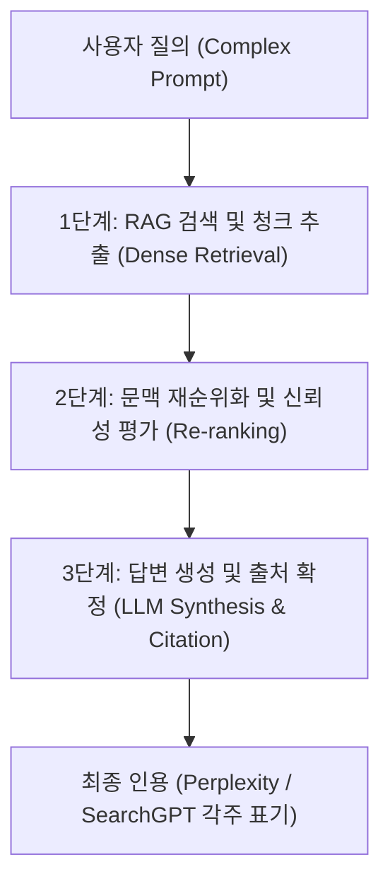

검색 패러다임이 20여 년 만에 근본적인 구조 변화를 맞이했습니다. 사용자의 질의(Query)에 맞춰 관련 웹페이지 링크를 나열하던 구글의 색인 기반 검색(Information Retrieval)은 이제 거대언어모델(LLM)이 웹 데이터를 실시간으로 크롤링하고 종합하여 단일 답변을 제시하는 **'생성형 검색(Generative Search)'**으로 대체되고 있습니다.

이러한 환경에서 기존의 검색엔진 최적화(SEO) 전략은 한계에 직면했습니다. 메타 태그와 역링크(Backlink) 수량에 의존하던 전통적 방식으로는 LLM의 인용 풀(Citation Pool)에 편입될 수 없습니다. 이제 기업과 브랜드의 디지털 가시성은 **'생성형 엔진 최적화(GEO, Generative Engine Optimization)'**에 의해 결정됩니다.

---

## 1. 전통적 SEO와 생성형 엔진 최적화(GEO)의 메커니즘 비교

기존 검색엔진은 페이지랭크(PageRank) 알고리즘을 중심으로 앵커 텍스트, 도메인 권위, 키워드 밀도를 점수화하여 순위를 매겼습니다. 반면 생성형 검색 엔진(SearchGPT, Perplexity, Gemini, Claude)은 **RAG(검색 증강 생성, Retrieval-Augmented Generation)** 파이프라인을 거쳐 작동합니다.

| 비교 항목 | 전통적 검색엔진 최적화 (SEO) | 생성형 엔진 최적화 (GEO) |
| :--- | :--- | :--- |
| **최종 목표** | 검색 결과(SERP) 1페이지 상단 노출 및 클릭(CTR) | LLM 생성 답변 내 팩트 인용(Citation) 및 소스 링크 확보 |
| **핵심 알고리즘** | PageRank, 키워드 매칭, 클릭률 신호 | RAG 임베딩 유사도, 신뢰성 가중치, 문맥 청킹(Chunking) |
| **콘텐츠 평가 단위** | URL(웹페이지 전체 단위) | 텍스트 청크(단락 단위의 정보 밀도 및 명제) |
| **정보 선호도** | 키워드가 반복 배치된 장문 콘텐츠 | 권위 있는 1차 출처, 구체적 통계 수치, 검증 가능한 논리 구조 |

기존 SEO가 '검색 로봇에게 페이지를 보여주는 기술'이었다면, GEO는 **'지능형 에이전트가 신뢰할 수 있는 사실(Fact)로 채택하도록 정보의 구조를 설계하는 기술'**입니다.

---

## 2. LLM이 출처를 인용하는 3단계 아키텍처

생성형 AI가 질문에 답변하면서 특정 웹페이지를 각주나 출처로 인용하는 과정은 수학적·통계적 필터링을 거칩니다. 프린스턴 대학교와 조지아 공대 연구진이 발표한 연구(*GEO: Generative Engine Optimization, Aggarwal et al., 2023*)에 따르면, LLM 인용 파이프라인은 다음의 세 단계를 따릅니다.

### 1) Dense Retrieval (의미 기반 고밀도 검색)
검색 엔진은 사용자의 질문을 고차원 벡터로 변환한 뒤, 웹에서 수집된 수십억 개의 텍스트 청크 중 의미적 유사도(Cosine Similarity)가 가장 높은 상위 20~50개 청크를 1차 추출합니다. 이때 추상적이거나 미사여구가 많은 문장은 임베딩 공간에서 질문과의 거리가 멀어져 1차 필터에서 탈락합니다.

### 2) Authority & Re-ranking (권위 및 신뢰성 재평가)
추출된 청크 중 교차 검증이 가능한 데이터, 공식 기관 통계, 수치가 포함된 텍스트 청크에 높은 가중치가 부여됩니다. 단순한 주장이 담긴 글보다 *"2025년 기준 글로벌 전환율은 2.3%로 집계되었다"*와 같이 정량 데이터가 포함된 문장이 우선순위 상단에 재배치됩니다.

### 3) LLM Synthesis (답변 합성 및 인용구 결합)
최종 단계에서 모델은 프롬프트 컨텍스트 창에 입력된 상위 청크들을 조합하여 답변을 서술합니다. 이때 **자신의 문장을 뒷받침하는 결정적 근거를 제공한 소스에만 앵커 링크(각주 번호)**를 부여합니다.

---

## 3. GEO 가시성을 극대화하는 3대 실행 전략

### 전략 1: 통계 인용 및 1차 데이터 삽입 (Statistics & Quantitative Evidence)
연구에 따르면, 콘텐츠에 신뢰할 수 있는 정량적 통계(숫자, 백분율, 표)를 포함하는 것만으로도 LLM의 인용 빈도가 **최대 37%까지 증가**합니다. 주관적인 서술형 문장을 지양하고, 구체적인 수치와 조사 시점을 명시해야 합니다.

### 전략 2: 구조화된 명제 중심의 청킹 (Clear Propositional Formatting)
LLM은 긴 줄글보다 명확한 헤딩(H2, H3) 아래에 단일 명제(Proposition)와 근거가 결합된 블록을 훨씬 효율적으로 파싱합니다. 단락 첫 문장에 핵심 결론을 정의하고, 뒤이어 인과관계를 설명하는 '역피라미드형 비즈니스 문체'가 GEO에 가장 유리합니다.

### 전략 3: 저자 권위와 E-E-A-T 메타데이터의 코드화
Perplexity와 구글 AI Overviews는 콘텐츠 작성 주체의 전문성을 철저히 검증합니다. 사이트 내에 `TechArticle` 및 `Person` 형태의 Schema.org JSON-LD 구조화 데이터를 구현하고, 저자의 실제 학술/실무 이력(LinkedIn, 논문 이력)을 기계 가독형(Machine-Readable) 코드로 제공해야 합니다.

---

## 📚 참고자료

1. Aggarwal, P., et al. (2023). *"GEO: Generative Engine Optimization."* arXiv preprint arXiv:2311.09735. [arXiv:2311.09735](https://arxiv.org/abs/2311.09735)
2. Lewis, P., et al. (2020). *"Retrieval-Augmented Generation for Knowledge-Intensive NLP Tasks."* Advances in Neural Information Processing Systems (NeurIPS 2020).
3. Perplexity AI. (2024). *"How Perplexity's Search Engine Works: The RAG and Citation Infrastructure."* Official Engineering Blog.
4. Google Search Central. (2024). *"Creating Helpful, Reliable, People-First Content & AI-Generated Content Guidelines."* Google for Developers.
