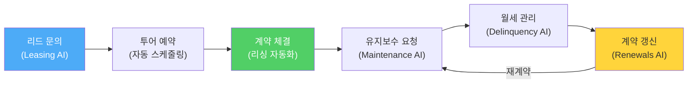

미국 부동산 시장에서 "Elise가 응답합니다"라는 문구는 이제 낯설지 않습니다. 수백만 명의 미국 임차인이 아파트를 문의할 때, 그들이 처음 대화하는 상대는 사람이 아니라 **AI**입니다. 그리고 그 AI 뒤에 있는 회사가 바로 **EliseAI**입니다.

2017년 설립, 2024년 유니콘 달성, 2025년 ARR 1억 달러 돌파. 이 회사는 어떻게 이렇게 빠르게 성장했을까요?

---

## 1. 설립 배경: MIT와 캠브리지에서 만난 두 창업자

### 👤 민나 송 (Minna Song) — CEO

EliseAI의 공동 창업자이자 CEO인 민나 송은 **MIT(매사추세츠공과대학교)** 출신의 컴퓨터 과학자입니다. 그녀가 특별한 점은, 부동산 업계 경험이 전혀 없었다는 것입니다.

민나 송은 부동산이라는 산업을 "첫 번째 원칙(First Principles)"에서 접근했습니다. 그녀가 발견한 핵심 문제는 명확했습니다.

> **"미국 멀티패밀리(다세대 임대) 부동산에서, 잠재 임차인 문의의 약 50%가 응답되지 않고 유실됩니다. 리싱 팀은 업무 시간 외 문의에 대응할 수 없고, 수십 개의 문의가 동시에 들어오면 물리적으로 처리할 수 없기 때문입니다."**

### 👤 토니 스토야노프 (Tony Stoyanov) — CTO

공동 창업자 토니 스토야노프는 **영국 케임브리지 대학교** 출신의 엔지니어입니다. NLP(자연어 처리)와 대화형 AI에 깊은 전문성을 가진 그는, 단순한 챗봇이 아닌 **복잡한 다중 턴(Multi-turn) 대화를 처리할 수 있는 AI 시스템**을 구축하는 데 집중했습니다.

두 사람은 2017년 뉴욕에서 **MeetElise**라는 이름으로 회사를 설립했습니다. 이후 EliseAI로 사명을 변경하며, 단순한 일정 조율 봇에서 **부동산 운영의 전체 라이프사이클을 자동화하는 AI 운영 시스템**으로 진화했습니다.

---

## 2. EliseAI는 무엇을 하는 회사인가?

한 문장으로 요약하면: **EliseAI는 부동산 임대 관리의 반복적인 커뮤니케이션을 AI로 완전 자동화하는 플랫폼**입니다.

### 🏠 핵심 제품: AI 리싱 어시스턴트 (Leasing AI)

EliseAI의 AI 리싱 어시스턴트는 24시간 365일 잠재 임차인의 문의에 응답합니다. 단순한 FAQ 챗봇이 아닙니다.

| 기능 | 설명 |
|------|------|
| **멀티채널 대화** | 웹챗, SMS, 이메일, 전화(음성) — 모든 채널에서 동시에 수백 건의 대화 처리 |
| **자동 투어 스케줄링** | 실시간 빈 시간 확인 → 예약 확정 → 확인 문자 + 길 안내까지 자동 발송 |
| **맥락 유지 대화** | "어제 봤던 그 방이요" 같은 다중 턴 대화에서도 맥락을 정확히 추적 |
| **No-show 방지** | 투어 전 리마인더 자동 발송, 취소 시 재예약 유도 |
| **리드 우선순위화** | 전환 가능성이 높은 리드를 자동으로 식별하여 인간 에이전트에게 전달 |

### 🔧 ResidentAI Suite: 임차인 라이프사이클 전체 자동화

리싱(계약 전) 단계를 넘어, 계약 후 임차인 관리까지 확장한 것이 EliseAI의 진정한 강점입니다.

- **Maintenance AI:** 임차인이 "싱크대 물이 새요"라고 문자를 보내면, AI가 자동으로 작업 지시서(Work Order)를 생성
- **Delinquency AI:** 월세 연체 시 자동 리마인더 발송 및 후속 조치
- **Renewals AI:** 계약 만료 전 자동으로 갱신 제안서 생성 및 발송

---

## 3. 성장 궤적: 숫자로 보는 EliseAI의 폭발적 성장

### 📈 투자 라운드 및 기업가치 변화

| 라운드 | 시기 | 투자 금액 | 기업가치 | 주요 투자자 |
|--------|------|----------|---------|-----------|
| 시드-시리즈 B | 2017-2021 | 비공개 | — | 초기 투자자 |
| 시리즈 C | 2022 | 비공개 | — | — |
| **시리즈 D** | **2024년 8월** | **$75M (약 1,000억 원)** | **$1B+ (유니콘 달성)** | **Sapphire Ventures** |
| **시리즈 E** | **2025년 8월** | **$250M (약 3,250억 원)** | 비공개 (추정 $2B+) | **Andreessen Horowitz(a16z), Bessemer Venture Partners** |

### 📊 핵심 성장 지표

- **ARR(연간 반복 매출):** 시리즈 C에서 D까지 **2.5배 이상 성장**, 2025년 8월 기준 **1억 달러 돌파**
- **직원 수:** 2024년 8월 150명 → 2025년 8월 **300명 이상** (1년 내 2배 성장)
- **고객 기반:** 미국 상위 50대 멀티패밀리 운영사의 **과반수 이상**이 EliseAI 사용

---

## 4. 왜 이렇게 빠르게 성장했는가? — 5가지 핵심 성장 동력

### 🚀 동력 1: "50%의 리드가 유실된다"는 압도적 페인포인트

미국 멀티패밀리 부동산은 연간 수조 원 규모의 시장이지만, 리싱 프로세스는 놀라울 정도로 비효율적이었습니다. 업무 시간 외(오후 6시-오전 9시)에 들어오는 문의가 전체의 **약 50%**에 달하지만, 대부분의 리싱 팀은 이 문의에 대응할 수 없었습니다.

EliseAI는 이 "유실되는 50%"를 **즉시 포착하여 응답하는 AI**를 제공함으로써, 명확하고 측정 가능한 ROI를 증명했습니다.

### 🚀 동력 2: 점유율(Occupancy) 향상이라는 증명 가능한 성과

EliseAI와 ALN Apartment Data가 3,763개 커뮤니티를 대상으로 수행한 대규모 분석에서:

> **EliseAI를 도입한 부동산은 도입 후 12개월간 지역 시장 평균 대비 점유율이 평균 2%p 더 높았습니다.**

| 지표 | 도입 전 | 도입 후 12개월 |
|------|--------|-------------|
| 시장 대비 점유율 | 시장 평균 이하 (약 1%p 하락 추세) | **시장 평균 +2%p** |
| 연간 순영업이익(NOI) 개선 | 기준 | **유닛당 +$731** (Villa Serena 사례) |
| 점유율 (GoldOller 사례) | 기준 | **+2%p 상승** |

2%의 점유율 차이는 작아 보이지만, 수천 세대를 운영하는 대형 운영사에게는 **연간 수백만 달러의 추가 매출**을 의미합니다.

### 🚀 동력 3: 중앙집중화(Centralization) 트렌드와의 완벽한 일치

미국 멀티패밀리 업계는 2020년대 들어 **리싱 업무의 중앙집중화** 트렌드가 가속화되고 있습니다. 각 단지마다 별도의 리싱 에이전트를 두는 대신, 본사에서 중앙 관리하는 모델로 전환하는 것입니다.

EliseAI는 이 트렌드의 **핵심 인프라**로 자리 잡았습니다. AI가 1차 응대를 처리하고, 인간 에이전트는 고부가가치 업무(투어 진행, 계약 상담)에 집중하는 구조입니다.

### 🚀 동력 4: 단순 챗봇이 아닌 "AI 네이티브" 기술

EliseAI가 경쟁사와 차별화되는 핵심은 **처음부터 대화형 AI를 위해 설계된 기술 스택**입니다.

기존 부동산 관리 소프트웨어(Yardi, Entrata, AppFolio)는 전통적인 PMS(Property Management System)에 AI 기능을 "추가"하는 방식입니다. 반면 EliseAI는:

- **자체 NLP 엔진**으로 부동산 도메인에 특화된 대화 처리
- **수억 건의 부동산 대화 데이터**를 학습하여 정확도 향상
- **PMS와의 양방향 통합**으로 실시간 데이터 기반 응답 (빈 유닛, 가격, 입주 가능일 등)

### 🚀 동력 5: 헬스케어로의 전략적 확장

부동산에서 검증된 대화형 AI 기술을 **헬스케어** 분야로 확장한 것은 EliseAI의 가장 대담한 전략적 결정입니다.

**HealthAI** 제품은 의료 기관의 비임상 행정 업무를 자동화합니다:
- 환자 예약 스케줄링 (EHR/EMR 연동)
- 전화 응대 및 안내 자동화
- 청구 및 결제 리마인더

의료 분야의 프론트 데스크 업무는 부동산 리싱과 구조적으로 유사합니다 — **대량의 반복적 문의, 24시간 대응 필요, 인력 부족**. EliseAI는 이 유사성을 활용하여 TAM(Total Addressable Market)을 폭발적으로 확대했습니다.

---

## 5. 경쟁 환경과 향후 전망

### 🏆 경쟁사 비교

| 기업 | 접근 방식 | 강점 | 약점 |
|------|---------|------|------|
| **EliseAI** | AI 네이티브 (대화 AI 전문) | 도메인 특화 NLP, 방대한 데이터, 의료 확장 | PMS 기능 미제공 |
| **AppFolio** | PMS에 AI 기능 추가 | 통합 플랫폼, SMB 시장 강점 | AI가 보조 기능 수준 |
| **Entrata** | PMS + AI 리싱 도구 | 대형 운영사 고객 기반 | AI 기술이 후발주자 |
| **Yardi** | 전통 PMS 강자 | 시장 점유율 1위, 깊은 통합 | AI 도입 속도 느림 |
| **Funnel Leasing** | AI 리싱 특화 | 사용 편의성 | 규모 및 데이터에서 EliseAI 대비 열세 |

### 🔮 2026년 이후 전망

1. **부동산 AI 도입률 가속화:** 업계 분석가들은 2026년까지 멀티패밀리 운영사의 약 75%가 AI 기반 워크플로우를 도입할 것으로 전망합니다. 나머지 25%는 장기적 경쟁 열위에 놓일 위험이 있습니다.

2. **에이전틱 AI(Agentic AI)로의 진화:** 단순 응답형 AI에서, 목표를 설정하면 자율적으로 행동하는 "에이전틱 AI"로의 진화가 핵심 트렌드입니다. 예: "이 유닛의 점유율을 95%로 올려라" → AI가 리드 관리, 가격 조정, 투어 스케줄링을 자율적으로 수행.

3. **헬스케어 시장의 거대한 기회:** 미국 의료 행정 비용은 연간 수천억 달러 규모입니다. EliseAI의 HealthAI가 이 시장에서 부동산만큼의 지배력을 확보한다면, 기업 가치는 현재의 수 배에 달할 수 있습니다.

4. **수익성 전환:** 2025년 말-2026년 초에 목표 수익성(Targeted Profitability) 달성을 선언할 것으로 예상됩니다. ARR 1억 달러를 넘긴 상태에서의 수익성 전환은 강력한 시그널이 됩니다.

---

## 6. EliseAI가 주는 시사점

### 💡 시사점 1: "기술 창업자가 비기술 산업을 혁신한다"
민나 송과 토니 스토야노프는 부동산 경험이 없었습니다. 하지만 바로 그 "외부자 시각"이 업계가 수십 년간 당연시한 비효율을 발견하게 했습니다. **도메인 전문성보다 문제 해결 능력이 중요한 시대**입니다.

### 💡 시사점 2: "AI의 가치는 측정 가능한 ROI에서 나온다"
EliseAI의 성장이 빠른 이유는 **점유율 +2%p, NOI 유닛당 +$731**이라는 구체적 숫자를 제시할 수 있기 때문입니다. "AI로 효율적이 되었다"는 모호한 주장이 아니라, CFO가 바로 이해할 수 있는 재무 지표로 증명한 것입니다.

### 💡 시사점 3: "수직 AI(Vertical AI)의 시대"
범용 AI 챗봇(ChatGPT, Claude)은 모든 것을 할 수 있지만, 특정 산업의 복잡한 워크플로우를 완벽히 자동화하지는 못합니다. EliseAI는 **부동산이라는 하나의 수직 시장에 깊이 파고든 후**, 유사 구조의 헬스케어로 확장하는 "수직 → 인접 수직" 전략을 구사했습니다.

---

## 결론: EliseAI는 "AI가 일자리를 대체한다"의 실제 사례인가?

EliseAI의 성장은 불편한 질문을 던집니다. **리싱 에이전트, 프론트 데스크 직원은 AI로 대체되는 것인가?**

현재까지의 데이터는 "완전 대체"보다는 **"역할 전환"**에 가깝습니다. AI가 반복적 1차 응대를 처리하면, 인간 에이전트는 투어 진행, 커뮤니티 관리, 복잡한 상담 같은 **고부가가치 업무에 집중**할 수 있게 됩니다. 실제로 EliseAI를 도입한 운영사들은 직원을 해고하기보다, **동일한 인원으로 더 많은 단지를 관리**하는 방향으로 운영을 최적화하고 있습니다.

그러나 장기적으로 에이전틱 AI가 더 자율적으로 진화한다면, 이 "역할 전환"이 "역할 축소"로 변할 가능성은 열려 있습니다.

확실한 것은 하나입니다: **EliseAI는 "AI가 실제 비즈니스 가치를 만드는 방법"의 교과서적 사례**이며, 이 회사의 향후 궤적은 수직 AI 스타트업 전체의 방향성을 보여주는 바로미터가 될 것입니다.

---

## 📚 참고자료

- EliseAI 공식 사이트. ([eliseai.com](https://eliseai.com))
- VentureBeat (2024). EliseAI Reaches Unicorn Status with $75M Series D. ([기사 보기](https://venturebeat.com/ai/eliseai-raises-75m-series-d-at-over-1b-valuation/))
- PYMNTS (2025). EliseAI Raises $250M Series E Led by a16z. ([기사 보기](https://www.pymnts.com/artificial-intelligence-2/2025/eliseai-raises-250-million-series-e/))
- EliseAI & ALN Apartment Data (2024). Occupancy Rate Study: 3,763 Communities Analysis. ([보고서](https://eliseai.com/resources))
- The Real Deal (2025). How AI is Transforming Multifamily Leasing. ([기사 보기](https://therealdeal.com/))
- Sapphire Ventures (2024). Why We Led EliseAI's Series D. ([블로그](https://sapphireventures.com/))
- HIT Consultant (2025). EliseAI Expands into Healthcare with HealthAI. ([기사 보기](https://hitconsultant.net/))
- Thesis Driven (2024). Minna Song Interview: Building AI for Housing. ([기사 보기](https://thesisdriven.com/))
