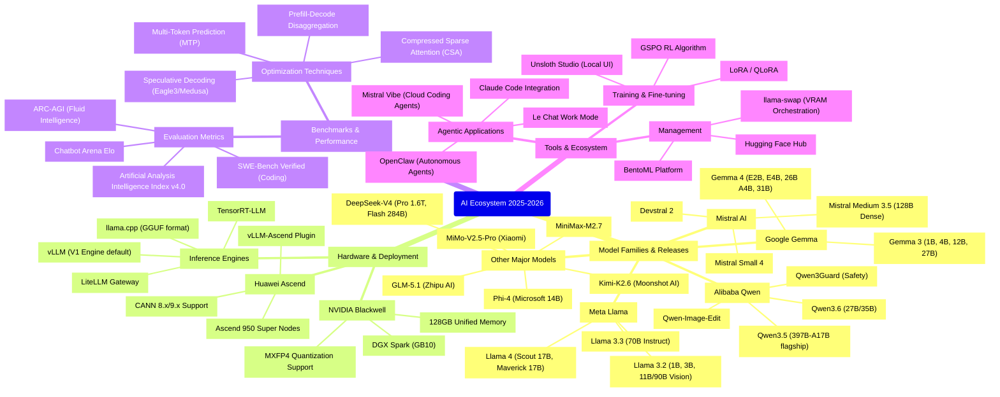

> **요약:** 2026년 5월 현재, 오픈소스 대형 언어 모델(LLM) 생태계는 역사상 그 어느 때보다 뜨거운 격전을 벌이고 있습니다. 불과 지난 한 달 사이에 프론티어급 오픈 가중치(Open-weights) 모델들이 쏟아져 나오며 독점(Closed) 모델들과의 격차를 거의 완벽하게 좁히고 있습니다 [1, 2]. 특히 이번 주는 코딩, 추론, 에이전트(Agent) 워크플로우에 특화된 모델들이 새롭게 재편되는 결정적 시기였습니다.
> 
> 본 포스트에서는 최근 1주일 및 근 한 달간 발표된 Llama 4, Mistral Medium 3.5, DeepSeek V4 등 주요 오픈소스 모델들의 핵심 업데이트와 벤치마크 결과, 그리고 이것이 엔터프라이즈 환경에 미치는 기술적·비즈니스적 시사점을 심층적으로 분석합니다.

---

## 1. 주요 모델 최신 업데이트 및 벤치마크 분석

### 🚀 Mistral Medium 3.5: 코딩과 추론을 하나로 통합한 128B 에이전트 특화 모델
4월 29일에 전격 출시된 **Mistral Medium 3.5**는 단일 128B(1,280억 개) 매개변수의 Dense(밀집) 모델입니다 [1, 3]. 기존에 추론을 담당하던 Magistral과 코딩을 담당하던 Devstral 2를 하나로 통합하여, 챗봇과 에이전트 환경 모두를 단일 가중치로 처리할 수 있게 되었습니다 [3-5].

*   **주요 스펙:** 256K 컨텍스트 윈도우, 텍스트 및 이미지 멀티모달 입력 지원, API 요청당 추론 노력(Reasoning effort) 조절 기능 탑재 [6].
*   **벤치마크:** 실제 GitHub 이슈 해결 능력을 측정하는 **SWE-Bench Verified에서 77.6%**를 기록하며 오픈소스 최상위권의 코딩 능력을 입증했습니다 [7, 8]. 에이전트 벤치마크인 τ³-Telecom에서는 91.4%를 기록했습니다 [8].
*   **사용성:** Mistral Vibe 기반의 원격 코딩 에이전트를 지원하여 클라우드에서 비동기적으로 긴 컨텍스트의 코딩 작업을 수행하도록 최적화되었습니다 [7, 9].

### 🧠 DeepSeek V4: 압도적인 가성비와 1M 컨텍스트 윈도우의 1.6T MoE
4월 22일 출시된 **DeepSeek V4 Pro**는 총 1.6T(1조 6천억 개) 매개변수를 가지지만 활성 매개변수는 49B에 불과한 MoE(전문가 혼합) 모델입니다 [10, 11]. 

*   **주요 스펙:** 1M(100만) 토큰의 컨텍스트 윈도우를 지원하며, HCA(Heavily Compressed Attention) 및 CSA(Compressed Sparse Attention)를 도입해 연산량과 KV 캐시를 획기적으로 줄였습니다 [10, 12].
*   **벤치마크:** 코딩 벤치마크인 **SWE-Bench Verified에서 80.6%**라는 경이로운 점수를 달성하며 GPT-5.5와 맞먹는 성능을 보였습니다 [13, 14]. MATH-500에서도 94%의 성능을 기록했습니다 [15].
*   **라이선스:** 상업적 이용이 매우 자유로운 완전한 **MIT 라이선스**로 배포되어 기업들의 환영을 받고 있습니다 [10, 16]. 실용성을 강조한 284B 크기의 Flash 버전도 함께 제공됩니다 [11].

### 🦙 Meta Llama 4 & Muse Spark: 극단적 컨텍스트 확장과 폐쇄형 모델로의 투트랙 전략
메타는 4월 초 **Llama 4**를 출시하며 MoE 아키텍처로 전환했습니다. 17B 활성 매개변수를 가진 Scout(총 109B)와 Maverick(총 400B) 모델을 공개했습니다 [17]. 특히 Scout 모델은 iRoPE 아키텍처를 적용해 무려 **10M(1,000만) 토큰의 컨텍스트 윈도우**를 지원하여, 대규모 RAG(검색 증강 생성) 워크플로우를 대체할 잠재력을 보여줍니다 [18].

그러나 메타는 오픈소스 전략과 별개로 최근 사내 'Super Intelligence Labs(MSL)'를 통해 **Muse Spark**라는 강력한 비공개(Proprietary) 멀티모달 모델을 발표했습니다 [19, 20]. 이는 GPT-5.4나 Claude Opus 4.7과 직접 경쟁하기 위한 것으로, 메타가 순수 오픈 가중치 전략에서 벗어나 수익성과 통제력을 고려한 폐쇄형 모델을 병행하는 방향으로 선회했음을 시사합니다 [21, 22]. 

### 🇨🇳 중국 오픈소스 LLM의 맹추격 (Kimi K2.6, GLM-5.1)
최근 리더보드 최상위권은 아시아 기반 모델들이 점령하고 있습니다.
*   **Kimi K2.6 (Moonshot AI):** 1T(1조 개) 매개변수의 MoE 모델(활성 32B)로, 256K 컨텍스트를 지원하며 SWE-Bench Verified 80.2%, HumanEval 99.0%를 기록했습니다 [23, 24]. 300개가 넘는 하위 에이전트를 조율하는 능력이 뛰어납니다 [25].
*   **GLM-5.1 (Zhipu AI):** 744B(활성 40B) MoE 모델로, 복잡한 SWE-Bench Pro에서 58.4%를 기록하며 최고 수준의 오픈소스 엔지니어링 에이전트 성능을 보였습니다 [14, 25].

---

## 2. 기술적 시사점 (Technical Implications)

**1) MoE 아키텍처의 완전한 주류화**
올해 최상위(S-Tier 및 A-Tier) 오픈소스 모델들의 가장 큰 특징은 **MoE(Mixture-of-Experts)** 아키텍처의 도입입니다 [26]. DeepSeek V4(1.6T), GLM-5.1(744B), Kimi K2.6(1T) 등은 총 매개변수는 방대하지만, 토큰당 활성화되는 매개변수는 32B-49B 수준으로 유지하여 추론 비용을 획기적으로 절감했습니다 [10, 23, 25, 26]. 유일한 예외인 Mistral Medium 3.5는 128B Dense 아키텍처를 고집했는데, 이는 에이전트 라우팅의 예측 가능성을 높이기 위함으로 보입니다 [6, 23].

**2) 컨텍스트 윈도우의 기하급수적 팽창**
128K 컨텍스트는 이제 오픈소스 모델의 '기본값'이 되었습니다 [26]. Mistral과 Kimi는 256K를 지원하며 [6, 27], DeepSeek V4 Pro는 1M, Llama 4 Scout는 10M에 이릅니다 [10, 18]. 이에 따라 기업들은 단순히 문서를 청킹(Chunking)하여 검색하던 기존 RAG 방식에서 벗어나, 수백만 토큰의 코드베이스나 법률 문서 전체를 한 번에 모델에 입력하는 방향으로 아키텍처를 전환하고 있습니다 [18].

**3) '코딩' 및 '에이전트' 중심의 평가 기준 이동**
단순한 텍스트 생성 능력보다는 복잡한 도구 사용(Tool-use)과 다단계 문제 해결 능력을 평가하는 추세입니다. 장난감 수준의 퍼즐이 아닌 실제 GitHub 이슈 해결 능력을 보는 **SWE-Bench Verified**가 모델의 지능을 가늠하는 가장 중요한 잣대로 부상했습니다 [14, 28]. Mistral 3.5와 GLM-5.1 모두 수백 번의 도구 호출과 자가 수정이 필요한 에이전트 워크플로우에 특화되어 설계되었습니다 [8, 29].

---

## 3. 비즈니스적 시사점 (Business Implications)

**1) 호스팅 경제성의 변화: API vs 로컬 구축**
오픈소스 모델의 성능이 독점 모델을 턱밑까지 추격하면서, 기업들의 ROI(투자 대비 수익) 계산 방식이 달라졌습니다. 예를 들어 Mistral Medium 3.5(128B Dense)는 양자화 없이도 4개의 H100 GPU에서 자체 호스팅(Self-hosting)이 가능합니다 [30]. 일일 5천만 토큰 이상의 트래픽이 발생하는 기업의 경우, 비싼 프론티어 API 요금을 내는 것보다 이러한 오픈소스 모델을 로컬에 구축하는 것이 TCO(총소유비용) 측면에서 훨씬 유리해졌습니다 [4, 30, 31]. 구글의 Gemma 4 모델은 MTP(다중 토큰 예측)를 지원하며 엣지/노트북 수준의 로컬 환경을 타겟팅해 B2B 보안이 중요한 오프라인 환경에서 비용 효율적인 대안을 제시합니다 [32, 33].

**2) 라이선스의 파편화 (Open-washing 논란)**
기업 도입 시 라이선스 검토가 매우 중요해졌습니다. 
*   **DeepSeek V4:** 상업적 이용이 완벽히 보장되는 순수 **MIT 라이선스**를 채택했습니다 [10, 34].
*   **Mistral 3.5 / Kimi K2.6:** **수정된 MIT 라이선스**를 사용하여 수익이나 MAU에 따른 제품 내 상표 표기 등 일부 제한을 두었습니다 [6, 35]. 
*   **Llama 4:** Llama Community License를 통해 7억 명 이상의 MAU를 가진 기업을 제한하며, OSI(오픈소스 이니셔티브)로부터 진정한 오픈소스가 아닌 '오픈워싱(Open-washing)'이라는 비판을 받고 있습니다 [36, 37]. 

## 결론
2026년 5월 현재 오픈소스 LLM은 단순한 '독점 모델의 대안'을 넘어섰습니다. 기업들은 **DeepSeek V4 Pro**를 통해 코딩 및 수학 능력을 최적화하거나, **Llama 4 Scout**로 엄청난 문서량을 한 번에 분석하고, **Mistral Medium 3.5**로 신뢰성 높은 자율 에이전트 시스템을 구축할 수 있는 '선택의 시대'를 맞이했습니다 [38]. 자사의 컴퓨팅 예산과 데이터 보안 요구사항, 그리고 핵심 태스크(추론, 코딩, 단순 챗)를 명확히 정의하고 이에 맞는 최적의 모델을 도입하는 것이 앞으로의 AI 경쟁력을 결정짓는 핵심이 될 것입니다 [39].

## 🧠 생태계 마인드맵 (AI 자동 생성)

