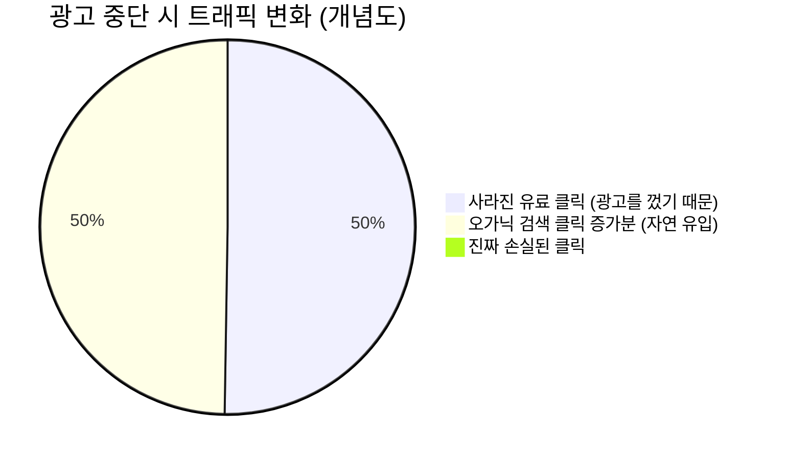

디지털 마케터라면 누구나 한 번쯤 이런 고민을 해봤을 것입니다. **"우리 브랜드 이름(키워드)을 검색할 때 나오는 광고, 꼭 돈 내고 해야 할까?"** 

광고 대행사나 구글, 네이버 같은 플랫폼 담당자들은 이렇게 말합니다. "경쟁사가 우리 브랜드 키워드를 입찰해서 고객을 빼앗아 갈 수 있으니, 방어 차원에서라도 반드시 브랜드 키워드 광고를 해야 합니다." 그리고 실제로 대시보드에는 브랜드 검색광고의 ROAS가 엄청나게 높게 찍힙니다.

하지만 이 높은 ROAS 뒤에는 **자기 잠식(Cannibalization)**이라는 거대한 착시가 숨어 있습니다. 오늘은 디지털 마케팅 역사상 가장 유명하고 충격적인 이베이(eBay)의 실험 논문(Blake et al., 2015)을 통해 이 현상을 낱낱이 파헤쳐 보겠습니다.

---

## 1. 이베이(eBay)의 대규모 중단 실험

2015년, 이베이의 연구진(Blake, Nosko, Tadelis)은 구글 검색광고의 실제 효과(Incrementality)를 측정하기 위해 과감한 결정을 내립니다. 미국 내 특정 지역에서 **이베이 브랜드 키워드("ebay", "e-bay" 등)에 대한 유료 검색 광고를 전면 중단**해 버린 것입니다.

구글이나 대행사의 논리대로라면, 유료 검색광고가 사라졌으니 이베이로 향하는 트래픽이 급감하고 매출이 폭락했어야 합니다. 

### 실험 결과: 충격적인 진실
결과는 정반대였습니다. 유료 광고를 껐음에도 불구하고 전체 트래픽과 매출에는 **유의미한 변화가 전혀 없었습니다.**



어떻게 된 일일까요? 이베이 검색광고를 클릭하던 사람들은 이미 '이베이에 가겠다'는 뚜렷한 목적(Intent)을 가진 충성 고객이었습니다. 광고를 끄자, 사람들은 자연스럽게 그 바로 밑에 있는 **오가닉(자연 검색) 링크를 클릭해서 이베이로 접속**했습니다. 

즉, 이베이가 지출하던 막대한 브랜드 검색광고 예산은 **"어차피 공짜(Organic)로 들어올 사람들을 굳이 돈을 내고(Paid) 데려오는" 완벽한 예산 낭비(Cannibalization)**였던 것입니다.

---

## 2. 왜 ROAS의 착시가 발생하는가?

브랜드 검색광고의 ROAS가 유독 높은 이유는, 그 광고가 '고객을 설득'했기 때문이 아닙니다. 이미 지갑을 열 준비가 끝난 고객들의 동선 가장 마지막에 서서 **통행세(Toll)**를 걷었을 뿐입니다. 

이를 통해 세 가지 중요한 통찰을 얻을 수 있습니다.

1. **상관관계 vs 인과관계의 혼동:** 광고를 클릭한 사람이 물건을 샀다는 것(상관관계)이, 그 광고 때문에 물건을 샀다는 것(인과관계)을 증명하지 않습니다.
2. **비대칭적 정보 (Asymmetric Information):** 광고 플랫폼은 유료 클릭이 일으킨 매출만 강조할 뿐, "광고가 없었을 때 발생했을 오가닉 클릭"은 리포트에 보여주지 않습니다.
3. **거대 브랜드의 딜레마:** 브랜드 인지도가 높을수록(예: 나이키, 쿠팡) 브랜드 검색광고의 증분성(Incrementality)은 0에 수렴합니다.

---

## 3. 경쟁사 방어 논리는 타당한가?

대행사가 주장하는 "경쟁사가 우리 키워드를 뺏어갈 수 있다"는 방어 논리는 어떨까요? 
이 논리가 성립하려면 경쟁사의 광고 카피나 제안이 워낙 강력해서, 우리 브랜드를 검색하고 들어온 사람의 마음을 그 짧은 찰나에 돌려세워야 합니다. 

하지만 실제로 이런 변심이 일어나는 비율은 극히 낮습니다. 오히려 이 미미한 방어 효과를 위해 연간 수천만 원, 수억 원의 예산을 고정적으로 플랫폼에 바치고 있는 것은 아닌지 냉정하게 평가해야 합니다.

```mermaid
graph TD
    A[사용자가 '나이키' 검색] --> B{브랜드 검색광고 진행 중?}
    B -- Yes --> C[유료 광고 클릭 (비용 발생)]
    C --> D[나이키 접속 및 구매]
    B -- No --> E[경쟁사 아디다스 광고 노출]
    E --> F{사용자가 마음을 바꿈?}
    F -- No --> G[자연 검색 결과 클릭 (비용 없음)]
    G --> D
    F -- Yes --> H[아디다스 접속 (아주 드문 확률)]
    
    style C fill:#f9d0c4,stroke:#f05050
    style G fill:#d4edda,stroke:#28a745
```

---

## 4. 실무자를 위한 액션 플랜

그렇다면 브랜드 검색광고를 지금 당장 다 꺼버려야 할까요? 무작정 끄기보다는 **검증(Testing)**이 필요합니다.

1. **지역별 A/B 테스트 (Geo-Experiment):** 전체 광고를 끄는 것이 부담스럽다면, 특정 지역(예: 대전, 광주)에서만 브랜드 검색광고를 1~2주간 중단해 보세요. 그리고 해당 지역의 오가닉 트래픽 증가량이 유료 트래픽 감소량을 얼마나 메우는지(Cannibalization Rate) 확인해야 합니다.
2. **타겟별 예산 재분배:** 이미 우리 브랜드를 알고 있는 기존 고객/VIP 타겟에게 나가는 검색 광고 예산을 줄이고, 논브랜드(Non-brand) 키워드나 신규 고객 획득 채널로 예산을 옮겨야 합니다.
3. **SEO(검색엔진 최적화) 투자:** 자연 검색 결과의 가장 첫 페이지, 첫 줄에 우리 브랜드가 안정적으로 노출되도록 SEO를 강화하는 것이 장기적으로 훨씬 저렴하고 강력한 방어책입니다.

브랜드 검색광고는 때때로 필요하지만, 그것이 내는 '숫자(ROAS)'를 맹신해서는 안 됩니다. 마케터는 플랫폼이 던져주는 리포트를 넘어, 이 예산이 **진짜 증분성(True Incrementality)**을 만들어내고 있는지 끊임없이 의심해야 합니다.

다음 포스트에서는 디지털 광고 시장 자체가 '서브프라임 모기지' 사태처럼 엄청난 거품을 안고 있다는 거시적 비판에 대해 다루어 보겠습니다.

---
## 📚 참고자료
- **Blake, T., Nosko, C., & Tadelis, S. (2015).** *Consumer Heterogeneity and Paid Search Effectiveness: A Large-Scale Field Experiment.* Econometrica, 83(1), 155-174. (이베이 검색광고 실험 논문)
- **Incrementality Testing Frameworks:** 증분성 테스트를 통한 오가닉 트래픽 잠식률 계산 방법론.
