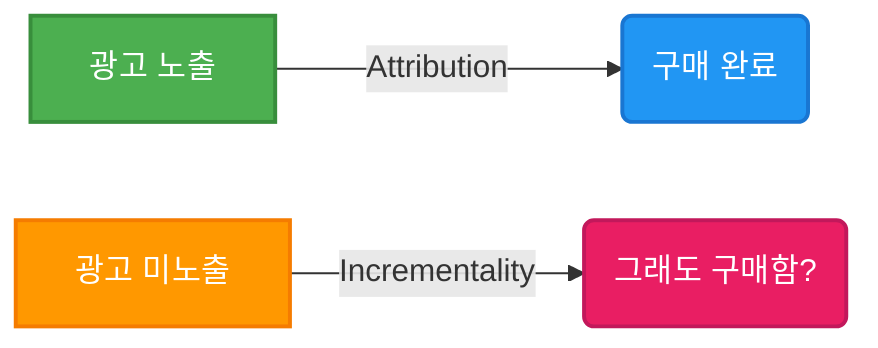
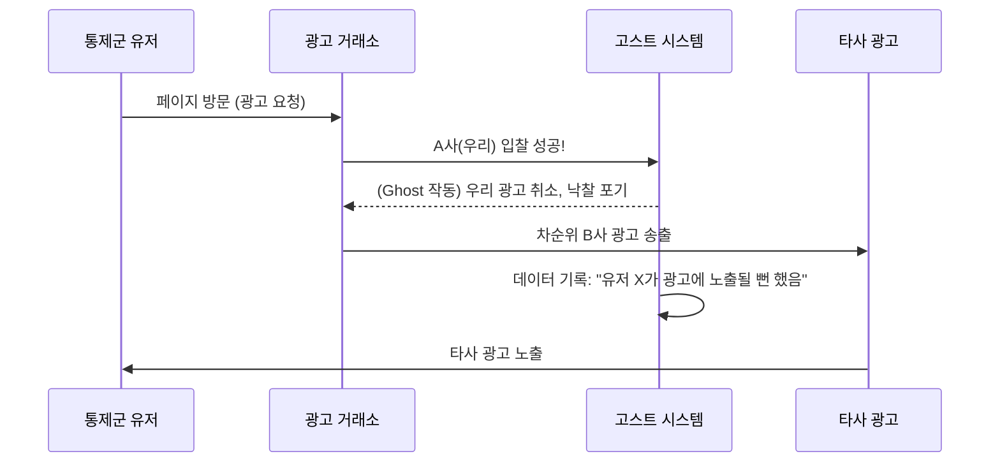

디지털 마케팅 업계에서 가장 신성시되는 지표가 있다면 단연 **ROAS (Return on Ad Spend)**일 것입니다. 플랫폼 대시보드에 찍히는 '1000%의 ROAS'는 마케터의 성과를 증명하는 훈장처럼 여겨집니다. 

하지만, 과연 그 숫자는 진짜일까요?

우리는 광고 플랫폼이 스스로 보고하는 성과(Attribution)와 광고 덕분에 순수하게 발생한 실제 비즈니스 효과(Incrementality) 사이의 거대한 괴리에 주목해야 합니다. 많은 기업들이 '허영의 지표(Vanity Metrics)'에 속아 어차피 구매했을 고객에게 막대한 예산을 쏟아붓고 있습니다.

오늘은 데이터 마케팅의 본질적 문제인 **상관관계와 인과관계의 착시**, 그리고 **선택 편향(Selection Bias)**을 해결하기 위한 **Causal Lift**와 **Ghost Ads** 방법론에 대해 딥리서치한 결과를 공유합니다.

---

## 1. 기여도(Attribution)의 한계와 선택 편향 (Selection Bias)

**기여도(Attribution)**는 고객이 전환(구매)하기 전까지 거친 터치포인트를 추적하여 공로를 할당하는 방식입니다. 라스트 클릭(Last-Click)이 대표적입니다.
반면, **증분성(Incrementality)**은 "이 광고가 없었다면 일어나지 않았을 전환이 몇 개인가?"를 묻는 **인과적 리프트(Causal Lift)** 측정입니다.

### 왜 ROAS는 뻥튀기 되는가? (Selection Bias)
리타겟팅 광고를 생각해보겠습니다. 이미 장바구니에 물건을 담아둔 고객에게 광고를 노출하면 구매 확률이 매우 높습니다. 플랫폼은 이 구매를 '광고 덕분(ROAS)'이라고 주장합니다. 하지만 이들 중 상당수는 **광고를 보지 않았어도 구매했을 사람**입니다.

이러한 현상을 통계학에서는 **선택 편향(Selection Bias)**이라고 부릅니다. 광고 시스템은 전환 확률이 높은 타겟을 귀신같이 찾아내어 광고를 뿌리기 때문에, 결과적으로 **광고의 인과적 효과(Causal Effect)**와 **원래 구매할 사람의 자연 전환율**이 섞여 ROAS가 2~5배 부풀려지게 됩니다.

---

## 2. Lewis & Rao (2015): 디지털 광고 측정의 불가능성 위기

광고의 순수한 효과를 발라내려면 어떻게 해야 할까요? 의학에서 신약을 테스트할 때 쓰는 **무작위 대조군 연구(Randomized Controlled Trials, RCTs)**를 써야 합니다. 타겟 고객을 반으로 나누어 한쪽(Treatment)에는 광고를 보여주고, 다른 쪽(Control)에는 보여주지 않은 뒤 전환율 차이를 측정하는 것입니다.

그러나 2015년 경제학자 Randall Lewis와 Justin Rao의 기념비적인 논문 **"On the Near-Impossibility of Measuring the Returns to Advertising"**은 업계에 충격을 안겼습니다. 

> *"디지털 광고의 효과는 데이터의 본질적인 노이즈에 비해 너무나 미미하다. 따라서 광고가 정말 수익성이 있는지 통계적 유의성(Statistical Significance)을 확보하려면 수백만 명 규모의 엄청난 실험 샘플이 필요하다."*

RCT를 하려면 통제군(Control Group)에게 우리가 원래 하려던 광고 대신 공익광고(PSA, Public Service Announcement)를 띄워 '이 유저가 우리 타겟팅에 잡혀 광고를 볼 뻔했다'는 사실을 기록해야 합니다. 하지만 이는 막대한 광고비를 무의미한 PSA에 태워야 함을 의미하므로, 실무적으로 불가능에 가까웠습니다.

---

## 3. 구원투수: Ghost Ads의 등장

Lewis & Rao의 연구 이후, 측정의 한계를 극복하기 위해 등장한 혁신적 방법론이 바로 **고스트 애드(Ghost Ads)**입니다. (Johnson, Lewis, and Nubbemeyer, 2017)

### Ghost Ads의 작동 원리
Ghost Ads는 값비싼 PSA(공익광고)를 통제군에게 보여주는 대신, **실시간 경매 시스템 내부의 로그**를 활용합니다. 

1. 통제군 유저가 웹서핑을 합니다.
2. 우리 광고가 입찰에 참여하여 낙찰될 상황이 됩니다.
3. 시스템은 **우리 광고를 보여주지 않고 (Ghost Impression), 경쟁사의 다른 광고가 나가게 둡니다.**
4. 대신 시스템 백단에 *"이 유저에게 광고가 나갈 뻔 했음"* 이라고 기록만 남깁니다.

이렇게 하면 광고비를 단 1원도 낭비하지 않으면서, 정확히 '광고를 볼 뻔했던' 통제군을 식별해 낼 수 있습니다. 이 기술 덕분에 수많은 플랫폼들이 막대한 비용 없이 대규모 인과성(Causality) 실험을 진행할 수 있게 되었습니다.

---

## 4. 결론: 허영의 지표(Vanity Metrics)를 버려라

플랫폼이 자랑하는 기여도 기반의 ROAS는 사실상 상관관계(Correlation)에 불과합니다. 우리는 이를 **허영의 지표(Vanity Metrics)**라 부르며 경계해야 합니다.

현대의 스마트한 마케터와 신호 설계자(Signal Designer)라면 다음과 같은 관점 전환이 필요합니다.

1. **플랫폼 ROAS 맹신 금지:** 플랫폼의 성과 보고서는 그들의 수익(광고비 소진)을 정당화하기 위해 편향되어 있음을 인지해야 합니다.
2. **Incrementality(증분성) 중심의 사고:** 주기적인 Lift 테스트를 통해 실제 비즈니스에 플러스가 된 진성 성과를 발라내야 합니다.
3. **LTV와 CAC 중심으로 이동:** 일회성 ROAS보다는 고객 획득 비용(CAC)과 생애 가치(LTV)를 바탕으로 데이터 기반의 의사결정을 내려야 합니다.

다음 포스트에서는 이러한 '선택 편향'이 가장 심각하게 나타나는 구글 브랜드 검색광고의 **자기 잠식(Cannibalization)** 현상과 이베이(eBay)의 충격적인 연구 사례를 파헤쳐 보겠습니다.

---
## 📚 참고자료
- **Lewis, R. A., & Rao, J. M. (2015).** *On the near-impossibility of measuring the returns to advertising.* The Quarterly Journal of Economics.
- **Johnson, G. A., Lewis, R. A., & Nubbemeyer, E. I. (2017).** *Ghost ads: Improving the economics of measuring online ad effectiveness.* Journal of Marketing Research.
- **Haus.io & Measured.com**, *Attribution vs. Incrementality: A Guide to Advanced Measurement.*
