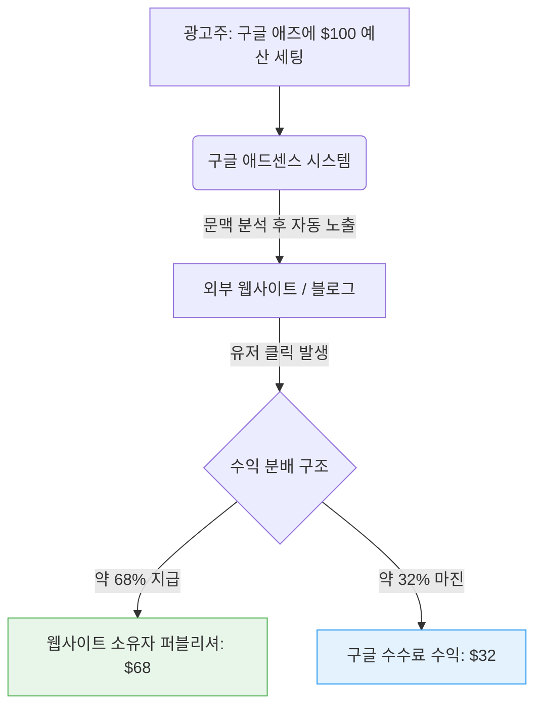

**애드센스(AdSense)**는 구글이 자사의 검색 엔진 홈페이지(Google.com)를 넘어, **전 세계 인터넷 웹 생태계 전체를 거대한 구글의 광고 네트워크로 확장**하게 만든 일등 공신입니다. 

검색창이라는 좁은 인벤토리의 한계를 극복하고, 구글이 폭발적으로 성장하며 IT 제국을 건설할 수 있었던 핵심 동력이 바로 이 애드센스 비즈니스 모델이었습니다.

---

## 1. 인터넷 전체를 광고 인프라로 전환 (Contextual Targeting)

과거 야후나 포털 사이트들은 광고 영업 사원들이 배너 광고를 팔아 홈페이지에 띄우는 원시적인 방식을 사용했습니다. 하지만 애드센스는 완전히 다른 접근법을 취했습니다.

외부 서드파티 웹사이트(개인 블로거부터 뉴욕타임스 같은 대형 언론사까지) 소유자가 자신의 홈페이지에 구글이 제공하는 짧은 HTML 자바스크립트 코드만 복사해서 붙여넣으면 끝이었습니다. 
구글의 크롤러 봇이 해당 페이지의 문맥(Context)을 텍스트 기반으로 즉각 분석하여, **해당 글의 주제와 가장 관련성 높은 구글 타깃 광고를 자동으로 노출**시켜 주었습니다. 

* **예시:** 강아지 훈련법에 대한 블로그 글에는 애견 훈련소나 사료 광고가, 주식 투자 기사에는 증권사 광고가 자동으로 붙게 됩니다. 이는 기존의 무작위 배너 광고에 비해 **클릭률(CTR)이 최대 5배 이상** 높았습니다.

## 2. 생태계를 폭발시킨 '수익 공유(Revenue Sharing)' 모델

애드센스가 구글 네트워크를 단시간에 장악할 수 있었던 비결은 **파격적인 수익 공유** 구조에 있습니다.

유저가 광고를 클릭하면 구글은 광고주로부터 받은 금액 중 소액의 플랫폼 수수료(약 32%)만 챙기고, 나머지 상당 부분(약 68%)을 콘텐츠를 만든 **웹사이트 소유자(퍼블리셔)에게 지급**했습니다.

이 정책은 혁명적이었습니다. 콘텐츠 제작자들은 영업팀이나 복잡한 결제 시스템 구축 없이도 오직 좋은 글을 쓰는 것만으로 막대한 달러를 벌어들일 수 있게 되었습니다. 결과적으로 구글은 자본금 0원으로 무한대에 가까운 인터넷의 모든 빈 공간을 구글의 광고판(Inventory)으로 편입시키는 데 성공했습니다.

## 3. 폭발적 성장과 구글 재무의 핵심 축

### 📈 초기 성장 견인
2002년 구글 전체 광고 매출의 25%에 불과했던 구글 네트워크(애드센스) 매출 비중은, 구글이 기업공개(IPO)를 단행한 2004년에는 무려 **49%**까지 급증했습니다. 애드센스는 출시 불과 2년 만에 회사 전체의 절반을 먹여 살리는 기둥이 되었습니다.

### 🌐 장기적이고 안정적인 캐시카우
2013년 기준으로 구글 애드센스 광고는 전 세계 200만 개 이상의 웹사이트에 게재되며 인터넷 사용자의 90% 이상에게 도달하는 엄청난 규모로 성장했습니다. 
오늘날 모바일과 유튜브(유튜브 역시 애드센스 시스템을 기반으로 수익을 배분합니다)로 중심이 이동했음에도, 2023년 기준 구글 네트워크 매출은 **약 313억 달러(전체 매출의 약 10.2%)**라는 막대한 이익을 안정적으로 창출해 내고 있습니다.

## 4. 결론: "상생을 통한 제국의 완성"

애드센스는 플랫폼 비즈니스의 정석을 보여줍니다. 광고주는 효율적으로 고객을 찾고, 콘텐츠 제작자는 돈을 벌며, 구글은 가만히 앉아 전 세계 광고 시장의 통행세를 거둡니다. 기술력(문맥 분석 알고리즘)과 비즈니스 마인드(수익 공유)의 완벽한 결합이 지금의 구글을 만들었습니다.

---
## 📚 참고자료
- **Google AdSense Help Center:** *AdSense Revenue Share Policy.*
- **Steven Levy (2011):** *In The Plex: How Google Thinks, Works, and Shapes Our Lives.*
- **Alphabet Earnings Reports (2023):** *Google Network Revenue Statistics.*
