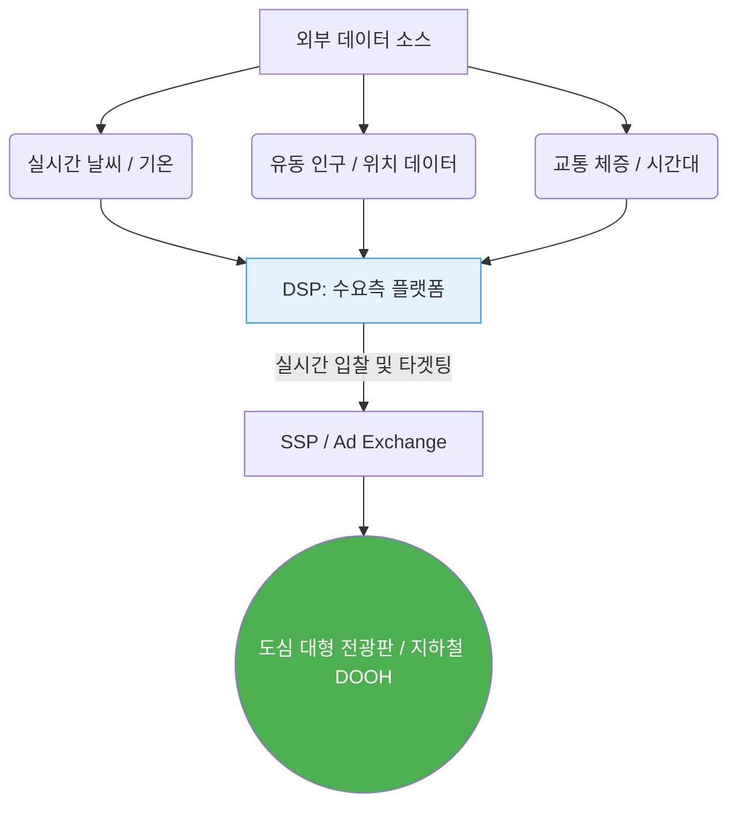

전통 매체(TV, 라디오, 인쇄물)들이 디지털 전환에 밀려 전반적인 하락세를 겪고 있는 반면, 옥외광고(OOH) 시장은 예외적으로 견조한 우상향 곡선을 그리고 있습니다. 글로벌 마케팅 리서치 기관들에 따르면 옥외광고는 매년 안정적으로 3~5% 이상의 성장세를 유지하고 있습니다.

그 비결은 단순히 간판의 크기를 키웠기 때문이 아닙니다. 과거의 단순 노출형 인쇄 매체를 넘어, **디지털 옥외광고(DOOH, Digital Out-of-Home)**와 **프로그래매틱 옥외광고(pDOOH)**로 성공적인 진화(Evolution)를 이뤄냈기 때문입니다.

---

## 1. 데이터 및 AI 기술과의 결합: 프로그래매틱 DOOH (pDOOH)

가장 큰 혁신은 '프로그래매틱(Programmatic)' 구매 방식의 도입입니다. 기존 옥외광고는 "한 달에 얼마" 식으로 고정된 구좌를 구매해야 했습니다. 하지만 pDOOH는 **실시간 유동 인구 데이터, 날씨, 시간대, 교통 상황** 등의 데이터 신호(Data Signal)와 연동되어 조건이 맞을 때만 광고를 송출합니다.

* **날씨 연동 타겟팅 예시:** 비가 오기 시작하는 순간, 옥외 전광판의 광고가 선크림에서 우산이나 따뜻한 커피 광고로 자동 교체됩니다. 이는 AI와 실시간 API가 결합되었기에 가능한 정밀 타겟팅입니다.

## 2. 옴니채널(Omnichannel) 전략의 핵심 접점

디지털 옥외광고는 온라인 광고와 결합하여 마케팅 시너지를 내는 옴니채널 전략의 중추로 자리 잡았습니다. 
온라인 배너나 모바일 광고가 무시되거나 애드블록(Ad-block)에 의해 차단당하는 시대에, DOOH는 강제 노출이라는 전통적 장점을 유지하면서도 **모바일 기기 위치 추적(Geofencing)**과 결합됩니다.

* **크로스 디바이스 연계:** 옥외광고를 본 유저가 해당 지역 내에 있을 때, 그들의 스마트폰 모바일 배너로 동일한 브랜드 광고를 리타겟팅하여 전송함으로써 실제 오프라인 매장 방문 및 구매를 유도합니다.

## 3. 단순 노출을 넘어선 참여형 브랜드 경험 (Case Study)

현대의 DOOH는 일방적인 이미지 노출 수단이 아닙니다. 시민의 참여와 다채로운 브랜드 경험을 결합하는 '플랫폼'으로 진화했습니다.

### 🏆 Case Study: 코엑스 K-POP 스퀘어 아나몰픽 미디어아트
한국의 옥외광고 트렌드를 바꾼 결정적 사례는 d'strict(디스트릭트)가 코엑스 K-POP 스퀘어 전광판에 선보인 **'WAVE(파도)'** 프로젝트입니다. 
- **아나몰픽 일루전(Anamorphic Illusion):** 특정 각도에서 볼 때 완벽한 입체감을 주는 착시 기술을 활용하여, 도심 한복판에 실제 거대한 파도가 치는 듯한 압도적인 몰입감을 제공했습니다.
- **바이럴 임팩트:** 이 시각적 충격은 단순 오프라인 노출로 끝나지 않고, 사람들이 자발적으로 영상을 찍어 유튜브와 틱톡에 공유하면서 전 세계적으로 수백만 뷰 이상의 2차 바이럴을 창출했습니다. OOH가 디지털 바이럴의 시작점이 된 것입니다.

## 4. 결론: 지속 가능한 매체로서의 DOOH

결과적으로 옥외광고는 전통 매체 중 유일하게 디지털 기술, 데이터, 공간 디자인을 적극 수용함으로써 구조적 한계를 극복했습니다. 향후 AR(증강현실) 안경이나 자율주행차 시대가 오더라도, 현실 공간을 기반으로 한 DOOH는 새로운 포맷으로 적응하며 광고주들의 선택을 지속적으로 이끌어낼 것입니다.

---
## 📚 참고자료
- **IAB (Interactive Advertising Bureau):** *DOOH Buyer's Guide & Programmatic OOH Statistics.*
- **d'strict (디스트릭트):** *WAVE at COEX K-POP SQUARE Case Study.*
- **eMarketer:** *Global Out-of-Home (OOH) Ad Spending Forecasts.*
