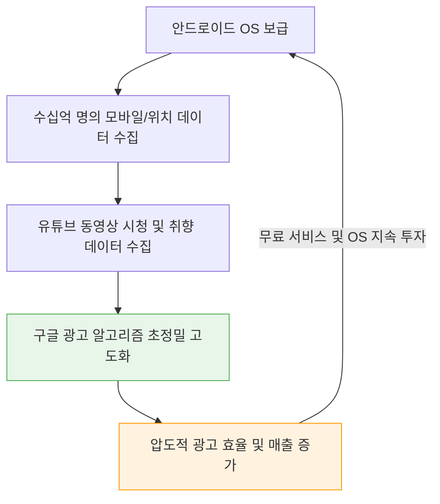

구글(Alphabet)이 단순한 텍스트 기반 검색 엔진을 넘어 전 세계 디지털 생태계를 지배하는 거대한 제국(Moat)을 구축할 수 있었던 결정적 이유는 **두 번의 선구적인 M&A(인수합병)**에 있습니다. 바로 **안드로이드(Android)**와 **유튜브(YouTube)**의 인수입니다.

데스크톱 시대의 성공에 안주하지 않고 다가올 '모바일'과 '비디오'의 미래를 선점한 이 결정은 IT 역사상 가장 성공적인 전략적 투자로 평가받습니다.

---

## 1. 안드로이드 인수: 모바일 생태계 장악과 절대 방어막 구축

2005년, 구글은 아직 출시도 되지 않은 작은 모바일 스타트업 '안드로이드'를 단돈 5천만 달러(약 600억 원)에 인수합니다. 이 인수의 핵심 목적은 소프트웨어 판매 수익이 아니라 **'생태계 방어'**였습니다.

- **모바일로의 급격한 전환:** 스마트폰 시대가 열리며 데스크톱 검색 트래픽이 모바일로 이동하고 있었습니다. 만약 애플이나 마이크로소프트가 모바일 OS를 독점하고 구글 검색을 기본 브라우저에서 차단한다면 구글의 광고 비즈니스는 붕괴될 위기였습니다.
- **오픈소스 전략과 프리로드(Pre-installation):** 구글은 안드로이드를 기기 제조사(삼성 등)에 '무료'로 풀었습니다. 대신 구글 검색, 지도, 크롬, 유튜브 앱을 스마트폰에 기본 탑재(GMS) 하도록 의무화했습니다. 

그 결과 2023년 기준 안드로이드는 전 세계 스마트폰 시장의 70% 이상을 점유하며 30억 명 이상의 월간 활성 사용자(MAU)를 확보했습니다. 오늘날 구글의 막대한 광고 수익을 지탱하는 모바일 검색 트래픽의 절반 이상이 바로 이 안드로이드 기기에서 발생하고 있습니다.

## 2. 유튜브 인수: 비디오 경제 선점과 디스플레이 광고의 진화

2006년, 구글은 당시 수익 모델도 없던 유튜브를 16억 5천만 달러(약 2조 원)라는 막대한 금액에 인수하며 업계를 놀라게 했습니다.

- **저작권 문제 돌파 (Content ID):** 인수 직후 유튜브는 방송사들로부터 쏟아지는 저작권 소송에 휘말렸습니다. 구글은 이를 방어하기 위해 '콘텐츠 ID' 시스템을 개발하여, 저작권자가 불법 영상을 차단하거나 오히려 그 영상에 광고를 붙여 **수익을 공유(Revenue Share)**받을 수 있게 만들었습니다. 이 천재적인 발상은 적을 동지로 만들었고 크리에이터 생태계를 폭발시켰습니다.
- **트루뷰(TrueView) 광고 혁신:** 5초 후 건너뛰기가 가능한 '트루뷰' 광고 포맷은 강제 시청의 피로도를 낮추면서도, 실제 시청한 광고주에게만 과금하는 혁신을 통해 폭발적인 성장을 견인했습니다.

현재 유튜브는 알파벳 전체 매출의 10% 이상(약 315억 달러, 2023년 기준)을 차지하는 핵심 수익원이며, 구글이 텍스트 검색을 넘어 가장 큰 동영상 광고 매체를 지배하게 만든 일등 공신입니다.

## 3. 구글 제국의 데이터 플라이휠 (Data Flywheel)

이 두 번의 인수는 단순한 시장 점유율 확대를 넘어, 구글을 지탱하는 거대한 **'데이터 플라이휠'**을 완성했습니다.

안드로이드를 통해 유저의 이동 동선(구글 맵)과 앱 사용 기록을 읽고, 유튜브를 통해 개인의 취향과 관심사를 실시간으로 파악합니다. 이 엄청난 파이프라인으로 모인 '퍼스트 파티 데이터'가 구글 광고의 타겟팅 효율을 우주 최고 수준으로 끌어올리며 난공불락의 제국을 완성한 것입니다.

---
## 📚 참고자료
- **Google Alphabet Investor Relations:** *Annual Earnings Reports (YouTube and Google Network revenues).*
- **Ken Auletta (2009):** *Googled: The End of the World As We Know It.*
- **Case Study:** *How Google's Content ID changed the music and video industry.*
