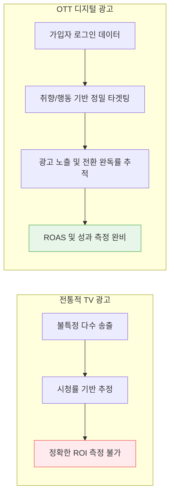

글로벌 미디어 소비의 중심축이 지상파와 케이블 TV(선형 TV)에서 모바일과 스트리밍(OTT)으로 완전히 넘어가면서, 막대한 자본의 광고비 역시 자연스럽게 OTT 생태계로 대거 이동하고 있습니다.

특히 최근 몇 년간 구독 피로도(Subscription Fatigue)가 심화되면서, 넷플릭스를 비롯한 주요 플랫폼들이 '광고 요금제(AVOD)'를 도입하며 OTT 광고 시장은 폭발적인 르네상스를 맞이하고 있습니다.

---

## 1. 기존 TV 광고 vs OTT 광고의 패러다임 차이

광고주들이 레거시 매체를 떠나 OTT 매체에 예산을 쏟는 가장 큰 이유는 **정교한 오디언스 타겟팅과 확실한 성과 측정** 때문입니다.

OTT 플랫폼은 사용자의 회원 정보(나이, 성별, 결제 정보)는 물론, 어떤 장르의 콘텐츠를 언제, 얼마나 길게 시청하는지에 대한 '고해상도 퍼스트 파티 데이터(1st Party Data)'를 보유하고 있어 디지털 타겟팅에 압도적으로 유리합니다.

## 2. 시장을 주도하는 OTT 플랫폼 전략

### 🏆 넷플릭스(Netflix)의 광고 요금제 성공 사례
오랜 기간 "광고는 절대 없다"던 넷플릭스는 성장 정체를 돌파하기 위해 **'광고 지원 요금제(Ad-supported tier)'**를 도입했습니다. 결과는 대성공이었습니다. 
- 신규 가입자의 상당수가 광고 요금제를 선택했으며, 이들의 ARPU(가입자당 평균 수익)는 순수 프리미엄 구독자보다 오히려 높은 현상까지 나타났습니다.
- 프리미엄 콘텐츠 환경에서 강제 송출되는 높은 광고 완독률(VTR) 덕분에 프리미엄 브랜딩을 원하는 대기업 광고주들의 예산을 성공적으로 빨아들였습니다.

### 🇰🇷 티빙(TVING)과 한국 시장의 지각변동
국내에서는 티빙이 선도적으로 광고요금제를 안착시켰습니다. 프로야구(KBO) 독점 중계라는 킬러 콘텐츠와 결합하여 트래픽을 폭발적으로 늘렸고, 이는 자연스럽게 막대한 광고 인벤토리 확보와 매출 증가로 이어졌습니다.

### 🚀 FAST (Free Ad-supported Streaming TV) 모델의 부상
새로운 트렌드로 **FAST 모델**이 떠오르고 있습니다. 쿠팡플레이 등을 필두로 영상 시작 전(Pre-roll)과 중간(Mid-roll)에 광고를 시청하는 대가로 콘텐츠를 '무료'로 제공하는 채널 형식의 서비스입니다. 시청자들은 구독료 부담 없이 TV 보듯 채널을 돌리고, 플랫폼은 광고 수익을 얻는 윈-윈 구조로 디지털 미디어 내 새로운 광고 기회를 창출하고 있습니다.

## 3. 남겨진 과제: 비용 효율성과 광고 피로도

광고주들은 OTT 플랫폼의 매체 영향력과 프리미엄 이미지(Brand Safety)를 높게 평가합니다. 하지만 한계점도 존재합니다.
- **높은 CPM(천 회 노출당 비용):** 일반 유튜브나 디스플레이 배너 대비 단가가 지나치게 높아 퍼포먼스 광고주 입장에서는 가성비가 떨어집니다.
- **동일 광고 반복 노출 (Frequency Capping 실패):** 광고 인벤토리 대비 다양한 광고주 풀이 확보되지 않으면 한 시청자에게 같은 광고가 계속 노출되어 브랜드 이미지를 훼손할 우려가 있습니다.

결국 미래의 OTT 광고 플랫폼은 사용자 경험을 해치지 않는 '몰입형 광고(Interactive Ads)' 포맷을 개발하고, 타겟팅을 최적화하여 단가를 합리적으로 맞추는 기술 고도화에 집중해야 할 것입니다.

---
## 📚 참고자료
- **eMarketer:** *Connected TV (CTV) and OTT Advertising Spend Trends.*
- **Netflix Q4 Earnings Report:** *Ad-supported tier growth and ARPU insights.*
- **한국언론진흥재단:** *국내 OTT 이용행태 및 광고 수용도 조사 연구.*
