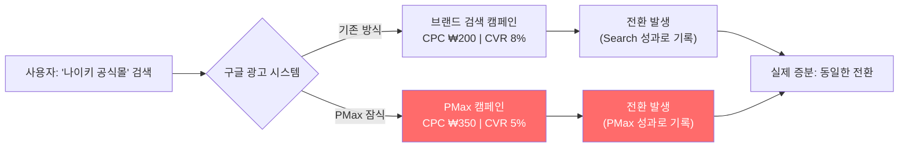
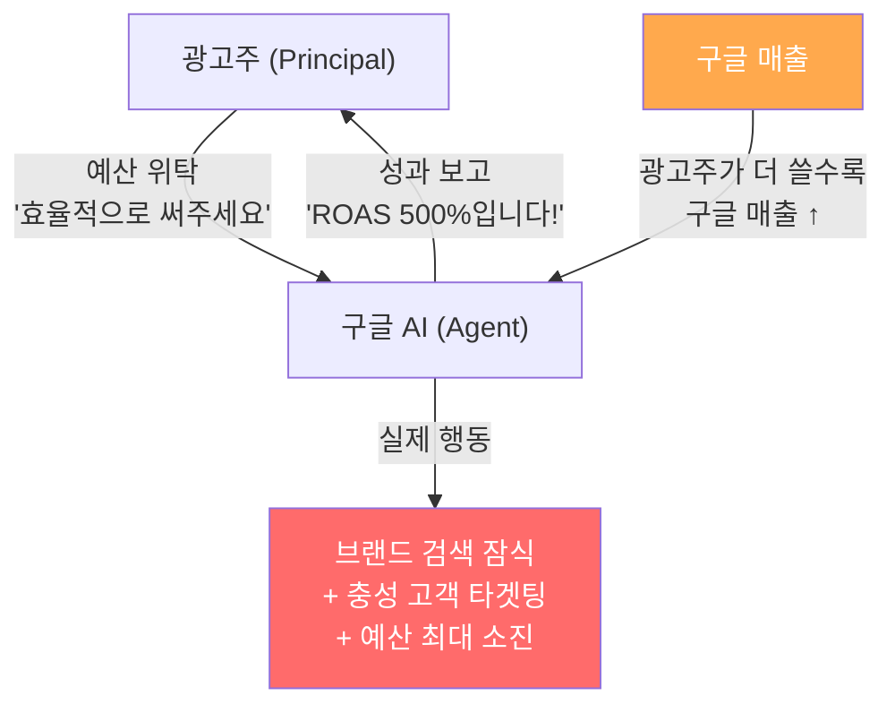

구글은 말합니다. "AI에 맡기세요. 더 많은 전환을, 더 효율적으로 가져다 드립니다."

Performance Max(PMax). AI Max. 자동 입찰. 광범위 검색(Broad Match). 구글이 최근 몇 년간 밀어붙인 자동화 제품들의 공통 메시지는 동일합니다. **"인간보다 AI가 더 잘합니다."**

그런데 정말 그럴까요?

이 글은 저명한 학술 논문, 실제 기업 사례, 그리고 업계 전문가들의 분석을 기반으로, AI 마케팅 자동화의 **구조적 문제점**을 깊이 파헤칩니다. 결론을 먼저 말하자면, AI는 당신의 마케팅 성과를 높이는 것이 아니라 **이미 구매할 고객에게 불필요한 광고비를 쓰면서, 그것을 '성과'로 포장하는 데 최적화**되어 있을 수 있습니다.

---

## 1. Performance Max의 구조적 문제: "블랙박스가 당신의 돈을 쓰는 법"

### 🎯 문제 1: 브랜드 키워드 잠식 — 업계 데이터가 말하는 불편한 진실

PMax는 검색, 쇼핑, 유튜브, 디스플레이, 디스커버, 지메일, 맵스 — 구글의 모든 인벤토리에 걸쳐 자동으로 광고를 배포합니다. PMax의 AI는 **'전환을 극대화(Maximize Conversions)'**하도록 설계되어 있고, 가장 쉽게 전환을 만드는 방법은 **이미 구매하려고 검색한 사람에게 광고를 보여주는 것**입니다.

이것이 바로 **브랜드 키워드 잠식(Brand Cannibalization)**입니다. 그리고 이 문제의 규모는 추측이 아니라 **데이터로 확인된 사실**입니다.

#### 📊 Optmyzr 연구 (2024): "90% 이상의 계정에서 잠식 발생"

구글 광고 최적화 플랫폼 Optmyzr는 수천 개의 Google Ads 계정을 분석한 결과, **전체 계정의 90% 이상**에서 PMax와 기존 검색 캠페인 간 키워드 중복(Search Term Overlap)이 발생하고 있음을 확인했습니다. 이는 예외적 상황이 아니라 **구조적 기본값(Default)**입니다.

> *출처: Optmyzr, "Performance Max vs. Search: The Overlap Problem" (2024)*

#### 📊 Adalysis 연구 (2024): "PMax vs Search, 누가 더 잘하는가?"

구글 광고 분석 도구 Adalysis는 PMax와 Search 캠페인이 동일한 검색어에서 경쟁하는 상황을 대규모로 분석했습니다. 결과는 충격적입니다.

| 비교 항목 | Search 캠페인 우위 비율 | PMax 우위 비율 |
|----------|-------------------|-------------|
| **전환율(CVR)** | **84%** | 16% |
| **전환 가치** | **84%** | 16% |
| **클릭률(CTR)** | **65%** | 35% |
| **노출수(Impressions)** | 39% | **61%** |

이 데이터가 보여주는 구조를 분석하면:

1. **PMax가 노출을 더 많이 가져갑니다(61%)** — AI가 예산을 적극적으로 소진하기 때문
2. **그러나 전환율은 Search 캠페인이 84%의 경우에서 우월합니다** — 정확한 키워드 매칭이 더 효과적
3. **결론:** PMax는 Search가 이미 더 잘하고 있는 트래픽을 빼앗아, 더 낮은 효율로 처리하고, 대시보드에는 "제가 이 전환을 만들었습니다"라고 보고합니다

> *출처: Adalysis, "Search vs PMax Performance Comparison" (2024)*

#### 📊 Adalysis 추가 발견: "67%의 PMax 캠페인이 Search와 중복"

같은 연구에서 Adalysis는 분석 대상 PMax 캠페인의 **약 67%**가 기존 Search 캠페인의 키워드와 검색어 수준에서 중복을 보이고 있음을 확인했습니다. 이 중복이 발생하면:

- **PMax가 보고하는 ROAS는 실제보다 부풀려집니다** (이미 올 사람을 잡은 것이므로)
- **총 매출에는 기여가 없거나 미미합니다** (전체 계정 매출이 동일한데 PMax만 좋아 보임)
- **브랜드 검색 캠페인의 전환이 감소합니다** (PMax에 빼앗기므로)
- **광고비는 증가하지만, 실제 신규 고객 획득은 제자리입니다**

### 🎯 문제 2: 유튜브·디스플레이의 저품질 인벤토리 — MFA 사이트의 함정

PMax가 영상과 배너 광고를 배포할 때, **어디에 노출되는지 광고주가 완전히 통제할 수 없습니다.** 이 '블랙박스' 구조에서 가장 심각한 문제는 **MFA(Made for Advertising) 사이트**입니다.

#### MFA 사이트란?

MFA 사이트는 **광고 수익만을 목적으로 만들어진 저품질 웹사이트**입니다. 자동 생성된 저품질 콘텐츠로 페이지를 채우고, 한 페이지에 수십 개의 광고를 배치하여 광고 노출 수익을 극대화합니다. 이런 사이트에 노출된 광고는:

- **실제 사용자의 관심을 끌지 못합니다** (봇 트래픽 비율이 높음)
- **브랜드 이미지를 훼손합니다** (광고가 스팸 사이트에 노출됨)
- **CPM 기준으로는 '저렴'해 보이지만, 전환 기여는 거의 0**입니다

업계 데이터(SpiderAF, 2024)에 따르면, 적극적인 관리 없이 방치된 PMax 캠페인의 디스플레이 예산 중 **상당 부분이 MFA 사이트에 유출**될 수 있습니다. 구글은 2025년에 게재 위치 보고서(Placement Report)와 계정 수준 게재 위치 제외(Account-Level Exclusion) 기능을 강화했지만, **캠페인 수준의 제외는 여전히 불가능**하며, 기본 설정은 여전히 "모든 곳에 노출"입니다.

#### PMax 디스플레이/유튜브 문제 체크리스트

| 문제 유형 | 증상 | 진단 방법 |
|----------|------|----------|
| MFA 사이트 노출 | 높은 노출수, 0 전환, 높은 이탈률 | 게재 위치 보고서에서 미확인 도메인 확인 |
| 유튜브 무관련 채널 | 키즈 채널, 음악 MV 등에 노출 | 유튜브 게재 위치 보고서 확인 |
| 리타게팅 과잉 | 이미 구매한 고객에게 동일 광고 반복 | GA4에서 전환 경로 분석 |
| 봇 트래픽 | 비정상적으로 높은 CTR + 0 전환 | 클릭 사기 탐지 도구 활용 |

### 🎯 문제 3: 구조적 이해충돌 (The Principal-Agent Problem)

여기서 간과하기 쉬운 근본적인 문제가 있습니다.

**구글은 광고 플랫폼이자 동시에 광고 자동화 도구의 제공자입니다.** 구글은 광고주의 예산을 최적화해 줘야 하는 '에이전트'이면서, 동시에 광고주가 더 많은 돈을 쓸수록 매출이 올라가는 '판매자'입니다.

이것은 경제학에서 **본인-대리인 문제(Principal-Agent Problem)**로 알려진 전형적인 이해충돌 구조입니다.

> **심판이 동시에 한쪽 팀의 감독인 경기에서, 판정의 공정성을 어떻게 보장하겠습니까?**

PMax의 AI가 "예산을 최대한 효율적으로 사용했다"고 보고할 때, 그 효율성의 정의는 **광고주의 실제 매출 증가**가 아니라 **구글 플랫폼 내에서의 전환 수 극대화**에 맞춰져 있을 수 있습니다.

### 🎯 문제 4: AI Max for Search — 새로운 자동화, 동일한 함정

2025~2026년에 걸쳐 구글이 출시한 **AI Max for Search**는 기존 검색 캠페인에 AI 자동화를 더한 제품입니다. 핵심 기능은 **자동 키워드 확장(Automatic Keyword Expansion)**으로, 광고주가 설정한 키워드를 넘어 AI가 "관련이 있다고 판단하는" 검색어로 자동 확장합니다.

이 기능의 위험성:

- **의도하지 않은 검색어 확장:** "프리미엄 가죽 소파"를 타겟팅했는데, AI가 "저렴한 소파 추천"까지 확장
- **PMax와 동일한 브랜드 잠식 구조:** 브랜드 키워드로의 자동 확장 가능성
- **Broad Match와의 중첩:** 기존 구문 검색(Phrase Match)·정확 검색(Exact Match) 전략을 무력화

구글은 AI Max를 PMax, Demand Gen과 묶어 **"파워 팩(Power Pack)"**이라는 이름으로 포지셔닝하고 있지만(WordStream, 2026), 업계 전문가들은 이를 **"통제권 포기의 3종 세트"**라고 경고합니다.

---

## 2. AI 자동화가 만드는 5가지 바이어스

PMax의 구조적 문제에서 반복적으로 등장하는 패턴을 정리하면, AI 마케팅 자동화가 만드는 **5가지 구조적 편향**이 있습니다.

### 편향 1: 쉬운 전환 편향 (Easy Win Bias)
AI는 전환 확률이 가장 높은 사용자를 우선 타겟팅합니다. 이는 **이미 구매 의사가 있는 충성 고객**에게 예산이 집중된다는 뜻입니다. 알고리즘 입장에서는 '효율적'이지만, 비즈니스 관점에서는 '광고가 없어도 구매했을 사람에게 돈을 쓰는 것'입니다.

### 편향 2: 기여도 과장 (Attribution Inflation)
PMax는 라스트클릭(Last Click) 또는 데이터 기반 기여(DDA) 모델로 전환을 보고합니다. 브랜드 검색이나 리타게팅을 통한 전환은 **PMax가 없어도 일어났을 전환**이지만, 대시보드에는 PMax의 성과로 기록됩니다.

### 편향 3: 예산 극대화 편향 (Budget Maximization Bias)
AI의 목표 함수는 "주어진 예산 내에서 전환을 극대화"입니다. 이는 구조적으로 **예산을 최대한 많이 소진**하도록 유도합니다. "이 예산은 쓸 필요 없습니다"라고 보고하는 AI는 존재하지 않습니다.

### 편향 4: 블랙박스 편향 (Opacity Bias)
PMax는 어떤 키워드에, 어떤 게재 위치에, 어떤 오디언스에게 얼마를 썼는지를 상세히 공개하지 않습니다. 이 불투명성은 광고주가 낭비를 감지하기 어렵게 만들며, 구글은 "AI를 믿으세요"라고 말합니다.

### 편향 5: 생존자 편향 (Survivorship Bias in Reporting)
PMax가 보고하는 ROAS는 **PMax를 통해 발생한 전환만**을 집계합니다. PMax 때문에 잠식된 브랜드 검색 캠페인의 전환 감소, 자연 검색의 전환 감소는 같은 대시보드에 나타나지 않습니다. 전체를 보면 성장이 없는데, 부분만 보면 성과가 좋아 보이는 전형적인 **생존자 편향**입니다.

---

## 3. 해결 방법: 증분성(Incrementality) 중심의 마케팅으로 전환

문제를 진단했으니, 해법을 이야기합시다.

### ✅ 전략 1: 브랜드 키워드를 PMax에서 제외하라

가장 즉각적이고 효과적인 조치입니다. 구글은 2023년부터 PMax에 **브랜드 제외(Brand Exclusion)** 기능을 제공하고 있습니다. 자사 브랜드명을 제외 리스트에 등록하면, PMax가 브랜드 검색어에 자동 입찰하는 것을 방지할 수 있습니다.

**즉시 실행 체크리스트:**
- [ ] PMax 캠페인 설정 → 브랜드 제외 리스트에 자사 브랜드명 등록
- [ ] 별도의 브랜드 검색 캠페인을 정확 검색(Exact Match)으로 유지
- [ ] PMax 에셋 그룹의 헤드라인·설명문에서 브랜드명 제거

### ✅ 전략 2: 증분성 테스트(Incrementality Test)를 수행하라

가장 근본적인 해법입니다. "이 광고가 없었어도 이 매출이 발생했을까?"라는 질문에 답하는 실험입니다.

**방법:**
1. **일시 중지 테스트(Pause Test):** PMax를 2~4주간 중단하고, 총 매출·트래픽·전환 수가 어떻게 변하는지 관찰합니다. PMax가 실제로 증분 기여를 하고 있다면 매출이 떨어져야 합니다. 떨어지지 않는다면 — 그 예산은 낭비였습니다.
2. **지역 분할 테스트(Geo-Split Test):** 특정 지역에서만 광고를 끄고, 대조군 지역과 비교합니다.
3. **Ghost Ads / PSA 테스트:** 실제 광고를 보여줄 위치에 공익광고(PSA)를 대신 보여주고, 그 사용자의 전환을 비교합니다.

### ✅ 전략 3: PMax를 '발견 레이어'로만 활용하라

PMax를 완전히 폐기하라는 것이 아닙니다. PMax는 **브랜드 검색 대체가 아닌, 신규 고객 발견 도구**로 포지셔닝해야 합니다.

**하이브리드 전략:**

| 캠페인 유형 | 역할 | 키워드 타입 | 통제 수준 |
|-----------|-----|----------|---------|
| 브랜드 검색 (Standard Search) | 브랜드 트래픽 보호 | 브랜드 정확 검색 | 🟢 높음 |
| 비브랜드 검색 (Standard Search) | 핵심 상업 키워드 커버 | 비브랜드 정확/구문 | 🟢 높음 |
| Performance Max | 신규 고객 발견·확장 | 브랜드 제외 | 🟡 중간 |
| Demand Gen | 인지도·관심 확대 | 관심사 기반 | 🟡 중간 |

### ✅ 전략 4: 신규 vs 기존 고객 가치를 차등 설정하라

구글 광고에는 **'고객 획득 목표(Customer Acquisition Goal)'** 기능이 있습니다. 이를 활성화하면, PMax에 "신규 고객의 전환 가치를 기존 고객보다 더 높게 평가하라"는 신호를 줄 수 있습니다.

예를 들어, 기존 고객의 구매 전환 가치를 $50으로, 신규 고객의 전환 가치를 $100으로 설정하면, AI가 신규 고객 획득에 더 적극적으로 예산을 배분하게 됩니다.

### ✅ 전략 5: AI의 성과를 AI로 검증하지 마라

가장 중요한 원칙입니다. PMax의 성과를 PMax 대시보드로만 평가하면 안 됩니다.

**독립적 검증 수단:**
- Google Analytics 4의 전체 채널 전환 추이
- 검색 콘솔(Search Console)의 자연 검색 클릭·노출 변화
- CRM/DMP 데이터를 통한 신규 vs 기존 고객 비율 추적
- 오프라인 매출 데이터와의 교차 검증

---

## 4. 마케터가 반드시 기억해야 할 3가지

### 💡 교훈 1: AI는 당신의 목표가 아니라, 자신의 목표 함수를 최적화한다
PMax의 목표 함수는 "전환 극대화"입니다. 그것이 신규 고객인지, 어차피 올 충성 고객인지는 구분하지 않습니다. **AI에 올바른 제약 조건(Guardrails)을 설정하는 것은 인간의 몫**입니다.

### 💡 교훈 2: 화려한 ROAS 숫자를 의심하라
PMax가 보고하는 높은 ROAS는 브랜드 키워드 잠식의 결과일 수 있습니다. 진짜 질문은 "ROAS가 얼마인가?"가 아니라 **"이 광고가 없었어도 이 매출이 발생했을까?(Incrementality)"**입니다.

### 💡 교훈 3: 플랫폼의 권고와 광고주의 이익은 항상 일치하지 않는다
구글이 "더 많은 자동화를, 더 넓은 타겟팅을, 더 많은 예산을"이라고 권고할 때, 그것이 광고주의 이익을 위한 것인지, 구글의 매출을 위한 것인지를 냉정하게 판단해야 합니다. 이 판단이 바로 마케터의 존재 이유입니다.

---

## 결론: AI 시대의 마케터는 '감시관(Auditor)'이 되어야 한다

AI 마케팅 자동화는 강력한 도구입니다. 그러나 **통제되지 않은 자동화는 낭비를 자동화할 뿐**입니다.

Performance Max가 보여주는 화려한 대시보드 뒤에는, 이미 구매할 충성 고객에게 불필요하게 예산을 쓰고 그것을 '성과'로 포장하는 구조적 메커니즘이 작동하고 있습니다.

AI 시대의 마케터에게 필요한 역량은 더 이상 "AI를 잘 세팅하는 것"이 아닙니다. **AI가 보고하는 숫자를 의심하고, 독립적으로 검증하며, 올바른 제약 조건을 설정하는 '감시관(Auditor)'의 역할**입니다.

> **"AI는 당신에게 정답을 줄 수 없습니다. AI는 당신이 설정한 목표 함수의 최적해를 줄 뿐입니다. 목표 함수가 잘못되었다면, AI는 잘못된 답을 완벽하게 실행할 것입니다."**

---

## 📚 참고자료

### 업계 연구 보고서
- Optmyzr (2024). Performance Max vs. Search: The Overlap Problem — 수천 개 계정 분석 결과 90%+ 중복 확인. ([Optmyzr Blog](https://www.optmyzr.com/blog/))
- Adalysis (2024). Search vs PMax Performance Comparison — 67% 캠페인 중복, 84% 전환율 우위 데이터. ([Adalysis Blog](https://adalysis.com/blog/))
- SpiderAF (2024). MFA Sites and Programmatic Ad Fraud — PMax 디스플레이 인벤토리 품질 분석. ([SpiderAF](https://spideraf.com/))
- Search Engine Land (2023–2025). Performance Max Brand Cannibalization 시리즈. ([Search Engine Land](https://searchengineland.com/))

### 학술 논문
- Lewis, R. A., & Rao, J. M. (2015). The Unfavorable Economics of Measuring the Returns to Advertising. *Quarterly Journal of Economics*, 130(4), 1941–1973. ([논문 보기](https://doi.org/10.1093/qje/qjv023))
- Johnson, G. A., Lewis, R. A., & Nubbemeyer, E. I. (2017). Ghost Ads: Improving the Economics of Measuring Online Ad Effectiveness. *Journal of Marketing Research*, 54(6), 867–884.
- Goldfarb, A., & Tucker, C. (2011). Online Display Advertising: Targeting and Obtrusiveness. *Marketing Science*, 30(3), 389–404.

### 도서 및 기사
- Sinan Aral (2020). *The Hype Machine: How Social Media Disrupts Our Elections, Our Economy, and Our Health*. Crown Publishing.
- WordStream (2026). Google's New Power Pack: PMax + Demand Gen + AI Max. ([기사 보기](https://www.wordstream.com/blog/ws/2026/01/15/google-ads-power-pack))

