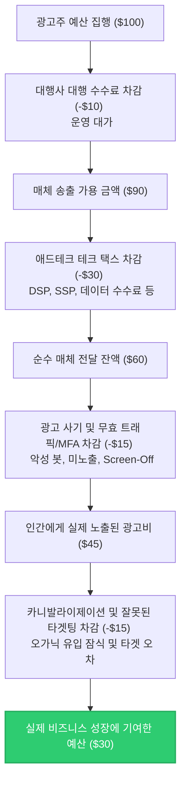

**"우리가 광고비로 100달러를 쓸 때, 실제로 진짜 사람인 소비자에게 도달해 비즈니스 성장을 이끌어내는 돈은 단 30달러 내외에 불과합니다. 나머지 70달러는 중간 거래 수수료, 가짜 봇 트래픽, 어차피 살 사람에게 띄운 무의미한 타겟팅 광고 뒤로 흔적도 없이 사라집니다."**

2025년을 기점으로 글로벌 전체 광고 시장은 사상 최초로 **1조 달러($1T, 한화 약 1,300조 원) 돌파**라는 대기록을 달성했습니다. 이 거대한 자금 흐름의 70% 이상을 디지털 광고가 이끌고 있습니다. 하지만 대시보드에 찍히는 화려한 ROAS와 클릭 수 뒤편에는 마케터들이 외면하고 싶어 하는 거대한 낭비의 블랙홀이 도사리고 있습니다. 

이번 포스트에서는 글로벌 광고비 1조 달러 시대에 마케터의 예산이 구체적으로 어떤 경로를 통해 낭비되고 있는지 관련 통계와 학술 데이터를 기반으로 추정해 봅니다.

---

## 1. 1조 달러 시장의 탄생과 디지털 광고의 지배
글로벌 마케팅 및 매체 대행 그룹인 WPP(GroupM)와 eMarketer 등 주요 리서치 기관들의 발표에 따르면, 글로벌 전체 광고 시장은 2025년 기준 **1조 500억-1조 1,400억 달러** 규모에 달하는 것으로 분석되었습니다. 

여기서 한 가지 짚고 넘어가야 할 사실이 있습니다. 흔히 '디지털 마케팅 시장 $1T'와 '전체 광고 시장 $1T'를 혼용하곤 하지만, 엄밀히 말해 **전체 매체 광고비**가 1조 달러를 돌파한 것이며, 그중 디지털 광고 시장의 비중은 **약 70-75% (약 7,400억-7,800억 달러)** 수준입니다. (단, 기업들이 지출하는 웹사이트 구축, CRM 마케팅 툴 솔루션 구독료, 컨설팅 비용 등 광의의 디지털 마케팅 에코시스템 전체를 합산할 경우 디지털 마케팅 시장 자체만으로도 이미 1조 달러를 훨씬 초과합니다.)

보다 자세한 연도별/기관별 추정치의 편차에 대해서는 [[글로벌 광고 시장 규모 추정치와 기관별 분석 격차]](file:///Users/wook/WookAi/Booklog/content/posts/Marketing/2026-04-29-global-ad-market-size-estimates-gap.md) 포스트에서 다룬 바 있습니다. 

그렇다면 이 천문학적인 디지털 광고 예산 중, 실제로 작동하는 돈은 얼마나 될까요?

---

## 2. 예산을 삼키는 4대 블랙홀

디지털 광고 예산이 최종 소비자에게 도달하기까지 거치는 중간 단계와 그 과정에서 발생하는 손실을 분석해 보면, 낭비의 요인은 크게 4가지로 요약할 수 있습니다.

### ① 테크 택스 (Tech Tax) — 애드테크 중개 수수료의 세분화 (30% - 50% 낭비)
디지털 광고의 대세가 된 프로그래매틱 광고(Programmatic Advertising) 시장에서는 광고주(DSP)와 매체(SSP) 사이에 수많은 기술 솔루션이 개입합니다. 이 중개 솔루션들이 가져가는 통행세를 업계에서는 **'테크 택스(Tech Tax)'**라고 부르며, 구체적으로 다음과 같은 유형별 수수료로 쪼개어 분석할 수 있습니다.

*   **광고주용 플랫폼 수수료 (DSP Fee / Buy-side Fee):** 광고주가 캠페인을 설정, 타겟팅 설정, 자동 입찰을 진행하기 위해 사용하는 수요자 측 플랫폼(DSP)의 이용료입니다. 통상 광고주의 전체 지출 대비 **10% - 15%** 수준입니다.
*   **매체용 플랫폼 수수료 (SSP Fee / Sell-side Fee):** 매체(Publisher)가 자사 인벤토리를 광고 거래소에 등록하고 노출당 단가를 극대화하기 위해 지불하는 공급자 측 플랫폼(SSP)의 수수료입니다. 대체로 **10% - 15%** 수준이 차감됩니다.
*   **데이터 및 타겟팅 수수료 (Data/DMP Fee):** 오디언스 타겟팅을 정교화하기 위해 서드파티 데이터 공급업체(DMP)의 데이터를 연동하여 활용하는 비용으로, 대략 **5% - 10%**가 지출됩니다.
*   **광고 검증 및 부정 방지 수수료 (Verification Fee):** 가시성(Viewability) 측정, 브랜드 세이프티(Brand Safety), 부정 광고(Ad Fraud) 차단을 위해 IAS, DoubleVerify, Moat 등 타사 측정 솔루션을 탑재하는 비용으로, 약 **2% - 5%**가 소비됩니다.
*   **애드 서빙 수수료 (Ad Serving Fee):** 최종적으로 사용자의 브라우저에 광고 크리에이티브(이미지/비디오)를 호스팅하고 전송하는 애드서버 비용이며, **2% - 5%** 수준입니다.
*   **추적 불가능한 미지의 델타 (Unknown Delta):** 영국 광고주협회(ISBA)와 PwC가 공동 진행한 [ISBA/PwC Programmatic Supply Chain Transparency Study (2020)](https://www.isba.org.uk/system/files?file=media/documents/2020-12/executive-summary-programmatic-supply-chain-transparency-study.pdf) 연구에 따르면, 광고주가 지출한 100달러 중 실제 지면을 제공한 매체(Publisher)에 도달한 금액은 **단 51달러(51%)**에 불과했습니다. 나머지 49% 중 **15%는 복잡한 중개 구조 및 거래 기록 미매칭으로 인해 어디로 사라졌는지 추적조차 불가능한 '미지의 델타(Unknown Delta)'**로 확인되었습니다.
    *   **세부 매칭 데이터의 한계:** 이 연구는 15개 글로벌 브랜드의 2억 6,700만 회 광고 노출 데이터를 추적했으나, 애드테크 간 경로가 너무 복잡해 처음부터 끝까지 완전 추적에 성공한 노출 데이터는 단 **12%**에 불과했습니다.
    이 수수료의 정체에 대해서는 [[DSP와 SSP 사이, 내 예산 절반은 어디로 사라졌나? (Tech Tax의 실체)]](file:///Users/wook/WookAi/Booklog/content/posts/Marketing/2026-05-12-adtech-supply-chain-tech-tax.md)에서 더 상세히 확인하실 수 있습니다.

*   **최신 ANA 벤치마크 데이터 (2024년 12월 보고서):** 미국 광고주협회(ANA)가 발표한 [ANA Programmatic Transparency Benchmark](https://www.ana.net) 최신 업데이트에 따르면, 공급망 최적화(SPO)와 투명성 강화 운동 덕분에 진짜 광고비(True Ad Spend) 비율이 기존 36%에서 **43.9%**로 소폭 개선되었습니다. 하지만 여전히 절반 이상의 마케팅 예산이 테크 택스 및 무효 노출로 사라지고 있으며, ANA 기업들이 오픈 마켓에서 낭비하는 금액만 글로벌 기준으로 연간 **268억 달러(한화 약 35조 원)**에 달합니다.

### ② 광고 사기 및 무효 트래픽 (Ad Fraud & IVT) (10% - 25% 낭비)
두 번째 블랙홀은 인간이 아닌 소프트웨어(봇)나 가짜 클릭 농장이 광고 노출과 클릭, 심지어 모바일 앱 설치 등의 이벤트를 인위적으로 위조하여 광고비를 가로채는 영역입니다.

*   **악성 봇 트래픽(Bad Bot Traffic):** Imperva의 [2024 Imperva Bad Bot Report](https://www.imperva.com)에 따르면, 전 세계 웹 트래픽 중 악성 봇(Bad Bot)의 비중이 무려 **32%**에 달해, 광고 노출 및 CPC 클릭을 악의적으로 난사하며 광고비 누수를 유발합니다.
*   **MFA(Made-for-Advertising) 채널의 모바일/CTV 확장:** 오직 광고 지출 갈취를 목적으로 스팸 글을 복제하고 다수의 광고창을 띄우는 MFA 지면이 웹을 넘어 모바일 유틸리티 앱(SlopAds 사태 등)과 Connected TV(CTV) 영역까지 확대되고 있습니다. DoubleVerify에 따르면, CTV 광고의 경우 사용자가 TV 화면을 끄고 외출한 상태(Screen-Off)에서도 백그라운드에서 동영상 광고를 무한 재생하여 가로채는 **Screen-Off Ad Fraud(대표 사례: 스모크스크린 스캔들)**로 인해 노출 10억 회당 약 70만 달러의 무임승차가 발생하고 있습니다.
*   **모바일 앱 설치 사기 (App Install Fraud)의 고도화된 유형:** AppsFlyer의 리포트에 따르면, 모바일 앱 성과 마케팅 시장에서는 매년 광고 사기로 인해 약 **12%**의 광고비가 영구 낭비되고 있습니다. 주요 수법은 다음과 같습니다.
    *   **클릭 인젝션 (Click Injection):** 안드로이드 기기 내에 잠입한 악성 앱이 사용자의 앱 다운로드/설치 브로드캐스트(Broadcast) 신호를 모니터링하다가, 실제 설치가 완료되는 찰나(직전 몇 밀리초 사이)에 백그라운드에서 가짜 광고 클릭을 서버로 급조하여 주입합니다. 이를 통해 해당 설치 성과를 자신이 유입시킨 것처럼 마케팅 어트리뷰션 결과를 왜곡해 성과 수수료를 가로챕니다.
    *   **SDK 스푸핑 (SDK Spoofing / SDK Hacking):** 실제 기기가 존재하지도 않고 앱을 설치하지 않았음에도, 광고주 앱에 내장된 어트리뷰션 SDK와 측정 서버 간의 통신 프로토콜 암호를 해킹 및 역설계(Reverse Engineering)하여, 임의의 가짜 기기 식호와 설치 완료 시그널 데이터를 조작된 패킷 형태로 서버에 직접 쏘아 보내 광고비를 편취하는 매우 정교한 기법입니다.
    *   **클릭 스패밍 / 플러딩 (Click Spamming / Click Flooding):** 사용자가 특정 앱을 활성화하고 있는 동안 보이지 않는 백그라운드에서 수백만 개의 가짜 클릭을 무차별적으로 난사(Spamming)해 둡니다. 나중에 해당 사용자가 자연적으로(Organic) 광고주 앱을 발견해 설치하게 되면, 어트리뷰션 측정 시스템의 '마지막 클릭 기여(Last Click Attribution)' 규칙에 의해 미리 난사된 클릭 중 하나가 매칭되어 오가닉 유입 성과를 광고 대행사나 매체의 성과로 둔갑시킵니다.
    *   **디바이스 팜 (Device Farms):** 가짜 에뮬레이터 프로그램이나 수십~수백 대의 실제 스마트폰 단말기를 기계식 랙에 거치해두고, 자동화 스크립트나 저임금 노동자를 동원하여 앱 설치, 클릭, 계정 생성, 튜토리얼 실행 등의 기만적인 액션을 물리적으로 조작·반복하는 원시적이면서도 강력한 사기 수법입니다.
    *   **우버(Uber)의 1억 달러 어트리뷰션 사기 사건:** 모바일 광고 대행사들이 유저의 자연 유입(Organic Install) 순간에 백그라운드에서 가짜 클릭 신호를 조작·주입하여 성과를 가로채왔습니다. 우버가 광고비 $1.2억 달러를 삭감했음에도 신규 설치 수에 아무런 변화가 없었던 이유는 카니발라이제이션이 아닌 바로 이 **어트리뷰션 사기(Attribution Fraud)** 때문이었습니다. 자세한 메커니즘은 [[우버(Uber)의 1억 달러 어트리뷰션 사기 사태 심층 분석]](file:///Users/wook/WookAi/Booklog/content/posts/2026-05-19-uber-100m-attribution-fraud-case.ko.md) 포스트를 참고하십시오.
    *   **2차 데이터 오염 피해:** 이렇듯 가짜 사기 트래픽 데이터가 애드테크의 머신러닝 최적화 엔진에 그대로 주입되면, AI 최적화 알고리즘이 엉뚱한 사기 지면이나 가짜 봇을 진짜 고가치 타겟으로 잘못 학습하여 광고비를 역으로 낭비하는 2차적인 데이터 오염 피해가 발생하게 됩니다.

### ③ 잘못된 타겟팅과 카니발라이제이션 (Targeting Trap) (15% - 30% 낭비)
많은 매체와 애드테크 플랫폼이 '초정밀 타겟팅'과 '고도화된 리타겟팅 알고리즘'을 전면에 내세우지만, 실질적인 비즈니스 증분(Incrementality) 관점에서 분석한 통계적 근거들은 이에 대해 강한 경고를 보내고 있습니다.

*   **초정밀 타겟팅 데이터의 처참한 민낯 (MIT/HBR 공동 연구):** 
    마케팅 과학 저널인 *Marketing Science*에 발표된 연구(*Neumann et al., 2019*)는 글로벌 주요 데이터 공급업체(DMP)가 광고주에게 값비싸게 판매하는 타겟 오디언스 세그먼트 데이터의 정확성을 대규모로 검증했습니다. 그 결과, 가장 기본적인 인구통계학적 속성인 **성별(Gender) 타겟팅조차 실제 정확도는 평균 50%대에 불과**하여 동전 던지기 수준의 신뢰도를 보였습니다. 성별에 더해 특정 연령대(Age Group) 등의 조건이 결합될 경우, 타겟 매칭의 정확도는 **20% 미만**으로 곤두박질쳤습니다. 즉, 광고주가 타겟팅을 정교화하기 위해 값비싼 데이터 수수료를 지급했으나, 실상은 타겟과 전혀 무관한 80%의 대중에게 광고가 잘못 뿌려지며 예산이 증발하는 '타겟팅 함정'이 작동하고 있는 것입니다.
*   **증분성(Incrementality)의 결여와 오가닉 잠식 (페이스북 대규모 실험 연구):**
    광고를 게재하지 않았더라도 어차피 웹사이트에 들어와 구매했을 기존 충성 고객에게 계속해서 리타겟팅 배너나 검색 광고를 노출하여 성과를 부풀리는 현상입니다.
    *   **페이스북의 15개 기업 대규모 실험 데이터 (*Gordon et al., 2019*):** 메타(Meta)와 학계 연구진이 공동 진행한 연구에 따르면, 수만 개의 캠페인에 대해 광고를 보는 집단(Test)과 완전히 배제된 통제 집단(Control)을 구성하여 무작위 통제 실험(RCT)을 수행한 결과, 기존의 일반적인 성과 기여 모델(Last-touch 기여 모델 등)이 나타내는 광고 기여 성과는 **실제 브랜드가 얻은 비즈니스 증분(추가) 효과 대비 약 3배에서 최대 4배까지 부풀려진 것**으로 검증되었습니다. 광고 대시보드는 성과를 크게 축하하지만, 그 실상은 원래 유입되었을 고객들의 전환을 가로챈 카니발라이제이션의 비중이 70%를 넘어선다는 것을 뜻합니다.
    *   **이베이(eBay) 브랜드 키워드 광고 전면 중단 실험:** 구글에서 'eBay' 브랜드를 검색하는 사람들에게 타겟팅하여 광고비를 지출해왔으나, 광고를 완전히 꺼버렸을 때 유저들이 자연스럽게 바로 아래의 자연 검색(Organic Search) 링크를 통해 그대로 유입되어 매출 변동률이 0%로 나타났습니다.
    *   **에어비앤비(Airbnb)의 퍼포먼스 마케팅 예산 삭감:** 검색 및 디스플레이 광고비의 상당 부분(1억 2,000만 달러 이상)을 삭감했음에도, 브랜드 검색 트래픽의 자연 복구로 인해 전체 트래픽이 95% 이상 그대로 유지된 바 있습니다.

### ④ 대행사 수수료 및 간접 비용 (Agency Markup) (5% - 15% 낭비)
마지막 예산 유실 경로는 광고의 실제 설계 및 미디어 운영에 개입하는 대행사(Agency) 관련 비용과 마크업입니다.

*   **대행사 수수료(Agency Fee) vs 테크 택스(Tech Tax)의 차이:**
    *   **테크 택스(Tech Tax):** 광고 입찰, 타겟 매칭, 노출 서빙, 성과 측정 등 광고 송출 시스템 전반을 가동하기 위해 사용하는 **'광고 기술 소프트웨어(Software) 및 SaaS 통행료'**입니다. (솔루션 사용료)
    *   **대행사 수수료(Agency Fee / Markup):** 광고 전략 기획, 크리에이티브 메시지 제작, 매체사 협상, 광고 세팅 및 리포팅 등 수동 작업과 전문 컨설팅을 수행하는 **'인적 리소스 및 대행 서비스 비용'**입니다. 일반적으로 매체 비용(Media Buy)에 10%~15% 수준의 수수료(Commission)를 덧붙이거나 매월 리테이너 피(Retainer Fee)를 부과하는 형태로 수취됩니다.
    두 항목 모두 광고주의 돈 중 실제 매체 지면에 실리지 못하는 '비매체비(Non-working Media Spend)'라는 공통점이 있으나, **시스템 가동을 위한 플랫폼 통행료(Tech Tax)**와 **기획/운영을 담당하는 휴먼 서비스 대가(Agency Fee)**라는 점에서 명확히 분별해서 관리되어야 합니다.

---

## 3. 종합 예산 낭비 추정: 100달러의 여행

앞서 살펴본 4대 누수 비율을 기반으로, 마케터가 100달러의 광고 예산을 디지털 광고(특히 프로그래매틱 디스플레이/비디오 영역)에 송금했을 때 최종적으로 실제 순수 비즈니스 성장에 기여하는 **'진짜 작동하는 광고비(Working & Incremental Media)'**를 가상의 경로로 시뮬레이션해 봅니다.

1.  **시작 금액:** `$100`
2.  **대행사 수수료 차감 (-10%):** 광고 기획, 세팅 및 분석 마크업으로 대행사가 가져가며, 실질 광고 송출 예산은 `$90`이 남습니다.
3.  **테크 택스 차감 (-33%):** 프로그래매틱 지면 낙찰 및 송출 과정에서 DSP/SSP 솔루션 통행료, 제3자 데이터 이용료, 가시성/사기 검증 솔루션 이용료, 서빙 피 등으로 약 `$30`가 증발합니다. 매체사(Publisher) 측에 가닿는 돈은 `$60` 수준입니다.
4.  **광고 사기 및 무효 트래픽/MFA 차감 (-25%):** 전송된 지면 중 봇 트래픽, MFA 사이트의 쓰레기 노출, 보이지 않는 광고 겹치기(Stacking), TV 화면 꺼짐(Screen-Off) 등 기만적인 지면 송출로 인해 약 `$15`가 소실되어 남은 실질 광고비는 `$45`가 됩니다.
5.  **카니발라이제이션 및 잘못된 타겟팅 차감 (-33%):** 데이터 오차로 타겟 연령/성별이 빗나간 오노출액과 광고를 하지 않았어도 어차피 자연(Organic) 유입으로 구매했을 고객에게 리타겟팅하여 낭비한 금액(약 `$15`)을 제외합니다.
6.  **비즈니스 성장에 순수하게 기여한 최종 금액 (Working & Incremental Media):** **`약 $30`**

즉, 아무리 효율적으로 집행한다고 가정해도 디지털 광고비의 **40%는 기술 및 대행 수수료(Tech Tax, Agency Fee)와 Ad Fraud로 무조건 유실**되며, 비즈니스 성과적 측면에서의 **'증분성이 없는 낭비'까지 감안하면 최대 70%의 광고비가 공중분해**되고 있는 셈입니다.

이를 2025년 글로벌 디지털 광고 시장 규모($7,400억 달러 기준)에 대입해 보면, 마케터들이 매년 **최소 $1,480억 - $2,960억 달러 (20-40%)**, 실질 증분성 낭비까지 포함할 시 **$4,000억 달러 이상(한화 약 520조 원)**을 아무런 기여 없이 허공에 날리고 있다는 충격적인 계산이 성립됩니다.

---

## 4. 마케터가 낭비를 멈추기 위해 해야 할 일

천문학적인 예산 누수를 방어하기 위해 CMO와 데이터 마케터들은 다음과 같은 방어 기제를 가동해야 합니다.

1.  **공급망 최적화 (SPO, Supply Path Optimization) 실행:** 불필요한 중간 Ad Exchange와 리셀러 단계를 과감히 쳐내고, 프리미엄 매체 및 SSP와 다이렉트 거래(PMP 등) 비율을 높여야 합니다.
2.  **로그 레벨 데이터(Log-level Data) 투명성 요구:** 단순 대시보드 리포트에 안주하지 말고, 각 입찰별 수수료와 매체 ID가 찍힌 로데이터 분석 권한을 파트너사 계약 조건에 포함해야 합니다.
3.  **지속적인 증분성(Incrementality) 테스트:** 광고 성과를 무조건 신뢰하지 말고, 특정 지역이나 미디어를 대상으로 광고 집행을 중단해보는 'Turn-off' 실험을 정기적으로 수행해 오가닉 잠식 효과를 정량화해야 합니다.

측정할 수 없거나 블랙박스 뒤에 숨겨진 효율 지표는 언제나 누군가의 수수료 챙기기에 악용되기 쉽습니다. 1조 달러 시장의 화려함 뒤에 숨겨진 70%의 낭비를 인지하는 것, 그것이 데이터 리터러시를 갖춘 현대 마케터의 시작점입니다.

---

## 📚 참고자료
1. Association of National Advertisers (ANA). (2025). *Programmatic Transparency Benchmark Report (Q2 2025)*. (글로벌 프로그래매틱 광고 낭비 규모 $26.8B 및 MFA 유입률 분석 자료)
2. ISBA & PwC. (2020). *Programmatic Supply Chain Transparency Study*. (15% Unknown Delta 및 51% Publisher Payout 최초 입증 연구)
3. Juniper Research. (2023). *Combating Ad Fraud: Market Forecasts & Losses*. (글로벌 광고 사기 피해 규모 예측 보고서)
4. Neumann, N., Tucker, C. E., & Whitfield, T. (2019). *How Effective Is Third-Party Consumer Profiling for Identifying Target Audiences?* Marketing Science. (DMP 타겟 데이터 정확도 및 연령/성별 매칭 오류 실증 논문)
5. Gordon, B. R., Zettelmeyer, F., Bhargava, N., & Chapsky, D. (2019). *A Comparison of Approaches to Advertising Measurement*. Marketing Science. (페이스북 대규모 RCT 실험을 통한 일반 성과 기여 모델의 증분 효과 과대평가 실증 논문)
6. Tadelis, S., et al. (2015). *Consumer Heterogeneity and Paid Search Effectiveness: A Large-Scale Field Experiment*. Econometrica. (브랜드 키워드 광고의 오가닉 잠식 효과 및 증분성 입증 학술 논문)
7. [[글로벌 광고 시장 규모 추정치와 기관별 분석 격차]](file:///Users/wook/WookAi/Booklog/content/posts/Marketing/2026-04-29-global-ad-market-size-estimates-gap.md)
8. [[DSP와 SSP 사이, 내 예산 절반은 어디로 사라졌나? (Tech Tax의 실체)]](file:///Users/wook/WookAi/Booklog/content/posts/Marketing/2026-05-12-adtech-supply-chain-tech-tax.md)
9. [[우버(Uber)의 1억 달러 어트리뷰션 사기 사태 심층 분석]](file:///Users/wook/WookAi/Booklog/content/posts/2026-05-19-uber-100m-attribution-fraud-case.ko.md)
