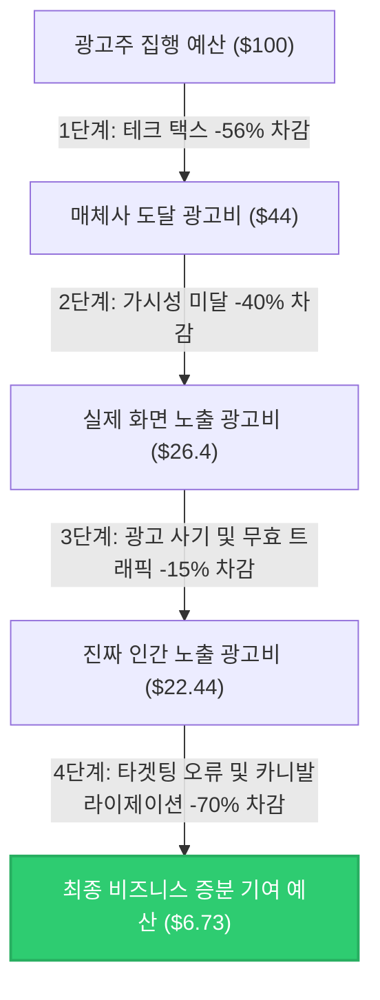

**"우리가 광고비로 100달러를 쓸 때, 실제로 진짜 사람인 소비자에게 도달해 비즈니스 성장을 이끌어내는 돈은 단 7달러 내외에 불과합니다. 나머지 93달러는 중간 거래 수수료, 가짜 봇 트래픽, 어차피 살 사람에게 띄운 무의미한 타겟팅 광고 뒤로 흔적도 없이 사라집니다."**

2025년을 기점으로 글로벌 전체 광고 시장은 사상 최초로 **1조 달러($1T, 한화 약 1,300조 원) 돌파**라는 대기록을 달성했습니다. 이 거대한 자금 흐름의 70% 이상을 디지털 광고가 이끌고 있습니다. 하지만 대시보드에 찍히는 화려한 ROAS와 클릭 수 뒤편에는 마케터들이 외면하고 싶어 하는 거대한 낭비의 블랙홀이 도사리고 있습니다. 

이번 포스트에서는 글로벌 광고비 1조 달러 시대에 마케터의 예산이 구체적으로 어떤 경로를 통해 낭비되고 있는지 관련 통계와 학술 데이터를 기반으로 추정해 봅니다.

---

## 1. 1조 달러 시장의 탄생과 디지털 광고의 지배
글로벌 마케팅 및 매체 대행 그룹인 WPP(GroupM)와 eMarketer 등 주요 리서치 기관들의 발표에 따르면, 글로벌 전체 광고 시장은 2025년 기준 **1조 500억-1조 1,400억 달러** 규모에 달하는 것으로 분석되었습니다. 

여기서 한 가지 짚고 넘어가야 할 사실이 있습니다. 흔히 '디지털 마케팅 시장 $1T'와 '전체 광고 시장 $1T'를 혼용하곤 하지만, 엄밀히 말해 **전체 매체 광고비**가 1조 달러를 돌파한 것이며, 그중 디지털 광고 시장의 비중은 **약 70-75% (약 7,400억-7,800억 달러)** 수준입니다. (단, 기업들이 지출하는 웹사이트 구축, CRM 마케팅 툴 솔루션 구독료, 컨설팅 비용 등 광의의 디지털 마케팅 에코시스템 전체를 합산할 경우 디지털 마케팅 시장 자체만으로도 이미 1조 달러를 훨씬 초과합니다.)

보다 자세한 연도별/기관별 추정치의 편차에 대해서는 [[글로벌 광고 시장 규모 추정치와 기관별 분석 격차]](file:///Users/wook/WookAi/Booklog/content/posts/Marketing/2026-04-29-global-ad-market-size-estimates-gap.md) 포스트에서 다룬 바 있습니다. 

그렇다면 이 천문학적인 디지털 광고 예산 중, 실제로 작동하는 돈은 얼마나 될까요?

---

## 2. 예산을 삼키는 2대 블랙홀 (도달 이전의 기술적·지면적 손실)

디지털 광고 예산이 최종 소비자의 화면에 정상적으로 도달하기까지, 매체 중개 과정과 지면 자체의 문제로 인해 발생하는 대표적인 기술적·지면적 손실은 크게 두 가지로 분류할 수 있습니다.

### ① 테크 택스 (Tech Tax) — 애드테크 중개 수수료의 세분화 (30% - 50% 낭비)
디지털 광고의 대세가 된 프로그래매틱 광고(Programmatic Advertising) 시장에서는 광고주(DSP)와 매체(SSP) 사이에 수많은 기술 솔루션이 개입합니다. 이 중개 솔루션들이 가져가는 통행세를 업계에서는 **'테크 택스(Tech Tax)'**라고 부르며, 구체적으로 다음과 같은 유형별 수수료로 쪼개어 분석할 수 있습니다.

*   **광고주용 플랫폼 수수료 (DSP Fee / Buy-side Fee):** 광고주가 캠페인을 설정, 타겟팅 설정, 자동 입찰을 진행하기 위해 사용하는 수요자 측 플랫폼(DSP)의 이용료입니다. 통상 광고주의 전체 지출 대비 **10% - 15%** 수준입니다.
*   **매체용 플랫폼 수수료 (SSP Fee / Sell-side Fee):** 매체(Publisher)가 자사 인벤토리를 광고 거래소에 등록하고 노출당 단가를 극대화하기 위해 지불하는 공급자 측 플랫폼(SSP)의 수수료입니다. 대체로 **10% - 15%** 수준이 차감됩니다.
*   **데이터 및 타겟팅 수수료 (Data/DMP Fee):** 오디언스 타겟팅을 정교화하기 위해 서드파티 데이터 공급업체(DMP)의 데이터를 연동하여 활용하는 비용으로, 대략 **5% - 10%**가 지출됩니다.
*   **광고 검증 및 부정 방지 수수료 (Verification Fee):** 가시성(Viewability) 측정, 브랜드 세이프티(Brand Safety), 부정 광고(Ad Fraud) 차단을 위해 IAS, DoubleVerify, Moat 등 타사 측정 솔루션을 탑재하는 비용으로, 약 **2% - 5%**가 소비됩니다.
*   **애드 서빙 수수료 (Ad Serving Fee):** 최종적으로 사용자의 브라우저에 광고 크리에이티브(이미지/비디오)를 호스팅하고 전송하는 애드서버 비용이며, **2% - 5%** 수준입니다.
*   **추적 불가능한 미지의 델타 (Unknown Delta):** 영국 광고주협회(ISBA)와 PwC가 공동 진행한 [ISBA/PwC Programmatic Supply Chain Transparency Study (2020)](https://www.isba.org.uk/system/files?file=media/documents/2020-12/executive-summary-programmatic-supply-chain-transparency-study.pdf) 연구에 따르면, 광고주가 지출한 100달러 중 실제 지면을 제공한 매체(Publisher)에 도달한 금액은 **단 51달러(51%)**에 불과했습니다. 나머지 49% 중 **15%는 복잡한 중개 구조 및 거래 기록 미매칭으로 인해 어디로 사라졌는지 추적조차 불가능한 '미지의 델타(Unknown Delta)'**로 확인되었습니다.
    *   **세부 매칭 데이터의 한계:** 이 연구는 15개 글로벌 브랜드의 2억 6,700만 회 광고 노출 데이터를 추적했으나, 애드테크 간 경로가 너무 복잡해 처음부터 끝까지 완전 추적에 성공한 노출 데이터는 단 **12%**에 불과했습니다.
    이 수수료의 정체에 대해서는 [[DSP와 SSP 사이, 내 예산 절반은 어디로 사라졌나? (Tech Tax의 실체)]](file:///Users/wook/WookAi/Booklog/content/posts/Marketing/2026-05-12-adtech-supply-chain-tech-tax.md)에서 더 상세히 확인하실 수 있습니다.

*   **최신 ANA 벤치마크 데이터 (2024년 12월 보고서):** 미국 광고주협회(ANA)가 발표한 [ANA Programmatic Transparency Benchmark](https://www.ana.net) 최신 업데이트에 따르면, 공급망 최적화(SPO)와 투명성 강화 운동 덕분에 진짜 광고비(True Ad Spend) 비율이 기존 36%에서 **43.9%**로 소폭 개선되었습니다. 하지만 여전히 절반 이상의 마케팅 예산이 테크 택스 및 무효 노출로 사라지고 있으며, ANA 기업들이 오픈 마켓에서 낭비하는 금액만 글로벌 기준으로 연간 **268억 달러(한화 약 35조 원)**에 달합니다.

### ② 광고 사기, 무효 트래픽 및 가시성 미달 (Ad Fraud, IVT & Viewability Trap) (25% - 45% 낭비)
광고주가 구매한 광고 지면이 실제 인간의 눈에 가닿지 않거나, 봇 프로그램에 의해 허위로 소모되는 영역입니다. 특히 **가시성(Viewability) 미달과 미노출 지면은 광고 사기 및 MFA(Made-For-Advertising) 지면의 특징과 완벽히 중첩**되어 나타납니다.

*   **MFA(Made-For-Advertising)의 본질과 가시성 미달의 연결성:** 
    *   **MFA의 정의와 동작 방식 (트래픽 아비트라지):** MFA는 유저에게 유용한 콘텐츠를 제공하는 것이 아니라, 오직 프로그래매틱 광고 수익만을 가로채기 위해 급조된 저품질 지면입니다. 이들은 타불라(Taboola)나 아웃브레인(Taboola) 같은 저렴한 광고 네트워크를 통해 싼값에 유저 트래픽을 사온 뒤(Traffic Arbitrage), 자사 페이지에 들어온 유저에게 AI가 생성한 스팸 글과 함께 일반 사이트 대비 3~4배 이상 많은 광고 지면을 노출시켜 차익을 남깁니다.
    *   **MFA 지면의 가시성 미달 양산 패턴:** MFA 사이트는 수익을 극대화하기 위해 화면 전체에 광고창을 빽빽이 배치하며, 유저가 미처 스크롤을 내리기 전에 보이지 않는 하단 영역(Below the fold)의 모든 광고 인벤토리를 강제로 로딩(Auto-refresh)시킵니다. 혹은 브라우저의 백그라운드 탭에서 혼자 동영상 광고를 소리 없이 무한 재생하기도 합니다. 이 때문에 MFA로 유입된 노출은 MRC 표준을 만족하는 가시성(Viewability)이 구조적으로 결여될 수밖에 없습니다.
    *   **모바일 유틸리티로의 변종 확장 (SlopAds 사태):** 최근 MFA는 일반 스팸 웹사이트를 넘어 계산기, 손전등, 날씨 등 모바일 유틸리티 앱 내부로 침투했습니다. 백그라운드에서 보이지 않는 웹뷰(Webview)를 작동시켜 저질 MFA 스팸 페이지를 대량으로 로드하고 광고를 강제 호출하는 **'SlopAds 사태'**가 대표적입니다. 유저의 기기 리소스와 모바일 데이터를 갈취하면서 광고주의 예산을 편취하는 신종 모바일 Ad Fraud의 온상으로 진화하고 있습니다.
*   **MRC 뷰어빌리티 표준과 미노출의 실제:**
    *   미국 미디어시청률실사위원회(MRC)의 글로벌 표준에 따르면, 디스플레이 배너 광고는 전체 면적의 **50% 이상이 화면에 1초 이상**, 동영상 광고는 **2초 이상** 연속해서 노출되어야만 유효한 '가시 노출(Viewable Impression)'로 인정받습니다.
    *   하지만 IAS(Integral Ad Science) 등의 글로벌 검증 보고서에 따르면, 프로그래매틱 광고 시장의 평균 뷰어빌리티(Viewability) 비율은 **60% 내외**에 머뭅니다. 즉, 송출된 광고의 약 40%는 사용자가 미처 스크롤을 내리기 전에 페이지를 벗어났거나, 여러 탭 중 백그라운드 탭에서 혼자 로딩되었거나, 너무 빠르게 스크롤을 지나쳐버려 **인간의 눈에 단 한 순간도 가닿지 못한 채 낭비**되고 있습니다.
    *   광고주가 지불한 CPM 단가에는 이 가시성 미달 노출이 고스란히 포함되어 과금되므로, 이는 매체 지면 비용 자체의 심각한 효율 저하를 초래합니다.
*   **악성 봇 트래픽(Bad Bot Traffic):** Imperva의 [2024 Imperva Bad Bot Report](https://www.imperva.com)에 따르면, 전 세계 웹 트래픽 중 악성 봇의 비중이 무려 **32%**에 달해 광고 노출 및 CPC 클릭을 악의적으로 난사하며 예산을 잠식합니다.
*   **CTV 영역의 화면 꺼짐 사기 (Screen-Off Ad Fraud):** Connected TV(CTV) 광고의 경우, DoubleVerify 조사에 의하면 사용자가 TV 화면을 끄고 외출한 상태에서도 백그라운드에서 동영상 광고를 무한 재생하여 가로채는 'Screen-Off Ad Fraud'(대표 사례: 스모크스크린 스캔들)로 인해 노출 10억 회당 약 70만 달러의 무임승차가 발생하고 있습니다.
*   **모바일 앱 설치 사기 (App Install Fraud)의 고도화된 유형:** AppsFlyer 리포트에 따르면, 모바일 앱 성과 마케팅 시장에서는 매년 광고 사기로 인해 약 **12%**의 광고비가 영구 낭비되고 있습니다.
    *   **클릭 인젝션 (Click Injection):** 기기 내 잠입한 악성 앱이 실제 설치 완료 직전 몇 밀리초 사이에 백그라운드에서 가짜 광고 클릭을 주입하여 기여 성과를 가로챕니다.
    *   **SDK 스푸핑 (SDK Spoofing):** 기기가 존재하지 않고 설치가 일어나지 않았음에도, 측정 서버 간의 통신 프로토콜을 해킹하여 조작된 패킷 형태로 설치 시그널을 위조해 쏘아 보냅니다.
    *   **클릭 스패밍 / 플러딩 (Click Spamming / Click Flooding):** 보이지 않는 백그라운드에서 수백만 개의 가짜 클릭을 무차별적으로 난사해 두었다가, 사용자가 자연적으로(Organic) 앱을 설치할 때 마지막 클릭 기여 규칙을 악용해 성과를 가로챕니다.
    *   **디바이스 팜 (Device Farms):** 자동화 스크립트나 저임금 노동자를 동원해 기계식 랙에 거치된 수많은 단말기에서 앱 설치 및 실행 액션을 물리적으로 조작·반복합니다.
    *   **우버(Uber)의 어트리뷰션 사기 사태:** 자연 유입(Organic Install) 순간에 백그라운드 가짜 클릭을 주입받아 광고 대행사가 성과를 가로챈 대표적인 사건입니다. 우버가 광고비 1억 2,000만 달러를 삭감했음에도 신규 설치 수에 아무런 변화가 없었던 메커니즘은 [[우버(Uber)의 1억 달러 어트리뷰션 사기 사태 심층 분석]](file:///Users/wook/WookAi/Booklog/content/posts/2026-05-19-uber-100m-attribution-fraud-case.ko.md) 포스트를 참고하십시오.
    *   **2차 데이터 오염 피해:** 이 가짜 사기 데이터가 머신러닝 최적화 엔진에 주입되면, AI 알고리즘이 사기 지면이나 가짜 봇을 고가치 타겟으로 잘못 학습하여 광고비를 역으로 낭비하는 악순환이 발생합니다.

---

## 3. 광고 도달 이후의 블랙홀: 타겟팅 함정과 카니발라이제이션 (Targeting Trap)

앞서 다룬 블랙홀들이 광고가 실제 인간에게 정상적으로 노출되기 전에 발생하는 '기술적·지면적 손실'이라면, 이번 영역은 광고가 무사히 소비자에게 도달한 이후 비즈니스 실익을 만들어내는 과정에서 발생하는 '효율성 손실'입니다.

*   **초정밀 타겟팅 데이터의 처참한 민낯 (MIT/HBR 공동 연구):** 
    마케팅 과학 저널인 *Marketing Science*에 발표된 연구(*Neumann et al., 2019*)는 데이터 공급업체(DMP)가 광고주에게 값비싸게 판매하는 타겟 오디언스 세그먼트 데이터의 정확성을 검증했습니다. 그 결과, 가장 기본적인 **성별(Gender) 타겟팅조차 실제 정확도는 평균 50%대에 불과**하여 동전 던지기 수준이었습니다. 성별에 더해 특정 연령대 등의 조건이 결합될 경우, 타겟 매칭의 정확도는 **20% 미만**으로 곤두박질쳤습니다. 즉, 광고주가 타겟팅을 위해 값비싼 데이터 수수료를 지급했으나, 실상은 타겟과 전혀 무관한 80%의 대중에게 광고가 잘못 뿌려지는 '타겟팅 함정'이 작동하고 있습니다.
*   **증분성(Incrementality)의 결여와 오가닉 잠식 (페이스북 대규모 실험 연구):**
    광고를 게재하지 않았더라도 어차피 웹사이트에 들어와 구매했을 기존 충성 고객에게 계속해서 리타겟팅 배너나 검색 광고를 노출하여 성과를 부풀리는 현상입니다.
    *   **페이스북의 15개 기업 대규모 실험 데이터 (*Gordon et al., 2019*):** 메타(Meta)와 학계 연구진이 공동 진행한 연구에 따르면, 수만 개의 캠페인에 대해 광고를 보는 집단(Test)과 완전히 배제된 통제 집단(Control)을 구성하여 무작위 통제 실험(RCT)을 수행한 결과, 기존의 일반적인 성과 기여 모델이 나타내는 광고 기여 성과는 **실제 브랜드가 얻은 비즈니스 증분(추가) 효과 대비 약 3배에서 최대 4배까지 부풀려진 것**으로 검증되었습니다. 이는 원래 유입되었을 고객들의 전환을 가로챈 카니발라이제이션의 비중이 70%를 넘어선다는 것을 뜻합니다.
    *   **이베이(eBay) 브랜드 키워드 광고 전면 중단 실험:** 구글에서 'eBay' 브랜드를 검색하는 사람들에게 타겟팅하여 광고비를 지출해왔으나, 광고를 완전히 꺼버렸을 때 유저들이 자연스럽게 바로 아래의 자연 검색(Organic Search) 링크를 통해 그대로 유입되어 매출 변동률이 0%로 나타났습니다.
    *   **에어비앤비(Airbnb)의 퍼포먼스 마케팅 예산 삭감:** 검색 및 디스플레이 광고비의 상당 부분(1억 2,000만 달러 이상)을 삭감했음에도, 브랜드 검색 트래픽의 자연 복구로 인해 전체 트래픽이 95% 이상 그대로 유지된 바 있습니다.

---

## 4. 종합 예산 낭비 추정: 100달러의 여행

앞서 살펴본 누수 요인들을 기반으로, 마케터가 100달러의 광고 예산을 디지털 광고(특히 프로그래매틱 디스플레이/비디오 영역)에 집행했을 때 최종적으로 실제 순수 비즈니스 성장에 기여하는 **'진짜 작동하는 광고비(Working & Incremental Media)'**를 실질적인 연구 결과와 데이터를 기반으로 추정해 봅니다. 

기존의 단순 합산이나 뺄셈 방식에서 벗어나, 광고비가 각 유실 단계를 거치며 점진적으로 필터링되는 **수학적 곱 연산(Chain Multiplication)**을 적용하면 다음과 같은 충격적인 결과를 얻게 됩니다.

### [단계별 추정 및 계산 과정]

1.  **1단계: 테크 택스 (Tech Tax) 필터링 (잔액: $44.00)**
    *   **적용 데이터**: 2024년 12월 발표된 최신 ANA(미국광고주협회) 보고서에 따르면, 프로그래매틱 오픈 마켓에서 진짜 광고비(True Ad Spend)로 매체(Publisher)에 도달하는 비율은 약 **44%**(정확히 43.9%)입니다. 즉, 100달러를 쓰면 기술 통행세와 중개 수수료로 약 56달러가 즉시 소실되고 매체에는 **44달러**만 도달합니다.
    *   *계산*: `$100.00 × 0.44 = $44.00`
2.  **2단계: 가시성(Viewability) 미달 필터링 (잔액: $26.40)**
    *   **적용 데이터**: IAS(Integral Ad Science) 보고서 등에서 집계된 프로그래매틱 광고 시장의 평균 뷰어빌리티(Viewability) 비율은 **60% 내외**입니다. 매체에 도달한 44달러 중 실제 유저가 스크롤을 내려 화면에 나타난 가시 광고비는 60%에 불과합니다.
    *   *계산*: `$44.00 × 0.60 = $26.40` (유실액: $17.60)
3.  **3단계: 광고 사기 및 무효 트래픽(Ad Fraud & IVT) 필터링 (잔액: $22.44)**
    *   **적용 데이터**: 봇 트래픽(전체 웹 트래픽의 32%), 모바일 성과 사기율(12%) 등을 종합하여, 가시 노출 지면 중 악성 봇이나 가짜 클릭, MFA 채널의 기만 노출로 낭비되는 광고 사기 비율을 보수적으로 **15%**로 산정합니다.
    *   *계산*: `$26.40 × (1 - 0.15) = $22.44` (유실액: $3.96)
4.  **4단계: 타겟팅 오류 및 카니발라이제이션(증분성 결여) 필터링 (최종 잔액: $6.73)**
    *   **적용 데이터**: 페이스북 RCT 대규모 실험 결과 일반 어트리뷰션 성과의 70% 이상은 광고 없이도 유입되었을 카니발라이제이션(비증분성)이었으며, MIT 연구에 따르면 성별/연령 타겟팅 정확도 오류 역시 극심합니다. 인간에게 도달한 청정 광고비 중 실제로 구매 증분을 이끌어내어 비즈니스 성장에 기여한 실질 비율을 보수적으로 **30%**로 산정합니다.
    *   *계산*: `$22.44 × 0.30 = $6.73` (유실액: $15.71)

### [추정 결론]
최종적으로 마케터가 지출한 100달러 중 비즈니스 성장에 실질적인 기여를 하는 '순수 증분 광고비'는 **단 $6.73 (약 7달러) 내외**에 불과합니다. 

통상 마케팅 업계에서는 "광고비의 30% 내외($30)만 진짜 작동한다"고 이야기하지만, 이는 각 손실 요인의 교집합과 필터링 단계를 정밀하게 고려하지 않은 낙관적인 수치입니다. 실제 수집된 최신 리서치 데이터를 바탕으로 단계별 누적 필터링(곱 연산)을 적용하면, **실제 작동하는 광고비는 100달러 중 7달러에도 미치지 못한다**는 사실이 명확하게 도출됩니다.

이를 2025년 글로벌 디지털 광고 시장 규모($7,400억 달러 기준)에 대입하면, 매년 마케터들이 날리는 무의미한 예산은 무려 **$6,900억 달러(한화 약 900조 원)**에 달한다는 충격적인 계산이 성립됩니다.

---

## 5. 마케터가 낭비를 멈추기 위해 해야 할 일

천문학적인 예산 누수를 방어하기 위해 CMO와 데이터 마케터들은 다음과 같은 방어 기제를 가동해야 합니다.

1.  **공급망 최적화 (SPO, Supply Path Optimization) 실행:** 불필요한 중간 Ad Exchange와 리셀러 단계를 과감히 쳐내고, 프리미엄 매체 및 SSP와 다이렉트 거래(PMP 등) 비율을 높여야 합니다.
2.  **로그 레벨 데이터(Log-level Data) 투명성 요구:** 단순 대시보드 리포트에 안주하지 말고, 각 입찰별 수수료와 매체 ID가 찍힌 로데이터 분석 권한을 파트너사 계약 조건에 포함해야 합니다.
3.  **지속적인 증분성(Incrementality) 테스트:** 광고 성과를 무조건 신뢰하지 말고, 특정 지역이나 미디어를 대상으로 광고 집행을 중단해보는 'Turn-off' 실험을 정기적으로 수행해 오가닉 잠식 효과를 정량화해야 합니다.

측정할 수 없거나 블랙박스 뒤에 숨겨진 효율 지표는 언제나 누군가의 수수료 챙기기에 악용되기 쉽습니다. 1조 달러 시장의 화려함 뒤에 숨겨진 93%의 낭비를 인지하는 것, 그것이 데이터 리터러시를 갖춘 현대 마케터의 시작점입니다.

---

## 📚 참고자료
1. Association of National Advertisers (ANA). (2025). *Programmatic Transparency Benchmark Report (Q2 2025)*. (글로벌 프로그래매틱 광고 낭비 규모 $26.8B 및 MFA 유입률 분석 자료)
2. ISBA & PwC. (2020). *Programmatic Supply Chain Transparency Study*. (15% Unknown Delta 및 51% Publisher Payout 최초 입증 연구)
3. Juniper Research. (2023). *Combating Ad Fraud: Market Forecasts & Losses*. (글로벌 광고 사기 피해 규모 예측 보고서)
4. Neumann, N., Tucker, C. E., & Whitfield, T. (2019). *How Effective Is Third-Party Consumer Profiling for Identifying Target Audiences?* Marketing Science. (DMP 타겟 데이터 정확도 및 연령/성별 매칭 오류 실증 논문)
5. Gordon, B. R., Zettelmeyer, F., Bhargava, N., & Chapsky, D. (2019). *A Comparison of Approaches to Advertising Measurement*. Marketing Science. (페이스북 대규모 RCT 실험을 통한 일반 성과 기여 모델의 증분 효과 과대평가 실증 논문)
6. Tadelis, S., et al. (2015). *Consumer Heterogeneity and Paid Search Effectiveness: A Large-Scale Field Experiment*. Econometrica. (브랜드 키워드 광고의 오가닉 잠식 효과 및 증분성 입증 학술 논문)
7. Integral Ad Science (IAS). (2024). *Media Quality Report (MQR)*. (글로벌 디스플레이 및 비디오 광고의 뷰어빌리티(Viewability) 평균 달성율 및 벤치마크 자료)
8. [[글로벌 광고 시장 규모 추정치와 기관별 분석 격차]](file:///Users/wook/WookAi/Booklog/content/posts/Marketing/2026-04-29-global-ad-market-size-estimates-gap.md)
9. [[DSP와 SSP 사이, 내 예산 절반은 어디로 사라졌나? (Tech Tax의 실체)]](file:///Users/wook/WookAi/Booklog/content/posts/Marketing/2026-05-12-adtech-supply-chain-tech-tax.md)
10. [[우버(Uber)의 1억 달러 어트리뷰션 사기 사태 심층 분석]](file:///Users/wook/WookAi/Booklog/content/posts/2026-05-19-uber-100m-attribution-fraud-case.ko.md)
