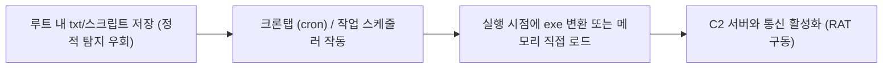
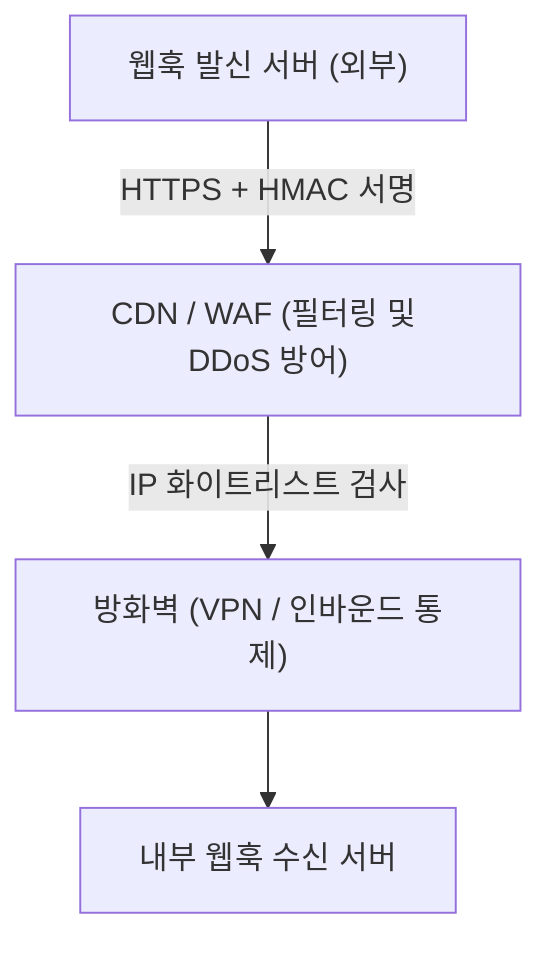
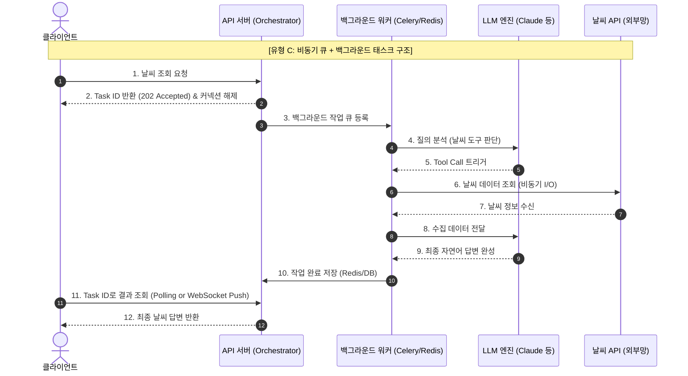
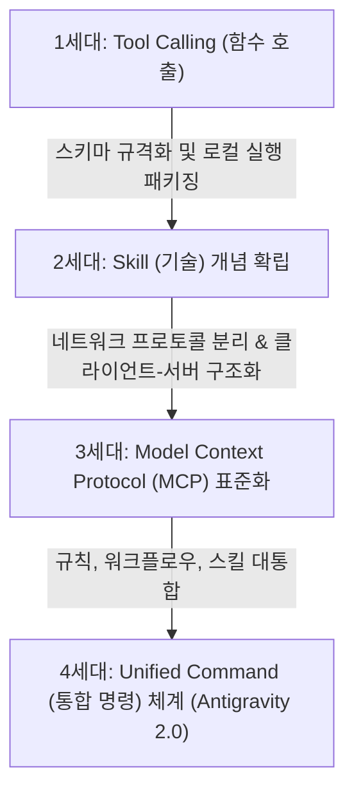
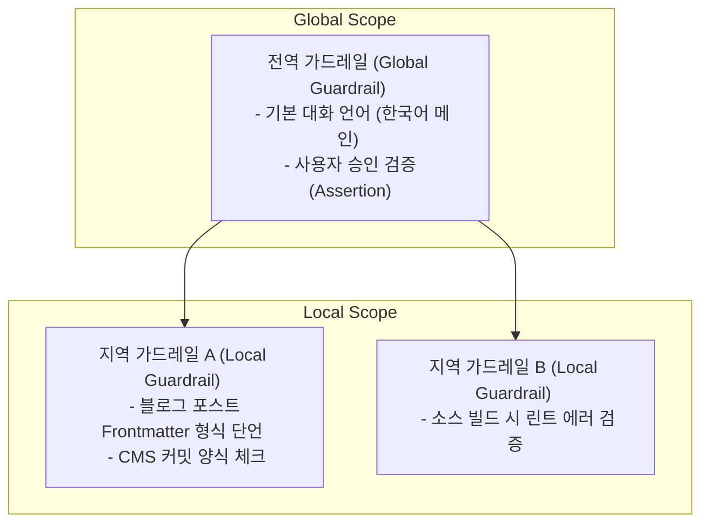
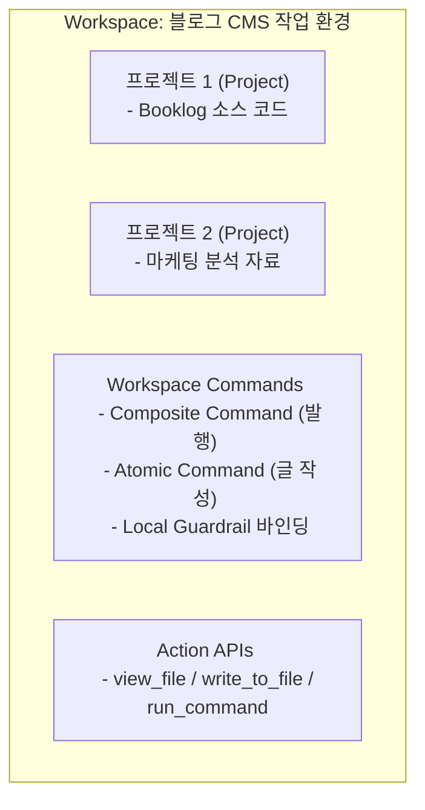
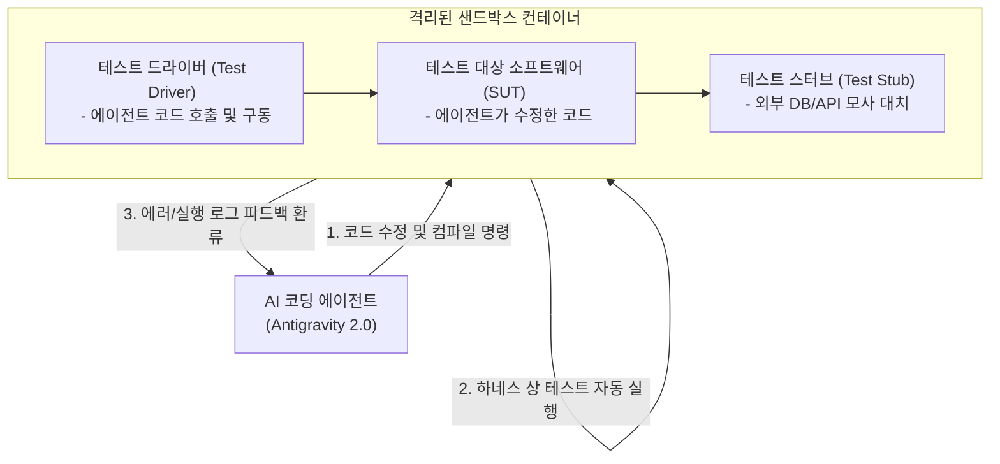
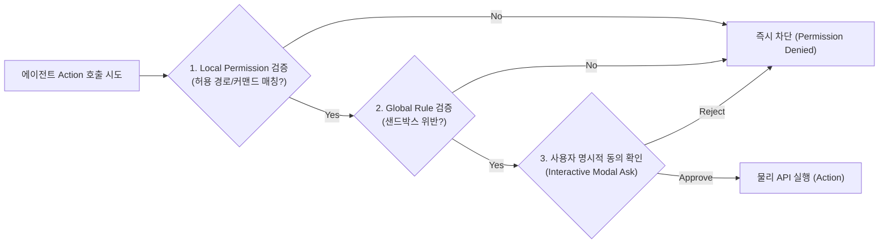

현대 비즈니스 환경에서 IT 인프라와 보안은 동전의 양면과 같습니다. 기술이 고도화될수록 공격 기법 역시 고도화되며, 개발 아키텍처와 업무 자동화 프레임워크 또한 급격하게 진화하고 있습니다. 

본 포스트에서는 실무자와 관리자가 반드시 알아야 할 **보안 위협 시나리오, 개발 핵심 이론, 그리고 최신 AI 에이전트 연동 기술**까지 총 16가지 주제를 선정하여 항목별로 상세히 해설합니다.

---

## 1. 금융사 주변 가짜 AP (Evil Twin AP / starbucks-free-wifi2)
### ① 개념 및 위협 메커니즘
금융사나 주요 기업 인근의 카페, 공유 오피스 등에서 합법적인 공용 Wi-Fi(예: `starbucks-free-wifi`)와 유사한 SSID(Service Set Identifier) 이름으로 개설된 보안이 없는 가짜 액세스 포인트(Access Point)를 의미합니다. 공격자는 신호 강도를 원본 AP보다 강하게 설정하여 사용자의 기기가 자동으로 가짜 AP(`starbucks-free-wifi2` 등)에 연결되도록 유도합니다.

### ② 해킹 활성화(Activate) 방식
사용자가 이 가짜 AP에 연결하는 순간, 공격자는 **중간자 공격(MITM, Man-in-the-Middle)** 환경을 확보합니다.
*   **패킷 감시 및 탈취:** HTTPS가 적용되지 않은 트래픽을 평문으로 감시하거나, SSL 탈취(SSL Stripping) 기법을 통해 암호화된 트래픽을 복호화하여 세션 토큰, 패스워드 등을 가로챕니다.
*   **외부망 접속 시 즉시 침투:** 사내망(Intranet) 내부에서는 방화벽과 보안 솔루션이 트래픽을 통제하지만, 직원이 카페 등 외부망에 접속하는 순간 기기의 보안 경계가 느슨해집니다. 공격자는 가짜 AP로 유입된 단말에 악성 스크립트를 주입하거나 브라우저 취약점(Exploit)을 이용해 백그라운드에서 악성코드(해킹 툴)를 즉각 활성화합니다.

### ③ 실무적 방안
*   공용 Wi-Fi 사용을 원칙적으로 금지하고 개인 모바일 핫스팟을 사용해야 합니다.
*   외부망 연결 시 반드시 **상시 가동 VPN (Always-on VPN)**을 활성화하여 모든 트래픽을 암호화 터널로 송수신해야 합니다.

---

## 2. 루트 디렉토리 은닉 스크립트 및 스케줄러 기반 백도어
### ① 우회 기법의 특징
기존의 컴파일된 실행 파일 형태(`.exe`, `.dll`, ELF 바이너리)의 악성코드는 백신(Anti-Virus) 프로그램이나 EDR(Endpoint Detection and Response) 솔루션의 정적 시그니처 분석에 쉽게 탐지됩니다. 이를 우회하기 위해 공격자들은 다음과 같은 단계를 거칩니다.
1.  **텍스트 및 스크립트 위장:** 시스템의 루트(`C:\` 또는 `/root`) 경로에 평범한 텍스트 파일(`.txt`)이나 쉘 스크립트(`.sh`, `.bat`, `.ps1`) 형태로 탐지되지 않는 코드를 숨겨둡니다.
2.  **크론탭(Crontab) 및 작업 스케줄러 등록:** 리눅스의 `cron` 서비스나 윈도우의 '작업 스케줄러'에 실행 규칙을 등록하여 주기적으로 가동되게 만듭니다.
3.  **실행 시점 변환:** 스케줄러에 의해 지정된 시간이 되면, 텍스트 형태의 소스코드가 즉석에서 컴파일되거나 메모리 상에서 바로 실행 파일(Executable)로 변환·구동(Fileless 공격 등)되어 외부로 백도어 통신을 엽니다. 이 방식은 사전 디스크 스캔 단계에서 검색이 거의 되지 않습니다.



### ② 해킹 툴의 주요 분류
*   **드롭퍼 (Dropper):** 그 자체로는 파괴적인 동작을 하지 않지만, 대상 시스템에 침투한 후 실제 악성 실행 파일을 다운로드하거나 압축을 해제하여 설치하는 징검다리 도구입니다.
*   **RAT (Remote Access Trojan):** 감염된 시스템에 대해 백그라운드에서 원격 제어 권한을 획득하는 도구로, 키로깅, 화면 캡처, 파일 유출 등을 수행합니다.

### ③ 네트워크 기반 침입 탐지 (NIDS)
파일 시스템 레벨에서 시그니처 탐지가 불가능한 경우, **네트워크 기반 침입 탐지 시스템(NIDS)**을 통해 대응해야 합니다.
*   **C2 비콘 탐지:** 감염된 단말이 외부 명령 제어(C2) 서버로 주기적으로 보내는 하트비트(Heartbeat) 신호나 비정상적인 도메인 대상의 대량 DNS 질의(DNS Tunneling) 패턴을 행위 기반 분석으로 포착하여 감염 사실을 인지합니다.

---

## 3. 모바일 테스트용 APK(Test APK) 설치 금지
### ① 안드로이드 사이드로딩(Sideloading)의 맹점
안드로이드 OS는 사용자가 공식 앱 마켓(Google Play Store 등)을 통하지 않고 패키지 파일(`.apk`)을 직접 다운로드하여 설치할 수 있는 개방성을 제공합니다. 개발 편의를 위한 '테스트용 APK'로 위장한 파일은 모바일 해킹의 가장 대표적인 유입 경로입니다.

### ② 위협 요소 및 권한 오용
공식 마켓의 구글 플레이 프로텍트(Play Protect)나 앱 심사를 거치지 않은 가짜 APK는 설치 단계에서 사용자에게 고권한을 요구하며, 설치가 완료되면 즉시 백그라운드 스파이웨어로 동작합니다.
*   **SMS 수신/발신 권한:** 은행 이체나 본인 인증 시 발송되는 2차 인증 SMS 번호를 해커에게 실시간 전송합니다.
*   **접근성(Accessibility) 서비스 권한:** 화면을 도청하고 키보드 입력을 가로채며(Keylogging), 금융 앱 실행 시 상단에 가짜 피싱 레이어를 씌워 계좌 비밀번호를 탈취(Overlay Attack)합니다.
*   **마이크 및 카메라 권한:** 원격 지시에 따라 주변 음성을 도청하거나 사진을 촬영합니다.

---

## 4. 사회공학적 해킹 (Social Engineering)과 조직 문화
### ① 개념
방화벽이나 암호화 같은 기술적 보안 장벽을 우회하여, **인간의 심리적 취약성(신뢰, 두려움, 호기심, 권위)을 악용**하여 기밀 정보를 획득하거나 권한을 탈취하는 기법입니다.

### ② 기업 문화적 취약점과 유입 경로
많은 보안 사고가 뛰어난 해커의 기술이 아닌, 조직 내부의 허술하고 인간적인 문화적 맹점에서 비롯됩니다.
*   **권위 복종형 문화 사칭:** "사장님(혹은 CFO)이 급히 정산안 확인을 지시하셨다"며 이메일로 악성 매크로가 포함된 문서를 보내면, 하위 직원은 확인 절차 없이 즉시 파일을 열게 됩니다.
*   **테일게이팅 (Tailgating):** 물리 보안 게이트가 설치되어 있더라도, 동료 의식이나 친밀함에 기반해 "뒤따라 들어오는 외부인을 위해 문을 열어두는 행위"를 통해 공격자가 사내 물리 영역에 침입합니다.
*   **지원 부서 사칭:** IT 헬프데스크를 사칭하여 시스템 점검을 핑계로 임베디드 패스워드를 구두로 획득하는 수법이 대표적입니다.

---

## 5. Webhook 보안 (GET vs POST) 및 인프라 설계
### ① Webhook의 본질
웹훅(Webhook)은 특정 서버에서 이벤트가 발생했을 때(예: 결제 완료, 코드 푸시), 사전에 등록된 대상 서버의 URL로 HTTP 요청을 전송하여 이벤트를 실시간 전달하는 **'역방향 API'** 메커니즘입니다.

### ② GET 방식과 POST 방식의 보안적 관점 비교
웹훅을 구성할 때 HTTP Method로 GET을 사용할 때와 POST를 사용할 때의 보안적 차이는 매우 큽니다.

| 항목 | GET 방식 웹훅 | POST 방식 웹훅 |
| :--- | :--- | :--- |
| **데이터 전달 위치** | URL 쿼리 파라미터 (`?data=xxx`) | HTTP Request Body |
| **보안 노출 범위** | CDN, 프록시, 웹서버 Access 로그, 브라우저 히스토리에 페이로드가 고스란히 텍스트로 남음 | 전송 구간(HTTPS) 암호화 시 바디 전체가 보호되어 중간 경로 노출 없음 |
| **페이로드 크기 한계** | URL 길이 제한(통상 2KB~8KB)으로 대량 데이터 전송 불가 | 실질적인 크기 제한 없이 안전한 구조화 데이터(JSON, XML) 전송 가능 |
| **권장 여부** | **매우 비권장 (보안 취약)** | **표준 및 강력 권장** |

### ③ 안전한 웹훅 인프라 설계 레이어
외부에서 접근 가능한 공용 엔드포인트를 열어두어야 하므로, 이를 노린 스푸핑이나 DDoS 공격을 방어하기 위해 계층화된 인프라 보안이 요구됩니다.



1.  **WAF 및 CDN:** 악성 패킷을 1차 필터링하고 DDoS 공격을 완화합니다.
2.  **IP 화이트리스팅:** 웹훅 발신측(예: GitHub, Slack)의 공인 IP 대역 정보만 방화벽 인바운드 규칙에 허용합니다.
3.  **HMAC 페이로드 검증:** 발신처와 수신처가 사전에 공유한 Secret Key를 이용해 페이로드의 해시값(HMAC-SHA256 등)을 HTTP 헤더로 전달받아, 수신처에서 해시가 일치하는지 비교함으로써 요청 위변조를 차단합니다.

---

## 6. 내부자 시간차 공격 시나리오와 기만 전술
### ① 시나리오 설계 (내부자 위협)
보안 권한을 적법하게 가지고 있는 직원이 **퇴사 몇 개월 전**부터 치밀하게 준비하는 내부 침입 시나리오입니다.
1.  **악성 스크립트 식재 (Seeding):** 퇴사 전, 자신의 업무망 권한을 이용해 접근 가능한 사내 동료들의 PC 또는 모바일 기기에 백도어 프로그램이나 은닉형 스크립트를 텍스트(`.txt`) 형태로 침투시켜 둡니다.
2.  **정상적인 퇴사:** 보안 감사팀이나 인사 시스템의 아무런 의심을 사지 않고 정상적으로 퇴사 절차를 밟습니다.
3.  **퇴사 후 외부 활성화 (Activation):** 퇴사 수개월 후, 회사 인근 카페 등에서 공용 Wi-Fi나 가짜 AP를 개설하여, 과거 사내망 내부 동료 기기에 심어둔 백도어에 원격 명령을 내려 활성화시킵니다.

### ② 해킹 추적 교란 및 기만
사고 발생 후 포렌식 수사팀이 해킹 흔적(네트워크 접속 로그, 로그인 자격 증명 사용 이력)을 추적하면, 공격 발원지와 침투에 사용된 단말은 **현직에 있는 동료의 계정과 기기**로 검출됩니다.
*   해커는 사외 안전한 곳에 숨고, 추적 조사 대상에는 사내 동료들만 올라가게 만들어 보안 부서의 추적을 완전히 교란합니다.

### ③ 대응 전략
*   모든 사용자의 기기 접근을 상시 불신하고 지속 검증하는 **제로 트러스트(Zero Trust)** 관점의 접근 통제.
*   퇴사 예정자의 계정 권한 점진적 축소 및 퇴사 시 반납 단말에 대한 정밀 디지털 포렌식 검사 필수화.

---

## 7. 중국 VPN 다중 체이닝을 활용한 역추적 무력화
### ① VPN 체이닝 (VPN Chaining / Multi-hop)
공격자가 자신의 실제 물리적 위치를 숨기기 위해 트래픽을 여러 개의 VPN 서버를 거쳐 목적지로 보내는 우회 기법입니다. (예: `해커 PC -> VPN A (싱가포르) -> VPN B (아이슬란드) -> VPN C (중국) -> 타겟 대상`)

### ② 사법 공조의 한계와 추적 불가능 이유
수사 기관이 공격자의 IP를 역추적하려면 각 VPN 공급업체에 접속 로그(특정 시간에 해당 IP로 유입된 세션이 어떤 IP로 나갔는지에 대한 매핑 정보)를 받아야 합니다.
*   **국제 사법 공조의 단절:** 서방 국가 간이나 Five Eyes(미국, 영국, 캐나다, 호주, 뉴질랜드) 정보 동맹국 간에는 사법 공조를 통해 로그 협조를 강제할 수 있습니다. 그러나 **중국, 러시아 등 서방 사법 체계의 영향력이 미치지 않고 협조적이지 않은 국가**에 위치한 VPN 서버를 체이닝에 포함시키는 순간, 로그 추적이 원천 차단됩니다.
*   **No-Log 정책의 악용:** 다수의 해외 사설 VPN 서비스들은 기술적으로 접속 로그 자체를 남기지 않는 '노로그 정책'을 채택하고 있어, 강제 수사를 진행하더라도 물리적으로 제공할 로그 데이터가 존재하지 않아 역추적이 불가능해집니다.

---

## 8. 동기(Sync) vs 비동기(Async) 프로그래밍과 재시도(Retry) 패턴
### ① 동기와 비동기의 본질적 차이
*   **동기 (Synchronous):** 하나의 작업이 시작되면 그 작업이 완료될 때까지 실행 흐름이 차단(Blocking)됩니다. 데이터베이스 질의나 네트워크 응답을 기다리는 동안 CPU는 아무런 일도 하지 못하고 대기해야 합니다.
*   **비동기 (Asynchronous):** I/O 요청 등 대기 시간이 발생하는 작업을 시작한 후, 그 작업의 완료를 기다리지 않고 제어권을 즉시 반환하여 다른 작업을 계속 수행(Non-blocking)합니다. Python의 `asyncio` 라이브러리와 `async/await` 키워드가 대표적입니다.

### ② "비동기로 해야만 실패 시 재시도가 가능하다?"
이는 **기술적인 오해**입니다. 동기식 코드에서도 `try-except` 블록과 `while` 루프를 사용해 얼마든지 재시도(Retry) 로직을 구현할 수 있습니다. 

### ③ 재시도 설계 시 비동기가 압도적으로 유리한 이유
실제 대규모 시스템에서 **재시도 아키텍처**를 다룰 때 비동기 방식이 채택되는 본질적인 이유는 시스템 리소스의 효율성 때문입니다.
*   **블로킹 리소스 해제:** 대량의 네트워크 호출 실패로 인해 100개의 요청에 대해 지수 백오프(Exponential Backoff - 대기 시간을 점진적으로 늘리는 기법)를 적용해 각각 5초씩 대기하며 재시도해야 한다고 가정해 봅시다.
*   **동기식 구조:** 100개의 스레드가 각각 5초간 블로킹되어 대기하므로, 메모리와 CPU 컨텍스트 스위칭 비용이 급증하고 서버 성능이 마비됩니다.
*   **비동기식 구조:** `await asyncio.sleep(delay)`를 사용하면, 대기하는 5초 동안 단일 스레드가 다른 유효한 작업을 처리할 수 있습니다. 결과적으로 시스템 전체가 멈추지 않고 수천 개의 재시도 태스크를 가볍게 스케줄링할 수 있습니다.

---

## 9. FastMCP의 정의와 아키텍처
### ① Model Context Protocol (MCP) 개요
Model Context Protocol(MCP)은 Anthropic에서 발표한 오픈 표준으로, Claude와 같은 대규모 언어 모델(LLM) 에이전트가 개발자 환경의 데이터 소스(Database, 웹 사이트, 로컬 파일 시스템 등)와 도구(CLI, API)에 **안전하고 표준화된 방식으로 접근**할 수 있도록 통신 규격을 정의한 프로토콜입니다.

### ② FastMCP란?
**FastMCP**는 Python 환경에서 MCP 규격에 맞는 서버를 매우 신속하게 구축할 수 있도록 지원하는 고수준 프레임워크(SDK)입니다. 
*   **데코레이터 기반 개발:** 개발자가 직접 통신 프로토콜 스펙을 파싱할 필요 없이, Python 함수에 `@mcp.tool()`이나 `@mcp.resource()` 같은 데코레이터만 지정해주면 SDK가 자동으로 모델이 인식할 수 있는 명세와 인터페이스를 빌드해 줍니다.

```python
from mcp.server.fastmcp import FastMCP

# MCP 서버 인스턴스 초기화
mcp = FastMCP("My Tech Info Server")

# LLM이 호출할 수 있는 도구(Tool) 등록
@mcp.tool()
def get_system_status(service_name: str) -> str:
    """지정된 서비스의 상태를 조회합니다."""
    return f"Service {service_name} is running normally."
```

---

## 10. Cognitive RPA (C-RPA)와 MCP의 상호작용
### ① Cognitive RPA (C-RPA)의 정의
기존의 전통적인 RPA(Robotic Process Automation)가 엑셀의 특정 열 복사, 웹 버튼 클릭 등 정해진 시나리오와 규칙에 따라 동작했다면, **Cognitive RPA(인지형 RPA)**는 여기에 머신러닝, 자연어 처리(NLP), 컴퓨터 비전, 그리고 LLM을 융합한 자동화 형태입니다. 비정형 텍스트(이메일 문의, PDF 계약서)를 읽고 의미를 해석하거나, 복잡한 예외 상황에서 의사결정을 내릴 수 있습니다.

### ② 왜 C-RPA에 MCP가 반드시 필요한가?
C-RPA 에이전트가 고차원적인 판단을 내리고 이를 실제 레거시 인프라에 적용하기 위해서는 내부 인프라와의 **'맥락(Context) 연결' 및 '도구 실행(Tool Execution)'** 능력이 필수적입니다.
1.  **표준 인터페이스 부재의 해결:** 과거에는 AI와 RPA 엔진을 결합할 때 매번 커스텀 API 코드를 작성해야 했습니다. MCP를 도입하면 기업용 레거시 DB, 메일함, ERP 시스템이 하나의 MCP 서버로 묶여 LLM 에이전트와 즉시 유연하게 소통할 수 있습니다.
2.  **안전한 실행 통제:** C-RPA가 자율적으로 업무를 처리하는 과정에서, MCP는 에이전트가 접근할 수 있는 데이터 범위와 실행 가능한 명령어 셋을 세부 제어할 수 있는 보안 장벽 역할을 제공하므로 보안성이 극대화됩니다.

---

## 11. 비동기 멀티태스킹과 백그라운드 태스크 서버 아키텍처
### ① 날씨 검색 AI 에이전트 시나리오로 보는 비동기 구조의 유형
AI 에이전트 서비스(예: "오늘 서울 날씨 어때?"라고 물어보고 외부 API 조회를 거쳐 자연어로 답변받는 시스템)에서 멀티태스킹과 효율성을 극대화하기 위한 서버 통신 유형은 크게 세 가지로 분류할 수 있습니다.



*   **유형 A: 동기식 블로킹 (Sync Blocking)**
    *   **동작:** `클라이언트 요청 -> 서버 대기 -> LLM 호출 대기 -> 날씨 API 대기 -> 답변 완성 -> 응답` 흐름 전체가 동기 스레드 하나를 점유합니다.
    *   **단점:** 외부 네트워크 지연이 발생하면 스레드가 블로킹되어 서버 전체의 동시 처리 능력이 급감하고, HTTP 커넥션 유지 시간이 길어져 타임아웃(Timeout) 오류가 빈번해집니다.
*   **유형 B: 비동기 코루틴 통신 (Async-Await Direct)**
    *   **동작:** Python `asyncio`나 Node.js 환경에서 `await call_llm()`, `await call_weather_api()`를 처리합니다.
    *   **장점:** API 응답을 대기하는 동안 스레드가 블로킹되지 않고 다른 사용자 요청을 처리하므로 단일 프로세스의 처리 성능이 크게 늘어납니다. 단, 클라이언트는 최종 결과가 나올 때까지 HTTP 연결을 연 채 대기해야 하므로 짧은 트랜잭션에 적합합니다.
*   **유형 C: 비동기 큐 + 백그라운드 워커 (Queue-based Background Task)**
    *   **동작:** 서버는 요청을 받자마자 작업 번호(Task ID)가 포함된 `202 Accepted` 응답을 클라이언트에게 즉시 보낸 뒤 연결을 종료합니다. 실제 무거운 작업은 백그라운드 메시지 큐(Celery, Redis Queue 등)로 넘겨 독립된 워커 프로세스에서 비동기로 처리합니다.
    *   **장점:** 클라이언트와 서버 간의 연결 점유 시간이 최소화되며, 서버 스케일아웃 및 트래픽 서지(Surge) 대응력이 매우 뛰어납니다.

### ② 가장 효율적인 아키텍처
*   **실시간 인터랙티브 조회 (날씨/가벼운 챗봇):** **비동기 Web Framework(FastAPI) + Event-Driven 스트리밍 (SSE: Server-Sent Events)** 구조가 가장 효율적입니다.
    *   **이유:** 클라이언트가 HTTP 접속을 유지하되, 서버는 응답을 한 번에 주지 않고 LLM이 생각하는 과정(Reasoning) 및 툴 호출 상태, 그리고 텍스트 토큰을 스트리밍 방식으로 쪼개어 실시간 전송합니다. 이로 인해 유저는 체감상 지연 시간이 최소화되고, 서버는 비동기 루프로 스레드 리소스를 점유하지 않는 논블로킹 장점을 완벽히 취하게 됩니다.
*   **중장기 연산 작업 (대량 문서 요약/리포트 생성):** **FastAPI + Celery + Redis (Result Backend) + WebSockets** 구조가 가장 효율적입니다. 무거운 연산은 메인 API 서버와 물리적으로 분리된 워커 노드에서 수행하고, 완료 알림만 실시간 소켓으로 푸시하는 방식이 시스템 가용성에 가장 안전합니다.

---

## 12. RPA 영역에서의 동기 vs 비동기 효율성 비교
### ① UI 조작 기반 RPA: 동기(Synchronous)의 절대적 유리함
전통적인 RPA의 주축인 **인터페이스 화면 조작(UI Interaction)** 중심 태스크(예: 사내 웹 사이트에 접속해서 버튼을 누르고, 복사한 텍스트를 엑셀에 붙여넣는 일 등)에서는 **동기 방식이 구조적으로 압도적으로 유리하고 안전**합니다. 그 이유는 다음과 같습니다.

1.  **물리적 UI 포커스의 단일성 (Single-threaded UI):**
    *   운영체제(OS) 화면의 마우스 커서와 윈도우 활성화 포커스는 **물리적으로 오직 하나만 존재**할 수 있습니다. 만약 비동기(Async) 병렬 처리를 통해 "엑셀 프로그램 데이터 작성"과 "웹 브라우저 양식 입력"을 동시에 시도한다면, 클릭 명령과 키보드 입력 신호가 꼬여 엉뚱한 영역에 데이터가 입력되거나 윈도우 창 포커스가 분산되어 자동화 프로그램이 중단됩니다.
2.  **엄격한 선후 인과 관계 (Process Dependency):**
    *   RPA 프로세스는 순차적이어야 합니다. `웹 로그인 완료 -> 검색어 입력 -> 조회 -> 엑셀 저장`이라는 흐름에서 이전 단계가 완전히 종료되어 화면에 렌더링되지 않았는데 비동기로 다음 단계를 논블로킹 실행하면 필수 UI 요소를 찾지 못해 대량의 `NoSuchElementException` 에러를 뿜게 됩니다. 따라서 앞 단계의 완료 시점을 동기적으로 확인하고 보증하는 것이 훨씬 안정적입니다.
3.  **직관적인 예외 처리 및 롤백:**
    *   동기식 실행 구조에서는 특정 단계에서 에러가 났을 때 즉시 동작을 정지시키고 화면을 안전하게 롤백하거나 담당자에게 즉시 메일을 발송하는 에러 제어 흐름이 매우 직관적입니다.

### ② API 기반 RPA (Headless RPA): 비동기(Asynchronous)의 압도적 유리함
만약 화면 UI 조작이 개입하지 않고, 서버 간 백그라운드 데이터 이동만을 다루는 **API 연동 기반의 RPA**라면 상황은 정반대가 됩니다.
*   UI 포커스 제한이나 화면 렌더링 지연이 없기 때문에, 대용량 파일의 동시 다운로드나 백엔드 ERP API 호출 작업 등은 `asyncio` 기반의 비동기 코루틴으로 처리해야 병렬성과 I/O 효율을 극한으로 끌어올릴 수 있습니다.

---

## 13. FastMCP에서의 Progress(진행률) 처리 아키텍처
### ① Progress Reporting의 개념과 역할
대규모 언어 모델(LLM)이 외부 도구(Tool)를 호출할 때, 특정 작업(예: 대용량 PDF 문서 파싱, 데이터베이스 통계 쿼리, 웹 크롤러 등)은 완료되기까지 수십 초에서 수 분 이상의 시간이 소요될 수 있습니다. 

이러한 장기 실행 작업(Long-running tasks) 도중 진행률을 표시하지 않으면, 호스트(클라이언트)나 사용자는 에이전트가 정상적으로 작동 중인지 혹은 타임아웃으로 다운된 것인지 알기 어렵습니다. MCP(Model Context Protocol) 규격은 이 문제를 해결하기 위해 클라이언트-서버 간 **진행률 보고(Progress Reporting) 프로토콜**을 표준화하여 정의하고 있습니다.

### ② FastMCP에서의 구현 방식 (Context 주입)
**FastMCP**는 도구 함수에 `Context` 타입의 인자가 선언되어 있으면, 런타임에 자동으로 프로토콜 컨텍스트를 주입(Dependency Injection)해 줍니다. 개발자는 이 `Context` 객체의 비동기 메서드인 `ctx.report_progress(current, total)`를 사용하여 손쉽게 진척도를 클라이언트에게 전송할 수 있습니다.

```python
import asyncio
from mcp.server.fastmcp import FastMCP, Context

# FastMCP 서버 생성
mcp = FastMCP("Data Processor")

@mcp.tool()
async def process_records(total_records: int, ctx: Context) -> str:
    """대량의 레코드를 비동기로 처리하며 호스트에 실시간 진행률을 전송합니다."""
    
    for i in range(total_records):
        # 1. 실제 I/O 또는 데이터 연산 시뮬레이션
        await asyncio.sleep(0.5)
        
        # 2. Context 개체가 주입되었는지 검증 후 진행률 보고 호출
        if ctx:
            # current(현재 진척도)와 total(총량)을 인자로 전송
            await ctx.report_progress(current=i + 1, total=total_records)
            
            # 선택사항: 진행 상태 로그를 콘솔이나 호스트에 전달
            ctx.info(f"레코드 {i + 1}/{total_records} 처리 중...")
            
    return f"총 {total_records}개의 레코드를 성공적으로 처리 완료했습니다."
```

### ③ JSON-RPC 프로토콜 단에서의 동작 원리
1.  **progressToken 전달:** 클라이언트가 도구를 호출할 때(JSON-RPC의 `tools/call` 요청), 헤더나 파라미터 메타데이터에 진행률을 추적할 고유의 `progressToken`을 실어서 보냅니다.
2.  **알림(Notification) 송출:** FastMCP 내부에 탑재된 `report_progress` 메서드가 실행되면, 서버는 클라이언트 측에 `notifications/progress` 타입의 JSON-RPC 알림 패킷을 보냅니다. 이 패킷에는 해당 `progressToken`과 함께 현재 진척 수치(`progress` 및 `total`)가 포함됩니다.
3.  **UI 업데이트:** Claude Desktop 등 호스트 클라이언트는 수신한 알림 패킷을 기반으로 사용자 화면에 실시간 진행률 인디케이터(Progress Bar)나 진행 상황 텍스트를 갱신하여 획기적으로 개선된 UX를 제공하게 됩니다.

---

## 14. MCP의 발전 과정과 AI 에이전트 실행 체계의 진화 (Antigravity 2.0 대통합)
### ① Tool에서 Skill로, 그리고 MCP의 분리
대규모 언어 모델(LLM)이 외부 환경과 상호작용하는 아키텍처는 에이전트 기술의 성장에 따라 극적으로 발전해 왔습니다.



*   **초기 단계 (Tool Calling):** 초창기 AI 에이전트는 API 스펙을 프롬프트에 구질구질하게 주입받아 동작을 유추하는 '함수 호출(Function Calling/Tool)'에서 출발했습니다. 그러나 도구의 개수가 늘어나고 스키마 형식이 제각각이 되면서 모델의 컨텍스트 윈도우 한계와 오동작이 빈번했습니다.
*   **Skill 개념의 도입:** Anthropic 등 기술 기업들은 도구의 설명, 스키마, 호출 방식을 하나의 패키지로 규격화한 'Skill(기술)' 개념을 제시했습니다.
*   **MCP의 독립 분리:** Skill 개념이 정립된 후, 도구와 데이터를 모델과 매끄럽게 연결하기 위한 인터페이스를 범용 표준으로 통일하려는 노력이 일어났고, 이것이 **Model Context Protocol (MCP)**로 독립·분리되었습니다.
*   **Skill과 MCP의 결정적 차이점:**
    *   **Skill (기술):** AI 에이전트가 동작하는 **로컬 환경(Local Sandbox)** 내에 종속되어 직접 실행되는 인라인 스크립트나 모듈 단위입니다.
    *   **MCP (프로토콜):** **클라이언트-서버(Client-Server) 아키텍처**를 기반으로 작동합니다. 에이전트가 로컬에 실행되는 별도 프로세스의 MCP 서버 뿐만 아니라, 원격 클라우드나 격리된 마이크로서비스 등 네트워크 너머의 자원도 표준 통신 규격(JSON-RPC over SSE/Stdio)으로 유연하게 결합할 수 있게 합니다.

### ② Antigravity 2.0의 혁신: Rule, Workflow, Skill의 Command 대통합
과거 에이전트 1.x 아키텍처에서는 개발자가 제약 조건(Rule), 절차(Workflow), 도구(Skill)를 각각 정의해야 하는 파편화된 오버헤드가 있었습니다. 하지만 **Antigravity 2.0**으로 진화하며 이 파편화된 3대 핵심 컴포넌트가 **'Command(명령)'**라는 단 하나의 핵심 제어 개념으로 완벽하게 통합(Unified Command Architecture)되었습니다.

*   **Rule의 Command 흡수 (Command Guardrail):** 룰은 독립된 텍스트 파일이 아니라, Command가 가동되기 전후로 반드시 검증(Assertion)하고 통제해야 할 **가드레일 속성**으로 내재화되었습니다.
*   **Workflow의 Command 흡수 (Composite Command):** 여러 단계를 순차적/조건부로 엮어 실행하는 워크플로우 로직은, 하위 Command들을 지능적으로 오케스트레이션하여 결합하는 **상위 복합 명령(Composite Command)**으로 승격되었습니다.
*   **Skill의 Command 흡수 (Atomic Command):** API를 다루고 로컬 스크립트를 수행하는 스킬들은, 외부 Action을 최종 트리거하기 위해 의미론적으로 정렬된 **단일 원자 명령(Atomic Command)**으로 매핑되었습니다.

### ③ 그렇다면 Action(액션)은 무엇이며 어떻게 정의되는가?
Rule, Workflow, Skill이 Command로 대통합되어 소멸한 반면, **Action(액션)**은 사라지지 않고 에이전트 인프라의 가장 본질적인 물리 실행 계층으로 그 지위가 격상되었습니다.

*   **Command vs Action의 이원화 구조:**
    *   **Command (논리적 실행 계획):** AI 에이전트가 상황을 인식하여 "논리적으로 무엇을 수행하고 통제할 것인가"를 나타내는 **머리(인지와 계획)**의 영역입니다. AI가 자율적으로 생성하고 구성하며 바인딩하는 선언적 단위입니다.
    *   **Action (물리적 API 호출):** Command가 컴파일/해석되어 최종적으로 로컬 파일 시스템, 운영체제(OS) 터미널, 외부 웹 브라우저 등에 실질적인 변화(Side Effect)를 일으키기 위해 호출하는 **손발(물리적 도구 API)**의 영역입니다. (예: `view_file`, `write_to_file`, `run_command`, `read_url` 등)
*   **Action of Features:** Action은 AI가 스스로 정의하는 논리적 명세가 아닙니다. IDE 플랫폼 혹은 MCP 환경이 보안 샌드박스 내부에서 엄격하게 규정하여 모델에 API 형태로 제공하는 **하부 불변의 툴셋(Tool APIs)**입니다. Command는 최종적으로 이 Action들의 조합으로 컴파일되어 실행됩니다.

---

## 15. Antigravity 2.0의 단일 Command & Action 아키텍처 실무 가이드
### ① 4대 레거시 요소의 Command & Action 매핑 관계
Antigravity 2.0에서는 레거시 아키텍처의 요소들이 다음과 같이 Command와 Action 계층으로 완벽하게 수렴되었습니다.

| 레거시 요소 (1.x) | Antigravity 2.0 매핑 위치 | 실제 역할 | 실무적 구성 방식 |
| :--- | :--- | :--- | :--- |
| **Rule (규칙)** | **Command Guardrail (가드레일)** | Command 실행 전후 조건 검증 (Pre/Post-condition) 및 단언(Assertion) 제어 | Command 명세 내 `guardrails` 또는 `assertions` 속성 정의 |
| **Workflow (워크플로우)** | **Composite Command (복합 명령)** | 여러 하위 Command들의 조건별 순차 조율 및 실행 흐름 통제 | 하위 Command를 조율하는 상위 Command 오케스트레이션 정의 |
| **Skill (기술)** | **Atomic Command (원자 명령)** | 단일 기능에 대한 선언적 호출 단위. 하부 Action API 호출 매핑 | 특정 목적에 맞춰 Action 호출 인자를 동적 바인딩하는 단일 명령 |
| **Action (행위)** | **Action API (물리 실행 툴)** | 시스템(OS, 파일 시스템)에 부작용(Side Effect)을 가하는 불변의 툴킷 | 플랫폼이 제공하는 API (`view_file`, `run_command` 등) |

### ② Global vs Local Guardrail (구 Global/Local Rule) 구조
2.0에서 Rule 파일 구조가 사라진 대신, 가드레일(Guardrail)은 작동 스코프에 따라 전역(Global)과 지역(Local)으로 나뉘어 Command 실행을 통제합니다.



1.  **전역 가드레일 (Global Guardrail):**
    *   에이전트가 가동되는 모든 세션과 모든 프로젝트에 공통으로 바인딩되는 보편적 안전 규약입니다. 보안, 윤리 정책, 다국어 처리(예: 한국어 메인) 등이 여기에 탑재되어 모든 Command 실행을 정적으로 감시합니다.
2.  **지역 가드레일 (Local Guardrail):**
    *   특정 워크스페이스 내에서만 활성화되는 가드레일입니다. 특정 Command가 로컬에서 구동될 때 파라미터 유효성이나 상태(State)의 변화를 Assertion 문을 통해 검증합니다.
3.  **가드레일의 우선순위:**
    *   동일 속성에 대해 전역 가드레일과 지역 가드레일이 동시에 바인딩될 경우, 더 좁은 맥락을 가진 **Local Guardrail의 단언문이 우선적으로 검사 및 처리**됩니다.

### ③ Command & Action 실무 최적화 방법 (Best Practices)
*   **비즈니스 의도의 선언적 명세:** Command를 생성할 때 복잡한 쉘 명령어 나열을 지양하고, Command 명세에는 AI가 인지할 수 있는 '논리적 의도(Intent)'와 '가드레일(Guardrail)'만 선언적으로 명시하십시오. 실제 물리 시스템 가동은 하위 Action API에 완벽히 양임해야 환각 현상을 원천 방어할 수 있습니다.
*   **가드레일의 단언(Assertion) 설계:** Command 내의 가드레일은 모호한 권고사항이 아닌, **"결과 마크다운 파일에 📚 참고자료 섹션이 없을 경우 에러를 반환한다"**와 같이 검증 가능한 단언문(Assertion Assert) 형태로 설계해야 에이전트의 오작동률이 제로에 수렴합니다.
*   **Few-shot 예시의 Command 임베딩:** Command 정의 구조 내부에 모범적인 성공 실행 패턴 및 예시 매핑(`examples`)을 명확히 바인딩하여, 에이전트가 추가 학습 없이도 Command를 최적의 조합으로 분해하고 처리할 수 있게 가이드합니다.

---

## 16. Antigravity 2.0의 멀티 워크스페이스(Workspace) 및 프로젝트(Project) 아키텍처
### ① 프로젝트(Project)와 워크스페이스(Workspace)의 개념 차이
Antigravity 2.0 에이전트는 다중 저장소와 대규모 시스템을 지능적으로 다루기 위해 물리적 단위와 논리적 작업 단위를 명확하게 구분하여 인지합니다.



*   **프로젝트 (Project):**
    *   **개념:** 물리적인 파일 시스템 디렉토리, 또는 단일 Git 저장소(Repository) 단위입니다.
    *   **예시:** 본 블로그 소스 코드가 들어있는 `WookAi/Booklog` 폴더 자체가 하나의 물리적 프로젝트입니다.
*   **워크스페이스 (Workspace):**
    *   **개념:** AI 에이전트가 특정한 목적을 가지고 한 세션 내에서 바라보는 **논리적 작업 범위이자 컨텍스트 경계선**입니다. 하나의 워크스페이스는 하나의 프로젝트만 담을 수도 있고, 연관된 여러 개의 프로젝트를 결합하여 동시에 다룰 수도 있습니다.
    *   **역할:** 워크스페이스는 해당 환경에서 기동할 `Command`와 가용한 `Action`의 적용 스코프를 정의하는 논리적 컨테이너 역할을 합니다.

### ② 워크스페이스별 Command 및 Guardrail 바인딩 구조
워크스페이스가 활성화되면 Antigravity는 해당 워크스페이스 루트의 환경(예: `.antigravity_rules.md`, `package.json`, 환경 설정 등)을 분석하여 에이전트 모델에 전용 Command 명세와 Guardrail을 동적으로 바인딩하여 주입합니다.

1.  **워크스페이스 가드레일 (Workspace Guardrail):**
    *   해당 워크스페이스 내부의 로컬 디렉토리에서 작업할 때만 작동하는 단언 규칙입니다. 예를 들어 블로그 워크스페이스에서는 "영어 파일명 컨벤션", "Frontmatter 필수 필드 검증" 가드레일이 작동하며, 다른 백엔드 API 워크스페이스로 이동하면 해당 가드레일은 해제되고 "테스트 커버리지 80% 유지" 가드레일이 바인딩됩니다.
2.  **워크스페이스 Command (Workspace Command):**
    *   해당 영역에서만 유효한 목표 지향 인터페이스입니다. 예를 들어 `/deploy`라는 Command를 내렸을 때, 블로그 워크스페이스에 있다면 "정적 마크다운 빌드 후 Git Push 및 배포" 복합 Command를 실행하고, 클라우드 인프라 워크스페이스에 있다면 "Terraform Apply 및 ECS 컨테이너 롤링 업데이트" 복합 Command를 실행하도록 동일 명령어가 다형성(Polymorphism)을 가지고 다르게 매핑됩니다.
3.  **플랫폼 Action 매핑:**
    *   워크스페이스의 보안 권한 등급에 따라 에이전트가 호출할 수 있는 로컬 **Action API**의 스코프가 엄격히 제한됩니다. (예: 샌드박스 설정에 따른 특정 디렉토리 외 쓰기 Action 차단 등)

### ③ 여러 프로젝트에 글로벌(Global)하게 확장 및 적용되는 방식
에이전트가 마이크로서비스 아키텍처나 모노레포처럼 여러 프로젝트를 오가며 작업할 때, 전역 통제와 공유 리소스 처리를 위해 **글로벌 오케스트레이션 레이어**가 작동합니다.

1.  **글로벌 가드레일 전파 (Global Guardrail Propagation):**
    *   에이전트 시스템 전체에 등록된 **글로벌 가드레일**(예: "대화 시 한국어 기본 사용", "보안 자격증명 노출 금지", "사용자 승인 프로세스 준수")은 하위의 모든 워크스페이스와 프로젝트 내 Command 실행 시점에 디폴트로 상속 및 주입되어 동작의 안전성을 확보합니다.
2.  **글로벌 커맨드의 지능적 라우팅 (Intelligent Command Routing):**
    *   사용자가 전역 영역에서 "모든 프로젝트의 패키지 보안 취약점을 패치해줘"라고 통합 명령을 내리면, 글로벌 오케스트레이터(Global Composite Command)가 가동됩니다. 에이전트는 이를 분석하여 각 프로젝트 워크스페이스별 의존성 매니저(npm, pip 등)와 개별 로컬 빌드 Command를 순차적으로 탐색하고, 프로젝트 간의 의존성 순서에 맞춰 하위 Command들을 연쇄적으로 분기 실행(Orchestration)합니다.
3.  **공유 전역 Action 인프라:**
    *   모든 프로젝트에서 공통으로 사용되는 로컬 파일 조작, 외부 API 호출, 터미널 명령어 실행 등의 **원자적 Action API**는 플랫폼 레이어에서 싱글톤 형태로 관리되며, 각 워크스페이스의 Command 실행기가 안전한 샌드박스 보안 규칙 하에 이 전역 Action들을 호출하여 최종적인 시스템 상태 변경을 유도합니다.

---

## 17. 기존 Rules의 컨텍스트 리소스 낭비 문제 (팩트 체크 및 구조 해설)
### ① Rules 기반 방식의 팩트 체크: 리소스 낭비는 사실인가?
기존 1.x 에이전트 프레임워크나 개발용 AI 챗봇 시스템에서 널리 사용되던 규칙(Rules) 주입 방식은 매번 대화나 동작(Action)을 수행할 때마다 규칙 파일(예: `.rules`, `.antigravity_rules.md`)의 전체 텍스트를 LLM의 컨텍스트 윈도우(System Prompt 또는 User Prompt의 서두)에 강제 주입하는 방식을 채택했습니다. 

이 방식이 리소스를 불필요하게 낭비하고 성능 저하를 초래한다는 의혹은 **명백한 사실(True)**로 규명되었습니다.

### ② 리소스 낭비와 성능 저하의 본질적 이유
1.  **불필요한 토큰 누수 (Token Bloat):**
    *   에이전트가 단지 파일 하나를 조회(`view_file`)하거나, 간단한 줄바꿈을 고치는 초소형 작업을 수행하는 순간에도 전체 규칙 문서(수천 토큰 이상)가 고스란히 입력 데이터로 청구됩니다. 대화 턴이 거듭될수록 규칙 토큰이 중복으로 누적 전송되며, 이는 막대한 **API 비용 낭비**와 **레이턴시(지연 시간) 폭증**으로 귀결됩니다.
2.  **주의 집중력 저하 (Attention Degradation - Needle in a Haystack):**
    *   LLM의 컨텍스트가 길어질수록, 프롬프트 중간에 박혀있는 실제 수정 대상 코드나 사용자 의도보다 주변 규칙 문서에 주의력(Attention)이 분산됩니다. 결국 코드를 꼼꼼히 보지 못해 환각(Hallucination)이 늘어나고, 정작 준수해야 할 규칙마저 노이즈에 묻혀 무시되는 '규칙 불이행 악순환'이 발생합니다.

### ③ Antigravity 2.0의 해결 방안 (On-demand Guardrail / Event-driven Verification)
Antigravity 2.0에서는 규칙 전체를 매 턴마다 AI 모델에게 읽히는 무식한 프롬프트 주입 방식을 폐기했습니다.
*   **On-demand 단언 검증 (Assertion Assert):** 규칙을 Command 단위의 **가드레일(Guardrail)**로 편입시킨 후, 평상시(코드 탐색 및 독해 턴)에는 모델 컨텍스트에서 제외합니다. 
*   **시점 제한 검사:** 에이전트가 코드를 다 고치고 최종 발행(Publish) Command를 내리거나, Git Commit Command를 가동하는 **특정 이벤트 시점**에만 로컬 프레임워크 런타임이 해당 가드레일 단언문(예: "Frontmatter 형식을 만족하는가?")을 정적으로 체크합니다. 조건에 불일치할 때만 에러 피드백을 전달하므로 토큰 비용을 최대 90% 이상 절감하고 에이전트의 순수 코드 집중도를 극대화합니다.

---

## 18. 하네스 엔지니어링 (Harness Engineering)
### ① 개념 정의와 유래
*   **하네스 (Harness):** 원래 마차의 말에게 씌우는 마구나 고삐, 또는 자동차/항공기 내부의 수많은 복잡한 전선 가닥들을 단단히 묶어 안전하게 전력을 공급하는 '배선 뭉치(Wiring Harness)'에서 온 말입니다.
*   **소프트웨어 공학에서의 하네스:** 테스트 대상 소프트웨어(SUT: System Under Test)가 외부 환경과 정상적으로 연결되고 격리되어 실행될 수 있도록, 주변에 모조 데이터(Mocking), 구동 엔진(Test Driver), 외부 모조 인터페이스(Test Stub)를 조립해 결합해놓은 **'테스트 실행 인프라 프레임워크'**를 의미합니다.
*   **하네스 엔지니어링 (Harness Engineering):** 이를 체계적으로 설계하고 샌드박스로 안전하게 구축하는 고도의 소프트웨어 검증 엔지니어링 기법입니다.



### ② AI 에이전트 시대에 하네스 엔지니어링이 필수적인 이유
AI 에이전트가 사람의 개입 없이 스스로 코딩하고 배포까지 자율적으로 마치는 시대가 도래함에 따라, **하네스 엔지니어링은 AI 에이전트의 신뢰성을 보증하는 최후의 방어선**이자 핵심 인프라가 되었습니다.

1.  **자율 피드백 루프 (Self-Correction Loop) 구축:**
    *   AI가 짠 코드는 구문 에러나 런타임 버그가 존재할 확률이 큽니다. 고도로 구성된 테스트 하네스는 AI 에이전트가 격리된 공간 내에서 즉시 코드를 실행해보고(Driver), 외부 API 종속성을 무시한 채 연동 상태를 시뮬레이션하며(Stub), 발생한 예외 로그를 AI 모델에 실시간 피드백으로 던져주어 AI 스스로 코드를 고치게 만드는 자율 정제 루프를 실현합니다.
2.  **시스템 손상 방지 및 보안 격리:**
    *   AI가 자율적으로 명령(Command)을 내리다 발생할 수 있는 호스트 서버 파괴, 프로덕션 DB 손상, 이상 네트워크 패킷 송출 등을 막기 위해 물리적으로 완벽히 통제된 컨테이너(Docker 등) 가상 환경 내에 테스트 하네스 장비를 엔지니어링하여 안전을 확보합니다.
3.  **자율 품질 보증 (QA):**
    *   하네스가 정상 판정(All Tests Passed Assertion)을 내리기 전에는 AI 에이전트가 프로덕션에 Git Push를 하거나 배포 커맨드를 동작시킬 수 없도록 가드레일과 통합하여 자율 QA를 보증합니다.

---

## 19. 프로젝트별 Local Permission(지역 권한)과 Global Rule(전역 규칙) 간의 관계 및 상세 설정 방법
### ① 개념적 위계 관계 (Hierarchy of Security Policies)
Antigravity 에이전트가 로컬 파일 시스템을 조작하거나 쉘 명령어를 가동할 때 발생하는 보안 위협을 통제하기 위해, 시스템은 최상위 **Global Rule(전역 규칙)**과 프로젝트 수준의 **Local Permission(지역 권한)**을 이중 레이어로 결합하여 관리합니다.

*   **글로벌 규칙 (Global Rule - 정책 경계선):**
    *   에이전트 시스템 전체에 강제되는 최고 존엄 가이드라인으로, 보안 및 프라이버시 원칙(최소 권한의 원칙 등)을 정의합니다. (예: "에이전트는 사용자 승인 없이 임의의 경로에 파일 쓰기를 할 수 없다", "자격증명 정보를 외부로 전송할 수 없다" 등)
*   **지역 권한 (Local Permission - 구체적 Action 통제):**
    *   특정 워크스페이스나 프로젝트 루트 폴더 내에서 에이전트가 가질 수 있는 실제 물리 **Action API의 허용 한계 스코프**를 지정합니다. (예: `read_file`, `write_file`, `run_command` 호출 시 사용 가능한 경로 및 명령어 접두사 세부 정의)
*   **상호 연계 및 보안 위계 원리:**
    *   Local Permission은 언제나 Global Rule이 정의한 보안 안전선 내부에서만 작동을 허가받습니다. 만약 특정 프로젝트의 로컬 권한 설정에서 시스템 루트 폴더(`/etc/*`)에 대한 쓰기 권한을 활성화하려 하더라도, 상위 레이어인 Global Rule이 이를 위변조/초과 권한으로 차단(Interception)함으로써 에이전트의 권한 위장 및 샌드박스 탈출 시도를 원천 봉쇄합니다.

### ② 상세 설정 방법 (Configuration Workflow)
1단계와 2단계 설정을 결합하여 전역 가드레일 아래에서 개별 프로젝트의 에이전트 권한을 안전하게 제어합니다.

#### 1. 전역 보안 정책 설정 (`~/.antigravity/global_config.json`)
에이전트가 전역적으로 지켜야 할 보안 파라미터와 모드(샌드박스 강제 여부 등)를 최상위 레벨에 정의합니다.
```json
{
  "global_security_rules": {
    "enforce_sandbox": true,
    "block_wildcard_permissions": true,
    "max_file_write_bytes": 10485760,
    "approved_outbound_hosts": ["*.github.com", "*.openalex.org"]
  }
}
```

#### 2. 프로젝트별 로컬 권한 파일 설정 (`${WORKSPACE_ROOT}/.antigravity/permissions.json`)
각 프로젝트의 루트 경로에 권한 설정 파일을 두고, 에이전트가 해당 프로젝트에서 호출 가능한 Action API의 인자(Argument) 패턴을 디렉토리 및 명령어 단위로 화이트리스팅합니다.
```json
{
  "workspace_permissions": {
    "read_file": [
      "${WORKSPACE_ROOT}/content/posts/",
      "${WORKSPACE_ROOT}/package.json",
      "${WORKSPACE_ROOT}/tsconfig.json"
    ],
    "write_file": [
      "${WORKSPACE_ROOT}/content/posts/"
    ],
    "run_command": {
      "allowed_prefixes": ["git add", "git commit", "git push", "npm run build"],
      "allow_arbitrary_shell_execution": false
    },
    "read_url": [
      "api.github.com",
      "openalex.org"
    ]
  }
}
```

#### 3. 런타임 인터셉터 (Runtime Interceptor) 작동
에이전트가 실제 물리 Action(예: `run_command`로 `git push` 실행)을 호출하는 순간, Antigravity 런타임은 다음과 같은 검증 파이프라인을 가동합니다.



이와 같은 이중 검증(Validation) 및 명시적 사용자 동의 절차를 통해, AI 에이전트의 효율성과 시스템 인프라 보안의 안전성을 완벽히 조화시킬 수 있습니다.

---

## 20. Antigravity Plugin vs Anthropic Agent Set의 개념 및 아키텍처 비교
### ① 두 확장 모델의 정의와 작동 방식
AI 에이전트의 능력과 한계를 확장하기 위해 업계에서 사용되는 디자인 패턴은 크게 **'플러그인 기반 확장(Plugin-based Extension)'**과 **'멀티 에이전트 협업(Multi-Agent Collaboration)'** 두 갈래로 나뉩니다.

```mermaid
graph TD
    subgraph PluginPattern [Antigravity 플러그인 패턴 (단일 지능, 손발 확장)]
        Agent["단일 에이전트 (Antigravity 2.0)"] -->|동적 로드| Plugin["Next.js Plugin <br> - 전용 Command <br> - 린트 Guardrail <br> - 빌드 Action"]
    end
    subgraph AgentSetPattern [Anthropic 에이전트 셋 패턴 (분산 지능, 오케스트레이션)]
        Planner["기획 에이전트 <br> (Planner)"] -->|협업 토폴로지| Coder["코딩 에이전트 <br> (Coder)"]
        Coder --> Reviewer["QA 에이전트 <br> (Reviewer)"]
    end
```

1.  **Antigravity Plugin (플러그인):**
    *   **정의:** 단일 에이전트의 물리적 역량 및 로컬 개발 환경(IDE) 연동성을 즉각적으로 확장하기 위해 에이전트 런타임에 동적으로 주입(Load)되는 **기능 확장 모듈 패키지**입니다.
    *   **작동 방식:** 하나의 플러그인 안에는 특정 도메인(예: Next.js 개발, 데이터베이스 튜닝)에 특화된 새로운 Command 명세, 전용 Guardrail, 그리고 샌드박스 내부에서 기동할 물리 Action API 셋이 바인딩되어 동작합니다.
2.  **Anthropic Agent Set (에이전트 셋):**
    *   **정의:** 거대하고 복잡한 문제를 단일 모델이 혼자 풀지 않고, 서로 다른 역할과 컨텍스트, 특화 도구(MCP 서버 등)를 매핑받은 **독립된 에이전트 군의 협업 협력체(Collaboration Group)**입니다.
    *   **작동 방식:** 에이전트 셋 내부의 각 노드들(예: Planner, Coder, Reviewer)은 철저히 한정된 목표(페르소나)만 담당하며, 서로 JSON-RPC 혹은 메시지 패싱(Message Passing)을 통해 데이터를 주고받으며 순차적으로 파이프라인을 완수합니다.

### ② 장점 및 아키텍처 차이점 비교
| 비교 항목 | Antigravity Plugin (플러그인) | Anthropic Agent Set (에이전트 셋) |
| :--- | :--- | :--- |
| **핵심 목적** | 단일 에이전트의 **물리적 능력과 손발(Action/Tool/IDE) 확장** | 비즈니스 해결을 위한 **지능 오케스트레이션(Collaboration) 구축** |
| **지능 모델** | **단일 뇌(Single Agent Context)** 모델 | **분산 협업 뇌(Multi-Agent Topology)** 모델 |
| **토큰 및 통신 비용** | 극히 낮음 (인메모리 로딩 및 전역 컨텍스트 유지) | 높음 (노드 간의 프롬프트 전송 및 역사적 컨텍스트 동기화 필요) |
| **보안 및 통제** | 샌드박스 및 플랫폼 수준에서 물리 Action 차단이 용이하여 명확함 | 메시지 전달 경로 상의 권한 전파 및 가탈취 문제 제어가 복잡함 |
| **대표 장점** | IDE와의 깊숙한 밀착성, 신속한 런타임 반응성 | 역할 한정을 통한 LLM 환각(Hallucination) 제어 우위 |

### ③ 실무적 선택 기준
*   **플러그인(Plugin)이 유리한 경우:** 단일 에이전트가 코드를 짜고 IDE의 로컬 터미널과 파일 이벤트를 실시간으로 지연 없이 오가며 "작성-빌드-포맷"과 같은 빠른 물리 조작을 완벽하게 통제하고 수행해야 할 때 절대적으로 가성비와 레이턴시가 뛰어납니다.
*   **에이전트 셋(Agent Set)이 유리한 경우:** 기획서 작성, 보안 취약점 감사, 유닛 테스트 자동 생성 등 높은 사고력(Reasoning)과 인간 수준의 단계별 검토(Double-Check) 및 다각도의 분석 검증이 필요한 복잡하고 장기적인 엔터프라이즈 워크플로우를 자율화할 때 적합합니다.

---

## 📚 참고자료
1. Mitnick, K. D. (2002). *The Art of Deception: Controlling the Human Element of Security*. John Wiley & Sons. (사회공학적 해킹 시나리오 및 조직 보안 문화 연구)
2. Kurose, J. F., & Ross, K. W. (2020). *Computer Networking: A Top-Down Approach* (8th ed.). Pearson. (Evil Twin AP 공격 원리, VPN 터널링 및 다중 홉 구조의 물리적 흐름 해설)
3. Anthropic. (2025). *Model Context Protocol (MCP) Specification*. Anthropic Developer Docs. (FastMCP 사용성 및 LLM 에이전트 통합 인터페이스 아키텍처)
4. Lacity, M., & Willcocks, L. (2016). *Robotic Process Automation and Cognitive Automation: The Next Frontier*. SB Publishing. (RPA에서 인지형 RPA로의 진화와 지능형 의사결정 프레임워크 연구)
5. Python Software Foundation. (2026). *Asynchronous I/O (asyncio) Developer Reference Guide*. Python Docs. (비동기 이벤트 루프와 I/O 블로킹 최소화 구조 분석)
6. OWASP Top 10. (2025). *API Security Project - Webhooks & Unvalidated Redirects*. OWASP Foundation. (Webhook 보안 및 HMAC 서명 기반 변조 차단 권고사항)
7. Richardson, L., & Ruby, S. (2013). *RESTful Web Services Cookbook*. O'Reilly Media. (HTTP 202 Accepted 패턴 및 비동기 작업 결과 Polling 패턴 해설)
8. Fowler, M. (2012). *Patterns of Enterprise Application Architecture*. Addison-Wesley. (비동기 백그라운드 메시지 큐 아키텍처 및 이벤트 기반 통합 패턴)
9. JSON-RPC Working Group. (2010). *JSON-RPC 2.0 Specification*. (MCP의 근간 프로토콜인 JSON-RPC 메커니즘 분석)
10. Antigravity Labs. (2026). *Antigravity 2.0 Agentic Architecture Spec & Unified Command Interface Guide*. (Antigravity 2.0의 Command 통합 체계 및 규칙-워크플로우 유기적 매핑 가이드 문서)
11. Anthropic. (2025). *From Tools to Autonomous Skills: The Evolution of Agentic Capabilities*. Anthropic Research Blog. (Skill 개념 정의 및 MCP 표준화로의 흐름 추적 분석)
12. Antigravity Labs. (2026). *Global and Local Rules Optimization in Multi-Agent Workspaces*. Antigravity Engineering Whitepaper. (멀티 워크스페이스 내 전역/지역 규칙 상호 작용 및 우선순위 제어 방법론 연구)
13. [[Wook's AI and Marketing Blog: CMS Rules]](file:///Users/wook/WookAi/Booklog/.antigravity_rules.md) (본 블로그 시스템의 로컬 규칙 적용 실례)
14. Antigravity Labs. (2026). *Multi-Workspace Orchestration and Context Routing Architecture*. Antigravity Engineering Spec. (다중 워크스페이스 간 지능형 명령어 라우팅 및 전역/공유 스킬 풀 운영 표준 설계 서적)
15. Fowler, M. (2018). *Refactoring: Improving the Design of Existing Code* (2nd ed.). Addison-Wesley. (다중 컴포넌트 간 관심사 분리 및 다형성 설계 패턴)
16. Meszaros, G. (2007). *xUnit Test Patterns: Refactoring Test Code*. Addison-Wesley. (소프트웨어 테스트 하네스, 스터브, 드라이버 설계 아키텍처 실무 명세 서적)
17. Antigravity Labs. (2026). *Harness Engineering and Automated Feedback Loops in Autonomous Coding Agents*. Antigravity Engineering Whitepaper. (자율 에이전트의 품질 신뢰성 보장을 위한 테스트 하네스 구성 기법 연구 논문)
18. Vasilescu, B., et al. (2015). *Quality and Productivity Outcomes relating to Continuous Integration in GitHub*. ESEC/FSE. (테스트 인프라 및 CI 도구 도입이 코드 신뢰성에 미치는 정량적 분석 자료)
19. Saltzer, J. H., & Schroeder, M. D. (1975). *The Protection of Information in Computer Systems*. Proceedings of the IEEE. (최소 권한의 원칙 및 전역/지역 보안 매칭 메커니즘을 정립한 고전 보안 바이블 논문)
20. OWASP. (2025). *OWASP Top 10 for Large Language Model Applications - Insecure Plugin Design & Excessive Agency*. OWASP Foundation. (LLM 에이전트의 권한 오용 및 차단 가이드라인 문서)
21. Wooldridge, M. (2020). *An Introduction to MultiAgent Systems* (2nd ed.). John Wiley & Sons. (멀티 에이전트 협업 토폴로지 및 오케스트레이션 설계 기초 이론 서적)
22. Antigravity Labs. (2026). *Modular Plugins and Extensible Sandboxes in Unified Agent Architectures*. Antigravity Engineering Whitepaper. (단일 지능 구조에서의 플러그인 로드 및 Action API 보안 통제 분석 논문)


