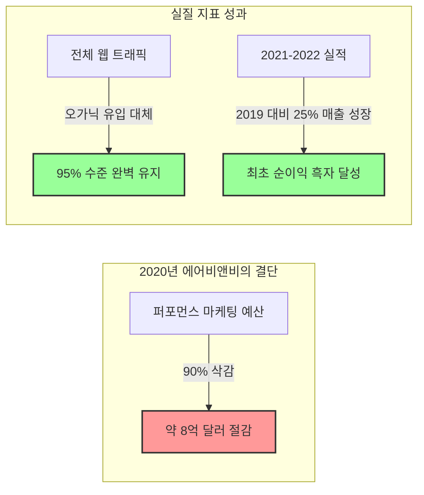
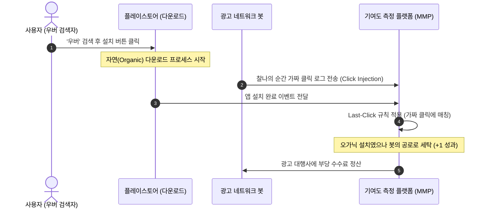

# 누가 당신의 광고비를 훔쳐가는가? 신간 《마케팅 데이터의 거짓말》 표지 공개 및 분석

우리는 매일 수많은 데이터와 차트, 그리고 실시간 대시보드에 둘러싸여 살아갑니다. 마케팅 부서는 1,000%의 ROAS(광고비 대비 매출액)와 30%의 전환율을 자랑스럽게 보고하고, 빅테크의 광고 알고리즘은 우리에게 타겟팅 광고를 더 집행하면 매출이 기하급수적으로 늘어날 것이라 설득합니다.

하지만 경영진이 금고를 열어보면 실제 통장 잔고는 크게 달라지지 않았거나, 오히려 마진이 줄어드는 미스터리한 일이 반복됩니다. 이러한 모순을 통렬하게 해부하고 애드테크(AdTech) 산업이 숨겨온 충격적인 데이터의 왜곡을 고발하는 도서 **《마케팅 데이터의 거짓말: 누가 당신의 광고비를 훔쳐가는가?》**가 출간을 앞두고 있습니다.

오늘은 이 책의 정갈한 스케치 스타일 표지 디자인의 앞/뒷면에 담긴 실증 통계와 구체적인 분석 데이터를 공개합니다.

---

## 🎨 1. 표지 앞면: 3대 글로벌 기업의 마케팅 삭감 실측 데이터

신간 《마케팅 데이터의 거짓말》의 앞면 표지는 광고를 완전히 중단했을 때 비로소 진실이 폭로된 **3대 글로벌 IT 기업(에어비앤비, 우버, 이베이)의 극적인 A/B 테스트 실측 지표**를 담았습니다. 이 기업들은 대시보드상의 화려한 광고 성과 숫자가 인과관계가 아닌 단순한 '카니발라이제이션(자기잠식)'과 '기여도 가로채기'였음을 입증했습니다.

### ① 에어비앤비 (Airbnb) — 팬데믹 초기 1조 원 마케팅 중단 실험 (2020)
2020년 코로나19 팬데믹으로 여행 수요가 전멸 위기에 처하자, 에어비앤비는 생존을 위해 2020년 전체 마케팅 예산을 전년 대비 **58% 전격 삭감**했습니다. 그중 검색 및 리타겟팅 등 단기 퍼포먼스 마케팅 예산은 **90% 이상(약 8억 달러, 한화 약 1조 원) 삭감**하여 사실상 제로에 가깝게 만들었습니다(출처: [에어비앤비(Airbnb) 공식 IR 실적 아카이브](https://investors.airbnb.com/financials/quarterly-results/default.aspx) 및 [월스트리트 저널(WSJ) 보도](https://www.wsj.com/articles/airbnb-says-its-focus-on-brand-marketing-instead-of-search-is-working-11667506438)). 대시보드 상으로는 트래픽이 동반 폭락해야 정상이었으나, 결과는 경악스러웠습니다.
*   **실측 결과 (트래픽 탄력성):** 유료 퍼포먼스 마케팅을 전격 중단했음에도 전체 웹 사이트 트래픽은 **전년(2019년) 대비 95% 수준을 완벽하게 유지**했습니다. 특히 2020년 4분기 기준 에어비앤비 전체 트래픽 중 **90% 이상(90%+)이 직접(Direct) 혹은 자연(Unpaid) 검색 유입**으로 기록되었습니다.
*   **원인 (자기 잠식):** 퍼포먼스 광고가 신규 고객을 창출한 것이 아니라, 이미 브랜드(Airbnb)를 인지하고 들어오려던 오가닉 고객들의 검색 길목을 유료 배너로 선점하여 기여도(Attribution) 성과만 가로채고 있었던(Cannibalization) 것입니다. (에어비앤비가 사용한 브랜드 검색 광고 차단 실험의 구체적인 통계적 방법론과 리프트 측정 원리가 궁금하다면 [광고의 순수 증분(Incrementality) 효과 측정 완벽 가이드](/posts/2026-05-21-ad-incrementality-measurement-ultimate-guide) 포스트를 참고하세요.)
*   **재무 성과:** 예산 낭비를 통제한 결과, 2020년 매출은 우려와 달리 30% 감소(34억 달러)에 선방했고, 비용 효율화 체질 개선을 바탕으로 2021년 전체 매출은 2019년(팬데믹 이전) 대비 **25% 성장(59억 달러)**했으며 2022년에는 창사 이래 최초로 **19억 달러의 연간 순이익(GAAP) 흑자 전환**에 성공했습니다.
*   **마케팅 전략 전환:** 2021년 2월 실적 발표에서 CEO 브라이언 체스키(Brian Chesky)는 에어비앤비 마케팅 전략의 '영구적인 전환'을 선언했습니다. 그는 *"에어비앤비는 이미 하나의 명사(Noun)이자 동사(Verb)로 자리잡았으며, 마케팅은 단순히 돈으로 고객을 구매(buying customers)하는 행위가 아니라 브랜드의 본질을 알리고 교육(educating and inspiring)하는 수단이어야 한다"*라고 역설했습니다. 당시 **월스트리트 저널(WSJ)**과 **Marketing Week** 등 주요 글로벌 비즈니스 미디어는 에어비앤비의 이 같은 대담한 행보와 "검색 광고 대신 브랜드에 투자하는 전략이 실제로 지속적인 성공을 거두고 있다"는 점을 비중 있게 분석 보도했습니다.



### ② 우버 (Uber) — 1,300억 원의 앱 설치 광고 사기 폭로 (2017)
우버의 퍼포먼스 마케팅 책임자였던 케빈 프리쉬(Kevin Frisch)는 자사 광고가 극우 사이트 Breitbart에 노출되는 것을 막기 위해 조사를 시작했다가, 마케팅 대행사들의 경고에도 불구하고 연간 1억 5천만 달러의 광고비 중 무려 **3분의 2인 1억 달러(약 1,300억 원)를 점진적으로 정지**했습니다.
*   **실측 결과:** 1억 달러의 광고비가 사라졌음에도 신규 앱 설치 수(App Installs)와 신규 가입자 수에는 **단 0%의 영향도 주지 않았습니다.**
*   **원인 (어트리뷰션 사기):** 대행사들의 광고 네트워크가 클릭 인젝션(Click Injection) 및 클릭 스패밍(Click Spamming)을 사용하여, 사용자가 직접 플레이스토어에서 우버를 검색해 다운로드하기 직전의 찰나(밀리초 단위)에 가짜 클릭 신호를 생성해 기여도(Attribution) 성과를 훔쳐 갔기 때문입니다.
*   **결과:** 우버는 해당 광고 대행사를 고소하였으며, 하청 네트워크 중 하나였던 Phunware와의 소송에서 승리(Phunware의 증거 인멸로 인한 제재 직전 합의)하여 **600만 달러의 합의금**을 받아냈습니다.



### ③ 이베이 (eBay) — 브랜드 검색 광고의 완전한 대체 효과 (2013-2015)
Thomas Blake(eBay), Steven Tadelis(UC Berkeley) 등이 발표하여 디지털 마케팅의 역사를 바꾼 기념비적 현장 실험 연구입니다. 이베이는 MSN과 Yahoo에서 자사 브랜드 명칭인 **'eBay' 브랜드 검색 광고를 전면 중단**했습니다.
*   **실측 결과:** 광고가 정지되자 유료 검색 유입 트래픽은 0으로 떨어졌으나, 그 즉시 **자연 검색(Organic Search) 유입이 잃어버린 유료 트래픽의 99.5%를 정확히 완벽하게 흡수**했습니다. 전체 매출과 트래픽은 0.5% 미만의 노이즈를 제외하고 변동이 없었습니다.
*   **원인 (비용 낭비):** '이베이'를 검색창에 칠 정도로 구매 의사가 명확한 충성 고객(단골)들은 광고 링크가 있든 없든 어차피 들어왔을 유저들이었습니다. 광고 플랫폼은 단지 최상단 광고 영역을 통해 이 네비게이션 목적의 트래픽을 가로채서 고액의 과금을 요구하고 있었던 것입니다.
*   **통계적 왜곡:** 대시보드 상에 찍히던 관측 ROI는 무려 **+4,100%**에 달했으나, 실제 이 통제 실험을 통해 밝혀진 진짜 ROI는 **-63%**였습니다.

```mermaid
graph TD
    subgraph 브랜드 광고를 집행할 때 (Before)
        Paid[유료 브랜드 광고 클릭: 100%] --> Total1[이베이 총 유입 트래픽: 100%]
        Organic[자연 검색 클릭: 0%] --> Total1
    end
    subgraph 브랜드 광고를 전면 차단할 때 (After)
        PaidZero[유료 브랜드 광고 클릭: 0%] --> Total2[이베이 총 유입 트래픽: 99.5%]
        OrganicUp[자연 검색 클릭: 99.5%] --> Total2
    end
    style Paid fill:#ff9999,stroke:#333,stroke-width:2px
    style Organic fill:#99ff99,stroke:#333,stroke-width:2px
    style OrganicUp fill:#99ff99,stroke:#333,stroke-width:2px
```

---

## 📄 2. 표지 뒷면: 워렌 버핏의 경고와 '진짜 성과'의 차트

> **"게임 시작 30분이 지났는데 누가 호구인지 모른다면, 바로 당신이 그 호구다."**
> — 워렌 버핏 (Warren Buffett), 1987년 주주서한 중

매년 전 세계적으로 1,000조 원에 달하는 디지털 마케팅 비용이 집행됩니다. 하지만 뒷면 표지가 고발하는 **PwC/ISBA 및 ANA(미국광고주협회)**의 프로그래매틱 광고 공급망 투명성 연구 실측 데이터는 가히 파괴적입니다.

*   **1달러당 실제 작동하는 비용의 비율 (Tech Tax & Unknown Delta):**
    *   **51% (Working Media):** 광고주가 지출한 $1.00 중 실제 지면을 제공한 매체(Publisher)에 도달하는 비율.
    *   **34% (Tech Tax):** 광고 중개인들(DSP, SSP, DMP, Ad Exchange 등)이 중간에서 가져가는 수수료.
    *   **15% (Unknown Delta):** 중간 경매 과정과 리베이트 뒤로 숨어 세계 최고 회계법인조차 "추적 자체가 불가능하다"고 판단한 유실 비용.
    *   **30% 이하 (Effective Working Media):** 매체에 도달한 51% 중에서도 봇 트래픽(Ad Fraud)과 낚시성 저품질 사이트(MFA)로의 누수를 제거하고 실제 인간의 시야에 유효 도달(Viewability)하는 진짜 비율.

마케터가 100달러를 쓸 때, 실제로 브랜드를 위해 일하는 순수 자원은 30달러 미만입니다. 나머지 70달러는 애드테크 중간상들의 지갑과 가짜 봇들의 약탈로 유실됩니다. 이 표지는 그 차가운 진실을 정갈한 스케치 스타일의 30% 파이 차트로 독자에게 강력히 경고합니다.

---

## 🎯 3. 이 책이 던지는 궁극적 가치

《마케팅 데이터의 거짓말》은 단순히 이론적인 통계학 지식을 설명하는 학술 서적이 아닙니다. 세계 최고 수준의 테크 기업들과 마케팅 과학 연구소들이 겪은 실제 고통스러운 실패와 성공 사례를 통해, 데이터를 다루는 마케터가 반드시 지켜야 할 엄격한 과학적 원칙을 제시합니다.

숫자는 결코 거짓말을 하지 않지만, **선택되고 가공된 데이터는 우리를 완벽하게 속입니다.** 이 책은 당신이 마주한 대시보드의 마법에서 깨어나, 진짜 비즈니스를 성장시키는 '인과의 과학'을 마주할 수 있도록 돕는 가장 실용적인 가이드가 될 것입니다.

---

## 📚 참고자료

1. Blake, T., Nosko, C., & Tadelis, S. (2015). Consumer Heterogeneity and Paid Search Effectiveness: A Large-Scale Field Experiment. *Econometrica*, 83(1), 155-174.
2. Wall Street Journal (2017.09.18). [Uber Sues Mobile Agency, Alleging Ad Fraud](https://www.wsj.com/articles/uber-sues-mobile-agency-alleging-ad-fraud-1505787048).
3. TechCrunch (2017.09.20). [Uber sues mobile agency Fetch for $40M, alleging ad fraud](https://techcrunch.com/2017/09/20/uber-sues-mobile-agency-fetch-for-40m-alleging-ad-fraud/).
4. Adweek (2020.10.23). [Uber Settles Mobile Ad Fraud Lawsuit With Phunware for $6 Million](https://www.adweek.com/performance-marketing/uber-settles-mobile-ad-fraud-lawsuit-with-phunware-for-6-million/).
5. MediaPost (2019.06.25). [Uber Sues Ad Agencies, Alleging Widespread Ad Fraud](https://www.mediapost.com/publications/article/337424/uber-sues-ad-agencies-alleging-widespread-ad.html).
6. Tech.co (2019.06.26). [Uber's Ad Fraud Suit Highlights a Billion-Dollar Brand Problem](https://tech.co/news/uber-ad-fraud-brand-problem).
7. Phunware SEC Filing Form 8-K (2020.10.09). [Phunware, Inc. SEC EDGAR Filings (CIK 0001665300)](https://www.sec.gov/edgar/browse/?CIK=1665300).
8. [Uber Cut $100M in Ad Spend and nothing happened? - Adriaan Dekker](https://adriaan-dekker.nl/uber-cut-100m-in-ad-spend-and-nothing-happened/)
9. [Uber Chief Claims Most Performance Marketing is Pure Fraud - ADOTAT](https://www.adotat.com/2021/01/uber-chief-claims-most-performance-marketing-is-pure-fraud/)
10. [Last Click Attribution & Cannibalization - INCRMNTAL](https://www.incrmntal.com/resources/last-click-attribution-and-cannibalization)
11. Kevin Frisch의 팟캐스트 인터뷰 기록 (Edward Nevraumont's *Marketing BS* Podcast).
12. Wall Street Journal (2022.11.03). [Airbnb Says Its Focus on Brand Marketing Instead of Search Is Working](https://www.wsj.com/articles/airbnb-says-its-focus-on-brand-marketing-instead-of-search-is-working-11667506438).
13. Marketing Week (2021.02.26). [Airbnb: Our marketing shift is a permanent pivot, not a temporary fix](https://www.marketingweek.com/airbnb-marketing-shift-permanent-pivot/).
14. Airbnb, Inc. (2021.02.26). [Airbnb, Inc. Q4 2020 Shareholder Letter / 2020 Annual Report](https://investors.airbnb.com/financials/quarterly-results/default.aspx).


