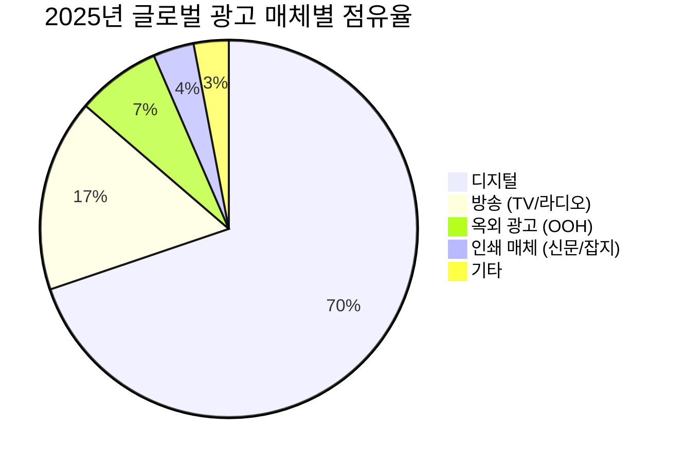
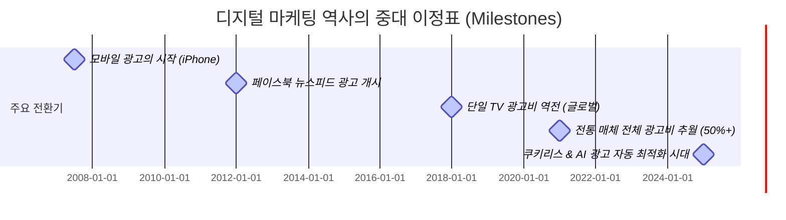

# 1장. 디지털 마케팅: 진화와 거대한 영토

> *"디지털 마케팅을 이해한다는 것은 현대 인류가 정보를 소비하고 의사결정을 내리는 방식의 전체 지형도를 파악하는 것과 같다."*

---

## 1-1. [경영자 속성 과외] 10분 만에 마스터하는 애드테크 톱니바퀴

C-Level 임원 회의나 마케팅 실무 미팅에 참석하면 머리가 어지러워진다. CTR, CPM, DSP, SSP, RTB, 어트리뷰션... 정체 모를 알파벳 약어들이 난무하고, 마케터와 대행사는 전문가스러운 표정으로 이 지표들을 읊조린다. 

이때 경영자와 CFO는 속으로 생각한다. *"내가 마케팅 트렌드를 너무 모르는 건가?"* 주눅이 든 경영진은 조용히 승인의 결재 라인을 누른다. 

하지만 기억하라. 빅테크 플랫폼과 대행사들은 일부러 **복잡한 기술적 전문용어의 장벽**을 높이 세운다. 장벽이 높을수록 광고주가 성과를 깊이 파헤치거나 예산을 삭감하기 어렵기 때문이다. 이 책의 논의를 막힘없이 이해하기 위해, 복잡한 알파벳 장막을 걷어내고 가장 뼈대가 되는 핵심 애드테크 톱니바퀴 3가지만 명쾌한 비유로 이해하고 넘어가자.

### ❶ 광고비를 지불하는 3가지 약속 (과금 모델)
디지털 광고비를 구글이나 메타에 낼 때, 우리는 어떤 조건으로 돈을 주겠다고 약속하는가? 크게 3가지 방식이 있다.

*   **CPM (Cost Per Mille - 노출당 과금):** 광고가 화면에 **1,000번 노출**될 때마다 돈을 낸다. 
    *   *쉽게 이해하기:* 아파트 단지 우편함에 전단지 1,000장을 넣는 대가로 배달원에게 수수료를 주는 것과 같다. 주민들이 전단지를 읽었는지, 혹은 그냥 쓰레기통에 버렸는지는 관심이 없다. 오직 '우편함에 들어갔는가(화면에 떴는가)'만 본다.
*   **CPC (Cost Per Click - 클릭당 과금):** 광고를 **클릭해서 우리 사이트에 들어올 때**만 돈을 낸다.
    *   *쉽게 이해하기:* 대형마트 시식 코너다. 지나가는 사람이 고기를 구경하는 건 공짜다. 하지만 이쑤시개로 고기 한 점을 집어 입에 넣는 순간(클릭하는 순간) 비용이 청구된다.
*   **CPA (Cost Per Action - 성과당 과금):** 광고를 통해 들어온 유저가 회원가입, 앱 설치, 혹은 실제 **구매 결제(Action)를 완료**했을 때만 돈을 준다.
    *   *쉽게 이해하기:* 부동산 중개 수수료다. 집을 구경하거나 문의전화를 건 사람에게는 돈을 주지 않는다. 오직 실제 계약서에 도장을 찍었을 때만 성공 보수를 지급한다.

> **경영자를 위한 경고:** 언뜻 CPA가 광고주에게 가장 안전하고 이득처럼 보인다. 하지만 사기꾼들은 CPM에서는 보이지 않는 픽셀 광고로 돈을 훔치고, CPC에서는 로봇(Bot)으로 가짜 클릭을 날려 돈을 가로채며, CPA에서는 어차피 가입하려던 자연 유입 고객의 뒤통수를 쳐서 자기가 데려왔다고 사기를 친다. 안전한 과금 모델이란 존재하지 않는다.

---

### ❷ 광고 배너가 뜨기까지 0.1초의 여정과 플레이어들
인터넷 신문 기사를 누르거나 앱을 켤 때, 빈 광고 칸에 배너가 뜨기까지는 단 **0.1초(100ms)**가 걸린다. 이 찰나의 순간에 보이지 않는 기계들의 실시간 경매가 벌어진다.

```
[광고주] ──▶  DSP (구매 자동화기) ──┐
                                     ├─▶ Ad Exchange (실시간 경매장)
[매체사] ──▶  SSP (판매 자동화기) ──┘        (0.1초 RTB 경매 완료 후 노출)
```

*   **DSP (Demand-Side Platform - 광고주 대리인):** 광고주가 돈을 충전하고 *"강남구에 사는 30대 여성이 접속하면 화장품 배너를 10원에 낙찰받아줘"*라고 명령을 내리는 **'구매 자동기계'**다.
*   **SSP (Supply-Side Platform - 매체사 대리인):** 신문사나 블로그 운영자가 *"내 사이트 빈 광고판의 최저 낙찰가는 5원이야. 이 가격 이상으로 살 대상을 찾아봐"*라고 지면을 올려두는 **'판매 자동기계'**다.
*   **Ad Exchange (광고 거래소):** 주식 거래소와 같다. 수만 대의 DSP(구매기)와 SSP(판매기)가 이 디지털 거래소에 접속해 실시간으로 매물을 주고받는다.
*   **RTB (Real-Time Bidding - 실시간 입찰):** 사용자가 웹페이지를 여는 0.1초 동안, Ad Exchange 내에서 수많은 DSP들이 *"내가 7원에 살게!", "내가 8원에 살게!"* 경쟁 입찰을 벌여 최고가를 제시한 브랜드의 광고를 사용자 화면에 띄우는 실시간 경매 메커니즘이다.

---

### ❸ 성과의 공로를 나누는 룰: 어트리뷰션(Attribution)
어떤 소비자가 인스타그램 광고를 보고 브랜드를 알게 되었고, 3일 뒤 구글에서 제품을 검색해 들어왔으며, 결제 직전 카카오톡 할인 쿠폰을 눌러 구매를 완료했다고 하자. 
이 10만 원짜리 매출 성과는 인스타그램, 구글, 카카오톡 중 누구의 덕분인가? 이 공로를 계산하는 규칙을 **'어트리뷰션(Attribution, 기여 모델)'**이라고 한다.

*   **라스트 클릭(Last Click)의 함정:** 현재 대다수 마케팅 대시보드는 **마지막에 클릭한 매체(카카오톡)**에 공로를 100% 몰아준다. 
    *   *쉽게 이해하기:* 백화점 매장 바로 문 앞에서 호객 행위를 하던 삐끼(마지막 클릭)가, 이미 백화점에 들어가려고 횡단보도를 건너오던 손님의 소맷자락을 슬쩍 잡고 문 안으로 밀어 넣은 뒤 *"제가 이 손님 모셔왔으니 수수료 주세요"*라고 외치는 꼴이다. 
    *   이 함정 때문에, 실제 브랜드를 인지하게 만들어 준 최초 광고비는 삭감되고 결제 직전 길목을 지키고 서 있는 하류 퍼널(네이버 검색광고, 리타겟팅 배너 등)에 쓸데없이 많은 예산이 배정되는 심각한 예산 왜곡이 일어난다.

이제 기본 톱니바퀴는 모두 파악했다. 이 도구들을 머리에 담고, 본격적으로 디지털 마케팅 영토의 진짜 크기와 그 뒤에 감춰진 가짜 성과의 실체를 추적해 보자.

---

## 1-2. 디지털 마케팅의 영토: 글로벌, 미국, 그리고 한국 시장 (2025-2026년 기준)

오늘날 디지털 마케팅은 광고 산업의 주변부가 아닌 **핵심 심장부**입니다. 기업이 마케팅 예산을 수립할 때 가장 먼저, 그리고 가장 큰 비중으로 고려하는 것은 디지털 광고 지출입니다. 2025년에서 2026년에 이르는 현재 시장 지표들은 디지털 마케팅 시장의 압도적인 규모를 직관적으로 증명합니다.

*   **글로벌 디지털 마케팅 시장:** 약 **7,400억 달러 (한화 약 990조 원)** 규모에 도달했습니다. 이는 전체 광고 시장의 약 70%에 달하는 수치로, 인류 역사상 그 어떤 단일 미디어 환경도 달성하지 못한 압도적 점유율입니다.
*   **미국(US) 디지털 마케팅 시장:** 세계 최대의 단일 광고 시장인 미국은 디지털 광고 지출만 약 **3,100억 달러 (한화 약 410조 원)**를 기록하고 있습니다. 전 세계 디지털 광고 예산의 40% 이상이 미국 시장 한 곳에서 소비됩니다.
*   **한국 디지털 마케팅 시장:** 한국의 디지털 광고 시장 규모는 약 **9조 5,000억 원**을 넘어섰습니다. 국내 전체 광고 시장(약 16조 원)의 **약 60%**를 차지하며, 방송(TV/라디오), 인쇄(신문/잡지), 옥외(OOH) 광고비 전체를 합친 것보다 더 큰 영토를 구축하고 있습니다.

---

## 1-3. 전통 매체와의 비교: 무너진 레거시의 영토

과거 광고 시장의 절대 강자였던 TV, 신문, 라디오 등의 전통 매체(레거시 미디어)는 이제 디지털 마케팅의 보조 채널 수준으로 격하되었습니다. 2025년 기준 글로벌 광고 매체별 점유율을 대조해 보면 이 판도의 변화가 극명하게 드러납니다.

### 📊 2025년 글로벌 광고 매체별 점유율 비교

| 매체 구분 | 세부 매체 | 글로벌 점유율 (%) | 한국 점유율 (%) | 주요 특징 |
|---|---|---|---|---|
| **디지털 (Digital)** | 검색, 소셜, 비디오, 디스플레이, 리테일 미디어 등 | **69.8%** | **59.4%** | 실시간 타겟팅, 측정 가능성, AI 자동화 |
| **방송 (Broadcast)** | 지상파 TV, 케이블 TV, 라디오 | **16.5%** | **18.2%** | 광범위한 도달률, 브랜드 신뢰도, 지속적인 시청률 하락 |
| **옥외 (OOH/DOOH)** | 빌보드, 지하철 광고, 버스 광고 등 | **7.2%** | **13.5%** | 물리적 공간 노출, 디지털 옥외광고(DOOH)로의 전환 추세 |
| **인쇄 (Print)** | 신문, 잡지 | **3.5%** | **6.1%** | 지면 신뢰도, 정기 구독자 중심, 급격한 지출 감소 |
| **기타** | 제작비, 이벤트, 다이렉트 메일 등 | **3.0%** | **2.8%** | 프로모션 및 B2B 대면 마케팅 중심 |



---

## 1-4. 20년간의 성장 궤적: 골리앗을 넘어뜨린 다윗

2000년대 초반만 해도 인터넷 배너 광고는 TV와 신문 광고의 뒷전에서 구걸하던 변두리 매체에 불과했습니다. 그러나 스마트폰의 보급과 초고속 이동통신 기술, 빅데이터 및 머신러닝의 발전은 지난 20년간 광고 시장의 권력 구도를 완벽하게 뒤바꾸었습니다.

그 역사적 정점은 **2019-2020년**이었습니다. 이 시기 디지털 광고비는 전 세계적으로 전통 매체 전체 합산 지출액을 공식적으로 추월(Crossover)했습니다. TV 광고를 단일 매체로 꺾은 시점은 이보다 훨씬 빠른 2017년이었습니다.

### 📈 지난 20년간 매체별 광고 지출 추이 (글로벌 기준, 단위: 억 달러)

| 연도 | 디지털 광고비 | 전통 매체 광고비 (TV/신문/라디오 등 합산) | 전통 대비 디지털 비중 (%) | 주요 역사적 사건 |
|---|---|---|---|---|
| **2005** | 250 | 3,900 | 6.0% | 구글 애드센스 정착, 검색 광고 활성화 |
| **2010** | 720 | 4,200 | 14.6% | 아이폰 출시 후 모바일 광고 여명기 |
| **2015** | 1,700 | 4,500 | 27.4% | 페이스북 모바일 광고 엔진 폭발적 성장 |
| **2017** | **2,280** | **1,780 (단일 TV)** | **TV 단일 추월** | 디지털 광고비, 단일 매체 1위였던 TV 광고비 최초 추월 |
| **2020** | **3,780** | **3,100 (전체 합산)** | **54.9% (전체 추월)** | 팬데믹 특수로 디지털 광고 지출이 전통 미디어 전체 합산액 추월 |
| **2025** | 7,400 | 3,200 | 69.8% | AI 기반 자동 최적화 광고(PMax, Advantage+) 독점기 |



---

## 1-5. 권력의 독점: 마케팅 제국을 지배하는 5대 거인 (Big Five)

전통 광고 시대에는 수천 개의 TV 채널, 라디오 방송국, 신문사가 광고 예산을 나누어 가졌습니다. 그러나 디지털 마케팅 시대는 극단적인 **승자독식(Winner-takes-all)** 구조입니다. 전 세계 디지털 광고비의 절반 이상을 단 3-5개의 빅테크 기업이 독식하고 있으며, 이들을 흔히 **'듀오폴리(Duopoly)'** 혹은 **'트리오폴리(Triopoly)'**라고 부릅니다.

특히 이 거인들의 내부는 사업부별로 성격이 완전히 다른 거대한 광고 플랫폼들로 쪼개져 작동합니다.

### 1. Alphabet (Google) — 검색, 모바일, 그리고 유튜브의 입체적 지배
구글은 디지털 마케팅의 탄생과 성장을 주도한 황제입니다. 구글의 광고 비즈니스는 크게 세 가지 기둥으로 나뉩니다.
*   **Google Search (검색 광고):** 구글의 본진입니다. 사용자가 명확한 구매 의도를 가지고 검색창에 단어를 입력할 때 노출하는 검색 광고(SA) 시장을 90% 이상 독점하고 있습니다.
*   **Android & Mobile Eco-system (구글 UAC/디스플레이):** 안드로이드 운영체제와 구글 플레이스토어를 장악하여, 수백만 개의 모바일 앱 내부에 디스플레이 광고(DA)를 실시간 입찰 시스템(RTB)으로 송출합니다.
*   **YouTube (유튜브 동영상 광고):** 전 세계 최대의 동영상 스트리밍 플랫폼으로, 전통 TV 광고 예산을 가장 빠르게 빨아들이는 블랙홀입니다. 범퍼 광고, 프리롤 광고 등 동영상 광고 시장을 완전히 장악했습니다.

### 2. Meta — 타겟팅의 절대자, 페이스북과 인스타그램
메타는 사용자의 인구통계학적 정보(성별, 나이, 지역)뿐만 아니라 관심사, 행동 패턴 데이터를 추적하여 '가장 구매할 확률이 높은 개인'을 정교하게 찾아내는 타겟팅 광고의 절대 강자입니다.
*   **Facebook (페이스북):** 30대 이상의 중장년층과 글로벌 지역에서 막강한 도달률을 자랑하는 매체입니다. 정교한 행동 데이터 수집의 근간이 됩니다.
*   **Instagram (인스타그램):** 이미지와 숏폼(릴스) 중심의 플랫폼으로, 전 세계 MZ세대의 트렌드와 이커머스 구매 전환을 주도하는 가장 강력한 퍼포먼스 광고 매체입니다.

### 3. Amazon — 구매 시점의 강력한 장악 (리테일 미디어)
아마존은 사용자가 제품을 '검색하고 바로 구매 결제를 진행하는' 최종 이커머스 시점에 광고를 노출합니다. 구글이 정보 탐색 단계이고 메타가 발견 단계라면, 아마존은 바로 지갑을 여는 순간을 장악합니다. 이른바 **리테일 미디어 네트워크(RMN)**의 선두주자로서 연간 500억 달러에 달하는 광고 매출을 올리고 있습니다.

### 4. ByteDance (TikTok) — 숏폼 바이럴의 신흥 강자
틱톡은 15초-1분 미만의 세로형 숏폼 비디오 트렌드를 선도하며 Z세대의 주의력(Attention)을 독점했습니다. 트렌드 전파 속도가 빠르고 바이럴 파급력이 커 신규 브랜드 유입 및 인지도 확장 플랫폼으로 급부상했습니다.

### 5. Apple — 사생활 보호 장벽 뒤의 반사이익
애플은 광고 지면을 직접 많이 소유하진 않았지만, iOS 운영체제의 지배자입니다. 2021년 애플이 단행한 **ATT(App Tracking Transparency, 앱 추적 투명성)** 정책은 라이벌인 메타와 구글의 타겟팅 해상도를 강제로 낮추어 버렸고, 그 틈을 타 애플 자체의 '서치 애드(Search Ads)' 매출을 수배 이상 폭발적으로 성장시켰습니다.

---

## 1-6. 디지털 마케팅의 5대 유형과 메커니즘

디지털 마케팅은 목적과 도구에 따라 크게 5가지 유형으로 구분됩니다. 중학생도 이해할 수 있는 비유와 함께 그 메커니즘을 알아봅니다.

```
┌────────────────────────────────────────────────────────┐
│                   디지털 마케팅의 5대 유형             │
│  ├──────────────┬──────────────┬──────────────┬───────────┤
│  │ 검색광고(SA)  │ 디스플레이   │ 소셜미디어   │ 비디오    │
│  │              │ 광고(DA)     │ 마케팅(SMM)  │ 마케팅    │
│  ├──────────────┼──────────────┼──────────────┼───────────┤
│  │ 의도 기반    │ 타겟 노출    │ 관계/바이럴  │ 고몰입    │
│  │ (수요 선점)  │ (발견 유도)  │ (팬덤 형성)  │ (시각화)  │
└────────────────────────────────────────────────────────┘
```

### ① 검색 마케팅 (SA, Search Advertising / SEM)
*   **작동 방식:** 소비자가 구글이나 네이버에 '여드름 화장품'을 검색할 때, 그 단어와 관련된 광고주의 웹사이트 링크를 최상단에 노출하고 클릭당 과금(CPC)을 청구하는 방식입니다.
*   **비유:** 백화점 정문 안내 데스크 바로 옆에 가게를 차려두고, "선글라스 파는 곳이 어디인가요?"라고 묻는 고객에게 우리 가게 카탈로그를 바로 쥐여주는 행위입니다. 이미 살 마음이 있는 사람을 잡기 때문에 효율이 매우 높습니다.

### ② 디스플레이 광고 (DA, Display Advertising / Programmatic)
*   **작동 방식:** 언론사 뉴스 기사 지면이나 모바일 앱 하단에 배너 이미지, 텍스트 형태로 노출되는 광고입니다. 애드테크 엔진이 사용자의 쿠키나 행동 이력을 분석해 관련 있는 배너를 실시간 입찰(RTB)로 띄웁니다.
*   **비유:** 길거리를 걸어가는 사람들의 이마에 '어제 컴퓨터 쇼핑을 한 사람'이라는 꼬리표가 붙어 있고, 그 꼬리표를 보고 골목길 벽면에 컴퓨터 할인 광고판을 순간적으로 교체하여 보여주는 기술입니다.

### ③ 소셜 미디어 마케팅 (SMM, Social Media Marketing)
*   **작동 방식:** 페이스북, 인스타그램, X(구 트위터) 등에서 브랜드 공식 계정을 운영하거나 유저들의 뉴스피드 사이에 네이티브 광고 형태로 스폰서 콘텐츠를 노출하는 방식입니다.
*   **비유:** 동네 주민들이 모여 수다를 떠는 사랑방에 주인이 자연스럽게 끼어들어 "요즘 이 면도기가 유행이라던데 써보셨어요?"라고 입소문을 넌지시 흘리는 방식입니다.

### ④ 비디오 마케팅 (Video Marketing)
*   **작동 방식:** 유튜브 영상 시작 전 나오는 5초 건너뛰기 광고나 틱톡, 릴스 등 숏폼 세로 동영상을 활용해 브랜드의 스토리와 시각적 자극을 극대화하는 광고입니다.
*   **비유:** 영화관에서 영화 상영 직전 강제로 불을 끄고 몰입도 높은 예고편을 틀어주어 관객들의 주의를 100% 가두는 행위입니다.

### ⑤ 이메일 & CRM 마케팅 (Customer Relationship Management)
*   **작동 방식:** 이미 가입했거나 구매한 이력이 있는 회원들의 이메일, 카카오톡 알림톡, 앱 푸시 메시지를 통해 개인화된 할인 쿠폰이나 큐레이션 정보를 발송하여 재구매(Retention)를 유도하는 마케팅입니다.
*   **비유:** 우리 가게에 한 번 들렀던 단골손님에게 직접 전화를 걸어 "사장님, 지난번에 사가셨던 원두가 떨어질 때쯤 되었는데 마침 이번 주에 햇원두가 들어왔습니다"라고 챙겨주는 친근한 관리 기법입니다.

---

## 1-7. 1장을 덮기 전에 — 마케터의 거대한 착각

우리는 이 거대하고 정교한 디지털 마케팅 영토에서 숫자를 다루고 있습니다. 20년 동안 시장은 기하급수적으로 커졌고, 빅테크의 독점은 견고해졌으며, 마케팅 도구는 공상과학 소설 수준으로 자동화되었습니다.

하지만 이 눈부신 진화의 이면에는 한 가지 치명적인 **어두운 질문**이 생략되어 있습니다. 
> "디지털 마케팅의 규모가 커지고 측정이 정교해진 만큼, 과연 우리의 진짜 마케팅 효과와 이익도 비례해서 늘어났는가?"

이 질문에 정직하게 답하기 위해, 2장에서는 우리의 눈을 가리고 매년 수십조 원의 광고비를 증발시키는 **디지털 광고 사기(Ad Fraud)와 빅테크의 검은 돈세탁 생태계**의 민낯을 본격적으로 해부해 보겠습니다.

---

## 📚 참고자료

### 시장 통계 및 학술 데이터
*   eMarketer / Insider Intelligence. (2025). *Global Digital Ad Spend Report 2025-2026.*
*   IAB (Interactive Advertising Bureau). (2025). *US Ad Revenue Report FY 2025.* (미국 광고 시장 규모 데이터)
*   KOBACO (한국방송광고진흥공사). (2025). *방송통신광고비조사 보고서 (2025-2026).* (국내 매체별 점유율 데이터)
*   Zenith Media. (2024). *Advertising Expenditure Forecasts.* (지난 20년간의 매체별 성장 추이 데이터)

### 업계 분석 리포트
*   Gartner. (2025). *State of Marketing Budget and Strategy Report.*
*   Jounce Media. (2024). *The State of the Programmatic Supply Chain: RMNs and the Triopoly.* (아마존 및 빅테크 3각 독점 분석)
*   Apple Inc. (2021). *App Tracking Transparency (ATT) Implementation Whitepaper.* (사생활 보호 장벽 정책 상세 문서)
