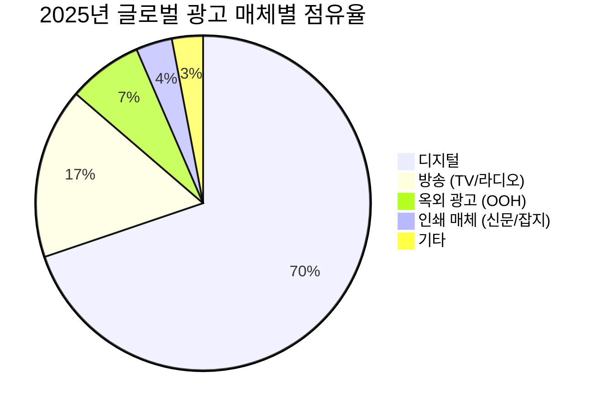
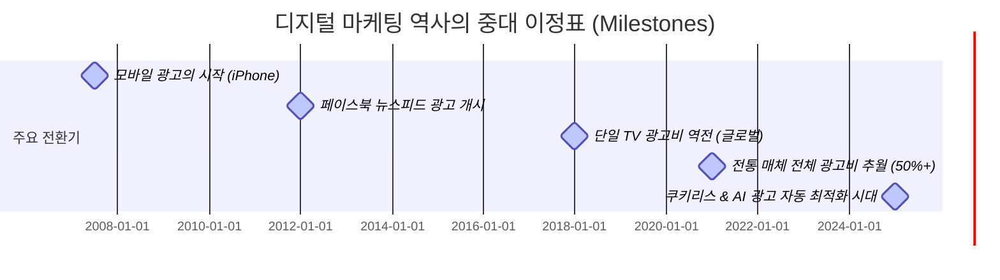

# 1장. 우리가 '클릭'에 1,000조 원을 바치는 이유

> *"디지털 마케팅을 이해한다는 것은 현대 인류가 정보를 소비하고 의사결정을 내리는 방식의 전체 지형도를 파악하는 것과 같다."*

---

## 1-1. 디지털 마케팅의 위상: 글로벌과 국내 시장의 영토

오늘날 디지털 마케팅은 광고 산업의 주변부가 아닌 **핵심 심장부**다. 기업이 마케팅 예산을 수립할 때 가장 먼저, 그리고 가장 큰 비중으로 고려하는 것은 디지털 광고 지출이다. 2025년에서 2026년에 이르는 현재 시장 지표들은 디지털 마케팅 시장의 압도적인 규모를 직관적으로 증명한다.

*   **글로벌 디지털 마케팅 시장:** 약 **7,400억 달러 (한화 약 990조 원)** 규모에 도달했다. 이는 전체 광고 시장의 약 70%에 달하는 수치로, 인류 역사상 그 어떤 단일 미디어 환경도 달성하지 못한 압도적 점유율이다.
*   **미국(US) 디지털 마케팅 시장:** 세계 최대의 단일 광고 시장인 미국은 디지털 광고 지출만 약 **3,100억 달러 (한화 약 410조 원)**를 기록하고 있다. 전 세계 디지털 광고 예산의 40% 이상이 미국 시장 한 곳에서 소비된다.
*   **한국 디지털 마케팅 시장:** 한국의 디지털 광고 시장 규모는 약 **9조 5,000억 원**을 넘어섰다. 국내 전체 광고 시장(약 16조 원)의 **약 60%**를 차지하며, 방송(TV/라디오), 인쇄(신문/잡지), 옥외(OOH) 광고비 전체를 합친 것보다 더 큰 영토를 구축하고 있다.

과거 광고 시장의 절대 강자였던 TV, 신문, 라디오 등의 전통 매체(레거시 미디어)는 이제 디지털 마케팅의 보조 채널 수준으로 격하되었다. 2025년 기준 글로벌 광고 매체별 점유율을 대조해 보면 이 판도의 변화가 극명하게 드러난다.

### 📊 2025년 글로벌 광고 매체별 점유율 비교

| 매체 구분 | 세부 매체 | 글로벌 점유율 (%) | 한국 점유율 (%) | 주요 특징 |
|---|---|---|---|---|
| **디지털 (Digital)** | 검색, 소셜, 비디오, 디스플레이, 리테일 미디어 등 | **69.8%** | **59.4%** | 실시간 타겟팅, 측정 가능성, AI 자동화 |
| **방송 (Broadcast)** | 지상파 TV, 케이블 TV, 라디오 | **16.5%** | **18.2%** | 광범위한 도달률, 브랜드 신뢰도, 지속적인 시청률 하락 |
| **옥외 (OOH/DOOH)** | 빌보드, 지하철 광고, 버스 광고 등 | **7.2%** | **13.5%** | 물리적 공간 노출, 디지털 옥외광고(DOOH)로의 전환 추세 |
| **인쇄 (Print)** | 신문, 잡지 | **3.5%** | **6.1%** | 지면 신뢰도, 정기 구독자 중심, 급격한 지출 감소 |
| **기타** | 제작비, 이벤트, 다이렉트 메일 등 | **3.0%** | **2.8%** | 프로모션 및 B2B 대면 마케팅 중심 |

---

## 1-2. 20년간의 급격한 성장: 골리앗을 넘어뜨린 다윗

2000년대 초반만 해도 인터넷 배너 광고는 TV와 신문 광고의 뒷전에서 구걸하던 변두리 매체에 불과했다. 그러나 스마트폰의 보급과 초고속 이동통신 기술, 빅데이터 및 머신러닝의 발전은 지난 20년간 광고 시장의 권력 구도를 완벽하게 뒤바꾸었다.

그 역사적 정점은 **2019-2020년**이었다. 이 시기 디지털 광고비는 전 세계적으로 전통 매체 전체 합산 지출액을 공식적으로 추월(Crossover)했다. TV 광고를 단일 매체로 꺾은 시점은 이보다 훨씬 빠른 2017년이었다.

### 📈 지난 20년간 매체별 광고 지출 추이 (글로벌 기준, 단위: 억 달러)

| 연도 | 디지털 광고비 | 전통 매체 광고비 (TV/신문/라디오 등 합산) | 전통 대비 디지털 비중 (%) | 주요 역사적 사건 |
|---|---|---|---|---|
| **2005** | 250 | 3,900 | 6.0% | 구글 애드센스 정착, 검색 광고 활성화 |
| **2010** | 720 | 4,200 | 14.6% | 아이폰 출시 후 모바일 광고 여명기 |
| **2015** | 1,700 | 4,500 | 27.4% | 페이스북 모바일 광고 엔진 폭발적 성장 |
| **2017** | **2,280** | **1,780 (단일 TV)** | **TV 단일 추월** | 디지털 광고비, 단일 매체 1위였던 TV 광고비 최초 추월 |
| **2020** | **3,780** | **3,100 (전체 합산)** | **54.9% (전체 추월)** | 팬데믹 특수로 디지털 광고 지출이 전통 미디어 전체 합산액 추월 |
| **2025** | 7,400 | 3,200 | 69.8% | AI 기반 자동 최적화 광고(PMax, Advantage+) 독점기 |

---

## 1-3. Big Tech의 지배: 마케팅 제국을 지배하는 5대 거인

전통 광고 시대에는 수천 개의 TV 채널, 라디오 방송국, 신문사가 광고 예산을 나누어 가졌다. 그러나 디지털 마케팅 시대는 극단적인 **승자독식(Winner-takes-all)** 구조다. 전 세계 디지털 광고비의 절반 이상을 단 3-5개의 빅테크 기업이 독식하고 있으며, 이들을 흔히 **'듀오폴리(Duopoly)'** 혹은 **'트리오폴리(Triopoly)'**라고 부른다.

특히 이 거인들의 내부는 사업부별로 성격이 완전히 다른 거대한 광고 플랫폼들로 쪼개져 작동한다.

### 1. Alphabet (Google) — 검색, 모바일, 그리고 유튜브의 입체적 지배
구글은 디지털 마케팅의 탄생과 성장을 주도한 황제다. 구글의 광고 비즈니스는 크게 세 가지 기둥으로 나뉜다.
*   **Google Search (검색 광고):** 구글의 본진이다. 사용자가 명확한 구매 의도를 가지고 검색창에 단어를 입력할 때 노출하는 검색 광고(SA) 시장을 90% 이상 독점하고 있다.
*   **Android & Mobile Eco-system (구글 UAC/디스플레이):** 안드로이드 운영체제와 구글 플레이스토어를 장악하여, 수백만 개의 모바일 앱 내부에 디스플레이 광고(DA)를 실시간 입찰 시스템(RTB)으로 송출한다.
*   **YouTube (유튜브 동영상 광고):** 전 세계 최대의 동영상 스트리밍 플랫폼으로, 전통 TV 광고 예산을 가장 빠르게 빨아들이는 블랙홀이다. 범퍼 광고, 프리롤 광고 등 동영상 광고 시장을 완전히 장악했다.

### 2. Meta — 타겟팅의 절대자, 페이스북과 인스타그램
메타는 사용자의 인구통계학적 정보(성별, 나이, 지역)뿐만 아니라 관심사, 행동 패턴 데이터를 추적하여 '가장 구매할 확률이 높은 개인'을 정교하게 찾아내는 타겟팅 광고의 절대 강자다.
*   **Facebook (페이스북):** 30대 이상의 중장년층과 글로벌 지역에서 막강한 도달률을 자랑하는 매체다. 정교한 행동 데이터 수집의 근간이 된다.
*   **Instagram (인스타그램):** 이미지와 숏폼(릴스) 중심의 플랫폼으로, 전 세계 MZ세대의 트렌드와 이커머스 구매 전환을 주도하는 가장 강력한 퍼포먼스 광고 매체다.

### 3. Amazon — 구매 시점의 강력한 장악 (리테일 미디어)
아마존은 사용자가 제품을 '검색하고 바로 구매 결제를 진행하는' 최종 이커머스 시점에 광고를 노출한다. 구글이 정보 탐색 단계이고 메타가 발견 단계라면, 아마존은 바로 지갑을 여는 순간을 장악한다. 이른바 **리테일 미디어 네트워크(RMN)**의 선두주자로서 연간 500억 달러에 달하는 광고 매출을 올리고 있다.

### 4. ByteDance (TikTok) — 숏폼 바이럴의 신흥 강자
틱톡은 15초-1분 미만의 세로형 숏폼 비디오 트렌드를 선도하며 Z세대의 주의력(Attention)을 독점했다. 트렌드 전파 속도가 빠르고 바이럴 파급력이 커 신규 브랜드 유입 및 인지도 확장 플랫폼으로 급부상했다.

### 5. Apple — 사생활 보호 장벽 뒤의 반사이익
애플은 광고 지면을 직접 많이 소유하진 않았지만, iOS 운영체제의 지배자다. 2021년 애플이 단행한 **ATT(App Tracking Transparency, 앱 추적 투명성)** 정책은 라이벌인 메타와 구글의 타겟팅 해상도를 강제로 낮추어 버렸고, 그 틈을 타 애플 자체의 '서치 애드(Search Ads)' 매출을 수배 이상 폭발적으로 성장시켰다.

---

## 📚 참고자료

### 시장 통계 및 학술 데이터
*   eMarketer / Insider Intelligence. (2025). *Global Digital Ad Spend Report 2025-2026.*
*   IAB (Interactive Advertising Bureau). (2025). *US Ad Revenue Report FY 2025.*
*   KOBACO (한국방송광고진흥공사). (2025). *방송통신광고비조사 보고서 (2025-2026).*
*   Zenith Media. (2024). *Advertising Expenditure Forecasts.*

### 업계 분석 리포트
*   Gartner. (2025). *State of Marketing Budget and Strategy Report.*
*   Jounce Media. (2024). *The State of the Programmatic Supply Chain: RMNs and the Triopoly.*
*   Apple Inc. (2021). *App Tracking Transparency (ATT) Implementation Whitepaper.*
