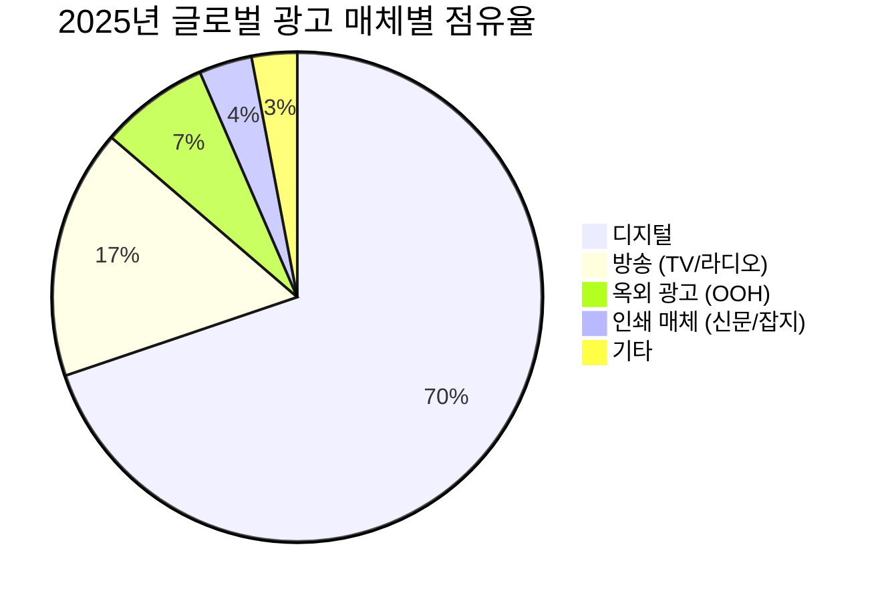
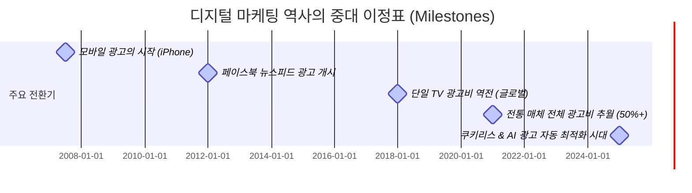

# 도서 초안 통합본: 마케팅 데이터의 거짓말

> *본 파일은 프롤로그부터 9장, 에필로그까지의 초안 원고를 하나로 합친 파일입니다. 구글 드라이브에 업로드한 후 'Google 문서'로 열어 편집하시거나 구글 독스에 복사하여 사용하실 수 있습니다.*

---

# 📍 프롤로그: 당신 회사의 마케팅은 괜찮은가요?

> *"게임 시작 30분이 지났는데 누가 호구인지 모른다면, 바로 당신이 그 호구다."*  
> — 워렌 버핏 (Warren Buffett), 1987년 버크셔 해서웨이 주주서한

---

## 호구 게임: 7,000억 달러짜리 카지노의 실상

1987년, 투자의 대가 워렌 버핏은 그의 유명한 주주서한에서 스승 벤저민 그레이엄의 우화를 인용하며 시장의 본질을 다음과 같이 묘사했습니다.

> “당신은 시장의 시세를, 개인 사업에서 당신의 파트너인 아주 친절한 ‘미스터 마켓(Mr. Market)’이라는 사람으로부터 매일 제시받는 것이라고 상상해야 한다. 미스터 마켓은 하루도 빠짐없이 나타나서, 당신의 지분을 사거나 혹은 자신의 지분을 당신에게 팔 가격을 제시한다.
> 
> 당신과 그가 함께 소유한 사업의 경제적 특성은 안정적일 수 있지만, 미스터 마켓이 제시하는 가격은 전혀 그렇지 않다. 안타깝게도 이 불쌍한 친구는 치유 불가능한 감정적 문제를 가지고 있기 때문이다.
> 
> 어떤 때 그는 지나치게 낙관적이 되어 사업에 영향을 주는 긍정적인 요소만 본다. 그런 기분일 때 그는 매우 높은 매수·매도 가격을 부르는데, 당신이 그의 지분을 덥석 사서 곧 다가올 이익을 빼앗아갈까 두려워하기 때문이다.
> 
> 반대로 어떤 때 그는 우울해져 사업과 세상 앞에 닥칠 문제만 보게 된다. 이런 경우 그는 매우 낮은 가격을 제시하는데, 당신이 자신의 지분을 그에게 떠넘길까 겁을 먹기 때문이다.
> 
> 미스터 마켓에게는 또 하나 사랑스러운 특징이 있다. 그는 무시당하는 것을 개의치 않는다. 오늘 그의 가격 제안이 당신에게 흥미롭지 않다면, 그는 내일 새로운 가격을 들고 다시 돌아온다. 거래 여부는 전적으로 당신의 선택이다.
> 
> 이런 상황에서는 그의 조울증적 행동이 심할수록 오히려 당신에게 유리하다. 하지만 무도회에 간 신데렐라처럼, 당신은 한 가지 경고를 반드시 명심해야 한다. 그렇지 않으면 모든 것이 호박과 쥐로 변해버릴 것이다.
> 
> 미스터 마켓은 당신을 위해 존재하는 것이지, 당신을 인도하기 위해 존재하는 것이 아니다. 당신에게 유용한 것은 그의 지혜가 아니라 그의 지갑이다.
> 
> 어느 날 그가 특히 어리석은 기분으로 나타난다면, 당신은 그를 무시해도 되고 이용해도 된다. 하지만 그의 영향력 아래 들어가는 것은 재앙이 될 것이다.
> 
> 실제로, 당신이 미스터 마켓보다 사업의 가치를 훨씬 더 잘 이해하고 평가할 수 있다는 확신이 없다면, 당신은 이 게임에 끼어들 자격이 없다. 포커에서 이런 말이 있다.
> 
> **‘30분 동안 게임을 했는데도 누가 호구인지 모르겠다면, 그 호구는 바로 당신이다.’**”

오늘날 7,000억 달러 규모로 팽창한 디지털 마케팅 시장은 1987년 버핏이 경고했던 자본시장보다 훨씬 더 심각한 **정보의 불균형**과 **광기**로 가득 차 있습니다. 매체사(구글, 메타 등), 대행사, 애드테크 중간상인들은 매일 아침 마케터와 경영진에게 찾아와 화려한 대시보드와 지표를 내밀며 '더 많은 예산을 쓰라'고 속삭입니다. 이들은 현대판 '미스터 마켓'입니다.

마케터들은 대시보드에 찍히는 300%, 500%의 ROAS(광고비 대비 매출액)와 수천만 건의 클릭, 다운로드 지표에 환호합니다. 그러나 경영진은 정작 회사 통장의 현금 잔고와 총매출 추이를 보며 의문에 빠집니다. *"숫자는 이렇게 좋은데, 왜 실제 매출은 늘지 않고 이익률은 떨어지는가?"*

만약 당신이 이 질문에 대한 명확한 답을 모른 채, 매체사가 설계한 룰대로 대시보드 지표를 올리기 위해 예산을 늘리고 있다면, 당신은 이미 디지털 마케팅이라는 정교한 게임에서 '호구'가 되어가고 있는 것일지 모릅니다.

---

## 숲에서 길을 잃은 거인들: 그들은 왜 총을 내려놓았는가

많은 기업이 데이터 대시보드라는 거울에 속아 천문학적인 돈을 낭비했습니다. 디지털 마케팅이 '언제나 정답'은 아님을 세상에 처음 증명한 것은 아이러니하게도 글로벌 최고의 비즈니스 거인들이었습니다.

### 이베이(eBay): 브랜드 키워드 입찰의 가짜 효과
2013년, 시카고 대학의 스티브 타델리스(Steve Tadelis) 교수 연구팀은 eBay와 함께 파격적인 실험을 진행했습니다. 구글 검색창에 'eBay'를 검색할 때 나오는 최상단 유료 광고(Brand Search Ads)를 전면 중단해 본 것입니다. 구글은 이 광고를 끄면 오가닉(무료 검색) 유입이 경쟁사에 잠식되어 큰 손실을 입을 것이라 경고했습니다.
그러나 실험 결과, 광고를 중단했음에도 불구하고 유입 트래픽과 매출은 **단 0.5%도 줄지 않았습니다.** 유저들은 유료 광고가 없어도 그 아래에 있는 오가닉 링크를 눌러 들어왔습니다. eBay는 매년 수천만 달러를 '어차피 들어왔을 유저'에게 퍼주고 있었던 것입니다.

### 우버(Uber): 1,300억 원의 광고비를 끄자 드러난 진실
2017년, 우버(Uber)의 마케팅 책임자 케빈 프리시(Kevin Frisch)는 가짜 뉴스 사이트에 우버 광고가 실린다는 제보를 받고 예산을 통제하기 시작했습니다. 의심스러운 광고 네트워크를 하나씩 끄다 보니, 결국 전체 디지털 광고 예산의 3분의 2에 해당하는 **1억 달러(약 1,300억 원)를 삭감**하게 되었습니다. 
하지만 우버의 앱 설치 수와 신규 탑승자 수에는 **아무런 변화도 없었습니다.** 광고 대행사와 플랫폼들이 대시보드에 보고한 수십만 건의 설치 성과는 실제 사용자를 데려온 것이 아니라, 이미 자발적으로 설치하려던 유저의 신호를 가로채거나(클릭 인젝션) 아예 있지도 않은 설치를 위조한(SDK 스푸핑) 가짜 지표였습니다.

### P&G: "디지털 광고 공급망은 기껏해야 불투명하고, 최악의 경우 사기다"
세계 최대의 생활용품 기업 P&G의 최고 브랜드 책임자 마크 프리차드(Marc Pritchard)는 2017년 업계를 향해 폭탄선언을 던졌습니다. 그리고 실제로 **디지털 광고 예산 2억 달러(약 2,600억 원)를 즉각 삭감**했습니다.
주변에서는 매출 급락을 걱정했지만, 결과는 정반대였습니다. 가짜 트래픽과 저품질 지면 광고를 걷어내자 비즈니스 성과는 유지되었고, 오히려 예산 낭비가 사라지면서 도달률은 10% 상승했습니다.

### 에어비앤비(Airbnb): 퍼포먼스 마케팅의 대포를 멈추다
2020년 코로나19 팬데ّم릭으로 여행 수요가 증발하자 에어비앤비(Airbnb)는 퍼포먼스 마케팅(검색 및 리타겟팅 광고) 예산을 90% 이상 삭감했습니다. 놀랍게도 그 해 트래픽의 **95%가 정상 유지**되었습니다. 에어비앤비의 고객들은 광고 링크가 아닌 '브랜드 이름'을 기억하고 직접 앱에 들어왔습니다. 이 경험을 바탕으로 에어비앤비는 퍼포먼스 지출을 완전히 줄이고 브랜드와 PR에 집중하였으며, 2022년 창사 이래 최초로 거대한 GAAP 흑자 전환에 성공했습니다.

### 아디다스(Adidas): 라스트 클릭 어트리뷰션의 눈먼 집착
글로벌 스포츠 브랜드 아디다스(Adidas)는 2019년 런던 미디어위크에서 뼈아픈 과거를 자인했습니다. 단기적인 전환과 효율 측정에 지나치게 매몰되어 마케팅 예산의 77%를 퍼포먼스 마케팅에 쏟아붓고, 브랜드 빌딩에는 단 23%만 투자했다는 사실입니다. 아디다스는 리타겟팅 광고가 즉각적인 구매를 만드는 줄 알았으나, 실제 조사를 해보니 매출의 대부분은 장기적인 브랜드 신뢰와 오프라인 충성도에서 나왔습니다. 이들은 즉시 마케팅 믹스 예산을 재조정하고 대시보드에 속았던 성과 측정 모델을 전면 수정했습니다.

### JP모건 체이스(JPMorgan Chase): 99%의 지면 삭감
2017년 3월, 미국 최대 투자은행 JP모건 체이스는 자신들의 브랜드 광고가 극우 가짜 뉴스나 음모론 사이트에 노출되는 문제를 해결하기 위해, 광고가 집행되던 **40만 개의 웹사이트를 단 5,000개로 99% 축소**했습니다. 당시 최고마케팅책임자(CMO)였던 크리스틴 렘카우(Kristin Lemkau)가 주도한 이 결단은 《뉴욕타임스(The New York Times)》와 애드테크 전문 매체 《디지데이(Digiday)》 등을 통해 대대적으로 보도되며 업계에 큰 충격을 주었습니다.
하지만 노출 지면을 99% 가까이 걷어냈음에도 불구하고, 광고비 효율과 도달 가시성(Viewability)에는 **아무런 차이가 없었습니다.** 39만 5,000개 사이트에서 집행되던 광고는 실제 사람이 아닌 봇(Bot)이나 방치된 저품질 지면에서 소모되던 낭비 예산이었음이 증명된 것입니다.

### "사기의 왕" — 메스봇(Methbot)과 3ve 사건
디지털 광고가 봇(Bot) 트래픽에 의해 얼마나 정교하게 난도질당할 수 있는지 보여준 역사상 최대의 범죄 사건입니다. 러시아 출신의 해커 알렉산드르 주코프(Aleksandr Zhukov)가 주도한 이 사기 조직은 데이터 센터에 수천 대의 서버를 돌려 가짜 웹서핑 행동을 구현하고, 전 세계 170만 대 이상의 좀비 PC를 감염시킨 봇넷(3ve)을 구축했습니다.
이들은 가짜 브라우저를 통해 유명 뉴스 매체의 도메인을 사칭(도메인 스푸핑)하여 하루 최대 **3억 건 이상의 동영상 광고 조회수**를 위조해 냈습니다. 실제 사람이 단 한 명도 보지 않은 유령 비디오 광고판을 만들어 광고주들로부터 하루 최대 300만-500만 달러의 광고비를 가로챈 것입니다. 주코프는 FBI의 국제 공조 수사로 체포되어 2021년 미국 법원에서 징역 10년형을 선고받았습니다.

### 숫자로 보는 광고 사기의 규모
이러한 광고 사기는 특수한 범죄자들만의 전유물이 아닙니다. 마케팅 업계 전체를 갉아먹는 만성 질환입니다.
*   **ANA (미국광고주협회) 보고서:** 전 세계 프로그래매틱 광고 공급망을 추적 분석한 결과, 광고주가 지출한 총비용의 **약 25% (약 220억 달러, 한화 약 30조 원)**가 광고 사기, 봇 트래픽, 저품질 MFA(Made for Advertising) 사이트에 송출되며 아무런 성과 없이 낭비되었습니다.
*   **주니퍼 리서치 (Juniper Research) 통계:** 글로벌 디지털 광고 사기 피해 규모는 매년 가파르게 상승하여, 오는 2028년에는 약 **1,720억 달러 (한화 약 230조 원)**에 육박할 것으로 전망되었습니다. 마케팅 대시보드에 기록되는 수치의 상당 비율이 허상임을 의미합니다.

### 독과점 플랫폼들의 '지표 마사지'와 법적 소송
광고주들을 보호해야 할 빅테크 플랫폼들조차 자신들의 광고 상품 가치를 부풀리기 위해 지표를 조작했다는 혐의로 잇따라 소송에 휘말렸습니다.
*   **메타(페이스북) 비디오 조회수 조작 소송:** 메타는 비디오 광고의 평균 시청 시간을 **60%에서 80%가량 부풀려 제공**했습니다. 이를 통해 수많은 광고주가 유튜브가 아닌 페이스북에 비디오 광고비를 집중하도록 유도했으며, 결국 광고주들의 집단 소송으로 수천만 달러의 합의금을 물어내야 했습니다.
*   **구글 애드센스 및 PMax 반독점 소송:** 구글은 광고주들의 예산이 저품질 스팸 광고 웹사이트(MFA)로 흘러가도록 방치하고 중개 수수료를 불투명하게 갈취했다는 혐의로 미국 법무부(DOJ)를 포함한 다수의 기관으로부터 반독점 소송을 당해 재판에 직면해 있습니다.

---

## 전선을 끊어버린 자들: 데이터 없이 세상을 움직이는 메커니즘

그렇다면 디지털 마케팅은 무용지물이며, 우리는 과거의 TV와 신문 광고 시대로 돌아가야 할까요? 결코 아닙니다. 디지털 환경을 올바르게 이해하고 데이터를 왜곡 없이 활용했을 때, 기업은 그 어떤 시대보다 폭발적인 속도로 성장할 수 있습니다.

조나 버거(Jonah Berger) 와튼스쿨 교수는 그의 저서 《컨테이저스: 전략적 입소문(Contagious: Why Things Catch On)》에서 사람들이 자발적으로 디지털 공간에서 이야기를 공유하고 전파하게 만드는 6가지 핵심 법칙, 즉 **'STEPPS 프레임워크'**를 제시했습니다.

*   **Social Currency (사회적 화폐):** 사람들이 그것을 공유함으로써 자신이 스마트하거나 매력적으로 보이게 만드는 가치.
*   **Triggers (계기):** 일상 속에서 해당 브랜드를 자연스럽게 떠올리게 만드는 환경적 신호.
*   **Emotion (감성):** 공유하고 싶은 강한 감정(경외감, 분노, 열정, 유머)을 자극하는 것.
*   **Public (대중성):** 행동이 눈에 잘 띄어 남들도 쉽게 모방할 수 있게 설계하는 구조.
*   **Practical Value (실용적 가치):** 타인에게 유용한 정보나 실질적인 혜택을 제공하는 콘텐츠.
*   **Stories (이야기):** 브랜드 메시지를 흥미진진한 플롯 속에 내포하여 자연스럽게 전달하는 내러티브.

전통적인 퍼포먼스 광고의 픽셀 트래킹 없이도, 이 입소문의 디지털 메커니즘을 극대화하여 조 단위의 비즈니스를 일궈낸 사례들이 존재합니다.

### 달러 쉐이브 클럽(Dollar Shave Club)
2012년, 면도날 정기 구독 서비스인 달러 쉐이브 클럽은 단돈 4,500달러를 들여 CEO 마이클 더빈이 직접 출연한 B급 감성의 유머러스한 유튜브 영상을 제작했습니다. 이 영상은 론칭 하루 만에 서버를 다운시켰고, 48시간 만에 12,000건의 주문을 확보했습니다. 대시보드를 두드리는 리타겟팅 광고 대신, 고객의 감성을 건드려 공유하게 만든 **'사회적 화폐'와 '이야기'의 힘**이었습니다. 이들은 설립 4년 만에 유니레버에 10억 달러(약 1조 2,000억 원)에 인수되었습니다.

### 한국의 메가 바이럴 케이스: APR의 메디큐브(Medicube)
대한민국의 뷰티 테크 기업 **APR(에이피알)**은 천문학적인 전통 TV 광고나 모바일 타겟팅 지표에 목매는 대신, 철저하게 디지털 생태계의 입소문 메커니즘을 지능적으로 활용했습니다. 
메디큐브의 홈 뷰티 디바이스는 가식적인 연출 대신 인플루언서들이 스마트폰 전면 카메라로 피부 변화 과정을 초밀착하여 솔직하게 보여주는 숏폼 비디오 콘텐츠를 주 무기로 삼았습니다. '실용적 가치(피부 개선 팁)'와 '대중성(직관적인 전후 비교)'을 결합한 비디오는 틱톡과 인스타그램 릴스를 타고 빠르게 바이럴을 탔습니다. 소비자가 자발적으로 댓글을 달고 링크를 카카오톡방에 공유하는 과정에서 어떠한 트래킹 데이터 낭비 없이 순수 오가닉 수요가 창출되었습니다. APR은 이 강력한 디지털 WOM(Word of Mouth)을 지렛대 삼아 글로벌 뷰티 시장에서 급격히 성장했고, 국내 뷰티 테크 기업 최초로 조 단위 기업가치로 상장(IPO)에 성공했습니다.

---

## 우리가 던져야 할 유일한 질문

디지털 마케팅은 무소불위의 마법 지팡이가 아닙니다. 제대로 질문하고 감시하지 않는다면 마케팅 비용은 빅테크의 호주머니와 가짜 봇들의 잔치로 흘러 들어가 사라집니다.

이 책은 단순히 광고 사기의 기법을 폭로하려는 기술서가 아닙니다.
*   **광고비를 직접 집행하고 의사결정을 내리는 마케터(CMO)**
*   **마케팅 예산을 승인하고 재무 건전성을 확보해야 하는 재무 책임자(CFO)**
*   **회사의 지속 가능한 장기적 성장을 책임지는 최고경영자(CEO)**

이 세 부류의 독자가 대시보드 뒷면의 진짜 데이터 생태계를 이해하고, **"우리 예산이 진짜 비즈니스를 움직이는 인과관계와 증분(Incrementality)에 사용되고 있는가?"**라는 질문을 스스로 던질 수 있도록 돕는 실전 데이터 리터러시 가이드입니다. 

자, 이제 미스터 마켓이 숨겨둔 주사위의 비밀을 파헤칠 시간입니다.

---

## 📚 참고자료

### 주요 학술 논문 및 실증 연구
*   Blake, T., Nosko, C., & Tadelis, S. (2015). Consumer Heterogeneity and Paid Search Effectiveness: A Large Scale Field Experiment. *Econometrica*, 83(1), 155-174. (eBay 브랜드 검색 광고 실험 원문)
*   Tadelis, S. (2016). The Economic Effects of Paid Search Advertising. *National Bureau of Economic Research (NBER)*.

### 보도 기사 및 보고서
*   "United States v. Aleksandr Zhukov (Methbot/3ve case): Defendant sentenced to 10 years in prison for multi-million dollar ad fraud scheme." *U.S. Department of Justice Press Release* (2021년 11월).
*   "ANA Programmatic Media Supply Chain Transparency Study." *Association of National Advertisers (ANA)* (2023년).
*   "Ad Fraud: Key Trends, Competitor Leaderboard & Market Forecasts 2023-2028." *Juniper Research* (2023년).
*   "Uber's Kevin Frisch on cutting $100M in ad spend with no impact." *The Hustle* (2020년 7월).
*   "Marc Pritchard’s landmark speech at the IAB Annual Leadership Meeting." *IAB Official Transcript / Digiday* (2017년 1월).
*   "JPMorgan Chase slashed its programmatic reach from 400,000 sites to 5,000." *Digiday* (2017년 3월).
*   "Airbnb reports first full year of profitability after shifting focus from performance marketing." *TechCrunch / Airbnb Earnings Report* (2022-2023).
*   "How Adidas realized it was over-investing in performance marketing." *Marketing Week* (2019년 10월).
*   "Meta faces class action lawsuit over video ad metrics inflated by up to 80%." *Reuters / Wall Street Journal* (2018년 10월).
*   "Department of Justice files antitrust suit against Google over ad tech monopoly." *U.S. Department of Justice Official Press* (2023-2024).

### 단행본
*   Berger, J. (2013). *Contagious: Why Things Catch On.* Simon & Schuster. (조나 버거의 컨테이저스 원서)
*   Hoffman, B. (2018). *BadMen: How Advertising Went From a Minor Annoyance to a Major Menace.* Type A Group.
*   Hwang, T. (2020). *Subprime Attention Crisis: Advertising and the Time Bomb at the Heart of the Internet.* FSG Originals.


<!-- PAGE_BREAK -->

---

# 1장. 우리가 '클릭'에 1,000조 원을 바치는 이유

> *"디지털 마케팅을 이해한다는 것은 현대 인류가 정보를 소비하고 의사결정을 내리는 방식의 전체 지형도를 파악하는 것과 같다."*

---

## 1-1. 디지털 마케팅의 위상: 글로벌과 국내 시장의 영토

오늘날 디지털 마케팅은 광고 산업의 주변부가 아닌 **핵심 심장부**다. 기업이 마케팅 예산을 수립할 때 가장 먼저, 그리고 가장 큰 비중으로 고려하는 것은 디지털 광고 지출이다. 2025년에서 2026년에 이르는 현재 시장 지표들은 디지털 마케팅 시장의 압도적인 규모를 직관적으로 증명한다.

*   **글로벌 디지털 마케팅 시장:** 약 **7,400억 달러 (한화 약 990조 원)** 규모에 도달했다. 이는 전체 광고 시장의 약 70%에 달하는 수치로, 인류 역사상 그 어떤 단일 미디어 환경도 달성하지 못한 압도적 점유율이다.
*   **미국(US) 디지털 마케팅 시장:** 세계 최대의 단일 광고 시장인 미국은 디지털 광고 지출만 약 **3,100억 달러 (한화 약 410조 원)**를 기록하고 있다. 전 세계 디지털 광고 예산의 40% 이상이 미국 시장 한 곳에서 소비된다.
*   **한국 디지털 마케팅 시장:** 한국의 디지털 광고 시장 규모는 약 **9조 5,000억 원**을 넘어섰다. 국내 전체 광고 시장(약 16조 원)의 **약 60%**를 차지하며, 방송(TV/라디오), 인쇄(신문/잡지), 옥외(OOH) 광고비 전체를 합친 것보다 더 큰 영토를 구축하고 있다.

과거 광고 시장의 절대 강자였던 TV, 신문, 라디오 등의 전통 매체(레거시 미디어)는 이제 디지털 마케팅의 보조 채널 수준으로 격하되었다. 2025년 기준 글로벌 광고 매체별 점유율을 대조해 보면 이 판도의 변화가 극명하게 드러난다.

### 📊 2025년 글로벌 광고 매체별 점유율 비교

| 매체 구분 | 세부 매체 | 글로벌 점유율 (%) | 한국 점유율 (%) | 주요 특징 |
|---|---|---|---|---|
| **디지털 (Digital)** | 검색, 소셜, 비디오, 디스플레이, 리테일 미디어 등 | **69.8%** | **59.4%** | 실시간 타겟팅, 측정 가능성, AI 자동화 |
| **방송 (Broadcast)** | 지상파 TV, 케이블 TV, 라디오 | **16.5%** | **18.2%** | 광범위한 도달률, 브랜드 신뢰도, 지속적인 시청률 하락 |
| **옥외 (OOH/DOOH)** | 빌보드, 지하철 광고, 버스 광고 등 | **7.2%** | **13.5%** | 물리적 공간 노출, 디지털 옥외광고(DOOH)로의 전환 추세 |
| **인쇄 (Print)** | 신문, 잡지 | **3.5%** | **6.1%** | 지면 신뢰도, 정기 구독자 중심, 급격한 지출 감소 |
| **기타** | 제작비, 이벤트, 다이렉트 메일 등 | **3.0%** | **2.8%** | 프로모션 및 B2B 대면 마케팅 중심 |



---

## 1-2. 20년간의 급격한 성장: 골리앗을 넘어뜨린 다윗

2000년대 초반만 해도 인터넷 배너 광고는 TV와 신문 광고의 뒷전에서 구걸하던 변두리 매체에 불과했다. 그러나 스마트폰의 보급과 초고속 이동통신 기술, 빅데이터 및 머신러닝의 발전은 지난 20년간 광고 시장의 권력 구도를 완벽하게 뒤바꾸었다.

그 역사적 정점은 **2019-2020년**이었다. 이 시기 디지털 광고비는 전 세계적으로 전통 매체 전체 합산 지출액을 공식적으로 추월(Crossover)했다. TV 광고를 단일 매체로 꺾은 시점은 이보다 훨씬 빠른 2017년이었다.

### 📈 지난 20년간 매체별 광고 지출 추이 (글로벌 기준, 단위: 억 달러)

| 연도 | 디지털 광고비 | 전통 매체 광고비 (TV/신문/라디오 등 합산) | 전통 대비 디지털 비중 (%) | 주요 역사적 사건 |
|---|---|---|---|---|
| **2005** | 250 | 3,900 | 6.0% | 구글 애드센스 정착, 검색 광고 활성화 |
| **2010** | 720 | 4,200 | 14.6% | 아이폰 출시 후 모바일 광고 여명기 |
| **2015** | 1,700 | 4,500 | 27.4% | 페이스북 모바일 광고 엔진 폭발적 성장 |
| **2017** | **2,280** | **1,780 (단일 TV)** | **TV 단일 추월** | 디지털 광고비, 단일 매체 1위였던 TV 광고비 최초 추월 |
| **2020** | **3,780** | **3,100 (전체 합산)** | **54.9% (전체 추월)** | 팬데믹 특수로 디지털 광고 지출이 전통 미디어 전체 합산액 추월 |
| **2025** | 7,400 | 3,200 | 69.8% | AI 기반 자동 최적화 광고(PMax, Advantage+) 독점기 |



---

## 1-3. 데이터 문해력 자가 진단: 당신의 데이터 지능(LQ)은 침팬지보다 높은가?

매년 기업들은 "우리는 데이터 기반(Data-driven) 의사결정을 내린다"고 선언하며 천문학적인 금액을 IT 시스템과 마케팅 대시보드 구축에 쏟아붓는다. 하지만 정작 대시보드 뒤에 앉아 있는 인간의 데이터 문해력(Data Literacy)이 오염되어 있다면 어떻게 될까? 잘못 설계된 나침반을 들고 전속력으로 항해하는 것과 다름없다.

이 책을 더 읽어나가기 전에, 한스 로슬링(Hans Rosling)이 설계한 전 세계인 대상의 인지 오류 테스트와 실무 마케팅 지표의 함정들을 결합한 **'글로벌 데이터 리터러시 진단 테스트 10문항'**을 직접 풀어보기 바란다. 

참고로, 무작위로 번호를 찍는 **침팬지의 평균 정답률은 33.3%**이다. 당신의 점수는 침팬지보다 높을까?

---

### 📝 [데이터 리터러시 & 마케팅 인지 오류 테스트 10문항]

#### Q1. (인구) 지난 20년간 전 세계 인구 중 극도로 빈곤한 상태(극빈층)에 사는 사람들의 비율은 어떻게 변했을까요?
*   A) 거의 두 배로 늘었다.
*   B) 거의 비슷하게 유지되었다.
*   C) 거의 절반으로 줄었다.

#### Q2. (교육) 오늘날 전 세계 30세 남성은 평균 10년간 학교에 다녔습니다. 그렇다면 같은 나이의 여성은 평균 몇 년간 학교에 다녔을까요?
*   A) 9년
*   B) 6년
*   C) 3년

#### Q3. (재해) 지난 100년간 전 세계적으로 매년 자연재해로 사망하는 사람의 수는 어떻게 변했을까요?
*   A) 두 배 이상 늘었다.
*   B) 거의 비슷하게 유지되었다.
*   C) 절반 이하로 줄었다.

#### Q4. (보건) 오늘날 전 세계 1세 아동 중 어떤 질병이든 백신 예방접종을 받은 아동의 비율은 얼마나 될까요?
*   A) 20%
*   B) 50%
*   C) 80%

#### Q5. (인구 추이) UN의 인구 예측에 따르면, 2100년 세계 인구는 지금보다 약 40억 명이 더 늘어날 전망입니다. 이 증가의 가장 주된 원인은 무엇일까요?
*   A) 15세 미만 아동 수의 급격한 증가
*   B) 15세 이상 성인 수의 증가 (기존 세대의 고령화 및 기대수명 연장)
*   C) 출산율의 급격한 반등

#### Q6. (상관관계) 한 도시의 통계를 조사한 결과, '아이스크림 매출'이 증가할 때마다 해수욕장의 '익사 사고 발생 건수'가 명확하게 정비례하여 증가했습니다. 이 데이터를 바탕으로 내릴 수 있는 올바른 의사결정은 무엇일까요?
*   A) 시민들의 안전을 위해 즉시 도시 내 아이스크림 판매를 규제한다.
*   B) 아이스크림 매출이 늘어나면 익사 사고를 막기 위해 구조요원을 추가 배치한다.
*   C) 두 지표는 직접적인 인과관계가 없으므로 공통 원인인 '여름철 기온 상승'을 관리한다.

#### Q7. (인과관계) 우리 영업팀 데이터 분석 결과, '삭발을 한(대머리인) 세일즈맨'들의 평균 영업 성과가 일반 머리카락을 가진 세일즈맨보다 13% 우수한 것으로 나타났습니다. 매출을 높이기 위해 팀 전체원들에게 단체 삭발을 강제해야 할까요?
*   A) 그렇다. 데이터가 증명하므로 즉시 삭발을 강제하여 성과를 높인다.
*   B) 아니다. 대머리 세일즈맨이 우수한 성과를 낸 것은 연령대와 경력(숙련도)이 높았기 때문이므로, 인과 관계가 아닌 상관관계에 따른 편향이다.
*   C) 알 수 없다. 영업 성과는 머리카락 길이에 비례하므로 머리를 더 기르게 한다.

#### Q8. (비용) 글로벌 광고주 협회(ANA)와 PwC의 실측 조사에 따르면, 광고주가 지출한 디지털 광고비 1달러 중 온전히 소비자가 보는 매체 지면에 닿아 기여하는 '유효 매체 비용(Working Media)'은 대략 몇 % 수준일까요?
*   A) 70% 이상
*   B) 50% 수준
*   C) 30% 이하 (나머지는 수수료와 무효 트래픽으로 유실)

#### Q9. (카니발라이제이션) 2015년 이베이(eBay) 연구원들이 구글 검색창에서 자사 키워드("eBay") 광고를 완전히 끄는(Pause) 실험을 전개했을 때, 유료 검색 광고를 타고 오던 트래픽 중 자연 검색(Organic Search) 결과로 대체되어 들어온 트래픽 비율은 얼마였을까요?
*   A) 10% 미만 (나머지 90%는 경쟁사로 유출됨)
*   B) 50% 수준
*   C) 99.5% (광고를 꺼도 자연 클릭으로 거의 완벽하게 대체됨)

#### Q10. (통계의 함정) 모바일 광고 캠페인에서 국가 전체 통계로는 A 광고 시안의 전환율(CVR)이 B 시안을 크게 압도했습니다. 그러나 각 유입 기기(iOS, Android)별로 쪼개어 정밀 분석해 본 결과, 두 기기 모두에서 B 시안의 전환율이 오히려 더 높게 나타났습니다. 이 기이한 통계적 모순을 무엇이라 부를까요?
*   A) 확증 편향 (Confirmation Bias)
*   B) 심슨의 역설 (Simpson's Paradox)
*   C) 생존자 편향 (Survivorship Bias)

---

### 🔑 [정답 및 해석]

*   **Q1 ~ Q5 정답: C / A / C / C / B**
    *   **해설:** 한스 로슬링의 글로벌 인지 오류 테스트 결과입니다. 우리는 미디어가 쏟아내는 자극적인 정보와 극적인 세계관에 갇혀 세상을 실제보다 훨씬 더 비관적이고 낙후된 곳으로 오해합니다. 전 세계 오피니언 리더, 노벨상 수상자들조차 이 테스트의 정답률이 **침팬지(33%)보다 낮은 10~15%**에 머물렀습니다.
*   **Q6 ~ Q7 정답: C / B**
    *   **해설:** 상관관계(Correlation)와 인과관계(Causality)의 전형적인 혼동 사례입니다. 기온 상승이라는 교란 변수(Confounding Variable)와 경력/연령대라는 누락 변수(Omitted Variable)를 통제하지 않고 데이터를 표면적으로만 해석하면 잘못된 규제나 단체 삭발 강요 같은 황당한 경영 의사결정으로 이어집니다.
*   **Q8 ~ Q9 정답: C / C**
    *   **해설:** 이 책의 핵심 주제입니다. 매년 수십조 원의 마케팅비가 애드테크 수수료(Tech Tax)와 봇 사기 트래픽으로 중간에 70%가 증발하고 있으며, 자사 브랜드 광고는 자연 검색을 잠식(카니발라이제이션)하는 돈 낭비에 불과함을 보여줍니다.
*   **Q10 정답: B**
    *   **해설:** 전체 그룹의 비율 가중치 차이 때문에 하위 그룹별로 분석했을 때의 결론이 전체 집계 시 뒤집히는 **'심슨의 역설'** 현상입니다. 기기별 가중치 불균형을 고려하지 않고 대시보드 합계 데이터만 보고 결정을 내렸다가는 완전히 상반된 잘못된 소재를 선택하는 오류를 범하게 됩니다.

> **💡 자가 진단 결과 요약:**
> *   **8 ~ 10문제 정답:** 데이터 문해력이 탁월한 지능적 의사결정자.
> *   **4 ~ 7문제 정답:** 보편적인 오피니언 리더 수준. 대시보드의 숫자에 속기 쉬운 상태.
> *   **0 ~ 3문제 정답:** **침팬지 이하 수준.** 당장 눈앞의 데이터 마케팅 보고서를 의심하고 이 책의 다음 장을 치열하게 정독해야 합니다.

---

## 1-4. Big Tech의 지배: 마케팅 제국을 지배하는 5대 거인

전통 광고 시대에는 수천 개의 TV 채널, 라디오 방송국, 신문사가 광고 예산을 나누어 가졌다. 그러나 디지털 마케팅 시대는 극단적인 **승자독식(Winner-takes-all)** 구조다. 전 세계 디지털 광고비의 절반 이상을 단 3-5개의 빅테크 기업이 독식하고 있으며, 이들을 흔히 **'듀오폴리(Duopoly)'** 혹은 **'트리오폴리(Triopoly)'**라고 부른다.

특히 이 거인들의 내부는 사업부별로 성격이 완전히 다른 거대한 광고 플랫폼들로 쪼개져 작동한다.


### 1. Alphabet (Google) — 검색, 모바일, 그리고 유튜브의 입체적 지배
구글은 디지털 마케팅의 탄생과 성장을 주도한 황제다. 구글의 광고 비즈니스는 크게 세 가지 기둥으로 나뉜다.
*   **Google Search (검색 광고):** 구글의 본진이다. 사용자가 명확한 구매 의도를 가지고 검색창에 단어를 입력할 때 노출하는 검색 광고(SA) 시장을 90% 이상 독점하고 있다.
*   **Android & Mobile Eco-system (구글 UAC/디스플레이):** 안드로이드 운영체제와 구글 플레이스토어를 장악하여, 수백만 개의 모바일 앱 내부에 디스플레이 광고(DA)를 실시간 입찰 시스템(RTB)으로 송출한다.
*   **YouTube (유튜브 동영상 광고):** 전 세계 최대의 동영상 스트리밍 플랫폼으로, 전통 TV 광고 예산을 가장 빠르게 빨아들이는 블랙홀이다. 범퍼 광고, 프리롤 광고 등 동영상 광고 시장을 완전히 장악했다.

### 2. Meta — 타겟팅의 절대자, 페이스북과 인스타그램
메타는 사용자의 인구통계학적 정보(성별, 나이, 지역)뿐만 아니라 관심사, 행동 패턴 데이터를 추적하여 '가장 구매할 확률이 높은 개인'을 정교하게 찾아내는 타겟팅 광고의 절대 강자다.
*   **Facebook (페이스북):** 30대 이상의 중장년층과 글로벌 지역에서 막강한 도달률을 자랑하는 매체다. 정교한 행동 데이터 수집의 근간이 된다.
*   **Instagram (인스타그램):** 이미지와 숏폼(릴스) 중심의 플랫폼으로, 전 세계 MZ세대의 트렌드와 이커머스 구매 전환을 주도하는 가장 강력한 퍼포먼스 광고 매체다.

### 3. Amazon — 구매 시점의 강력한 장악 (리테일 미디어)
아마존은 사용자가 제품을 '검색하고 바로 구매 결제를 진행하는' 최종 이커머스 시점에 광고를 노출한다. 구글이 정보 탐색 단계이고 메타가 발견 단계라면, 아마존은 바로 지갑을 여는 순간을 장악한다. 이른바 **리테일 미디어 네트워크(RMN)**의 선두주자로서 연간 500억 달러에 달하는 광고 매출을 올리고 있다.

### 4. ByteDance (TikTok) — 숏폼 바이럴의 신흥 강자
틱톡은 15초-1분 미만의 세로형 숏폼 비디오 트렌드를 선도하며 Z세대의 주의력(Attention)을 독점했다. 트렌드 전파 속도가 빠르고 바이럴 파급력이 커 신규 브랜드 유입 및 인지도 확장 플랫폼으로 급부상했다.

### 5. Apple — 사생활 보호 장벽 뒤의 반사이익
애플은 광고 지면을 직접 많이 소유하진 않았지만, iOS 운영체제의 지배자다. 2021년 애플이 단행한 **ATT(App Tracking Transparency, 앱 추적 투명성)** 정책은 라이벌인 메타와 구글의 타겟팅 해상도를 강제로 낮추어 버렸고, 그 틈을 타 애플 자체의 '서치 애드(Search Ads)' 매출을 수배 이상 폭발적으로 성장시켰다.

---

## 📚 참고자료

### 시장 통계 및 학술 데이터
*   eMarketer / Insider Intelligence. (2025). *Global Digital Ad Spend Report 2025-2026.*
*   IAB (Interactive Advertising Bureau). (2025). *US Ad Revenue Report FY 2025.*
*   KOBACO (한국방송광고진흥공사). (2025). *방송통신광고비조사 보고서 (2025-2026).*
*   Zenith Media. (2024). *Advertising Expenditure Forecasts.*

### 업계 분석 리포트
*   Gartner. (2025). *State of Marketing Budget and Strategy Report.*
*   Jounce Media. (2024). *The State of the Programmatic Supply Chain: RMNs and the Triopoly.*
*   Apple Inc. (2021). *App Tracking Transparency (ATT) Implementation Whitepaper.*


<!-- PAGE_BREAK -->

---

# 2장. 디지털 마케팅과 애드테크란 무엇인가?

> *"빅테크 플랫폼과 대행사들은 일부러 복잡한 기술적 전문용어의 장벽을 높이 세운다. 장벽이 높을수록 광고주가 성과를 깊이 파헤치거나 예산을 삭감하기 어렵기 때문이다."*

---

## 2-1. 디지털 마케팅의 기초: 고객 여정 흐름과 마케팅의 간단한 종류

디지털 마케팅의 본질은 간단하다. 고객이 제품을 전혀 모르는 **'인지(Awareness)'** 단계에서부터, 제품에 흥미를 느끼고 정보를 탐색하는 **'고려(Consideration)'** 단계를 거쳐, 최종적으로 지갑을 열어 결제하는 **'전환(Conversion)'** 및 재구매하는 **'유지(Retention)'** 단계에 이르기까지의 모든 여정(Customer Journey)을 디지털 지면에서 유도하는 것이다.

이를 위해 브랜드들은 유료 채널 광고(Paid Media), 자체 소유 웹사이트나 소셜 채널(Owned Media), 언론 보도나 유저들의 자발적인 바이럴 입소문(Earned Media)의 세 가지 영역을 넘나들며 마케팅을 전개한다. 이 전체 과정이 매끄럽게 맞물려 돌아갈 때 비로소 디지털 마케팅의 톱니바퀴가 굴러가기 시작한다.

---

## 2-2. 클릭과 트래픽은 어떻게 돈이 되나요?: 과금 모델의 본질과 숨겨진 결함

디지털 광고비를 구글이나 메타에 낼 때, 우리는 어떤 조건으로 돈을 주겠다고 약속하는가? 크게 3가지 방식이 있다.

*   **CPM (Cost Per Mille - 노출당 과금):** 광고가 화면에 **1,000번 노출**될 때마다 돈을 낸다. 
    *   *쉽게 이해하기:* 아파트 단지 우편함에 전단지 1,000장을 넣는 대가로 배달원에게 수수료를 주는 것과 같다. 주민들이 전단지를 읽었는지, 혹은 그냥 쓰레기통에 버렸는지는 관심이 없다. 오직 '우편함에 들어갔는가(화면에 떴는가)'만 본다.
*   **CPC (Cost Per Click - 클릭당 과금):** 광고를 **클릭해서 우리 사이트에 들어올 때**만 돈을 낸다.
    *   *쉽게 이해하기:* 대형마트 시식 코너다. 지나가는 사람이 고기를 구경하는 건 공짜다. 하지만 이쑤시개로 고기 한 점을 집어 입에 넣는 순간(클릭하는 순간) 비용이 청구된다.
*   **CPA (Cost Per Action - 성과당 과금):** 광고를 통해 들어온 유저가 회원가입, 앱 설치, 혹은 실제 **구매 결제(Action)를 완료**했을 때만 돈을 준다.
    *   *쉽게 이해하기:* 부동산 중개 수수료다. 집을 구경하거나 문의전화를 건 사람에게는 돈을 주지 않는다. 오직 실제 계약서에 도장을 찍었을 때만 성공 보수를 지급한다.

언뜻 CPA가 광고주에게 가장 안전하고 이득처럼 보인다. 성과가 날 때만 비용을 내니까 말이다. 하지만 사기꾼들은 CPM에서는 사람 눈에 보이지 않는 1x1 픽셀 광고판으로 노출수를 부풀려 돈을 훔치고, CPC에서는 컴퓨터 프로그램 봇(Bot)으로 가짜 클릭을 날려 돈을 가로채며, CPA에서는 어차피 가입하려던 자연 유입 고객의 뒤통수를 쳐서 자기가 데려왔다고 사기를 친다. 애드테크 세계에 안전한 과금 모델이란 존재하지 않는다.

---

## 2-3. 디지털 마케팅의 5대 유형과 메커니즘

디지털 마케팅은 목적과 도구에 따라 크게 5가지 유형으로 구분된다. 

### 1. 검색 마케팅 (SA, Search Advertising)
소비자가 구글이나 네이버에 '유기농 사료'를 검색할 때, 그 단어와 관련된 광고주의 웹사이트 링크를 최상단에 노출하고 클릭당 과금(CPC)을 청구하는 방식이다. 백화점 안내 데스크 바로 옆에 가게를 차려두고, 특정 물건을 찾는 고객에게 우리 가게 카탈로그를 쥐여주는 것과 같이 효율이 매우 높다.

### 2. 디스플레이 광고 (DA, Display Advertising)
언론사 뉴스 기사 지면이나 모바일 앱 하단에 배너 이미지, 텍스트 형태로 노출되는 광고다. 사용자의 이마에 '어제 가전제품 쇼핑을 한 사람'이라는 보이지 않는 꼬리표를 붙여놓고, 그 꼬리표를 읽어내어 골목길 벽면 광고판을 컴퓨터 할인 배너로 순간적으로 교체하여 보여주는 방식이다.

### 3. 소셜 미디어 마케팅 (SMM, Social Media Marketing)
인스타그램, 페이스북 등에서 브랜드 계정을 운영하거나 유저들의 피드 사이에 광고 콘텐츠를 노출하는 방식이다. 동네 사랑방 대화에 자연스럽게 끼어들어 "요즘 이 화장품이 유행이라던데 써보셨어요?"라고 입소문을 넌지시 흘리는 관계 중심 마케팅이다.

### 4. 비디오 마케팅 (Video Marketing)
유튜브 영상 시작 전 나오는 광고나 틱톡, 릴스 등 숏폼 동영상을 활용해 시각적 자극을 극대화하는 방식이다. 영화관에서 영화 상영 직전 강제로 불을 끄고 몰입도 높은 예고편을 틀어주어 관객들의 시선을 완전히 가두는 행위와 유사하다.

### 5. 이메일 & CRM 마케팅 (Customer Relationship Management)
이미 가입했거나 구매한 이력이 있는 회원들의 연락처(이메일, 카카오톡 알림톡, 앱 푸시)를 통해 개인화된 혜택을 발송하여 재구매(Retention)를 유도하는 마케팅이다. 우리 가게에 한 번 들렀던 단골손님에게 직접 전화를 걸어 "지난번에 사가셨던 원두가 떨어질 때쯤 되었는데 마침 새 원두가 들어왔습니다"라고 챙겨주는 친근한 관리 기법이다.

---

## 2-4. 이 카지노에는 누가 참여하고 있나?: 애드테크 생태계의 기계들

사용자가 웹페이지나 앱을 켜서 빈 광고 칸에 배너 광고가 뜨기까지는 단 **0.1초(100ms)**가 걸린다. 이 찰나의 순간에 보이지 않는 기계들의 실시간 경매가 벌어진다.

```
[광고주] ──▶  DSP (구매 자동화기) ──┐
                                     ├─▶ Ad Exchange (실시간 경매장)
[매체사] ──▶  SSP (판매 자동화기) ──┘        (0.1초 RTB 경매 완료 후 노출)
```

*   **DSP (Demand-Side Platform - 광고주 대리인):** 광고주가 예산을 충전하고 *"강남구에 사는 30대 여성이 접속하면 화장품 배너를 10원에 낙찰받아줘"*라고 명령을 내리는 **'구매 자동기계'**다.
*   **SSP (Supply-Side Platform - 매체사 대리인):** 신문사나 블로그 운영자가 *"내 사이트 빈 광고판의 최저 낙찰가는 5원이야. 이 가격 이상으로 살 대상을 찾아봐"*라고 지면을 올려두는 **'판매 자동기계'**다.
*   **Ad Exchange (광고 거래소):** 주식 거래소와 같다. 수만 대의 DSP(구매기)와 SSP(판매기)가 이 디지털 거래소에 접속해 실시간으로 매물을 주고받는다.
*   **RTB (Real-Time Bidding - 실시간 입찰):** 사용자가 웹페이지를 여는 0.1초 동안, Ad Exchange 내에서 수많은 DSP들이 *"내가 7원에 살게!", "내가 8원에 살게!"* 경쟁 입찰을 벌여 최고가를 제시한 브랜드의 광고를 사용자 화면에 띄우는 실시간 경매 메커니즘이다.

이 모든 중개 단계를 거칠 때마다 광고주가 낸 예산의 절반가량이 통행세(수수료)로 뜯겨 나간다. 이 애드테크 복잡계 자체가 거대한 비용 누수 카지노와 다름없다.

---

## 2-5. 애널리틱스(Analytics)란 무엇인가?: 웹 브라우저 뒤의 기록관

마케터가 광고를 집행하면, 유저들이 실제로 홈페이지에 들어와서 어떤 행동을 했는지 기록해야 한다. 이 유저들의 발자국을 추적해 통계를 보여주는 도구를 **'웹 애널리틱스(Web Analytics)'**라고 부르며, 구글 애널리틱스(GA4)가 전 세계 표준으로 쓰인다.

애널리틱스는 홈페이지 소스 코드 내부에 '추적 코드(스크립트)'를 삽입하여 작동한다. 유저가 마우스로 스크롤을 내리거나, 장바구니 버튼을 누르거나, 결제를 완료할 때마다 이 추적 코드가 서버로 실시간 신호(Event)를 쏘아 올린다. 이 신호들이 쌓여 대시보드에 그래프와 표로 표현되며, 마케터들은 이 데이터를 바탕으로 "이 광고를 타고 들어온 손님들이 물건을 많이 샀구나" 판단하게 된다.

---

## 2-6. 그래서 어떻게 측정하나?: 쿠키와 쿠키리스, 그리고 모바일 MMP

데이터를 측정하고 광고 효과의 주인공(Attribution)을 찾기 위해 애드테크가 사용하는 추적 기지는 크게 두 가지다.

### 1. 웹 브라우저의 기억장치: 쿠키(Cookie)
쿠키는 웹사이트가 방문자의 브라우저(크롬, 사파리 등)에 저장해 두는 아주 작은 텍스트 파일이다.
*   **퍼스트 파티 쿠키(1st Party Cookie):** 사용자가 방문 중인 사이트(예: 쇼핑몰)가 직접 굽는 쿠키로, 로그인 세션을 유지하거나 장바구니에 담은 물건을 기억하는 데 쓰인다.
*   **서드 파티 쿠키(3rd Party Cookie):** 사용자가 방문한 사이트가 아닌 제3자(구글, 메타 등 광고 네트워크)가 구워서 사용자 브라우저에 몰래 심어두는 쿠키다. 이를 통해 유저가 이 사이트 저 사이트를 돌아다니며 구경한 쇼핑 내역을 몰래 추적하여 따라다니는 리타겟팅 광고가 가능했다. 
*   **쿠키리스(Cookie-less) 시대:** 사생활 침해 논란으로 애플 사파리와 구글 크롬이 이 서드 파티 쿠키를 차단하면서 기존의 추적 마케팅이 붕괴하였고, 대안으로 서버끼리 데이터를 통신하는 CAPI(전환 API)가 대두되었다.

### 2. 모바일 앱의 심판관: MMP (Mobile Measurement Partner)
모바일 앱 환경은 웹과 달리 브라우저 쿠키를 쓸 수 없다. 따라서 앱의 설치가 구글 광고 덕분인지 메타 광고 덕분인지 판정해 줄 독립적인 심판관이 필요한데, 이를 **MMP(모바일 측정 파트너, 앱스플라이어 등)**라고 한다.
스마트폰에 고유하게 부여된 광고 식별자(ADID/IDFA)를 이용해 매체 광고 클릭 기록과 실제 앱 설치 신호를 대조하여 기여도를 판정한다. 이 역시 애플의 개인정보 보호 조치(iOS ATT)로 광고 식별자 수집이 막히며 측정 효율이 급감하는 한계에 맞닥뜨려 있다.

---

## 2-7. 2장을 덮기 전에 — 마케터의 거대한 착각

우리는 이 장을 통해 디지털 마케팅의 기초 용어와 애드테크의 기본적인 작동 메커니즘을 파악했다. 복잡한 용어들의 베일을 벗기고 보니, 광고비가 매체사와 애드테크 중개인들 사이에서 순식간에 흘러 다니는 거대한 톱니바퀴 시스템이 눈에 들어올 것이다.

하지만 수많은 마케터가 이 화려한 톱니바퀴를 보며 한 가지 중대한 착각에 빠져 있다. 
> "측정이 잘 되고 대시보드에 성과 지표가 찍힌다면, 그것이 곧 실제 비즈니스의 성장과 매출로 직결될 것이다."

데이터 측정 툴이 보고하는 숫자는 절대 무결하지 않다. 3장에서는 우리의 이 눈먼 믿음을 틈타 수십조 원의 광고비를 흔적도 없이 증발시키고 있는 **진짜 광고 사기(Ad Fraud)와 유령 트래픽 생태계**의 민낯을 폭로해 보겠다.

---


## 🖼️ 시각 자료 (참고 블로그)


## 📚 참고자료

### 1. 실무 리포트 및 매뉴얼
*   Google Analytics 4 Help Center. (2025). *About GA4 Event Measurement and Attribution.*
*   AppsFlyer. (2024). *The State of Mobile Ad Attribution and MMP Role.*
*   Interactive Advertising Bureau (IAB). (2024). *The Transition to Cookie-less: Server-Side and CAPI Best Practices.*

### 2. 전문 도서 및 에세이
*   Ramos, A. (2020). *Ad Fraud: How to Prevent Digital Ad Fraud.* (애드테크 과금 결함 분석)
*   Hoffman, B. (2022). *ADSCAM: How Online Advertising Gave Birth to One of History's Greatest Frauds.* Type A Group.


<!-- PAGE_BREAK -->

---

# 3장. 내 광고비를 훔쳐가는 유령들

> *"게임 시작 30분이 지났는데 누가 호구인지 모른다면, 바로 당신이 그 호구다."*  
> — 워렌 버핏

---

## 3-1. 1,000억 원이 사라진 날 — 우버(Uber)의 이야기

2017년, 우버(Uber)의 퍼포먼스 마케팅 책임자 케빈 프리시(Kevin Frisch)는 이상한 민원을 하나 받았다. 우버 광고가 브라이트바트(Breitbart) 같은 극우 사이트에 실리고 있다는 시민단체의 지적이었다. 프리시는 당장 해당 사이트를 광고 차단 목록(블랙리스트)에 추가하고자 했으나, 수십 개의 광고 네트워크 중 정확히 **어디서** 광고를 내보내는지 파악할 방법이 없었다. 

답답해진 프리시는 원시적인 방법을 택했다. 광고 네트워크를 **하나씩 꺼보기로** 한 것이다.

### 실험의 시작
먼저 전체 예산의 10%에 해당하는 약 1,500만 달러(약 200억 원)를 집행하던 대형 광고 네트워크부터 비활성화했다. 결과는 무반응이었다. 앱 설치 지표에는 **아무런 변화도 없었다.**

의구심이 깊어진 프리시는 20%, 30%, 50% 순으로 더 많은 네트워크를 꺼나갔다. 결국 연간 1억 5,000만 달러(약 2,000억 원) 규모의 디지털 광고 예산 중 무려 **3분의 2에 달하는 1억 달러(약 1,300억 원)를 삭감**했다. 그러나 결과는 충격적이었다. 전체 우버 앱 설치 수와 신규 탑승 결제 지표는 **여전히 그대로 유지되었다.**

### 돈은 어디로 갔나
조사 결과, 우버가 지불한 광고비의 대부분은 이미 스스로 우버 앱을 찾아서 가입하려던 자연 유입 고객의 공(Credit)을 가로채는 데 쓰이고 있었다. 

> 당신이 카페 카운터로 걸어 들어가 직접 커피를 주문한다. 그런데 결제 직전 어떤 삐끼가 튀어나와 손님의 어깨를 툭 친 다음 계산대로 밀어 넣으며 말한다. "이 손님이 커피 주문한 건 다 제 호객 덕분입니다. 수수료 주세요."

이것이 **어트리뷰션 사기(Attribution Fraud)**의 본질이다. 광고를 통해 고객을 데려온 것이 아니라, 이미 유입될 고객의 공을 가로채 수수료를 뜯어간 것이다. 광고 네트워크들은 심지어 다음과 같은 수법도 병행하고 있었다.
*   우버의 전체 활성 사용자 수보다 훨씬 **더 많은** 가짜 클릭 로그를 매일 전송하기.
*   포르노 사이트에 실린 광고 지면을 정상 사이트로 위장하는 마스킹 프로그램 구동하기.
*   실제 설치 없이 가짜 API 신호를 만들어 기기당 설치 수수료 청구하기.

### 법정으로 간 진실
우버는 2017년 모바일 광고 대행사 페치(Fetch)를 상대로 소송을 제기했다. 가짜 클릭과 기기 사기에 의한 허위 비용 청구 혐의였다. 이 사건은 광고 사기의 구조적 실태를 폭로한 첫 번째 도화선이 되었으며, 법원은 우버의 청구 원인을 일부 인용하며 사기꾼들에게 엄중한 법적 배상 책임을 지웠다.

---

## 3-2. 2,000억 원을 줄여도 매출은 그대로 — P&G의 선언

우버의 사례가 모바일 앱 시장에 경종을 울렸다면, 생활용품 제국 P&G의 행보는 전통 매체와 디지털을 막론한 전체 마케팅 생태계에 핵폭탄을 투하했다.

2017년 1월, P&G의 최고 브랜드 책임자(CBO) **마크 프리차드(Marc Pritchard)**는 미국 인터랙티브 광고 협회(IAB)의 단상에 올라 다음과 같이 연설했다.

> "디지털 미디어 공급망은 기껏해야 불투명하고, 최악의 경우 사기다(murky at best and fraudulent at worst)."

P&G는 수사적인 경고에 그치지 않고 즉각적인 행동을 단행했다. **디지털 광고 예산 2억 달러(약 2,600억 원)를 즉각 삭감**했다. 가짜 트래픽 의심 사이트, 화면에 전혀 보이지 않는 저품질 지면 광고를 일괄 제거했다.

주변 미디어와 대행사들은 P&G의 시장 점유율 폭락을 예견했으나 결과는 정반대였다. 매출에는 **아무런 부정적 영향이 없었다.** 가짜 봇들의 낭비를 제거하자, 오히려 남은 순수 예산을 효율적인 미디어에 재투자할 수 있었고 실질적인 유효 도달 범위는 10% 상승하는 기염을 토했다.

---

## 3-3. 40만 개에서 5,000개로 — JP모건 체이스의 실험

2017년 3월, 미국 최대 은행 **JP모건 체이스(JPMorgan Chase)** 역시 비슷한 진흙탕 속을 뒹굴고 있었다.

당시 JP모건 체이스의 광고는 자동화 프로그래매틱 시스템에 의해 전 세계 약 **40만 개의 웹사이트**에 실시간 배포되고 있었다. 그러다 보니 브랜드 이미지와 맞지 않는 음모론 블로그, 불법 저작권 웹사이트 옆에 자신들의 로고 배너가 송출되는 심각한 노출 사고가 발생했다.

당시 CMO 크리스틴 렘카우(Kristin Lemkau)는 광고 집행 지면을 사람이 직접 손으로 검토하여 화이트리스트 사이트 **단 5,000개로 축소**하는 특단의 조치를 시행했다. 무려 99%의 도메인을 잘라낸 대담한 실험이었다.

결과는 어땠을까? 광고가 노출되는 가시성 비율과 실제 성과, 그리고 CPM 비용 추이에는 **어떠한 차이도 발생하지 않았다.** 39만 5,000개 도메인에 뿌려지던 예산은 실제 소비자가 아닌, 봇과 스팸 페이지가 가로채던 허상이었음이 고스란히 증명되었다.

---

## 3-4. 광고를 끊었더니 오히려 성장했다 — 에어비앤비(Airbnb)

2020년, 전 세계를 덮친 코로나19 팬데믹으로 여행 수요가 전멸하자 에어비앤비(Airbnb)는 부도 직전의 비상 체제에 돌입했다. 생존을 위해 검색 및 리타겟팅 등 퍼포먼스 마케팅 예산을 **90% 이상 삭감**했다.

대다수 마케팅 대시보드는 퍼포먼스 마케팅이 에어비앤비의 트래픽을 먹여 살리는 기둥이라고 보고하고 있었기에, 모두가 에어비앤비의 트래픽 급락을 확신했다. 그러나 놀라운 결과가 나타났다.

삭감 조치 이후에도 에어비앤비의 전체 트래픽은 **95% 수준으로 완벽하게 유지되었다.** 광고를 끄자 비로소 대시보드가 감춰온 민낯이 드러났다. 퍼포먼스 마케팅이 신규 수요를 데려온 것이 아니라, 이미 브랜드를 신뢰하여 직접 유입되려던 고객들의 검색 경로 길목을 유료 광고로 지키고 서서 자기 잠식(Cannibalization)을 유도하고 있었던 것이다.

에어비앤비는 이 뼈아픈 교훈을 거울삼아 마케팅 믹스를 전면 재조정했고, 2022년 창사 이래 최초로 거대한 순이익 흑자 전환에 성공하며 디지털 업계의 생존 공식 자체를 새로 썼다.

---

## 3-5. "사기의 왕" — 메스봇(Methbot)과 3ve 사건

위의 사례들이 마케터의 미숙함이나 플랫폼의 성과 부풀리기 영역에 걸쳐 있다면, 지금 다룰 사례는 고도로 조직된 범죄 집단이 시스템을 털어간 기술적 약탈극이다.

### 메스봇(Methbot): 가짜 세상의 창조
러시아 해커 알렉산드르 주코프(Aleksandr Zhukov)는 미국과 네덜란드의 데이터 센터에 수천 대의 서버를 돌려 가짜 웹서핑 행동을 자동화한 봇넷 '메스봇'을 창조했다. 
*   가짜 브라우저가 실제로 마우스를 이리저리 굴리고 스크롤을 내리며, 가상의 소셜 미디어 계정에 로그인해 행동 이력을 남기게 만들었다.
*   유명 언론 매체(CNN, NYT 등)의 도메인을 속여(Domain Spoofing) 광고 지면 경매장에 올려두고, 하루 최대 **3억 건의 동영상 광고 노출**을 위조했다.
*   광고주들은 진짜 사람이 해당 언론사의 프리미엄 비디오를 보고 있다고 믿고 하루 최고 300만-500만 달러의 거금을 매일 지불했다.

### 3ve: 170만 대의 좀비 군단
이후 이들은 일반 가정과 사무실에 유포된 악성코드로 **170만 대의 좀비 PC(봇넷 3ve)**를 통제하는 단계로 진화했다. 봇넷은 감염된 개인들의 진짜 IP와 주거용 트래픽을 활용하여 가작 노출을 유도했기에, 일반적인 광고주 보안 탐지 알고리즘은 이를 실제 소비자의 활발한 모바일 활동으로 오인하여 고스란히 결제 승인을 통과시켰다.

주코프는 결국 FBI의 공조 수사로 검거되어 미국 법원에서 징역 10년형을 선고받았으나, 수조 원에 달하는 광고 낭비의 실태가 애드테크 블랙박스 깊숙한 곳에서 얼마나 대담하게 진행될 수 있는지 적나라하게 증명했다.

---

## 3-6. 숫자로 보는 광고 사기의 규모

일부 사기 사건은 특수한 범죄극이 아니다. 이는 생태계 전체가 앓고 있는 만성 질환이다.

### 📊 연도별 글로벌 광고 사기 피해 규모 (주니퍼 리서치 및 업계 분석 데이터)

| 연도 | 글로벌 피해 규모 (달러) | 한화 환산 (원) | 특징 및 출처 |
|:---|:---|:---|:---|
| **2023** | 840억 달러 | 약 110조 원 | 전체 디지털 광고비의 약 22% (Juniper Research) |
| **2024** | 920억 달러 | 약 122조 원 | 봇 트래픽 비율 급증 (Spider Labs) |
| **2025** | 1,000억 달러 | 약 133조 원 | CTV(커넥티드 TV) 사기 및 AI MFA 대량 발생 (Improvado) |
| **2028** | 1,720억 달러 (전망) | 약 230조 원 | 봇 트래픽의 인간 트래픽 추월 지점 (Juniper Research) |

ANA(미국광고주협회)의 프로그래매틱 추적 연구에 따르면, 평균적인 오픈웹 광고 공급망에서 광고주가 집행한 비용의 **25%가 사기 트래픽과 무효 지면으로 송출**되고 있다. 또한, 2024년 모바일 사기 데이터에 따르면 모바일로 유입되는 전체 광고 트래픽 중 안드로이드의 **42.7%**, iOS의 **34.7%**가 사기로 분류되며, 전 세계 웹 트래픽의 **49.6%**가 사람이 아닌 악성 봇에 의해 생성되고 있다.

---

## 3-7. 광고 사기의 6가지 유형 상세 해부

이 정교한 디지털 카지노에서 작동하는 도둑들의 대표적인 6대 수법을 해부해 본다.

### 1. 클릭팜(Click Farm)
*   **원리:** 노동력이 저렴한 국가에 대형 사무실을 마련하고 스마트폰 수천 대를 고정 배치하여, 사람들이 손가락으로 직접 앱을 설치하고 광고를 눌러주는 노동집약형 사기 방식이다.
*   **위험성:** 실제 기기에서 실제 사람의 손가락 터치로 실행되기 때문에 봇을 가려내는 일반 보안 알고리즘을 완벽히 무력화한다. 

### 2. 봇 트래픽(Bot Traffic)
*   **원리:** 프로그램 소스 코드를 통해 가상의 유저 행동(스크롤, 마우스 드래그, 클릭 시간 무작위 지연)을 시뮬레이션하여 하루에 수억 번의 가짜 방문을 유도한다.
*   **위험성:** 기기가 필요 없는 가상화 환경(클라우드 서버 등)에서 무한대로 복제 가능하여 대량의 예산을 순식간에 약탈해 간다.

### 3. 클릭 인젝션(Click Injection)
*   **원리:** 스마트폰에 심어진 손전등, 계산기 등 미끼 악성 앱이 대기하고 있다가, 사용자가 다른 유용한 앱을 설치하기 시작하면 시스템 신호를 엿듣고 설치 완료 직전 **1,000분의 1초 만에 가짜 광고 클릭**을 우회 삽입한다.
*   **위험성:** 기여도 판정 시 '마지막 클릭'에 기여 공로를 몰아주는 어트리뷰션 룰의 허점을 노려, 오가닉 설치의 공로를 가로채 수수료를 빼앗아 간다.

### 4. SDK 스푸핑(SDK Spoofing)
*   **원리:** 모바일 앱 추적 시스템(SDK)과 측정 서버 간의 암호화 데이터 포맷을 가로채 해독한 뒤, 스마트폰 기기나 앱 설치 자체가 아예 없는 허공에서 "가짜 설치 완료" 통신 신호만 조작하여 무한 전송한다.
*   **위험성:** 실체하는 사용자가 단 한 명도 없고 기기도 돌지 않는데, 서버 장부상에는 수만 건의 설치 성과가 완벽하게 발생한 것으로 위조된다.

### 5. 도메인 스푸핑(Domain Spoofing)
*   **원리:** 아무도 오지 않는 스팸 블로그나 가짜 웹사이트를 운영하면서, 광고 중개 장치(SSP)에는 자신들의 도메인이 프리미엄 경제지인 것처럼 거짓 명찰을 달아 경매에 올린다.
*   **위험성:** 광고주는 고가의 비용을 지불하고 메이저 매체에 광고를 띄운 줄 알지만, 실제 광고는 스팸 지면에 노출되고 차액은 사기꾼이 독식한다.

### 6. 광고 스태킹 및 숨김(Ad Stacking & Hidden Ads)
*   **원리:** 1x1 픽셀로 제작되어 인간의 눈에는 아예 보이지 않는 미세 배너를 심거나, 배너 하나 뒤에 보이지 않게 4-5개의 다른 광고판을 겹쳐서 로드(Stacking)시킨다.
*   **위험성:** 화면을 보는 소비자는 맨 앞의 단 1개 광고만 인지하지만, 시스템상에는 겹쳐져 숨겨진 뒷면의 광고 5개도 동시에 모두 100% 정상 노출(Impression)된 것으로 잡혀 과금된다.

---

## 3-8. [최신 스캔들] 2024-2026 글로벌 광고 사기의 고도화

보안 검증 기술이 진화함에 따라, 사기 조직들은 마케터가 상상하지 못한 새로운 맹점들을 파고들었다.

### 1. Forbes MFA 스캔들 (2024년 4월 폭로)
메이저 프리미엄 경제 매체사인 포브스(Forbes)가 은밀히 운영하던 `www3.forbes.com` 서브도메인의 존재가 세상에 알려졌다. 포브스는 광고주 몰래 일반 독자가 접근하지 않는 서브 도메인에 봇 트래픽을 유도한 뒤, 페이지당 수십 개의 디스플레이 배너를 띄워 자동 스크롤과 새로고침을 무한 트리거했다. 광고주들은 값비싼 포브스 본지에 정당한 광고가 나가는 줄 알고 수십억 원을 지불했으나, 실상은 트래픽 장사를 위한 MFA(Made For Advertising) 지면에서 예산이 세탁되고 있었다.

### 2. SlopAds 봇넷 사기 (2025년 2월 적발)
구글 플레이스토어 등에서 약 **3,800만 회 이상 다운로드**된 평범한 유틸리티 앱 224개 내부에서 고도화된 악성 코드가 검출되었다. 이들은 평소 보안 탐지 샌드박스의 실시간 감시를 회피하기 위해, 평소에는 코드를 죽여놓다가 **"사용자가 폰에 충전기를 꽂았을 때"**, 혹은 **"화면이 완벽히 꺼졌을 때"** 등 특정 조건에서만 숨겨둔 이미지를 복호화(Steganography)하여 백그라운드 웹 브라우저를 띄웠다. 이로 인해 유저는 아무것도 모르는 상태에서 배터리가 방전되며 하루 23억 건의 보이지 않는 광고가 처리되었다.

### 3. CTV 'TV-Off' (화면 꺼짐) 사기 (2025-2026년)
안방의 스마트 TV 및 OTT 셋톱박스 시장을 타겟으로 한 지능형 사기다. 사용자가 리모컨을 눌러 TV 화면을 끄거나 앱을 종료한 뒤 잠이 들어도, 백그라운드 셋톱 OS는 연결 신호를 끊지 않고 밤새도록 고가의 비디오 광고 스트리밍 신호를 재생시켰다. 실제 사람은 꺼진 화면을 마주하고 있으나 서버 상으로는 광고가 정상적으로 시청(Viewed)된 것으로 분류되어 막대한 비디오 마케팅 예산이 증발했다.

---

## 3-9. 광고비 1달러가 소비자에게 닿기까지 (Tech Tax)

광고 사기뿐만 아니라, 정당한 거래 경로라고 믿는 애드테크 체인 내부 자체에도 마케터의 주머니를 털어가는 **'테크 택스(Tech Tax)'** 장치가 숨어 있다.

```
[광고주 예산 100$] ──▶ [DSP 수수료] ──▶ [Ad Exchange 수수료] ──▶ [SSP 수수료] ──▶ [매체 실제 정산액 51$]
                                                                        └─▶ [15$ 미지의 델타 증발]
```

영국 광고주협회(ISBA)와 PwC가 글로벌 브랜드들의 마케팅 예산 추적 데이터를 공동 분석한 바에 따르면, 광고주가 지출한 예산 100달러 중 실제 지면을 대고 있는 언론사나 앱 개발자에게 도달하는 돈(Publisher Payout)은 **단 51%**에 불과했다.

나머지 예산의 흐름은 다음과 같다.
*   **34% (테크 택스):** 광고를 실어 나르는 중개기계(DSP, SSP, 데이터 타겟팅 플랫폼 등)가 떼어가는 시스템 수수료.
*   **15% (미지의 델타, Unknown Delta):** 복잡한 환전 절차, 비공개 할인 계약(Rebate), 그리고 중간 거래소의 가격 담합 로직 뒤로 숨어 세계 최고의 회계법인조차 **"추적 자체가 불가능하다"**고 고개를 흔든 검은 낙전(落錢).

결국 마케터는 10억 원을 집행해도 실질적으로 작동하는 매체 지면(Working Media)에는 단 5억 원 남짓만 도달하며, 절반은 중간 애드테크 상인들이 세금(Tax)으로 징수해 가고 있는 실정이다.

---

## 3-10. 미들맨이 사라진 자리에서 피어난 K뷰티의 거인: 에이피알(APR)의 D2C 혁신

중간 테크 상인들이 뜯어가는 테크 택스(Tech Tax)와 백화점, 면세점, 가맹 로드숍 등의 유통 수수료(Middleman Fee)가 마케터의 예산을 무차별 잠식하고 있을 때, 이 누수 경로를 혁신적으로 차단하여 비약적인 수익성을 확보한 K뷰티의 신흥 거인이 있다. 바로 **에이피알(APR)**이다.

에이피알은 미국의 소셜 및 디지털 퍼포먼스 마케팅에 최적화된 비즈니스 구조를 구축하여 단기간 내에 기존 뷰티 업계의 전통 골리앗들을 영업이익률에서 가볍게 압도했다.

### ① 2025 영업이익률 실측 대조: 마진 통제력이 주는 체력 차이
중간 단계의 수수료를 줄인 결과는 공시된 재무제표 통계에 고스란히 반영되어 있다.

*   **에이피알 (APR):** 2025년 기준 **영업이익률 23.9%** 달성
*   **아모레퍼시픽 (Amorepacific):** 2025년 기준 **영업이익률 7.9%**에 정체
*   **LG생활건강 (LG H&H):** 2025년 기준 **영업이익률 -1.0% (영업적자 기록)**

전통 대기업들이 면세점 따이공(대량 구매 상인) 수수료, 로드숍 가맹 수수료, 올리브영 입점 마진 양보 등으로 매출 100원 중 60~70원을 유통 채널에 강탈당할 때, 에이피알은 **자사 직영 온라인 몰(D2C) 중심의 판매 구조**를 지키며 유통 마진을 내재화했다. 절감된 유통세는 더 정교한 글로벌 퍼포먼스 마케팅 예산과 R&D 뷰티 디바이스 제조 시설로 전격 재투자되는 선순환 동력을 확보했다.

### ② 트래픽 빌더와 마진 빌더의 '락인(Lock-in)' 믹스
에이피알은 단순 단품 화장품 판매에서 벗어나 하드웨어 플랫폼 비즈니스의 수익 구조를 이식했다.
1.  **트래픽 빌더 (Traffic Builder):** 모공 패드, 스킨케어 등 접근성과 소셜 바이럴이 강한 저마진 화장품으로 메타/틱톡에서 엄청난 트래픽을 저렴하게 유치한다.
2.  **마진 빌더 (Margin Builder):** 모인 유저층을 대상으로 고단가 및 고마진의 에이지알(AGE-R) 뷰티 디바이스 구매를 유도한다.
3.  **락인 루프 (Lock-in Loop):** 디바이스 작동 시 필수적으로 함께 써야 하는 전용 젤과 화장품의 재구매를 자사몰(D2C) 내에서 유도함으로써 장기적인 고객 생애가치(LTV)를 극대화한다.

### ③ Short 퍼널과 Long 퍼널의 미국 마케팅 밸런스
에이피알은 단기 전환(Short) 마케팅과 장기 브랜드 신뢰(Long) 마케팅의 밸런스를 전략적으로 지휘했다.
*   **미국 마케팅 숏폼 혁명:** 틱톡 숍 및 마이크로 인플루언서 제휴 마케팅을 연동하여 소비자가 스마트폰 화면을 넘기며 비포/애프터의 즉각적인 효과를 인지하게 하는 퍼포먼스(Short) 최적화에 성공했다.
*   **옴니채널 브랜딩 확장:** 소셜에서 확보한 트래픽 체력을 발판으로 미국 울타(Ulta), 타겟(Target) 등 오프라인 채널과의 직거래 옴니채널 진입 및 뉴욕 타임스퀘어 대형 전광판 OOH(Long)를 융합하여 브랜드 안전망을 구축했다.

에이피알의 성공 사례는 중간 유통 거품(Middleman Fee)과 무의미한 애드테크 수수료를 억제하고 직접 유통 데이터의 주도권을 쥔 브랜드만이, 치솟는 디지털 광고 단가 경쟁 속에서도 20%대의 초고수익 영업이익률을 수호할 수 있다는 실증적 교훈을 던진다.

---

## 3-11. 광고 사기 생태계와 브랜드 세이프티(Brand Safety)의 역설

브랜드의 돈이 유실되는 것보다 CFO와 CEO를 더 공포에 떨게 만드는 것은, 회사의 소중한 브랜드 이미지가 혐오 범죄나 불법 스팸 콘텐츠의 자금줄로 전락하는 **브랜드 세이프티(Brand Safety)**의 침해 문제다.

프로그래매틱 광고는 사람(Audience)을 따라다닌다. 타겟 고객이 극단주의 음모론 블로그나 테러 옹호 포럼에 접속하는 순간, 자동 입찰 AI는 문맥을 가리지 않고 그 구석에 나이키나 삼성의 최신 제품 배너를 배치한다. 소비자들이 테러 기사 옆에 자사 배너가 걸린 장면을 캡처해 SNS에 박제하는 순간, 수년간 쌓아 올린 브랜드 신뢰도는 한순간에 붕괴한다.

이를 차단하기 위해 **IAS(Integral Ad Science), DoubleVerify(DV)** 같은 전문 검증 경찰 솔루션이 도입되었다. 이들은 크게 세 가지 기준을 체크한다.
1.  **Fraud Detection (사기 식별):** 접속 속도와 브라우저 서명을 분석해 봇 트래픽을 실시간 격리한다.
2.  **Brand Suitability (문맥 검사):** 자연어 처리(NLP)를 이용해 혐오, 폭력, 마약 관련 유해 단어가 포함된 페이지의 송출을 감시하고 차단한다.
3.  **Viewability (조회 가시성):** 사용자 화면의 가시 영역에 광고 배너의 최소 50% 이상 면적이 1초 이상 머물렀을 때만 진짜 광고가 나간 것으로 인정(MRC 표준)한다.

### ⚠️ 브랜드 세이프티의 역설
그러나 이 검증 시스템 역시 완벽하지 않다. 검증 벤더들이 광고 대행사 및 플랫폼과 계약하여 "우리가 필터링한 결과 귀사 캠페인의 광고 사기율은 1.1%에 불과합니다"라는 면죄부성 리포트를 주 단위로 찍어내기 때문이다. 실상은 이 검증 코드조차 우회하는 신종 봇 트래픽이 20-30% 이상 난무하고 있지만, 플랫폼과 대행사, 검증 업체 모두 예산이 정상적으로 흘러가야 수수료를 떼어갈 수 있는 **카르텔형 이해관계**로 묶여 있기에 "모두가 알고도 침묵하는 정상화된 사기(Normalized Fraud)" 생태계가 공고히 유지된다.

---

## 3-12. 왜 광고 사기는 사라지지 않는가와 데이터 오염

이 모든 구조적 병폐가 지속되는 궁극적인 원인은 **이해 상충(Conflict of Interest)**과 **무효 학습(Invalid Learning)** 때문이다.

### 이해 상충의 카르텔
*   **플랫폼의 침묵:** 구글이나 메타는 노출수와 클릭 수가 발생해야 정산 매출이 일어난다. 사기를 너무 투명하게 솎아내면 자신들의 분기 실적 그래프가 꺾인다.
*   **대행사의 암묵적 승인:** 광고주의 총 집행 비용에서 일정 %를 마진 수수료로 취하는 대행사 입장에서, 사기를 적발해 광고비를 삭감하면 자신들의 실적 보상도 동반 하락한다.
*   **마케터의 안일함:** 마케터가 윗선에 "우리가 쓴 예산 중 30%가 가짜 봇 클릭이었습니다"라고 자진 고백하는 순간, 그것은 자신의 직무 유기를 자백하는 꼴이 된다. 따라서 대행사가 가져온 "사기율 1%" 안심 대시보드를 믿는 편이 생존에 유리하다.

### 무효 학습(Invalid Learning) 루프의 치명성
사기는 돈만 훔치지 않는다. 마케팅의 '두뇌' 역할을 하는 AI 머신러닝 엔진을 완전히 오염시킨다.

```
[봇의 대량 가짜 클릭 발생] 
       │
       ▼
[대시보드 상 CTR/CPA 지표 왜곡 상승]
       │
       ▼
[구글/메타 AI가 해당 봇의 세션을 '이상적인 타겟'으로 인지]
       │
       ▼
[AI가 봇 트래픽이 몰린 MFA/저품질 지면에 예산 추가 집중 배분]
       │
       ▼
[무효 학습(Invalid Learning)의 무한 악순환 피드백 루프 작동]
```

이 악순환 루프에 발을 들이면, 마케터가 대시보드 성과를 높이기 위해 예산을 추가로 투입할수록 AI는 봇들이 득실거리는 쓰레기 지면에 돈을 더 쏟아붓고, 실제 오프라인 매출은 오히려 줄어드는 기이한 인프라 왜곡이 현실화된다.

---

## 3-13. 이 장을 덮기 전에 — 당신의 회사를 점검하라


우리는 대시보드 이면에 도사리고 있는 데이터 유령들의 존재를 직시해야 한다. 이 장을 넘어가기 전, 경영자와 실무자는 다음 다섯 가지 질문을 통해 스스로의 방어 벽을 점검해야 한다.

1.  **우리 캠페인의 광고비를 20% 삭감하면 실제 매출이 하락할 것인가?**
    *   우버는 3분의 2를 줄여도, 에어비앤비는 90%를 줄여도 매출 변동이 없었다.
2.  **우리 광고가 노출되는 도메인 리스트를 엑셀 파일로 내려받아 1페이지부터 직접 검토해 본 적이 있는가?**
    *   수십만 개의 이름 모를 모바일 게임과 낚시성 뉴스 사이트가 가득 차 있다면 예산 누수는 100%다.
3.  **대행사와 플랫폼이 내놓는 리포트의 설치/전환 숫자와, 자사 DB 상의 결제 완료 로그를 수작업으로 크로스 매칭해 보았는가?**
    *   두 수치의 차이가 비정상적으로 크다면 기여도 스푸핑이나 SDK 사기가 침투해 있다.
4.  **우리가 집행한 광고비 1만 원 중, 수수료를 떼고 매체 지면에 온전히 닿은 돈은 몇 원인가?**
    *   테크 택스의 불투명성을 대행사나 DSP 파트너에 계약서상 로그 데이터로 까보라고 요구해야 한다.
5.  **구글 AI가 권고하는 자동 최적화 필터를 맹신하고 있는가?**
    *   제외 키워드나 화이트리스트 없이 AI의 블랙박스 학습에 의존하고 있다면, 당신의 인공지능은 봇들이 파놓은 늪지대에서 무효 학습을 반복하고 있을 가능성이 농후하다.

---


## 🖼️ 시각 자료 (참고 블로그)


## 📚 참고자료

### 학술 연구 및 실증 보고서
*   ISBA & PwC. (2020). *Programmatic Media Supply Chain Transparency Study.* (15% 미지의 델타 발견 실증 보고서)
*   Blake, T., Nosko, C., & Tadelis, S. (2015). Consumer Heterogeneity and Paid Search Effectiveness: A Large Scale Field Experiment. *Econometrica*, 83(1), 155-174.
*   Dr. Augustine Fou, FouAnalytics Research Documents. (2022-2024). *The Concept of Normalized Fraud in Digital Advertising.*

### 업계 및 정부 보도
*   "United States v. Aleksandr Zhukov (Methbot/3ve Defendant Sentenced)." *U.S. DOJ Eastern District of New York Official Press Release* (2021).
*   "Forbes programmatic advertising transparency failure." *Adalytics Investigation & Forbes Statement* (2024년 4월).
*   "SlopAds mobile SDK botnet analysis." * HUMAN Security / DoubleVerify Threat Intel Reports* (2025).
*   "Connected TV (CTV) Viewability and Screen-Off Fraud Investigation." *DoubleVerify Global Insights* (2025).
*   "Ad Fraud Forecasts and Market Estimates 2023-2028." *Juniper Research* (2023).


<!-- PAGE_BREAK -->

---

# 4장. 구글의 블랙박스: 내 지갑을 털어가는 AI와 비밀 프로젝트

> *"구글은 단순히 성능이 좋은 광고 도구를 만든 것이 아니다. 그들은 경매장(AdX)의 주인이자, 물건을 파는 대리인(DFP)이자, 물건을 사는 구매자(Google Ads/DV360)였으며, 자신들이 100% 이기도록 게임의 룰을 실시간으로 조작했다."*

---

## 4-1. 브랜드 검색어 입찰의 함정: "내 브랜드 이름을 검색한 사람에게 광고를 사야 하는가?"

디지털 마케팅 실무 미팅에서 검색광고(SA) 예산을 논할 때 늘 대립하는 두 가지 주장이 있다.
> *"어차피 우리 이름을 검색해서 들어올 사람인데, 왜 굳이 광고비를 내고 클릭을 사야 합니까?"*  
> **vs**  
> *"경쟁사들이 우리 이름 위에 광고를 띄워 고객을 하이재킹(낚아채기)하는 것을 막으려면 방어 입찰이 필수입니다!"*

이 오랜 딜레마를 둘러싸고 디지털 마케팅 역사상 가장 유명한 두 가지 랜드마크 필드 실험(Field Experiment)이 대립하며 본질적인 통찰을 제공한다.

### ① 이베이 연구 vs 에드먼즈 연구: 브랜드 광고의 실효 요율
*   **이베이 연구 (Blake, Nosko, and Tadelis, 2015):** 시카고 대학의 스티브 타델리스 교수와 이베이 연구팀은 미국 전역의 특정 행정구역(DMA) 단위로 자사 키워드("eBay") 유료 검색 광고를 전면 중단하는 무작위 대조군 실험을 진행했다. 결과는 충격적이었다. 브랜드 광고를 꺼도 자사로 유입되는 총 트래픽과 매출은 **단 0.5%도 감소하지 않았다.** 유료 클릭의 **99.5%가 자연 검색(Organic) 클릭으로 고스란히 대체**된 것이다. 이는 광고로 창출된 진짜 신규 가치, 즉 **'증분성(Incrementality)'이 사실상 0%**였음을 입증한다.
*   **에드먼즈 연구 (Edmunds.com, 2017):** 반면 자동차 정보 플랫폼인 에드먼즈가 동일한 실험을 진행했을 때는 브랜드 광고를 중단하자 자사 트래픽이 눈에 띄게 유실되었다. 원인은 **'경쟁사 난입(Conquesting/Hijacking)'**이었다. 카구루스(CarGurus)나 트루카(TrueCar) 같은 경쟁 브랜드들이 'Edmunds' 키워드로 공격적인 입찰 광고를 집행하고 있었기 때문에, 에드먼즈가 광고를 끄자 유저들이 최상단 경쟁사 링크로 빠져나간 것이다.
*   **교훈:** 브랜드 키워드 광고는 신규 수요를 창출하는 효과가 없으며, **오직 경쟁사의 하이재킹 공격이 실재할 때만 방어(Defense) 수단으로서 유효**하다. 경쟁사가 입찰하지 않는 자사 키워드에 예산을 쏟는 것은 구글에 통행세를 헌납하는 돈 낭비일 뿐이다.

메타(Meta)의 CMO 알렉스 슐츠(Alex Schultz) 역시 브랜드 검색광고의 데이터를 일반 논브랜드(Non-brand) 광고 데이터와 절대 섞지 말라고 경고한다. 구매 의도가 100%에 달하는 유저들의 데이터를 섞어버리면 전체 캠페인의 평균 ROAS가 비정상적으로 높게 왜곡되는 **'착시 현상'**이 발생하고, 결국 마케터는 자신이 성과를 낸 것으로 착각해 예산을 오배분하는 실패에 이르게 된다.

---

### ② 글로벌 20개국 10대 브랜드 키워드 경쟁 CPC 매트릭스

경쟁사들이 내 브랜드명을 탈취하려 하거나 내가 이를 방어하기 위해 경매 시장에 참여할 때 지불해야 하는 **예상 경쟁 CPC(구글 키워드 플래너 2025/2026 벤치마크 기준)**는 국가의 가처분소득 및 실질 구매력(PPP) 수준에 따라 극도로 요동친다. 

아래 매트릭스는 글로벌 10대 브랜드 키워드에 대해 세계 경제 규모 상위 20개국의 입찰 경쟁 단가(USD)를 대조한 실측 통계이다.

| 경제규모 순위 및 국가 | Apple | Samsung | Amazon | Nike | Microsoft | Coca-Cola | Starbucks | BMW | Toyota | IKEA |
| :--- | :--- | :--- | :--- | :--- | :--- | :--- | :--- | :--- | :--- | :--- |
| **1. 미국 (US)** | $1.85 | $1.45 | $2.10 | $1.20 | $2.40 | $0.85 | $1.10 | $1.65 | $1.30 | $1.50 |
| **2. 독일 (DE)** | $1.15 | $0.95 | $1.30 | $0.80 | $1.60 | $0.55 | $0.70 | $1.25 | $0.90 | $1.10 |
| **3. 일본 (JP)** | $0.95 | $0.80 | $1.10 | $0.70 | $1.40 | $0.50 | $0.65 | $1.00 | $0.85 | $0.90 |
| **4. 인도 (IN)** | $0.35 | $0.25 | $0.40 | $0.20 | $0.50 | $0.15 | $0.20 | $0.35 | $0.30 | $0.30 |
| **5. 영국 (UK)** | $1.40 | $1.10 | $1.60 | $0.95 | $1.80 | $0.65 | $0.85 | $1.30 | $1.05 | $1.20 |
| **6. 프랑스 (FR)** | $1.10 | $0.85 | $1.20 | $0.75 | $1.50 | $0.50 | $0.65 | $1.15 | $0.85 | $1.00 |
| **7. 이탈리아 (IT)** | $0.90 | $0.70 | $1.00 | $0.60 | $1.20 | $0.40 | $0.55 | $0.95 | $0.75 | $0.80 |
| **8. 브라질 (BR)** | $0.45 | $0.35 | $0.50 | $0.30 | $0.65 | $0.20 | $0.25 | $0.50 | $0.40 | $0.45 |
| **9. 캐나다 (CA)** | $1.35 | $1.05 | $1.50 | $0.90 | $1.75 | $0.60 | $0.80 | $1.25 | $1.00 | $1.15 |
| **10. 멕시코 (MX)** | $0.50 | $0.40 | $0.60 | $0.35 | $0.70 | $0.25 | $0.30 | $0.55 | $0.45 | $0.50 |
| **11. 한국 (KR)** | $1.05 | $0.90 | $1.15 | $0.75 | $1.45 | $0.50 | $0.75 | $1.10 | $0.95 | $1.00 |
| **12. 호주 (AU)** | $1.55 | $1.20 | $1.75 | $1.05 | $2.00 | $0.70 | $0.95 | $1.40 | $1.15 | $1.30 |
| **13. 스페인 (ES)** | $0.85 | $0.65 | $0.95 | $0.55 | $1.15 | $0.35 | $0.50 | $0.90 | $0.70 | $0.75 |
| **14. 인도네시아 (ID)**| $0.25 | $0.20 | $0.30 | $0.15 | $0.35 | $0.10 | $0.15 | $0.25 | $0.20 | $0.20 |
| **15. 터키 (TR)** | $0.30 | $0.20 | $0.35 | $0.18 | $0.40 | $0.12 | $0.18 | $0.30 | $0.25 | $0.25 |
| **16. 네덜란드 (NL)**| $1.25 | $1.00 | $1.40 | $0.85 | $1.70 | $0.60 | $0.75 | $1.25 | $0.95 | $1.10 |
| **17. 사우디 (SA)** | $0.80 | $0.60 | $0.90 | $0.50 | $1.10 | $0.35 | $0.45 | $0.80 | $0.65 | $0.70 |
| **18. 스위스 (CH)** | $1.90 | $1.50 | $2.20 | $1.30 | $2.50 | $0.90 | $1.15 | $1.70 | $1.35 | $1.60 |
| **19. 대만 (TW)** | $0.75 | $0.60 | $0.80 | $0.50 | $1.00 | $0.30 | $0.45 | $0.75 | $0.60 | $0.65 |
| **20. 스웨덴 (SE)** | $1.30 | $1.00 | $1.45 | $0.90 | $1.80 | $0.60 | $0.80 | $1.35 | $1.05 | $1.20 |

*   **가처분 소득의 법칙:** 미국의 Apple 키워드 CPC($1.85) 및 스위스의 Microsoft 키워드 CPC($2.50)가 인도의 동일 키워드 CPC($0.35, $0.50)를 압도적으로 추월하는 현상은 국가별 소비 능력이 다를 때 광고주가 베팅할 수 있는 고객 가치(LTV)가 비례하여 상승하기 때문이다.
*   **품질 지수(Quality Score)의 한계:** 자사가 직접 자사명을 낙찰받을 때는 품질지수가 10/10점으로 극대화되어 통상 $0.05 ~ $0.20의 극소 단가로 수렴하지만, 경쟁사의 활발한 Conquesting 공격이 이어지는 고소득 국가 지면에서는 자사 방어 비용 역시 매년 상승하는 경향을 보인다.

---

### ③ 브랜드 광고 의사결정을 위한 3대 데이터 가이드

광고주의 의사결정권자는 단순 대시보드가 보고하는 ROAS에 속지 않기 위해 다음의 세 가지 정밀 통계 지표를 도입하고 예산 집행을 모니터링해야 한다.

#### 1. 증분 클릭 기여율 (Incrementality Share)
브랜드 광고를 온/오프(ON/OFF) 시켰을 때 자사 사이트에 도달하는 총 클릭수(유료 + 자연 검색 통합)의 스프레드를 파악해 진짜 광고의 기여분을 환산한다.

$$\text{증분 클릭 기여율} = \frac{\text{총 클릭수 (광고 ON)} - \text{총 클릭수 (광고 OFF)}}{\text{유료 광고 클릭수 (광고 ON)}} \times 100$$

이 값이 5% 미만으로 수렴한다면 브랜드 광고비를 100% 삭감하여 자연 검색 유입을 무상으로 받는 것이 훨씬 이득이다.

#### 2. 자연 검색 카니발라이제이션 비율 (Organic Cannibalization Rate)
유료 광고비 클릭 중, 광고가 집행되지 않았어도 어차피 자연스럽게 유입되었을 기존 고객들의 비율이다.

$$\text{카니발라이제이션 비율} = 100\% - \text{증분 클릭 기여율}$$

이 지표가 90%를 초과하는 강력한 메가 브랜드는 예산을 즉시 비브랜드(Generics) 탐색 퍼널이나 외부 인플루언서 제휴 마케팅으로 돌려 새로운 잠재 수요를 확보해야 한다.

#### 3. 한계 방어 비용 비율 (Marginal Defensive Cost Ratio)
경쟁사들의 내 브랜드 키워드 침투 비율(구글 Auction Insights 기준 경쟁사 노출 점유율)에 대비하여 내가 지불하는 방어 예산의 한계 가치이다. 경쟁사의 침투율이 5% 미만인 정황이라면 방어 입찰을 즉각 차단하여 구글의 통행세 과금을 방지하는 모니터링 룰을 수립해야 한다.


---

## 4-2. 네이버 검색 광고와 브랜드 인지도의 혼동

한국 시장에서는 이와 유사한 기만이 네이버 쇼핑 및 검색 광고 영역에서 매일 벌어진다.

네이버에 자사 브랜드명을 검색해서 유입되는 '브랜드 검색 광고'와 '파워링크'의 대시보드 ROAS는 종종 500%에서 1,000%를 가볍게 넘나든다. 마케터들은 이 수치에 환호하며 네이버 검색 광고에 예산을 집중 배분한다.

하지만 냉정하게 유저 여정을 뜯어보자. 소비자가 네이버 검색창에 특정 브랜드나 제품명을 직접 쳤다는 것은, 이미 인스타그램이나 유튜브, 혹은 외부 지면에서 광고를 보았거나 입소문을 듣고 **이미 브랜드 인지도를 획득한 상태**임을 뜻한다. 이들은 이미 지갑을 꺼내 든 채 결제 직전의 최종 게이트로 네이버를 통과하고 있을 뿐이다.

즉, 네이버 검색 광고는 수요를 인과적으로 **'창출(Create)'**한 것이 아니라, 다른 매체가 고생해서 창출해 둔 수요를 결제 문턱에서 **'포획(Capture)'**했을 뿐이다. 그럼에도 마지막 접점(Last Touch)에만 공로를 100% 몰아주는 대시보드 규칙 때문에, 네이버 검색 광고가 모든 매출을 만든 주인공으로 둔갑한다. 이 착각에 빠져 브랜드 인지도를 넓혀주던 상위 퍼널(인스타그램, 유튜브 등) 예산을 깎아버리면, 얼마 지나지 않아 네이버로 들어오는 브랜드 검색량 자체가 말라붙으며 전체 매출이 동반 폭락하는 비극을 맞이하게 된다.

---

## 4-3. 구글 AI, Performance Max의 블랙박스

기술이 극도로 자동화되면서 구글이 내놓은 야심작이 바로 **퍼포먼스 맥스(Performance Max, 이하 PMax)** 캠페인이다. PMax는 검색, 디스플레이, 유튜브, 지메일, 구글 쇼핑 등 구글의 모든 지면을 AI가 알아서 조작해 최적의 전환을 만들어 준다고 광고한다.

하지만 PMax의 내부 알고리즘은 광고주의 장기적 이익이 아닌, **"설정된 예산을 최대한 남김없이 소소히 소진(Max Out)하면서 단기적인 전환(KPI) 수치를 동시에 극대화"**하도록 설계되어 있다. 이 맹목적인 머신러닝 엔진에 명확한 '제외 가드레일'을 설정해 주지 않으면, AI는 다음과 같은 기괴한 꼼수로 성과를 부풀린다.

1.  **브랜드 오가닉 가로채기:** 가장 쉽게 전환을 올리는 방법은 이미 자사 브랜드를 검색해 들어오려던 유저에게 유료 광고를 띄워 구매를 유도하는 것이다. PMax는 광고주 몰래 자사 브랜드 키워드 입찰에 예산을 집중시켜 높은 전환 성과를 기록한 것처럼 꾸민다.
2.  **쓰레기 지면 밀어내기:** 전환 목표를 맞추는 동시에 예산을 소진해야 하므로, AI는 단가가 저렴한 유튜브 키즈 채널의 무효 클릭이나 저품질 MFA(Made for Advertising) 사이트 지면에 배너 광고를 무차별 투하한다.

마케터가 PMax 내부의 구체적인 매체별 게재 위치와 세부 비용 내역을 볼 수 없는 '블랙박스' 구조로 설계되었기에, 대시보드 상의 좋은 지표만 보고 예산을 늘리는 사이 실제 회사의 마케팅 효율은 밑 빠진 독에 물 붓기처럼 새어나가게 된다.

---

## 4-4. Google UAC와 앱 광고 사기

모바일 앱 설치 캠페인을 지배하는 구글의 **UAC(Universal App Campaign)** 역시 사기꾼들의 주요 놀이터다. UAC는 광고주가 타겟과 게재 위치를 직접 설정할 수 없고 오직 예산과 크리에이티브 소재만 등록하면 AI가 설치를 최적화해 준다.

이 통제 불능의 자동화 구조를 틈타 사기 조직들은 앞서 3장에서 다룬 **클릭 인젝션(Click Injection)**과 **SDK 스푸핑(SDK Spoofing)** 수법을 대대적으로 전개한다.

*   UAC가 광고를 송출할 때, 사기꾼들이 구글 애드 네트워크에 심어둔 저품질 악성 앱(예: 배경화면, 손전등 앱 등)이 신호를 감지하고 있다가 진짜 유저가 다른 앱을 다운받는 순간 가짜 클릭 로그를 UAC 측정 서버로 순간적으로 밀어 넣는다.
*   구글 UAC의 기계 학습 엔진은 가짜 클릭 신호와 설치 신호를 보고 "아, 이 매체 지면에서 고품질의 앱 설치 유저가 대거 유입되고 있구나!"라고 오판하여 해당 사기 네트워크 지면에 마케팅 예산을 더 쏟아붓는 **무효 학습(Invalid Learning)** 피드백 루프에 빠진다.

---

## 4-5. 구글 애드센스와 MFA 사이트 생태계

구글은 전 세계 개인 블로그와 중소 언론사 웹사이트에 광고를 중개해 주는 **애드센스(AdSense)** 네트워크를 운영한다. 이 생태계에서 구글은 광고주가 낸 비용의 약 32%를 중개 수수료로 취하고, 나머지 68%를 사이트 운영자(퍼블리셔)에게 정산한다.

여기서 구글의 뼈아픈 **이해 상충(Conflict of Interest)**이 발생한다.
오직 광고 클릭 수익만을 챙기기 위해 AI로 긁어모은 쓰레기 글과 자극적인 낚시 배너로 도배된 **MFA(Made For Advertising) 웹사이트**들이 대량으로 애드센스에 가입하여 가짜 봇 트래픽을 유도할 때, 구글이 이들을 엄격하게 정지시키면 어떻게 될까? 구글 본사의 광고 중개 매출 역시 그 즉시 32%만큼 동반 삭감된다.

사기꾼이 돈을 벌면 구글도 수수료를 벌고, 광고주만 독박을 쓰는 기형적인 구조다. 이 때문에 구글은 MFA 사이트들을 시스템적으로 즉각 차단하지 않고 미온적인 태도로 방치한다는 비판을 미국 법무부와 독립 보안 연구자들로부터 지속해서 받아왔다.

---

## 4-6. 유튜브 광고의 함정: 키즈 채널의 무효 클릭

동영상 광고의 황제인 유튜브(YouTube) 역시 거대한 측정 갭을 숨기고 있다. 가장 심각한 지대 중 하나가 바로 **유튜브 키즈(YouTube Kids) 채널**과 아동용 애니메이션 영상 내부의 광고 송출이다.

화장품, 금융 상품, IT 솔루션 등 성인을 타겟으로 설정한 캠페인의 게재 위치 리포트를 상세 분석해 보면, 뜬금없이 뽀로로나 핑크퐁 같은 유아용 채널이 상위 노출 순위를 차지하고 있는 경우가 대단히 흔하게 발견된다.
*   부모의 구글 계정이 로그인된 스마트폰이나 태블릿을 어린 자녀에게 쥐여주고 영상을 보게 할 때, 구글의 AI는 기기 소유자의 프로필(예: 30대 사무직 남성)만 보고 성인용 광고를 아동용 영상 중간에 송출한다.
*   아동들은 광고를 건너뛰기 위해 화면을 무작위로 터치하다가 배너를 오클릭(Misclick)하여 광고주 웹사이트로 강제 유입된다.
*   마케터의 대시보드에는 "타겟 오디언스가 광고를 보고 유입되어 머물렀다"고 찍히지만, 실상은 글씨도 읽지 못하는 유아가 화면을 만지다 발생한 100% 무효 트래픽이며 광고비는 고스란히 낭비된다.

---

## 4-7. 독점의 알고리즘: 미 법무부 반독점 소송과 구글의 비밀 프로젝트

2025년 4월, 미국 연방법원의 레오니 브린케마(Leonie Brinkema) 판사는 미국 법무부(DOJ)가 제기한 소송에서 구글의 디지털 광고 기술 독점에 대해 **유죄 판결**을 최종 선언했다. 이 재판 과정에서 구글이 경쟁자를 말살하고 광고주와 매체사의 주머니를 털기 위해 가동했던 비밀 알고리즘의 판도라 상자가 공식 개방되었다.

```
┌────────────────────────────────────────────────────────┐
│               구글의 불공정 경매 조작 체계             │
│                                                        │
│   Google Ads ───────▶ AdX 경매장 ───────▶ DFP 서버     │
│   (구매 도구)         (거래소)          (판매 서버)     │
│       │                   ▲                            │
│       │                   │                            │
│       └─▶ [Project Bernanke] 입찰가 정보 도용 및 넛지  │
└────────────────────────────────────────────────────────┘
```

### 1. Project Bernanke (프로젝트 버넌케): 경매장의 내부자 거래
구글은 광고주가 쓰는 구매 도구(Google Ads)와 실시간 경매장(AdX), 매체사 판매 서버(DFP)를 한 손에 쥐고 경매를 조작했다. 프로젝트 버넌케를 통해 타사 구매 도구(DSP)가 제시한 입찰가 정보를 독점적으로 엿본 뒤, 구글 Ads를 쓰는 광고주가 타사보다 단 1센트만 높게 써서 낙찰받을 수 있도록 입찰액을 인위적으로 보정(Nudge)해 주었다. 이 보정금은 매체사에게 정산해 줘야 할 광고 단가를 후려쳐서 마련했다. 경매장 주인이 특정 입찰자에게 패를 보여주고 판매자의 주머니를 턴 명백한 내부자 거래였다.

### 2. Project Poirot (프로젝트 푸아로): 경쟁자의 싹을 자르다
매체사들이 구글의 독점 수수료에서 벗어나기 위해 타사 거래소들을 묶어 공정 경쟁을 붙이는 '헤더 비딩(Header Bidding)' 기술을 연동하자, 구글은 보복 조치인 프로젝트 푸아로를 발동했다. 구글의 대형 구매 툴(DV360)은 입찰 대상 지면이 경쟁사 헤더 비딩 경로를 타고 들어오는 것이 포착되면 **입찰 단가를 최대 90%까지 스스로 후려쳐 떨어뜨려** 낙찰률을 박살 냈다. 매체사들은 헤더 비딩의 수익성이 악화하자 결국 기술 연동을 포기하고 구글의 독점망 아래로 복귀했다.

### 3. Project Bell (프로젝트 벨): 복종하지 않는 자에게 내리는 징벌
구글 외에 다른 독립 광고 서버 기술을 병행 사용하려는 매체사들에게 구글 경매장(AdX) 입찰 단가를 **20-30% 강제로 인하**하는 징벌적 패널티 알고리즘을 가동하여 타사 기술로의 이탈을 물리적으로 통제했다.

### 4. Jedi Blue (제다이 블루): 거인들의 비밀 담합
가장 위협적인 라이벌이었던 메타(당시 페이스북)가 헤더 비딩 연합에 참여하려 하자, 구글은 메타에게 구글 경매장 내에서 **낙찰 성공률 보장, 입찰 속도 우대, 수수료 리베이트**라는 특혜를 제공하는 조건으로 동맹에서 탈퇴시키는 비밀 담합을 맺어 공정 경쟁 시장을 완전히 좌초시켰다.

---

## 4-8. 구글 플랫폼에서의 증분 테스트: 실무 가드레일 설정 방안

구글이 설계한 이 불투명한 카지노 게임에서 내 예산을 지키고 진짜 광고 효과(Incrementality)를 발라내려면, AI의 완전 자율 주행을 중단시키고 마케터가 물리적인 가드레일을 쳐야 한다.

1.  **브랜드 키워드 제외 설정 (Brand Exclusion):**
    PMax 및 스마트 검색 캠페인을 세팅할 때, 옵션 설정에서 **자사 브랜드 키워드 및 도메인명을 강제 제외 목록(Exclusion List)에 등록**해야 한다. 이를 통해 AI가 쉬운 성과를 내기 위해 오가닉 트래픽을 가로채는 행위를 원천 차단하고, 순수 신규 유입(Non-brand)에만 예산이 쓰이도록 강제해야 한다.
2.  **게재 위치 블랙리스트 연동:**
    캠페인 수준에서 아동용 모바일 앱 카테고리 전체를 차단하고, 유튜브 키즈 채널 도메인 전체를 게재 제외 리스트에 등록하여 아동 오클릭으로 인한 무효 트래픽 누수를 방지해야 한다.
3.  **네이버/구글 검색 광고 홀드아웃(Holdout) 실험:**
    전체 검색 광고 예산을 2주간 일시적으로 20-30% 낮추거나 특정 지역에서 광고를 완전히 꺼보는 대조군 실험을 설계해야 한다. 광고를 차단한 대조군 지역에서 자연 유입이 광고 감소분을 얼마나 대체하는지 측정하여, 검색 광고가 가진 진짜 순수 증분 성과(Incrementality)의 실효 요율을 계산해 예산 한도를 재설정해야 한다.

---


## 🖼️ 시각 자료 (참고 블로그)


## 📚 참고자료

### 법원 판결문 및 사법 문서
*   *United States et al. v. Google LLC*, Case No. 1:23-cv-00108-LMB-JFA (E.D. Va. 2025). MEMORANDUM OPINION by Judge Leonie M. Brinkema.
*   U.S. DOJ Antitrust Division. (2023). *Antitrust Civil Action for Monopolizing Digital Advertising Technologies.*

### 학술 연구 및 실증 논문
*   Blake, T., Nosko, C., & Tadelis, S. (2015). Consumer Heterogeneity and Paid Search Effectiveness: A Large Scale Field Experiment. *Econometrica*, 83(1), 155-174. (eBay 브랜드 검색 실험 원문)
*   Simonov, A., Nosko, C., & Rao, J. M. (2018). *Competition and Crowd-Out for Brand Keywords.* Marketing Science.

### 업계 및 미디어 보고서
*   "Inside Google's Secret Ad-Tech Projects: Bernanke, Poirot, and Bell." *Digiday Special Investigation* (2024).
*   "How Google and Meta's Jedi Blue Deal Shook the Open Web." *The Wall Street Journal* (2024).
*   Jounce Media. (2024). *The Black Book of Programmatic Advertising and PMax Placement Audits.*


<!-- PAGE_BREAK -->

---

# 5장. 메타 광고의 함정

> *"광고 성과를 측정하는 주체가 광고비를 받는 주체와 같다. 이것은 선수가 동시에 심판인 스포츠다."*

---

## 5-1. ROAS 6.0의 진실: 메타 대시보드와 실제 사업 성과의 괴리

어느 월요일 아침, 퍼포먼스 마케터가 상기된 얼굴로 보고한다.
"팀장님! 메타 광고 관리자 대시보드 성과가 미쳤습니다. ROAS(광고비 대비 매출액)가 6.0(600%)이 찍혔습니다. 1,000만 원을 썼는데 메타 덕분에 6,000만 원 매출이 났습니다! 당장 예산을 더 증액해야 합니다."

기뻐하며 회사의 백엔드 결제 데이터베이스를 열어본 경영자는 찬물을 뒤집어쓴 표정이 된다. 회사의 전체 총매출은 전주와 비교해 거의 늘어나지 않았고, 통장 잔고 역시 메타의 600% 성장이라는 요란한 수치와 달리 차갑게 정체되어 있기 때문이다.

어떻게 메타 대시보드의 6,000만 원 매출과 실제 회사 통장의 순매출 사이에 이런 거대한 균열이 발생하는 것일까?

이 현상의 주범은 바로 **'뷰스루 어트리뷰션(View-through Attribution)'**과 **'기여 기간(Attribution Window)'**의 왜곡이다. 메타는 유저가 자사 피드의 광고를 클릭하지 않고 그냥 스크롤로 지나쳐 보기만(View) 했더라도, 24시간 이내에 다른 경로(예: 네이버 검색, 직접 주소창 입력)를 통해 자사몰에서 결제하면 "내 광고 덕분에 매출이 났다"고 100% 공로를 가로챈다. 

특히 2021년 4월, 애플이 개인정보 보호를 위한 **iOS 14.5 ATT(App Tracking Transparency)** 정책을 가동하여 사용자 식별자(IDFA) 추적이 끊기자 메타는 데이터를 지키기 위해 성과 측정 방식을 더 지능화했다. 직접적인 쿠키 추적 대신 머신러닝으로 전환 성과를 추정하여 채워 넣는 **'예측 전환(Modeled Conversions)'** 모델을 강제로 이식한 것이다. 이 알고리즘은 "광고를 본 타겟의 통계 패턴 상 10건이 더 발생했을 것"이라며 대시보드의 전환과 ROAS를 강제로 부풀려 보고하기 시작했고, 대시보드의 화려한 숫자와 실제 경영 지표 사이의 간극은 한층 더 넓고 불투명해졌다.

---

## 5-2. 타겟팅의 착각: 잠재 고객을 찾았는가, 성과를 훔쳤는가?

메타의 정교한 머신러닝 최적화 엔진은 광고주에게 최저의 CPA(전환당 비용)를 선사하는 것처럼 보인다. 하지만 통계학적 관점에서 메타의 AI 알고리즘은 잠재 고객을 창출하는 똑똑한 영업 사원이 아니라, **어차피 살 사람을 체리피킹(Cherry-picking)하여 성과를 가로채는 도둑**에 가깝다.

이러한 성과 뻥튀기를 만드는 통계학적 오염원은 세 가지 편향으로 분류된다.

1.  **활동 편향 (Activity Bias):** 메타 광고에 노출되기 위해서는 일단 해당 주간에 메타(페이스북, 인스타그램) 앱을 실행하고 화면을 본 사람이어야 한다. 평소 모바일 활동이 매우 활발하고 쇼핑 앱에 자주 접속하는 유저가 광고에 우선적으로 노출된다. 이들은 광고 노출 여부와 관계없이 원래 온라인 쇼핑으로 물건을 잘 사는 집단이다.
2.  **타겟팅 편향 (Targeting Bias):** 메타 AI의 목표는 전환을 올리는 것이다. AI는 자사몰의 결제 완료 픽셀 신호를 학습하여 **"가장 결제 버튼을 누를 확률이 높은 충성 고객 그룹"**부터 우선적으로 타겟팅을 좁혀 광고를 배포한다. 즉, 광고를 보지 않았어도 조만간 자사몰에 제 발로 찾아와 물건을 샀을 집단에게 굳이 비용을 들여 배너를 강제 배달하고는 "내 성과"라 기록한다.
3.  **경매/경쟁 편향 (Competition Bias):** 디지털 광고는 실시간 경매(RTB) 구조다. 다른 경쟁사가 특정 타겟에 높은 입찰가를 쓰면 우리 광고는 그들에게 노출되지 못한다. 결과적으로 우리 광고에 노출된 사람들은 '통제 불가능한 타사의 입찰 기피 오디언스'로 오염되어 데이터 왜곡을 가속한다.

결국 고효율 리타겟팅(Retargeting) 마케팅의 높은 성과는 광고가 그들의 지갑을 열게 한 원인(인과관계)이 아니라, 이미 제품에 지대한 관심이 있어 자사몰을 들락날락하던 고관여 고객들 위주로 노출이 쏠린 결과물(선택 편향)일 뿐이다.

---

## 5-3. 메타의 다크 패턴: Audience Network의 저품질 트래픽

메타는 자사 인바운드 앱 지면(인스타그램, 페이스북 피드) 외에도 서드파티 제휴 앱들의 지면을 모아 대리 송출해 주는 **'오디언스 네트워크(Audience Network)'** 지면을 운영한다.

마케터가 메타의 인공지능 기반 자동 캠페인인 **Advantage+ 캠페인**을 설정하면, 시스템은 기본 설정(Default)으로 오디언스 네트워크 지면에 예산을 자동 분배한다. 이 외부 네트워크 지면은 메타의 철저한 보안 장벽 밖에 위치하기 때문에 다음과 같은 데이터 오염의 온상이 된다.
*   **아동 오클릭 및 무효 트래픽:** 무료 모바일 캐주얼 게임 중간에 광고를 억지로 띄운 뒤, 유저가 게임 화면을 빠르게 터치하다가 실수로 누르게 만드는 유도형 클릭이 가득하다.
*   **봇 트래픽:** 기계적으로 광고 노출 수와 클릭 수를 복제 생성하는 악성 유령 앱에 예산이 빨려 들어간다.

메타의 AI는 단가가 저렴하다는 이유로 오디언스 네트워크에 예산을 우선 밀어 넣어 노출과 클릭 수 대시보드 지표를 인위적으로 급상승시킨다. 하지만 플레이스먼트 분류(Breakdown by Placement) 리포트를 뜯어보면, 오디언스 네트워크 지면은 **클릭만 수천 건 발생하고 실질적인 자사몰 구매는 단 1건도 일어나지 않는** 예산 증발의 블랙홀로 작동하고 있다.

### 🤖 알고리즘의 좀비 유도: AI 광고 엔진의 '무효 학습(Invalid Learning)' 피드백 루프
여기서 마케터들이 가장 경계해야 할 기술적 덫이 바로 **'무효 학습(Invalid Learning) 피드백 루프'**다. 메타의 인공지능 입찰 엔진은 자사몰 결제 페이지에 심긴 '구매 픽셀(Pixel)'이나 전환 API(CAPI) 신호를 실시간 학습의 절대적 나침반으로 삼는다. 

만약 마케터가 광고 효율을 극대화하기 위해 최종 구매(Checkout)가 아닌, '회원가입'이나 '장바구니 담기', 혹은 단순 '웹사이트 방문'과 같은 중간 단계의 가벼운 **소프트 전환(Soft Conversion)**을 AI 최적화 목표로 세팅해 두면 어떤 일이 벌어질까?

1. **가짜 신호의 포착:** 봇(Bot)이나 체리피커 유저들이 광고를 클릭하여 회원가입 양식을 가짜 정보로 자동 입력(Form Filling)하거나 무차별 장바구니 담기 버튼을 누른다.
2. **AI의 오인:** 메타의 머신러닝 엔진은 이 가짜 클릭과 행동 데이터를 보고 "우수 타겟이 드디어 전환 행동을 취했다!"고 판단한다.
3. **가짜 패턴의 강화:** AI는 이 봇과 체리피커 유저들의 디바이스 ID, 행동 궤적, 인구 통계학적 특징을 정밀 분석하여 유사한 집단(Lookalike)을 찾기 시작한다.
4. **낭비의 자동화:** 결국 머신러닝 엔진은 진짜 구매 확률이 높은 잠재 고객층을 찾는 대신, **가짜 회원가입을 기계적으로 잘 해줄 또 다른 봇들과 유령 트래픽이 가득한 오디언스 지면으로 예산을 집중 배분**하는 파멸적인 피드백 루프에 빠진다.

마치 좀비 바이러스가 퍼지듯, 알고리즘은 스스로 '목표 지표 달성'을 위해 광고주의 지갑을 털어 봇들에게 비용을 헌납하는 자가 증식형 낭비 메커니즘을 완성하게 된다. 이를 차단하기 위해서는 학습 신호 자체에서 가짜 전환을 걸러내는 정밀한 **'신호 가지치기(Signal Pruning)'**가 백엔드 단에서 반드시 수반되어야 한다.

---

## 5-4. 페이스북 광고 측정 편향: Gordon et al. (2019)의 실증 연구

대시보드 기반 관측 데이터가 광고의 실제 성과를 얼마나 부풀리는지 실증적으로 폭로한 기념비적인 논문이 2019년 켈로그 경영대학원 연구진과 페이스북 데이터 사이언스 팀이 공동 발표한 **"A Comparison of Approaches to Advertising Measurement: Evidence from Big Field Experiments at Facebook (Gordon et al., 2019)"**이다.

### 🔬 실험 개요
연구팀은 총 5억 명의 유저와 16억 회의 광고 노출이 발생한 15개의 거대 페이스북 광고 캠페인을 대상으로 디지털 업계에서 통용되는 두 가지 성과 측정 방식을 정면 대조했다.
1.  **관측 데이터 모델 (대시보드 방식):** 광고를 본 집단과 안 본 집단의 성과를 성별, 연령, 활동량 등 수천 개의 변수로 매칭 보정하여 효과를 산출하는 일반적인 통계 모델.
2.  **무작위 통제 실험 (RCT, Randomized Controlled Trials):** 광고가 배포되기 전 사용자 그룹을 완벽하게 무작위로 실험군(광고 노출)과 대조군(광고 원천 차단)으로 나누어, '광고를 껐을 때와 켰을 때'의 순수 차이(Incrementality)만 발라내는 실험.

```
                  ┌──▶ [실험군] 광고 노출 ─────▶ 구매 전환율: 0.15% ┐
[무작위 분할 (RCT)]                                                  ├──▶ 진짜 광고 Lift = 0.05%
                  └──▶ [대조군] 광고 원천 차단 ─▶ 구매 전환율: 0.10% ┘

[일반 대시보드 (관측)] ──▶ 광고를 보고 구매한 사람 전부 독식 ───────▶ 광고 기여 전환율 = 0.15% (3배 뻥튀기!)
```

### 💥 충격적인 연구 결과
실험 결과, 현존하는 최고 수준의 머신러닝 데이터로 관측 오차를 아무리 정교하게 통제(Propensity Score Matching 등)하더라도, 대시보드 기반 관측 모델은 무작위 통제 실험(RCT)을 통해 검증된 **'진짜 광고 효과(Incrementality)'를 최대 3배(300%) 이상 과대평가**하고 있었다.

즉, 메타 대시보드가 "이 광고 덕분에 100명이 샀습니다!"라고 주장할 때, 실제 광고의 인과적 작용으로 유도된 순수 신규 구매자는 **단 30명**에 불과했으며, 나머지 70명은 **광고를 보지 않았어도 어차피 자연적으로 구매했을 기존 충성 유저**였다는 사실이 입증되었다.

또한, 연구팀은 이러한 측정 왜곡이 상위 퍼널(회원가입, 이벤트 랜딩 페이지 뷰)에서는 비교적 적었으나, **최종 결제(Checkout) 단계로 갈수록 알고리즘의 타겟팅 편향이 극대화되면서 300% 이상의 극심한 성과 뻥튀기**가 고착화된다는 귀중한 실무적 시사점을 덧붙였다.

---

## 5-5. 메타의 소송 이력과 알고리즘 꼼수

메타의 대시보드 지표 부풀리기는 단순한 시스템 오류나 알고리즘의 내재적 편향 수준에 그치지 않는다. 광고주를 속여 매출을 극대화하기 위해 지표 조작을 묵인하고 숨겨왔던 어두운 소송 이력이 존재한다.

### 1. 2016년 동영상 지표 조작 스캔들
2016년 9월, 메타(당시 페이스북)가 동영상 광고의 핵심 지표인 **"평균 동영상 시청 시간"을 수년간 60%에서 최대 80%까지 의도적으로 부풀려 보고**했다는 사실이 폭로되었다. 이들은 3초 미만으로 비디오를 스쳐 지나간 수많은 사용자들의 짧은 뷰(View) 기록을 분자(총 시청 시간)에는 더하면서 분모(총 시청 유저 수)에서는 교묘하게 제외하는 방식으로 평균치를 조작했다.

소송 과정에서 봉인 해제된 법원 내부 메일과 개발 일지에 따르면, 페이스북 엔지니어들은 **2015년부터 이미 이 오류의 실체를 알고 보고**했으나, 경영진은 즉각적인 지표 정정이 가져올 "심각한 광고 매출 하락(Significant Revenue Impact)"을 우려하여 이를 방치하고 외부에 알리지 않는 **"No PR 전략"**을 가동했다. 결국 메타는 2019년 광고주 단체에게 **4,000만 달러(약 540억 원)의 합의금**을 지불하며 소송을 종결했다.

### 2. Potential Reach (잠재 도달 수) 사기 소송
2018년부터 진행되어 2022년 미국 연방법원에서 클래스 액션(집단 소송) 지위를 획득한 또 다른 스캔들은 **'잠재 도달 수(Potential Reach)'**의 조작 혐의다.
광고주가 캠페인 설정 시 타겟 범위를 설정하면 메타는 "이 조건으로 2,000만 명에게 도달할 수 있다"는 예상 규모를 보여준다. 법원 조사 결과, 메타의 잠재 도달 수는 **미국 실제 거주 인구보다 특정 연령대에서 최대 400% 이상 과장**되어 있었으며, 이 역시 유령 계정과 봇 계정을 실사용자 통계에 고의로 합산해 광고 입찰 단가(CPM)를 인위적으로 올리기 위한 경영진의 의도적 방치였음이 밝혀졌다.

---

## 5-6. 메타와 구글 지표의 차이와 과다 계상: 중복 성과의 덧셈 오류

두 마케팅 공룡, 구글과 메타는 자신들이 쌓아 올린 장벽(Walled Garden) 내부에서 서로 소통하지 않고 오직 자사의 픽셀과 추적 태그 정보만을 절대적 진실로 삼는다. 

만약 한 소비자가 다음과 같은 여정을 밟았다고 가정해 보자.
```
[월요일] 인스타그램을 켜고 광고판에 뜬 자사 배너를 얼핏 보고 패스함 (클릭 안 함, 뷰 노출 발생)
[화요일] 구글에서 자사 검색 광고(SA)를 누르고 들어와 장바구니에 상품을 담았다가 이탈함
[수요일] 최종 구매를 위해 브랜드명을 자연 검색하여 사이트에 들어와 결제를 완료함
```

이 구매 1건이 완료된 후, 각 플랫폼이 대시보드에 보고하는 성과는 다음과 같다.
*   **메타의 주장:** "월요일에 우리 광고 뷰(View)가 발생했으니 1일 뷰스루 정책에 따라 **전환 1건 획득!**"
*   **구글의 주장:** "화요일에 우리 검색 광고를 클릭했으니 30일 클릭 기여도에 따라 **전환 1건 획득!**"
*   **실제 서버에 기록된 총 결제 건수:** **단 1건**

합산하면 **총 1건의 결제를 두고 메타와 구글이 각각 자기 공이라며 1건씩 보고하여 장부상에는 전환 2건(200%)이 발생**한 유령 성과가 창조된다. 이것이 바로 마케터들이 겪는 '성과 덧셈 오류'이자 '기여 전쟁(Attribution War)'의 민낯이다.

#### 📊 실무용 스프레딧 대조 테이블 예시 (초과 계상 오차 추적)
이 중복 계산의 왜곡 요율을 추적하려면, 매주 매체 대시보드 성과와 서버의 실제 유니크 결제 로그 데이터를 아래와 같이 1대1 대조(Reconciliation)해야 한다.

| 날짜 | 구글 대시보드 전환 (A) | 메타 대시보드 전환 (B) | 매체 보고 합 (A+B) | 서버 실제 결제 (C) | 초과 계상률 (Over-reporting) |
| :--- | :---: | :---: | :---: | :---: | :---: |
| **1주차** | 850건 | 720건 | 1,570건 | 1,000건 | **+57.0%** |
| **2주차** | 900건 | 800건 | 1,700건 | 1,100건 | **+54.5%** |
| **3주차** | 1,000건 | 1,000건 | 2,000건 | 1,200건 | **+66.7% (유령 전환 80건 발생)** |
| **평균** | **917건** | **840건** | **1,757건** | **1,100건** | **+59.7%** |

매주 데이터를 매칭해보면 메타와 구글의 보고 성과 합이 실제 서버 데이터보다 **평균 60%가량 초과 계상**되고 있음을 직시할 수 있다. 이 대조표를 근거로, 마케터는 대시보드 상의 기여 수치에서 약 60%를 감쇄(Discount)한 **'조정된 ROAS(Adjusted ROAS)'**를 기준으로 실제 예산 배분을 조정해야만 실시간 의사결정의 오류를 피할 수 있다.

---

## 5-7. 메타 플랫폼에서의 증분 테스트: Advantage+ 쇼핑 캠페인(ASC) 대조군 실험

그렇다면 마케터는 메타의 불투명한 인공지능 추천 엔진에서 어떻게 실제 성과를 입증해야 할까? 메타가 권고하는 Advantage+ 쇼핑 캠페인(ASC)의 최적화 수준을 감사하고 통제하는 두 가지 실무 방법론이 있다.

### 1. 지오 홀드아웃 테스트 (Geo Holdout Test)
전국 단위로 메타 광고를 돌리는 대신, 지리적 공간을 분리하여 성과를 발라내는 통계적 A/B 테스트 기법이다.
1.  **지역 그룹 매칭:** 인구 통계 및 과거 매출 추이가 매우 유사한 두 지역을 선정한다 (예: 대구광역시 vs 부산광역시).
2.  **광고 통제:** 한 지역(대구)에는 평소대로 메타 Advantage+ 광고를 송출하고, 대조군 지역(부산)에는 **4주간 메타 광고 송출을 원천 100% 차단(Holdout)**한다.
3.  **동향 비교:** 4주 후 대조군 지역(부산)의 오프라인 및 전체 온라인 매출이 실험군(대구) 대비 얼마나 하락했는지 확인한다. 메타 대시보드 상으로는 부산에서 수천만 원의 매출 기여가 날아갔다고 호들갑을 떨겠지만, 실제 총매출 하락률이 단 5%에 불과했다면 메타 광고의 진짜 인과적 기여도(증분 효과)는 5%에 그쳤음이 수학적으로 입증된다.

### 2. 고스트 애드 방법론 (Ghost Ads Methodology)
메타가 제공하는 공식 툴 내부에서 대조군(Holdout) 그룹 설정을 가동하는 방법이다.
메타의 **'Conversion Lift'** 테스트 기능을 이용해 광고 캠페인을 세팅하면, 시스템은 전체 타겟 오디언스 중 10%의 유저를 무작위 대조군으로 격리한다. 
*   격리된 10%의 대조군 유저가 피드를 내릴 때, 우리 브랜드 광고 대신 '투명한 고스트 애드(가상의 보이지 않는 광고)' 신호만 시스템 백그라운드로 처리한다.
*   대조군에게는 광고를 보여주지 않는 자연 상태를 만들고, 광고를 본 나머지 90% 실험군과의 최종 결제 전환율 차이를 비교하여 **"순수하게 광고 덕분에 발생한 증분 리프트(Incremental Lift)"**만 추출해 청구서를 검증한다.

마케터는 플랫폼의 대시보드 수치인 ROAS에 목을 매는 대행사의 피치(Pitch)에 속지 말고, 주기적으로 이러한 인과관계 테스트를 진행하여 자사의 **'블렌디드 ROAS (Blended ROAS, 전체 매출 ÷ 전체 광고 지출)'**를 전사적 최종 북극성 지표로 삼아야 한다.

---

## 📚 참고자료

### 학술 연구 및 실증 논문
*   Gordon, B. R., Zettelmeyer, F., Bhargava, N., & Chapsky, D. (2019). A comparison of approaches to advertising measurement: Evidence from big field experiments at Facebook. *Marketing Science*, 38(2), 193-225.
*   Lambrecht, A., & Tucker, C. (2013). When does retargeting work? Information specificity in online advertising. *Journal of Marketing Research*, 50(5), 561-576.
*   Johnson, G. A., Lewis, R. A., & Nubbemeyer, E. I. (2017). Ghost ads: Improving the economics of measuring online ad effectiveness. *Journal of Marketing Research*, 54(6), 867-884.
*   Lewis, R. A., & Rao, J. M. (2015). The unfavorable economics of measuring the returns to advertising. *Quarterly Journal of Economics*, 130(4), 1941-1973.

### 사법 및 정부 공식 문서
*   *DZ Reserve et al. v. Facebook, Inc.*, Case No. 3:18-cv-04978 (N.D. Cal. 2022). Class Action Status Granted by U.S. District Court for Potential Reach Misrepresentation.
*   U.S. Department of Justice. (2022). *Settlement Agreement between the United States and Meta Platforms Inc. resolving discriminatory housing ad algorithms.*
*   *In re Facebook, Inc. Consumer Privacy User Profile Litigation* (Video Metrics Class Action Settlement), 2019.

### 산업 및 보도 자료
*   "Facebook Overestimated Key Video Metric for Two Years." *The Wall Street Journal* (2016년 9월 22일 보도).
*   "Meta sued over scam ads that knowingly profited the company." *The Guardian* (2026).
*   eMarketer. (2025). *Global Digital Ad Spending and Duopoly Market Share Forecasts 2026.*


<!-- PAGE_BREAK -->

---

# 6장. 우리 회사의 데이터는 정확하게 측정되고 있나요?

> *"쓰레기를 넣으면, 쓰레기가 나온다(Garbage In, Garbage Out)."*  
> — 데이터 사이언스의 제1 원칙

---

## 6-1. 웹 애널리틱스의 측정 불일치: GA4와 Adobe Analytics

"GA에는 이번 달 방문자 세션이 100만 건인데, 어도비 애널리틱스(Adobe Analytics)에는 왜 87만 건뿐입니까? 대체 어느 쪽이 진짜 우리 사이트 트래픽입니까?"

임원진의 날카로운 질문에 분석가들은 식은땀을 흘린다. 동일한 웹사이트에 동일한 기간 동안 방문한 유저를 측정했는데 툴마다 숫자가 다르게 찍히는 현상은 흔한 일이다. 이는 데이터 수집 시스템의 버그가 아니라, 각 툴이 가진 **측정 철학과 세션 정의의 아키텍처 차이**에서 비롯되는 구조적 필연이다.

### 1. 세션(Session) 정의의 불일치
*   **자정 기준 분리:** 구글 애널리틱스(GA4)는 밤 11시 50분에 들어온 유저가 웹서핑을 하다 자정을 넘겨 12시 10분에 나가면, 날짜가 바뀌었으므로 이를 **2개의 세션**으로 분리해 집계한다. 반면 어도비 애널리틱스는 자정이 지나도 유저의 연속된 활동(비활동 30분 미만)이 유지되는 한 이를 **단일 세션**으로 간주한다.
*   **UTM 파라미터 강제 시작:** GA4는 웹서핑 중인 유저가 메일함에서 새로운 마케팅 링크(UTM 파라미터가 붙은 링크)를 클릭해 다시 사이트에 진입하면 기존 세션을 강제 종료하고 **새로운 세션을 시작**한다. 그러나 어도비는 이를 동일 세션의 연속으로 간주하고 세션을 쪼개지 않는다.

### 2. 봇(Bot) 필터링과 샘플링 정책
GA4 무료 버전은 구글의 표준 봇 리스트로 봇 트래픽을 자동 제거하지만 대량 데이터 조회 시 통계적 추정치로 값을 메우는 **'데이터 샘플링'**을 적용한다. 어도비는 기본적으로 100% 원본 데이터를 처리하되 봇 필터링은 관리자가 수동으로 규칙을 설계해야 한다.

두 툴의 측정 기준이 다르다 보니, 대규모 이메일 캠페인을 집행한 직후 GA4는 세션과 전환이 급등했다고 보고하는 반면, 어도비는 평온한 추세를 유지하는 정반대의 결론이 도출되기도 한다. 숫자의 오류가 아니라 **정의의 차이**를 먼저 이해해야 하는 이유다.

---

## 6-2. 클라이언트사이드 vs 서버사이드: 데이터 유실의 함정

디지털 마케팅 데이터를 수집하는 방식은 크게 브라우저 자바스크립트가 직접 신호를 보내는 **클라이언트사이드(Client-Side)**와 광고주 백엔드 서버에서 신호를 쏘아 올리는 **서버사이드(Server-Side)**로 나뉜다.

```
[클라이언트사이드] 브라우저(JS 픽셀) ──(AdBlock/ITP 차단! 30~60% 유실)──▶ 광고 매체 서버
[서버사이드]       브라우저 ──▶ 자사 API 서버 ──(보안 우회 전송)──────▶ 광고 매체 서버
```

전통적인 클라이언트사이드(인스타그램 픽셀, GA 스크립트 등)는 사용자가 브라우저에 탑재한 **광고 차단기(AdBlock)**나 애플 사파리 브라우저의 강력한 개인정보 보호 조치인 **ITP(Intelligent Tracking Prevention)** 기술에 그대로 노출된다. 실제로 전 세계 인터넷 유저 중 9억 명 이상이 광고 차단기를 사용하고 있어, 클라이언트사이드 측정 방식은 **실제 발생하는 트래픽과 결제 성과의 30%에서 최대 60%를 유실**한 채 반쪽짜리 대시보드를 그리게 된다.

이 데이터 구멍을 메우기 위해 도입된 것이 메타의 **전환 API(Conversions API, CAPI)**나 구글의 서버사이드 태깅(SSGT) 같은 서버사이드 트래킹이다. 유저 브라우저가 아닌 광고주 서버가 결제 신호를 받아 매체사 서버로 직접 데이터를 안전하게 쏴주기 때문에 차단막을 우회할 수 있다.

### ⚠️ 전환 API의 중복 집계 역설
서버사이드 방식을 결합할 때 정교한 **중복 제거(De-duplication) 로직**이 없으면 심각한 대역병이 발생한다.
영국 패션 브랜드 마크앤스펜서(Marks & Spencer)는 사파리 브라우저의 데이터 유실을 막기 위해 브라우저 픽셀과 메타 CAPI를 동시에 연동했다. 그러나 중복 필터링을 빼먹는 바람에 한 명의 유저가 결제할 때 브라우저에서 1건, 서버에서 1건이 동시에 메타로 전송되어 **매체 대시보드 ROAS가 40% 이상 가짜로 튀겨지는 사고**를 겪었다. 결국 이벤트 ID 기반의 중복 정제 필터를 올바르게 설계하고 나서야 실질 ROAS는 원래 보고된 것보다 28% 낮다는 참담한 진실을 마주할 수 있었다.

---

## 6-3. 모바일 MMP의 중복 기여(Double Attribution)

모바일 앱 생태계에서는 사용자 유입과 설치 성과를 측정하기 위해 **MMP(Mobile Measurement Partner)**라 불리는 앱스플라이어(AppsFlyer)나 애드저스트(Adjust) 등의 서드파티 SDK를 탑재한다. 

여기서 발생하는 고질적인 모순이 **'중복 기여(Double Attribution)'**다.
구글은 기본 설정으로 유저가 광고를 클릭한 후 **30일 이내**에 앱을 깔면 자기 공이라 주장하고, 메타는 **7일 이내 클릭 또는 1일 이내 단순 노출(View)**을 성과 기준으로 삼는다.

한 유저가 월요일에 인스타그램에서 스크롤로 배너 광고를 지나쳐 보고, 화요일에 구글 검색 광고를 클릭해 수요일에 앱을 설치했다면:
*   메타는 "1일 뷰스루 기여에 해당하므로 **우리가 1건 달성!**"
*   구글은 "30일 클릭 기여에 해당하므로 **우리가 1건 달성!**"
*   MMP 서버 상의 실질 앱 설치 수는 **단 1건**

이 상태로 마케터가 각 매체의 대시보드 성과 수치만 합산하여 보고하면, **실제 앱 설치 수보다 30%에서 50%나 부풀려진 유령 설치 수**로 장부가 조작된다. 

애플이 iOS 14.5 ATT 도입 이후 개인화 추적을 전면 통제하면서 내놓은 공식 측정 시스템인 **SKAdNetwork(SKAN)** 역시 한계가 뚜렷하다. SKAN은 중복 집계를 예방하기 위해 설계되었으나, 개인 식별을 차단하기 위해 전환 데이터 전송을 24-48시간 동안 강제로 지연시키고 캠페인 메타데이터를 암호화하여 잘라내기 때문에 마케터는 어떤 검색어와 어떤 타겟 세그먼트가 진짜 성과를 냈는지 알 수 없는 캄캄한 어둠 속에서 의사결정을 내려야 하는 또 다른 난제에 부딪히게 된다.

---

## 6-4. 카카오 인앱 브라우저와 다크 소셜의 함정

한국의 디지털 마케팅 환경은 글로벌 표준 분석 툴들이 예측하지 못한 독자적인 '가두리 양식장'으로 인해 데이터 왜곡이 한층 더 극심하다. 그 대표적인 사례가 바로 국민 메신저 카카오톡의 **'인앱 브라우저(In-App Browser)'**와 **'다크 소셜(Dark Social)'**의 충돌이다.

```
[카카오톡 대화방 링크 클릭] ──▶ [카카오 인앱 브라우저 실행 (Referrer 차단)] ──▶ GA4 분석: "Direct / (none)" 오분류
```

### 1. 지워진 리퍼러와 사칭당한 직접 유입
소비자들이 카카오톡 대화방이나 오픈채팅방에서 브랜드 상품 링크를 서로 공유할 때, 해당 링크를 터치하면 크롬이나 사파리 같은 스마트폰 기본 브라우저가 아닌 카카오톡 앱 내부의 임시 웹뷰(인앱 브라우저)가 열린다.

이때 카카오톡 인앱 브라우저는 보안 및 가두리 정책을 이유로 이전 페이지 정보인 **리퍼러(Referrer) 헤더 값을 웹서버에 전달하지 않고 완전히 차단**해 버린다. 리퍼러가 증발한 상태로 쇼핑몰에 들어온 유저를 본 구글 애널리틱스(GA4)는 유입 경로를 식별하지 못해 이 트래픽을 주소창에 url을 직접 입력하고 들어온 **'Direct / (none)' (직접 유입)**으로 강제 귀속시킨다.

실무 데이터 감사 결과, 카카오톡을 통해 바이럴된 소셜 유입 트래픽의 **60-80%가 직접 유입으로 오분류**되고 있는 것으로 밝혀졌다. 마케터는 "우리 브랜드 인지도가 올라가 직접 찾아오는 충성 고객이 급증했다!"며 자화자찬하지만, 실제로는 측정이 불가능한 다크 소셜의 우연한 구전 효과가 착시를 일으킨 것뿐이다.

### 2. 빙산 밑에 잠긴 84%의 다크 소셜
RadumOne의 글로벌 연구에 따르면, 온라인 상에서 발생하는 전체 콘텐츠 공유 및 구전 활동의 **무려 84%가 카카오톡, 왓츠앱, Slack, 개인 다이렉트 메시지(DM) 같은 프라이빗 채널(다크 소셜)**을 통해 이루어진다. 마케터가 UTM 태그나 픽셀로 완벽히 추적할 수 있는 페이스북, 인스타그램 피드, 구글 배너 같은 퍼블릭 소셜 영역은 빙산의 일각인 16% 미만에 불과하다.

데이터 트래킹이 명확하게 잡히는 16% 영역에만 마케팅 비용을 집중 투입하고, 정작 실제 매출의 84%를 몰고 오는 프라이빗 입소문 채널을 방치하는 것. 이것이 오늘날 데이터 주도 마케팅이 범하고 있는 가장 눈먼 맹점이다.

---

## 6-5. 측정의 모순과 관찰자 효과(Observer Effect)

양자역학에는 대상을 관측하려는 행위 자체가 대상의 상태를 변화시킨다는 **'관찰자 효과(Observer Effect)'**가 존재한다. 놀랍게도 이 물리 법칙은 디지털 마케팅 측정 생태계에서도 고스란히 재현된다.

많은 기업들이 데이터를 더 꼼꼼하고 빈틈없이 수집하겠다는 일념으로 웹사이트에 수많은 추적 도구(자바스크립트 SDK)들을 겹겹이 얹는다. 구글 애널리틱스, 메타 픽셀, 틱톡 픽셀, 뷰저블(마우스 히트맵), 채널톡(상담 툴), 브레인(추천 엔진) 등 수십 개의 태그가 웹사이트의 머리(Header) 부분에 가득 들어찬다. 

하지만 이 과도한 측정 집착은 치명적인 비즈니스 모순을 낳는다.

### 1. 스크립트 오버헤드와 로딩 지연
사용자가 웹사이트에 접속하는 순간, 브라우저는 텍스트나 이미지를 로딩하기 전에 웹 헤더에 기재된 수십 개의 외부 추적 스크립트를 먼저 내려받고 해석(Parsing/Execution)하기 시작한다. 이 과정에서 브라우저의 CPU 자원이 고갈되며 웹 화면이 완전히 굳어버리거나 로딩 속도가 3-5초 이상 늘어지는 **'스크립트 오버헤드(Script Overhead)'** 현상이 발생한다.

### 2. 관찰자 효과의 모순: 측정이 전환을 깎아 먹다
구글의 연구 결과에 따르면, 웹 페이지의 로딩 속도가 **1초에서 3초로 늘어날 때 이탈률(Bounce Rate)은 32% 증가**하고, **5초로 늘어날 때는 90%까지 치솟는다**. 
즉, 데이터를 더 잘 모아서 정밀하게 최적화하겠다는 '측정의 행위' 자체가 웹사이트의 사용성을 심각하게 파괴하고, 정작 가장 중요한 비즈니스 전환율(CVR)을 아래로 깎아내려 매출을 공중 분해하는 원인이 되는 것이다. 

```
[측정 집착] 수십 개 추적 태그 삽입 ──▶ 스크립트 무거워짐 ──▶ 웹 로딩 지연 ──▶ 잠재 유저 이탈 급증 ──▶ 전환율(CVR) 급감
```

결국 데이터의 무덤 속에서 "우리 사이트 방문자의 행동 궤적은 완벽하게 수집했으나, 들어온 사람이 다 도망가서 전환 수는 0건입니다"라는 참담한 데이터 보고서만 받아들게 된다.

### 3. 해결책: 미니멀 태그 매니지먼트와 서버사이드 태깅
이 모순을 극복하기 위해, 기업은 측정의 절대적 미니멀리즘을 고수해야 한다.
*   **태그 다이어트:** 3개월 이상 사용하지 않았거나 기획 단계에서 한 번 쓰고 버려진 레거시 트래킹 픽셀들은 구글 태그 매니저(GTM)에서 즉시 찾아내 폐기해야 한다.
*   **서버사이드 태깅(Server-Side Tagging) 전환:** 브라우저(클라이언트)가 개별 매체사에 직접 10번 신호를 쏘게 만들던 무거운 작업을 중단하고, 자사 웹서버로 단 1번의 데이터만 쏜 뒤 서버 내부에서 각 매체(구글, 메타 등)로 신호를 중계 분배하도록 인프라를 개편해야 한다. 이렇게 하면 브라우저의 연산 부담이 최소화되어 로딩 속도가 획기적으로 개선된다.

---

## 6-6. 이 장을 덮기 전에 — 당신의 데이터를 감사하라

회사의 의사결정 프로세스가 오염된 데이터에 휘둘리지 않기 위해 경영진과 마케터는 다음 질문에 신속하게 답할 수 있어야 한다.

1.  **우리 회사 대시보드의 GA4 세션 수와 어도비 애널리틱스의 세션 수 차이를 인지하고 있으며, 그 오차 범위를 몇 % 이내로 정의하고 있는가?**
    *   두 툴의 수치 차이가 15%를 넘어선다면 UTM 강제 세션 쪼개기나 봇 필터링 설정 오류가 의심된다.
2.  **클라이언트 픽셀과 서버사이드 전환 API(CAPI)를 혼용하면서 이벤트 ID 기반의 중복 제거 필터를 가동하고 있는가?**
    *   중복 제거 필터가 없다면 당신이 보고받은 전환 수의 최대 40%는 시스템이 만들어 낸 가상의 유령 데이터다.
3.  **구글 대시보드의 설치 성과와 메타 대시보드의 설치 성과 합이 실제 구글 플레이스토어/앱스토어의 실제 설치 합과 일치하는가?**
    *   두 매체의 대시보드 합산 수치에 60% 이상 할인율을 매기지 않은 채 원본 그대로 의사결정을 하고 있다면 예산 집행 효율은 이미 왜곡되어 있다.
4.  **카카오톡 유입의 다크 소셜 트래픽 누수를 방어하기 위해 공유하기 버튼에 UTM 파라미터 자동 삽입 스크립트를 구현했는가?**
    *   이를 구현하지 않았다면 당신 회사 마케팅 보고서의 '직접 유입' 그래프는 허상으로 가득 차 있는 것이다.

---


## 🖼️ 시각 자료 (참고 블로그)


## 📚 참고자료

### 기술 규격 및 툴 매뉴얼
*   Adobe Experience League Technical Notes. (2024). *Processing and sessionization differences between Google Analytics and Adobe Analytics.*
*   Google Analytics 4 Help Center. (2024). *Modeled Conversions and Consent Mode Mechanics.*
*   Meta Developer Docs. (2025). *Conversions API (CAPI) Best Practices: Event ID and De-duplication Logic.*
*   Apple Developer Documentation. (2025). *SKAdNetwork 4.0 Framework and Attribution Mechanics.*
*   Google Web Dev Team. (2023). *Why Speed Matters: How Page Load Time Affects Mobile Bounce Rates.*

### 학술 연구 및 산업 통계
*   RadiumOne. (2016). *The Light and Dark of Social Sharing: RadiumOne Dark Social Research Report.*
*   Snowplow Analytics. (2023). *Client-side vs Server-side Data Discrepancies and AdBlock Penetration Study.*
*   Rafieian, O., & Yoganarasimhan, H. (2021). Targeting and Privacy in Mobile Advertising. *Marketing Science*, 40(5), 875-900.


<!-- PAGE_BREAK -->

---

# 7장. 지표의 착각과 성과 해석의 함정

> *"어떤 측정 지표가 목표가 되는 순간, 그것은 더 이상 좋은 지표가 아니다."*  
> — 찰스 굿하트(Charles Goodhart)

---

## 7-1. 지표가 목표가 되는 순간: 굿하트의 법칙과 거인들의 몰락

경영학과 데이터 과학에서 언제나 경계해야 할 가장 무서운 함정은 '지표의 금융화(Financialization)'와 '부분 최적화의 오류'다. 측정할 수 있는 단기 지표에 집착하여 시스템 전체를 파멸로 몰고 간 거대 기업들의 비극은 마케팅 실무자들에게 엄중한 가르침을 준다.

### 1. 보잉(Boeing) 737 MAX의 비극: 주가 지표가 안전을 학살하다
1997년 보잉이 철저한 재무 중심 회사였던 맥도넬 더글라스(McDonnell Douglas)와 합병한 뒤, 회사의 정체성은 엔지니어링 중심에서 **'주주 가치 극대화와 단기 재무 지표(주가, 분기 이익)'** 중심으로 통두리째 교체되었다.

보잉은 2013년부터 2019년까지 순이익을 안전성 R&D나 기체 설계 개선에 투자하지 않고, 주가 부양을 위한 **자사주 매입에 430억 달러(약 58조 원)**를 쏟아부었다. 주가 그래프는 우상향했고 경영진의 인센티브는 치솟았다. 

그러나 에어버스가 새로운 고연비 기종을 출시하자 신속하게 대응하기 위해, 보잉은 기초부터 설계를 새로 하는 대신 1960년대 구형 기체에 억지로 큰 엔진을 탑재하는 편법을 택했다. 엔진 때문에 앞부분이 들리는 결함을 조종사에게 숨긴 채 소프트웨어(MCAS)로 해결하려다 결국 **두 차례의 연쇄 추락 참사와 346명의 사망자**를 낳았다. 단기 비용 절감과 주가 지표의 극대화라는 가로등 밑의 숫자 놀음이 비행이라는 항공업의 본질(안전)을 파괴한 역사적 참극이다.

### 2. 시어스(Sears): 부서별 지표가 만든 내부의 적
126년의 역사를 자랑하던 미국의 유통 제국 시어스는 헤지펀드 매니저 출신 CEO 에드워드 램퍼트(Edward Lampert) 체제 하에서 붕괴했다. 그는 회사를 **30개의 독립 부서로 쪼개어 부서별 고유 손익계산서(P&L)와 영업이익 지표**만으로 철저하게 내부 경쟁시켰다. 

경쟁은 협력을 지워버렸다. 각 부서장은 시어스 전체의 파이를 키우기보다 경쟁 부서의 예산을 빼앗아 자신의 지표를 올리는 방식을 채택했다. 가전 부서와 의류 부서가 매장 노출 자리를 두고 내전을 벌였고, 물류 부서는 타 부서에 운송 순위를 미끼로 협박했으며, 직원들은 옆 부서 손님을 빼앗는 데 몰두했다. '개별 지표의 최적화'라는 암세포가 시어스 전체를 갉아먹은 결과, 유통 명가는 2018년 파산 보호를 신청했다.

### 3. 에듀윌(Eduwill)의 데이터 마사지: 기만적 '합산' 지표의 평판 참사
국내 교육 기업 에듀윌(Eduwill)이 겪은 대규모 사법 리스크와 평판 붕괴는 특정 지표를 억지로 만들어 내기 위한 '데이터 마사지(Data Massage)'가 어떻게 기업의 부메랑이 되는지 증명하는 대표적인 한국형 실패 사례다.

에듀윌은 다년간 버스, 지하철, 공중파 등에서 **"합격자 수 1위"**, **"공인중개사 합격률 1위"**라는 공격적인 광고 카피를 앞세워 급성장했다. 그러나 이 지표의 내부를 뜯어보면 통계학적으로 교묘하게 설계된 왜곡이 자리 잡고 있었다.
*   **교차 지표의 기만적 합산:** 에듀윌이 광고에서 주장한 '합격자 수 1위'는 단일 연도가 아닌 **"한국산업인력공단 공식 합격자 수 중 특정 몇 개 연도(예: 2016, 2017)의 1위"** 기록을 교묘히 기재한 것이었으며, 심지어 극히 작은 글씨로 보이지 않게 단서 조항을 달았다. 
*   **분모가 다른 지표의 마사지:** 또한 '합격률 1위' 역시 전체 합격생 기준이 아닌, 자사 수강생 중 일부 고액 유료 회원들만을 분모로 삼아 산출한 **'부분 합격률'**을 전체의 보편적 합격률인 것처럼 데이터의 정의를 왜곡하여 마케팅에 사용했다.

결국 공정거래위원회는 이 광고가 소비자를 오인하게 만드는 명백한 '기만적 표시·광고'에 해당한다고 판단해 **시정명령과 함께 2억 8,600만 원의 과징금**을 부과했다. 에듀윌은 억울함을 호소하며 행정소송을 제기했으나, 서울고등법원과 대법원 모두 **"소비자가 광고의 제한적인 통계적 조건을 명확히 인지하기 어렵고 오인할 가능성이 충분하다"**며 에듀윌의 최종 패소 판결을 내렸다. 

1위라는 단 하나의 '허영 지표' 타이틀을 억지로 유지하기 위해 데이터를 억지 매칭했던 에듀윌은, 수억 원의 과징금뿐 아니라 브랜드의 가장 핵심 가치인 '신뢰도'에 치명적인 평판 타격을 입고 시장의 냉담한 외면을 받았다. 지표의 마사지가 결국 기업의 실질적 가치를 파괴한다는 통렬한 가르침이다.

---

## 7-2. 허영의 지표와 ROAS 마사지

데이터 대시보드가 흔히 벌이는 가장 흔한 기만행위는 진짜 비즈니스 성공과는 무관하게 겉보기에만 화려한 **'허영 지표(Vanity Metrics)'**를 전면에 앞세우는 것이다.

### 1. 퀴비(Quibi)의 6개월 천하
2020년, 17억 달러(약 2조 3,000억 원)의 투자를 유치한 모바일 숏폼 OTT 서비스 '퀴비'는 출시 첫 주 **"앱 다운로드 170만 건 돌파"**라는 모바일 앱 지표(MMP)를 앞세워 축제를 벌였다. 그러나 화려한 다운로드(허영 지표) 이면에는 결제를 계속 연장할 의사가 있는 진짜 진성 고객의 지표인 **30일 잔존율(Retention Rate)이 8% 미만**이라는 끔찍한 실체가 숨겨져 있었다. 허영 지표의 신기루에 속아 본질적인 리텐션 지표를 방치한 퀴비는 출시 후 단 6개월 만에 영구 폐업을 선언했다.

### 2. '뷰어빌리티(Viewability)'의 기만적인 정의
광고 대행사가 리포트에 "노출 1,000만 회 중 50%가 뷰어블(Viewable) 노출로 안전하게 전송되었습니다"라고 보고한다면 이는 광고가 유저의 시선에 닿았다는 뜻일까? 전혀 아니다.

업계 표준인 미디어측정위원회(MRC)의 뷰어빌리티 통과 기준은 다음과 같다.
> **"디스플레이 배너 광고의 픽셀 절반(50%) 이상이 화면에 1초 이상 노출될 것."**

모바일 화면 가장자리에 잘린 채로, 유저가 피드를 빠르게 스크롤하여 1초 미만 스쳐 지나간 배너까지 전부 기술적으로 '뷰어블'로 필터링되어 광고주에게 비용이 청구된다. 카렌 넬슨-필드(Karen Nelson-Field) 교수의 연구에 따르면 실제 광고 노출 중 무려 **70%는 사람의 눈길조차 닿지 않는 '제로 어텐션(Zero Attention)'** 노출이다.

---

## 7-3. A/B 테스트와 통계적 유의성의 함정

경영진이 직관적 의사결정을 피하기 위해 A/B 테스트 인프라를 구축하더라도 통계학의 기초를 모르면 '가짜 승리(False Positive, 1종 오류)'에 놀아나게 된다.

### 1. 훔쳐보기(Peeking)와 1종 오류의 폭발
A/B 테스트를 가동해 두고, 마케터가 매일 아침 대시보드를 열어 p-value(유의확률) 값을 훔쳐보다가 0.05 미만으로 떨어지는(유의미함) 파란불이 켜지는 순간 실험을 전격 종료하고 "B안의 승리!"를 선언하는 행위를 **피킹(Peeking)**이라고 한다.

이것은 통계적 자살 행위다. 데이터가 누적되는 도중에는 일시적인 무작위 노이즈의 진동 때문에 p-value가 일시적으로 낮게 떨어질 수 있다. 
*   **원칙:** 사전에 목표 샘플 수(N)와 실험 기간을 수학적으로 설계해 두고 이를 준수하여 종료 시점에만 결과를 해석해야 한다. (1종 오류 5%로 통제)
*   **오류:** 매일 피킹하여 한 번이라도 유의미하면 멈추는 방식을 고수할 경우, 실제 효과가 전혀 없는데도 효과가 있다고 거짓 판정할 확률은 **30%를 초과**하여 동전 던지기와 다를 바 없게 된다.

### 2. 소리 없는 신호 왜곡기: 표본 비율 불일치 (SRM)
A/B 테스트의 분배 알고리즘 결함을 잡는 핵심 경고등이 바로 **SRM(Sample Ratio Mismatch)**이다. 
예를 들어 유저 유입을 50대 50 비율로 정확히 분할해 집행하도록 설정했으나, 최종 도달 인원이 A안 10,200명, B안 9,800명 수준으로 유의미한 비율 차이가 발생했다면 SRM 신호다.

SRM이 떴다는 것은 트래픽 유입 분배 엔진의 어딘가에 편향이 침투했다는 증거다. 예를 들어 B안 화면의 자바스크립트 버그로 인해 특정 저스펙 스마트폰 유저들이 사이트 진입 전 이탈했을 수 있다. 이 경우 B안에는 고스펙 스마트폰 유저들만 남아 전환율이 비정상적으로 높게 나올 수밖에 없다. SRM이 감지된 A/B 테스트 리포트는 원인을 규명하기 전까지 즉시 **폐기**해야 한다.

---

## 7-4. 설문조사와 AI 알고리즘의 편향: 말과 행동의 간극

사람들은 왜곡된 기억을 품거나, 남을 의식하여 거짓말을 한다. 마케터가 유저의 행동 데이터 대신 단순 정성적 설문조사에만 의존할 때 마주하는 치명적인 편향들이 있다.

### 1. 사회적 바람직성 편향 (Social Desirability Bias)
스코틀랜드의 의료 연구진은 임산부 대상 설문조사를 통해 "현재 임신 중 담배를 피우고 계십니까?"라고 물했다. **응답자는 단 5%만이 그렇다고 인정**했다. 그러나 임산부 전원의 혈액을 채취해 흡연 물질(코티닌) 농도를 과학적으로 검사한 결과, **실제 임산부 흡연율은 무려 25%**에 달했다. 

자신이 임신 중 흡연한다는 고통스러운 사실을 의사 앞에서도 '사회적으로 올바른 답변(금연)'으로 위장한 것이다. 이 5배의 격차가 보여주듯, "친환경 제품에 돈을 더 쓰겠다", "인문학 책을 더 구매하겠다"는 식의 사회적으로 바람직한 설문 답변은 실제 소비자가 매장 가격표 앞에서 보여주는 적나라한 행동(Revealed preference)과 완전히 대조된다.

### 2. 브래들리 효과와 NPS의 함정
*   **브래들리 효과 (Bradley Effect):** 선거 여론조사 당시 인종적 비난을 두려워하여 흑인 후보를 지지한다고 답했던 백인들이, 투표소라는 완벽한 익명 공간에 들어서자 백인 후보에게 표를 던져 예상을 엎은 현상이다. 설문 참여자는 시스템과 질문자에게 좋은 사람으로 보이고 싶어 거짓 정보를 기입한다.
*   **NPS(순추천지수)의 왜곡:** NPS 설문에 굳이 성실하게 답변을 기재해 전송하는 사람은 브랜드의 열성적인 신봉자이거나 분노로 가득 찬 극단적인 소비자들이다. 대다수의 평범하고 중립적인 고객은 귀찮은 설문을 무시하기 때문에, 대시보드 상의 NPS는 실제 전체 고객의 행복도를 대표하지 못하고 편향된다.

---

## 7-5. 상관관계와 인과관계의 혼동: 소방관이 많을수록 화재 피해가 커지는가?

데이터 과학과 마케팅 영역에서 가장 빈번하게 일어나면서도 가장 방치하기 쉬운 인지 왜곡이 바로 **'상관관계(Correlation)와 인과관계(Causality)의 혼동'**이다. 두 변수가 단순히 같은 방향으로 움직인다는 통계적 결합(상관)을 두고, 한 변수가 다른 변수를 직접 야기했다(인과)고 단정하는 순간 끔찍한 비즈니스 낭비와 엉뚱한 의사결정이 초래된다.

이를 직관적으로 보여주는 통계학의 가장 클래식한 세 가지 오류 사례가 있다.

### ① 소방관 수와 화재 피해액의 미스터리
전국의 화재 사고 데이터를 수집해 통계를 분석해 보면 매우 뚜렷한 양(+)의 상관관계가 나타난다. **"화재 현장에 출동한 소방관의 수가 많을수록, 화재로 인한 재산 피해액과 인명 피해 규모가 커진다."**
*   **바보 같은 의사결정:** 만약 통계표 상의 상관관계를 인과관계로 오독한다면, 정부는 화재 피해를 예방하기 위해 다음날 당장 **"소방관 출동 인원을 1명으로 제한하라"**는 행정 명령을 내릴 것이다. 소방관이 불을 키우는 주범이라고 결론지었기 때문이다.
*   **실제 인과관계:** 이 두 변수 사이에는 **'화재의 규모와 심각성(Severity)'**이라는 핵심적인 **교란 변수(Confounding Variable)**가 누락되어 있다. 불이 크게 났기 때문에 당연히 많은 소방관이 파견되었고, 불이 크기 때문에 피해액도 늘어난 것뿐이다. 소방관은 피해를 키운 원인이 아니라 결과에 대응한 조치일 뿐이다.

### ② 경찰관 배치와 범죄율의 역설
또 다른 사례는 치안 행정학에서 매우 깊게 연구된 경찰 규모와 범죄의 통계다. **"특정 도시에 배치된 근무 경찰관의 수(혹은 순찰차 수)가 많을수록, 해당 지역의 강력 범죄 발생 건수가 정비례해서 높다."**
*   **바보 같은 의사결정:** 이 상관관계를 그대로 인과로 받아들인 시장은 범죄율을 낮추기 위해 **"도시 내 경찰관을 전부 해고하고 파출소를 폐쇄하라"**고 지시할 것이다. 경찰이 범죄를 유발하는 원인이라고 결론지었기 때문이다.
*   **실제 인과관계:** 이는 원인과 결과의 방향을 거꾸로 뒤집어버린 **'역의 인과관계(Reverse Causality)'**의 오류다. 애초에 범죄율이 높은 우범 지대이거나 치안이 극도로 불안정한 도시(교란 변수)이기 때문에 예산과 치안 인력을 집중적으로 투입한 결과일 뿐이다.
*   **실증적 반증 (1972~1973 캔자스시티 예방 순찰 실험):** 
    실제로 단순히 경찰의 머릿수와 순찰 횟수를 늘리는 무작위 순찰 방식은 범죄 예방에 아무런 기여를 하지 못한다는 것이 무작위 대조 실험(RCT)으로 규명되었다. 15개 Beat 구역 중 일부 구역의 순찰차 진입 빈도를 **2~3배로 대폭 늘렸음에도**, 순찰을 아예 돌지 않고 출동 호출에만 응답한 구역과 비교했을 때 **실제 범죄 건수, 시민들이 체감하는 범죄에 대한 두려움, 경찰 서비스 만족도에서 통계적으로 유의미한 차이가 단 1%도 발견되지 않았다.**
*   **진짜 범죄율을 급감시킨 해결책 (NYC CompStat 혁신):**
    그렇다면 실제 범죄는 어떻게 줄일 수 있었을까? 1990년대 뉴욕시는 단순히 경찰 수만 늘리는 물량 공세를 멈추고 치안 자원 배치의 효율성을 데이터 기반으로 전격 혁신했다. 바로 **CompStat(컴프스타트)**이라는 실시간 범죄 정보 매핑 시스템을 도입한 것이다. 뉴욕시는 범죄가 주로 일어나는 지리적 위치인 **'핫스팟(Hotspot)'**을 정밀 타겟팅하여 경찰력을 핀포인트로 투입하고, 경범죄를 강력히 통제하는 환경 예방 치안을 결합했다. 그 결과 **살인율 65% 급감, 강도율 67% 급감**이라는 압도적인 범죄 감소 성과를 이뤄냈다. 중요한 것은 단순 수치(Count)의 증원이 아니라 **타겟팅의 정확성과 자원 운영 방식의 혁신**이었던 것이다.

### ③ 야간 취침등과 소아 근시의 가짜 인과관계 (Nature, 1999)
1999년 과학 저널 《네이처(Nature)》에 발표된 펜실베이니아 대학교 의료진의 연구는 미국 전역을 뒤흔들었다. **"두 살 미만의 소아 시절 방에 불을 켜놓고 자게 한 아이들은, 깜깜한 방에서 잔 아이들에 비해 나중에 근시(Myopia)가 될 확률이 최대 5배 높다"**는 통계 보고였다. 수많은 부모들이 밤에 전등을 켜두어 아이들의 눈을 망쳤다며 죄책감에 시달렸다.
*   **실제 인과관계:** 이 연구는 이듬해인 2000년 오하이오 주립대 연구진에 의해 완벽하게 논박되었다. 진짜 교란 변수는 **'부모의 근시 여부'**였다. 유전적으로 눈이 나빠서 근시인 부모는 밤중에 방에서 아이를 돌보기가 어렵기 때문에 방에 불을 켜두는 경향이 강했고, 그 부모의 유전을 물려받은 자녀가 근시가 될 확률이 높았던 것이다. 야간 조명이라는 환경은 근시를 일으키는 원인이 아니었다.

### 💡 마케팅 대시보드가 파놓은 가짜 인과관계의 덫
이처럼 실소(失笑)를 자아내는 빤한 통계의 오류를 비즈니스 테이블의 똑똑한 마케터들은 매일 같이 저지르고 있다. 이를 가장 명징하게 입증하는 것이 **두 쌍의 상관관계 대조 그래프**의 대조다.

*   **그래프 A (경찰관 수 📈 vs 강력 범죄 건수 📈):** 인구 대비 경찰관 수와 강력 범죄 건수 추이 곡선은 대다수 도시에서 완벽하게 비례하는 상관관계를 보이지만, 경찰관의 해고가 범죄율을 감소시키진 않는다. 단순 머릿수 증원은 캔자스시티 실험처럼 무용지물이며, 진짜 범죄를 통제하려면 뉴욕시의 CompStat처럼 **실시간 데이터를 활용하여 핫스팟에 예산을 핀포인트 집중 투입(Targeting)**해야 한다.
*   **그래프 B (광고비 지출 📈 vs 기업 매출액 📈):** 비즈니스 현장의 월별 광고 집행액과 월별 매출액 추이 곡선 역시 쇼핑 시즌인 연말 12월에 나란히 거대한 정점을 찍고 1월에 동반 급락하는 데칼코마니 구조를 보인다. 대시보드를 보는 마케터는 광고가 매출을 올렸다고 확신하지만, 진짜 원인은 소비자가 기꺼이 지갑을 여는 **'연말 소비 시즌(계절성 수요)'이라는 거대한 교란 변수**다. 

광고를 끄고도 일어났을 **자연 발생 매출(Baseline)**의 높이를 분리하지 않고 단순히 두 곡선의 동반 상승(상관관계)만으로 매체 성과를 찬양하는 의사결정은 결국 엄청난 마케팅 예산 낭비로 직결된다.

*   **리타겟팅 광고의 기만:** 장바구니에 상품을 담아두고 결제 직전 단계에 도달한 고객에게 배너 광고를 노출하여 구매가 일어나면, 광고 시스템은 그 구매를 '자신의 광고 성과(ROAS)'로 100% 귀속시킨다. 하지만 이는 소방관을 보고 불의 주범이라 우기는 꼴이다. 고객은 **이미 구매할 의사(교란 변수)**가 극도로 높은 상태였고, 광고가 없었어도 오가닉하게 결제했을 잠재 고객에 불과하다. 광고는 성과를 '창출'한 것이 아니라, 결제 직전의 고객을 '선점'하여 성과를 가로챘을 뿐이다.
*   **브랜드 검색광고의 낭비:** 자사 브랜드 이름을 검색창에 직접 쳐서 유입되는 유저들에게 비용을 지불하며 광고를 내보내는 것 역시 동일하다. 유저는 이미 자사 브랜드를 인지하고 구매하려는 목적을 갖고 검색을 시도했다. 그럼에도 검색광고를 클릭하여 들어왔다는 통계적 결합(상관관계)만으로 "검색광고비가 회사 매출을 견인한다(인과관계)"고 결론 내리는 의사결정은 엄청난 예산 낭비를 낳는다.

진정한 비즈니스 분석가는 눈앞에 보이는 뚜렷한 동반 상승 곡선(상관)에 환호할 것이 아니라, 숨겨진 **교란 요인(Confounders)**을 도려내고 광고 집행이 가져온 **'순수 증분(Incrementality)'**만을 엄격히 측정해낼 수 있어야 한다.

---


## 7-6. 이 장을 덮기 전에 — 당신의 의사결정을 검증하라

1.  **당사 마케팅 팀이 쫓는 KPI 중 클릭 수나 다운로드 수처럼 비즈니스 최종 영업이익과 무관한 '허영 지표'에 얼마나 높은 예산을 할당하고 있는가?**
2.  **우리 회사에서 시행하는 A/B 테스트 중, 미리 계산된 실험 기간과 샘플 수를 채우지 않고 수시로 훔쳐보며 중간에 종료하는 캠페인은 없는가?**
3.  **A/B 테스트 대시보드 상에 표본 분배 비율 불일치(SRM) 알림이 떴음에도 이를 무시하고 전환율 개선 승리를 확정해 배포하고 있는가?**
4.  **시장 조사를 위해 고객에게 "이 제품을 구매하시겠습니까?"라고 단순히 묻는 수준의 정성 설문 결과를 신제품 판매 전망치 산출의 주된 근거로 활용하고 있지 않은가?**

---


## 🖼️ 시각 자료 (참고 블로그)


## 📚 참고자료

### 학술 논문 및 실증 연구
*   Blake, T., Nosko, C., & Tadelis, S. (2015). Consumer Heterogeneity and Paid Search Effectiveness: A Large Scale Field Experiment. *Econometrica*, 83(1), 155-174.
*   Brennan, R., et al. (2014). Objective measurement of compliance with smoking cessation in pregnancy. *Addiction*, 109(6), 990-997.
*   Crowne, D. P., & Marlowe, D. (1960). A new scale of social desirability independent of psychopathology. *Journal of Consulting Psychology*, 24(4), 349-354.
*   Bratton, W. J., & Maple, J. (1994). CompStat: NYC Police Department's Data-driven Management System.
*   Kelling, G. L., Pate, T., Dieckman, D., & Brown, C. E. (1974). *The Kansas City Preventive Patrol Experiment: A Technical Report.* Police Foundation.
*   Nelson-Field, K. (2020). *The Attention Economy and How Media Works.* Springer.

### 기업 사례 및 소송/언론 보도
*   *ライオンエアー610便及びエチオピア航空302便墜落事故調査最終報告書*, FAA & NTSB (2020).
*   "Ayn Rand Destroyed Sears: How Edward Lampert's hyper-individualist approach destroyed a retail empire." *Verso Blogs* (2019).
*   "Quibi's Demise: Why 1.7 Million Downloads Couldn't Save the Short-Form Video App." *Harvard Business Review* (2021).


<!-- PAGE_BREAK -->

---

# 8장. 인과관계와 증분(Incrementality)의 패러다임

> *"상관관계는 인과관계가 아니다. 데이터 분석의 첫 단추는 '광고가 없었다면 무슨 일이 일어났을까'를 묻는 것이다."*

---

## 8-1. "이 광고가 없었다면?"이라는 본질적 질문: 증분의 수학

대부분의 마케팅 의사결정권자는 "광고비를 1억 원 더 썼더니 그 주 매출이 3억 원 늘었습니다. 역시 광고가 효과가 있네요!"라며 상관관계를 인과관계로 곧장 연결하곤 한다. 그러나 이는 통계적으로 매우 위험한 착각이다. 

만약 광고를 집행한 시점이 블랙프라이데이 프로모션 주간이거나 경쟁사의 파업 기간이었다면, 3억 원의 매출 증가는 광고 덕분이 아니라 시장 상황이라는 제3의 외생 변수 덕분일 확률이 높다. 이를 확인하기 위해 데이터 과학과 마케팅 과학은 **'증분(Incrementality)'**이라는 수학적 잣대를 들이댄다.

### 🧪 증분(Incrementality)의 정의
증분이란 **"광고라는 개입(Treatment)이 존재했을 때의 성과"**에서 **"광고가 전혀 없었을 때의 자연 상태(Counterfactual)의 성과"**를 뺀 순수 차이를 뜻한다.

```
진짜 광고 효과(Incrementality) = [광고를 켰을 때의 총매출] - [광고가 없었을 때 일어났을 가상의 매출(자연 유입)]
```

이 가상의 자연 상태를 현실에 구현하는 방법론이 바로 **무작위 통제 실험(RCT, Randomized Controlled Trials)**이다.
*   **홀드아웃(Holdout) 설계:** 광고주의 전체 고객군 중 10%의 유저를 무작위로 추출하여 광고 노출 그룹에서 원천 격리(Holdout)한다. 광고를 본 90%의 실험군 전환율과 광고를 전혀 보지 못한 10% 대조군의 전환율 편차를 측정함으로써, 플랫폼 대시보드가 주장하는 가짜 ROAS 밑에 숨겨진 진짜 인과적 광고 기여도(Lift)를 추출할 수 있다.

---

## 8-2. 마케팅 믹스 모델링(MMM)의 부활: 통계적 귀환

2010년대 퍼포먼스 마케팅의 전성기는 개별 유저의 웹 행동을 픽셀과 쿠키로 스토킹하여 전환 공로를 쪼개 갖는 **멀티 터치 어트리뷰션(MTA, Multi-Touch Attribution)**이 주도했다. 그러나 애플의 iOS ATT 정책 가동과 전 세계적인 서드파티 쿠키(Third-party Cookie) 규제 강화로 인해 유저 추적 기반의 MTA는 사실상 붕괴했다. 추적 데이터의 절반이 누수되는 '쿠키리스' 시대에 대안으로 화려하게 복귀한 것이 바로 **마케팅 믹스 모델링(MMM)**이다.

### 1. 집계형 거시 데이터 모델
MMM은 개인정보나 디바이스 ID를 전혀 추적하지 않는다. 대신 주간/월간 단위로 누적된 **'매체별 광고비 지출 총액'**과 **'회사 총매출액(영업 실적)'** 그리고 통제 변수(가격 변동, 프로모션, 날씨, 경쟁사 지출 등)의 거시적 집계 데이터(Aggregated Data)만을 시계열 통계 분석(다중 회귀 분석)하여 기여도를 추정한다. 개인정보를 침해하지 않아 보안 규제로부터 완전히 자유롭다(Privacy-safe).

### 2. 오픈소스 MMM의 혁신
과정상 막대한 비용이 들던 과거와 달리, 구글과 메타가 자체 오픈소스 프레임워크를 배포하면서 대량 최적화가 가능해졌다.
*   **메타의 로빈(Robyn):** R 언어를 기반으로 하며, 데이터 과학자가 수동으로 튜닝하던 하이퍼파라미터 영역을 페이스북의 진화 알고리즘 'Nevergrad'를 이식해 자동 최적화한다.
*   **구글의 메리디안(Meridian):** 텐서플로우 프로바빌리티(TensorFlow Probability) 기반의 베이지안(Bayesian) 확률 통계 모델을 차용한다. 불확실성을 가미할 수 있는 사전 정보(Priors) 기능과 구글의 검색 쿼리 볼륨(GQV) 통제 기능을 탑재하여 검색 광고 최적화에 강점을 보인다.

### 3. MMM의 핵심 수학적 변환
*   **애드스탁 (Adstock / 이월 효과):** 오늘 송출된 TV 광고나 페이스북 피드가 다음 주, 다다음 주 매출에까지 점진적으로 미치는 잔존 효과(Decay)와 지연 효과(Lag)를 통계 분포로 변환하여 모델에 대입한다.
*   **포화도 (Saturation / 수확 체감):** 광고비를 끝없이 늘린다고 매출이 무한히 늘어나지 않는다. 예산 지출 한계점에 도달할수록 효율이 꺾이는 S자 곡선(Hill Function 등)을 활용해 최적의 채널별 한계 ROI 포화점을 산출한다.

```
[원시 광고 지출 데이터] ──▶ [애드스탁 변환 (이월 효과)] ──▶ [포화도 변환 (S-커브)] ──▶ 회귀 분석 실행
```

---

## 8-3. 구글과 메타 외부에서 Lift Test 실행하기

대다수 마케터는 메타 광고 관리자나 구글 Ads의 설정 창에 내장된 광고 효율 리프트 툴을 맹신한다. 그러나 선수가 심판을 겸하는 빅테크의 Walled Garden 내부 통계는 그들의 광고 지출을 늘리도록 매체에 유리하게 왜곡되어 설계되어 있을 인센티브가 구조적으로 존재한다. 따라서 진짜 진실을 알기 위해서는 플랫폼 외부에서 **독립적인 리프트 테스트**를 설계해야 한다.

### 1. 지오 홀드아웃 테스트 (Geo Holdout Test) 설계의 3대 가이드
자체 결제 DB 인프라가 있다면 가장 현실적이고 강력한 방법론이 지리적 공간을 쪼개는 지오 테스트(Geo-test)다.

1.  **동질성 통제 (Region Matching):** 인구 규모, 연령대 비율, 과거 1년간의 주간 매출 상관성이 90% 이상 일치하는 두 쌍의 독립 지역을 매칭한다 (예: 대구 권역 vs 부산 권역).
2.  **클린 테스트 기간 설정:** 4주간 실험군 지역(대구)에는 메타, 구글, 네이버 등 모든 유료 광고 송출량을 평소의 2배로 증액하고, 대조군 지역(부산)에는 **해당 매체 유료 광고 예산을 0원(Holdout)으로 전면 원천 중단**한다.
3.  **순수 증분 산출:** 4주간 대조군 지역(부산)에서 유료 광고가 꺼졌음에도 자사몰 회원가입 및 실질 매출의 낙폭이 메타 대시보드 예측치보다 극히 미미했다면, 그 차이만큼이 이 비즈니스가 획득한 진짜 인과적 증분 기여도다.

### 2. Alex Schultz의 마케팅 사이언스 원칙: 홀드아웃 격리와 방어적 예산의 갈림길
메타의 초기 성장을 견인하고 글로벌 마케팅 사이언스 체계를 수립한 알렉스 슐츠(Alex Schultz) 전 부사장은 증분(Incrementality) 테스트를 집행하는 마케터들에게 두 가지 파괴적인 교훈을 남겼다.

첫째, **'완벽한 통제군 격리(Perfect Holdout Isolation)'의 기술적 집착**이다.
알렉스 슐츠는 대조군(Holdout Group)에 속한 유저가 어설픈 타겟팅 오버랩이나 서드파티 애드네트워크의 리타겟팅 경로로 인해 단 한 차례라도 광고 신호에 오염(Contamination)되면 전체 실험의 신뢰도가 통계적으로 완전히 붕괴한다고 경고했다. 따라서 GTM이나 백엔드 서버에서 대조군 세그먼트의 디바이스 ID와 쿠키를 광고 플랫폼의 오디언스 업로드 목록에서 '원천 제외(Exclusion)' 조치하여 어떠한 크로스오버도 없도록 기술적 장벽을 먼저 쌓아야 한다.

둘째, **'방어적 마케팅(Defensive Marketing)'과 효율 0(Zero)의 딜레마**이다.
만약 증분 테스트를 통해 특정 브랜드 키워드 광고(예: 네이버나 구글에 '우리 브랜드명'을 검색할 때 상단에 띄우는 광고)의 증분 리프트 효율이 **0(Zero)**에 가깝다는 참담한 사실을 확인했다고 치자. 즉, 광고를 완전히 꺼도 소비자들이 하단의 오가닉(자연) 검색 링크를 누르고 들어와 똑같이 구매한다는 결과다.

이때 광고 예산을 즉시 100% 삭감해야 할까? 알렉스 슐츠는 이를 '경쟁사 잠식(Competitor Conquesting)' 강도와 연동해 결정해야 한다고 주장한다.
*   **경쟁사의 침투가 심한 시장:** 우리가 브랜드 키워드 입찰을 멈추는 순간, 바로 밑에 대기하던 경쟁 브랜드들이 막대한 예산을 부어 상단 1순위 지면을 장악해 우리 고객을 유도할 것이다. 이 경우 '증분 리프트' 효율은 통계적으로 0으로 수렴하더라도, **우리 영역을 지키기 위한 '방어적 비용(Insurance Premium)'**의 개념으로 입찰을 강제 유지해야 한다.
*   **경쟁 우위 또는 독점 시장:** 우리의 고유 브랜드명이 독점적이어서 하단 자연 검색을 경쟁사가 가로챌 가능성이 없다면, 브랜드 키워드 광고는 100% 중단하고 그 예산을 다른 잠재 고객 획득 퍼널로 실시간 재배치해야 한다.

결국 데이터는 '효율의 유무'를 정량적으로 증명할 뿐이며, 그 데이터를 기반으로 비용의 성격을 '성장 투자'로 볼 것인지 아니면 '시장 방어용 보험료'로 볼 것인지 해석하고 최종 배분하는 것은 **경영자의 전략적 안목(Business Judgment)**에 달려 있다.

---

## 8-4. 데이터 검증의 5대 원칙 (Triangulation)

어떤 단일 데이터 수집 도구도 100% 완벽할 수 없다는 **측정의 불확실성**을 받아들여야 한다. 마케팅 조직은 의사결정을 내리기 전에 다음 5대 검증 원칙에 입각해 데이터를 걸러내야 한다.

```
               [ 1. 단일 진실 공급원 (SSOT) ]
                             │
                             ▼
     [ 2. 사과 vs 사과 ] ──▶ [ 3. 절대값보다 추세 ]
                             │
                             ▼
     [ 4. 3중 교차 검증 (MMM + Lift Test + Attribution) ]
                             │
                             ▼
                [ 5. 가설 기반 행동 지휘 ]
```

1.  **단일 진실 공급원(SSOT, Single Source of Truth) 확립:** 여러 대시보드의 숫자가 충돌할 때, 전사 의사결정의 종착지가 될 최종 데이터베이스(예: 자사 서버 백엔드 DB 결제 데이터)를 전원 합의 하에 하나만 지정한다.
2.  **사과 대 사과 비교 (Apple-to-Apple):** 비교 분석하려는 지표의 수학적 정의가 동일한지 먼저 검증한다. GA4의 세션 만료 기준과 어도비의 세션 기준이 같지 않다면 두 수치를 직접 연결해 비율을 구하는 짓은 통계적 왜곡을 낳는다.
3.  **절대값보다 추세(Trend) 신뢰:** 특정 매체의 ROAS가 300%라는 절대 수치 자체는 대시보드 왜곡으로 인해 틀릴 수 있지만, 매체 지출을 전주 대비 20% 늘렸을 때 전체 비즈니스 매출 추세가 동반 상승했는지의 '방향성'과 '추세'는 신뢰성이 매우 높다.
4.  **3중 교차 검증 (Triangulation):** 
    *   *MTA 어트리뷰션:* 실시간 광고 소재 최적화 및 크리에이티브 A/B 테스트에 활용.
    *   *증분 테스트 (Lift Test):* 분기별 채널의 진정성 및 실질 기여도 감사에 활용.
    *   *MMM (믹스 모델):* 연간/반기 단위 전사 예산 재배분 및 거시 전략 수립에 활용.
    이 세 방법론을 독립적인 삼각 측량 도구로 활용해 상호 견제하도록 배치한다.
5.  **가설 기반 행동 지휘:** 데이터 분석을 위한 분석(Analysis Paralysis)에 빠지지 말아야 한다. 데이터 검증의 목적은 소수점 둘째 자리까지 숫자를 맞춰서 안심하려는 장부 기록이 아니라, "B 매체의 예산을 줄이고 A 매체로 옮긴다"는 비즈니스 액션을 이끌어내기 위함이다.

---


## 🖼️ 시각 자료 (참고 블로그)


## 📚 참고자료

### 오픈소스 프레임워크 공식 기술 문서
*   Meta Marketing Science Team. (2024). *Robyn: Semi-automated Marketing Mix Modeling (MMM) in R.* [GitHub Repository]
*   Google Meridian Team. (2025). *Meridian: A Bayesian Marketing Mix Modeling (MMM) Framework in Python.* [Google Developers]
*   Statsig & Microsoft Research. (2024). *Geo-Testing at Scale: Methodology and Statistical Power.*

### 학술 연구
*   Lewis, R. A., & Rao, J. M. (2015). On the near-impossibility of measuring the returns to advertising. *Quarterly Journal of Economics*, 130(4), 1941-1973.
*   Blake, T., Nosko, C., & Tadelis, S. (2015). Consumer Heterogeneity and Paid Search Effectiveness: A Large Scale Field Experiment. *Econometrica*, 83(1), 155-174.
*   Johnson, G. A., Lewis, R. A., & Nubbemeyer, E. I. (2017). Ghost ads: Improving the economics of measuring online ad effectiveness. *Journal of Marketing Research*, 54(6), 867-884.


<!-- PAGE_BREAK -->

---

# 9장. 의사결정의 가드레일과 감시 자동화

> *"알고리즘은 맹목적인 기계다. 우리가 클릭을 원하면 봇을 데려오고, 진짜 마진을 원하면 진성 고객을 데려올 것이다."*

---

## 9-1. 경영진을 위한 데이터 리터러시 체크리스트

디지털 마케팅 현장에서 C-Level 경영진과 실무 마케터의 대화는 평행선을 달리기 일쑤다. 실무자는 "매체 대시보드 기준 역대급 ROAS를 달성했다"고 외치는데, 최고재무책임자(CFO)는 "통장에 찍힌 순이익은 변함이 없거나 오히려 줄었다"며 갈등이 빚어진다.

이 소모적인 커뮤니케이션 갭을 제거하고 의사결정의 가드레일을 세우기 위해, 경영진은 마케팅 팀으로부터 리포트를 받을 때 다음 **4가지 데이터 체크리스트**를 반드시 직접 심문해야 한다.

1.  **"이 대시보드 ROAS에 뷰스루(View-through) 기여분과 브랜드 키워드 검색 유입분이 섞여 있습니까?"**
    *   어차피 들어올 자연 유저나 단순히 배너를 지나쳐 본 사람들의 몫이 70% 이상 섞여 있다면, 이 ROAS 수치는 현실 영업 이익을 심각하게 과대평가하고 있는 것이다.
    *   *💡 경영진 Action:* 마케팅 팀에 "뷰스루(노출 기여) 및 브랜드 키워드 광고비와 성과를 완전히 발라낸 **'순수 클릭 기반 논브랜드(Non-brand Click-only) ROAS'** 리포트를 별도 분리하여 제출하라"고 지시하십시오.
2.  **"구글과 메타의 전환 보고 수치를 합산했을 때, 실제 자사몰 백엔드 DB의 총 결제 건수와 비교해 초과 오차가 몇 % 발생했습니까?"**
    *   두 플랫폼의 합산 전환 수가 자사몰 결제 건수를 30% 이상 초과하여 중복 집계(Double Attribution)되고 있다면 즉시 중계 보정 필터를 달아야 한다.
    *   *💡 경영진 Action:* 재무 데이터와 매체 대시보드 합산값 간의 **'초과 계상 오차 추적표'** 작성을 의무화하고, 초과 오차 요율(예: 60%)만큼을 매체 성과에서 일괄 차감(Discount)하는 정산 가이드라인을 세우십시오.
3.  **"우리가 마케팅 예산을 완전히 차단하는 홀드아웃(Holdout) 통제군 실험을 마지막으로 가동한 것이 언제입니까?"**
    *   지난 6개월간 광고가 없었을 때의 자연 매출(Counterfactual)을 정기 검증해 보지 않았다면, 현재 광고비의 상당 부분은 공중으로 새어 나가고 있을 가능성이 높다.
    *   *💡 경영진 Action:* 매 분기 혹은 반기마다 최소 1회 이상, 특정 지역이나 상품 카테고리를 대상으로 **'4주간 광고비 100% 차단(Holdout)'** 실험을 정례화하여 순수 증분(Incrementality)을 측정하십시오.
4.  **"다크 소셜(카카오톡, 메신저 등) 유입으로 인한 분석 불가 트래픽을 방어하기 위해 어떤 대안 수집망을 운용하고 있습니까?"**
    *   분석 툴 상의 '직접 유입(Direct)' 수치를 무조건 충성 고객 브랜드 인지도 탓으로 돌리고 있다면, 시장의 구전 트래픽을 눈뜬장님처럼 놓치고 있는 것이다.
    *   *💡 경영진 Action:* 공유하기 링크에 UTM 파라미터 자동 삽입 스크립트를 적용하고, 결제 완료 페이지에 **"어떤 경로로 저희를 처음 알게 되셨나요?"**라는 단 한 문장의 설문조사(Post-Purchase Survey)를 도입하여 다크 소셜 영역을 상호 대조(Triangulate)하게 하십시오.

---

## 9-2. 에이전시 성과 리포트 감사(Agency Audit)

광고 대행사(에이전시)의 본질적인 목표는 광고주의 예산을 늘리고 캠페인을 계속 유지시키는 것이다. 이 때문에 대행사가 제출하는 성과 리포트에는 실무 효율을 눈가림하기 위한 여러 교묘한 **지표 조작(ROAS 마사지)** 기술이 스며든다. 광고주는 다음 세 가지 수법을 감시하고 파헤칠 수 있어야 한다.

### 1. 브랜드 키워드 끼워 팔기
대행사는 전체 광고 효율을 올리기 위해, 광고주 브랜드 명(예: "이베이")을 검색하면 뜨는 **브랜드 검색 광고(SA)**에 예산을 집중 배분한다. 브랜드 키워드 광고는 ROAS가 1,000%에서 3,000%까지 기형적으로 치솟기 때문에, 이 고효율 데이터를 일반 디스플레이 광고나 논브랜드 타겟팅 광고와 합산함으로써 전체 평균 ROAS를 보기 좋게 포장한다. 리포트를 볼 때는 반드시 **"브랜드 키워드 성과를 제외한 논브랜드(Non-brand) 순수 유입 효율"**을 발라내어 따로 보고하도록 요구해야 한다.

### 2. 뷰스루 기여 기간(Attribution Window)의 왜곡
소재 효율 리포트에서 전환 수가 폭증한 것처럼 보여줄 때, 그 실질 클릭 수가 0건이고 오직 24시간 이내의 뷰스루(단순 노출) 성과만으로 채워져 있지는 않은지 확인해야 한다. 대행사는 인스타그램 피드 구석에 배너를 스치듯 노출하고 발생한 모든 자연적 결제를 자사의 성과로 둔갑시키기 쉽다.

### 3. 무효 클릭 및 MFA 트래픽 은폐
클릭률(CTR)과 유입 세션 수는 증가했으나 자사몰 구매 전환율이 비정상적으로 급락했다면, 대행사가 저렴한 입찰단가(CPC) 지표를 맞추기 위해 봇 트래픽이 가득한 광고 사기(Ad Fraud) 지면이나 광고판으로 도배된 **MFA(Made For Advertising) 사이트**에 예산을 퍼부었을 가능성이 농후하다. 매체 배치(Placement) 리포트를 열어 도메인 주소별 유입 로그를 감사해야 한다.

### 4. 리타겟팅의 자가 순환 루프 (Self-Attribution Trap)
리타겟팅(Retargeting) 광고는 가장 기만성이 짙은 성과 부풀리기의 온상이다. 대행사는 자사몰에 방문하여 장바구니에 상품을 담아두고 **"3일 이내에 어차피 결제할 확률이 95%가 넘는 극단적 고관여 유저들"**만을 매체 픽셀을 통해 골라내어 그들의 피드에 배너 광고를 집중 도배한다. 

유저가 사이트에 돌아와 결제하는 순간, 대행사는 "우리 리타겟팅 배너 덕분에 전환이 발생했다"며 기여 성과를 100% 가로챈다. 이것은 영업 사원이 매장 문 앞까지 스스로 걸어 들어와 지갑을 꺼내 든 고객의 손을 낚아챈 뒤 자기 실적으로 올리는 파렴치한 행위와 같다.
*   *💡 감사 포인트:* 리타겟팅 광고의 예산을 **일주일간 0원으로 꺼보십시오**. 전체 매출에 유의미한 변동이 없다면, 리타겟팅 대시보드에 찍히던 1,000%의 ROAS는 어차피 발생할 매출을 가로챈 유령 성과였을 뿐입니다.

---

## 9-3. 신호 설계자(Signal Designer) 전략: AI의 통제권을 되찾는 법

오늘날 디지털 광고는 구글 PMax나 메타 Advantage+와 같은 **인공지능 자동화 블랙박스**가 지배한다. 마케터가 입찰 단가를 세부 조정하던 시대는 끝났다. AI 마케팅 시대에 마케터의 새로운 본업은 단추를 누르는 단순 작업자(Operator)가 아니라, 인공지능 알고리즘에게 먹여줄 먹이의 순도를 고르는 **'신호 설계자(Signal Designer)'**로 진화하는 것이다.

### 1. 쓰레기를 넣으면 쓰레기가 나온다 (Garbage In, Garbage Out)
AI 알고리즘은 맹목적이고 탐욕적이다. 광고주가 "전환 수를 최대한 늘려라"고 목표를 주면, 알고리즘은 가장 싸고 쉽게 전환 신호(Signal)를 획득할 수 있는 지면으로 질주한다.
*   만약 자사몰 결제 페이지 대신 단순히 "회원가입 완료"나 "장바구니 담기 완료" 같은 가벼운 **소프트 전환(Soft Conversion)**을 알고리즘의 최적화 목표(Primary Conversion)로 설정해 주면, AI는 최적의 신호로 착각하여 봇 클릭 유저나 체리피커들만 쓸어 담아 광고주 돈을 소진한다.

### 2. 신호 잘라내기(Signal Pruning)와 가치 기반 입찰(VBB)
*   **신호 잘라내기:** AI에게 학습 재료로 줄 전환 신호에서 무가치한 가짜 신호(봇 트래픽, 스킵 뷰어블, 아동 채널 오클릭 등)는 백그라운드 단에서 아예 전송을 차단(Pruning)하여 엔진의 오학습을 차단한다.
*   **가치 기반 입찰 (Value-Based Bidding):** 10,000원짜리 물건을 사는 체리피커 유저 10명과 1,000,000원짜리 VIP 유저 1명의 신호를 동일하게 취급해서는 안 된다. 유저가 일으킨 실질 이익 마진(Profit Margin)을 서버 단에서 매개변수 가치(Value) 값으로 환산해 광고 API(CAPI)에 심어 보내야만, AI가 단순 '건수'가 아닌 **'전사 이익 볼륨'**을 극대화하도록 영리한 학습 궤도를 밟는다.

---

## 9-4. Vibe Coding 기반 낭비 감시 자동화 시스템

이론을 마스터했다면 이제 실행할 시간이다. 하지만 사내에 전담 개발자나 데이터 엔지니어가 없는 조직의 마케터는 어떻게 매일 봇 트래픽을 가려내고 낭비되는 예산을 실시간으로 제어할 수 있을까? 

최근 실리콘밸리를 휩쓸고 있는 **Vibe Coding(바이브 코딩)** 트렌드와 워크플로우 자동화 툴인 **n8n**, 그리고 자율형 AI 에이전트 **Antigravity**를 결합하면 코딩 지식이 전혀 없더라도 24시간 낭비를 감시하는 로봇 경비원을 하루 만에 띄울 수 있다.

```
[GA4 API / MMP API] (매일 아침 9시 트리거)
        │
        ▼
[n8n 워크플로우 시작] ──▶ 데이터 필터링: [이탈률 99% 이상 & 클릭 1,000회 이상]
        │
        ▼
[Antigravity LLM 분석] ──▶ 봇 의심 매체 리스트 / 자연어 진단서 작성
        │
        ▼
[자동화 제어 동작] ──▶ (1) Slack 채널 즉시 경고 전송
                       (2) Google Ads API 연동 ──▶ 해당 낭비 지면 즉시 차단 처리
```

### 🤖 봇 탐지 자동화 워크플로우 구축 4단계
1.  **바이브 기획 (The Vibe):** 마케터는 인공지능 에이전트 Antigravity에 자연어로 자신의 의도와 로직을 제시한다.
    *   *프롬프트 예시:* `"매일 아침 9시에 GA4와 앱스플라이어 API에서 어제 집행된 캠페인 배치 리포트를 불러와서, 이탈률이 99% 이상이고 클릭 대비 구매 전환이 0건인 퍼블리셔 ID들을 파싱해 줘. 봇으로 의심되는 ID가 있다면 회사 Slack 마케팅 채널로 보고하고, 해당 리스트를 구글 Ads 배치 차단(Exclusion) 목록에 API로 자동 삽입해 주는 n8n JSON 워크플로우를 완성해 줘."*
2.  **노드 설계 및 코드 생성:** AI 에이전트가 데이터 가공에 필요한 파이썬 코드, REST API 호출 구문, n8n 노드 연결 구조를 실시간으로 조립하여 내려준다.
3.  **n8n 캔버스 이식:** 생성된 JSON 코드를 드래그하여 n8n 워크플로우 화면에 붙여넣기만 하면, 복잡한 비주얼 노드들이 마법처럼 연결되어 생성된다.
4.  **보안 키 결합 및 가동:** 구글 Ads 개발자 토큰과 슬랙 웹훅 URL 키를 지정된 노드에 바인딩하고 가동 스위치를 누르면 개발자의 개입 없이 독립적인 광고비 낭비 차단 시스템이 영구히 가동된다.

이제 마케터는 데이터 대시보드 지표에 매몰된 수동적 오퍼레이터에서 해방되어, AI 시스템의 가드레일을 짓고 방어벽을 통제하는 진정한 **설계자**로 거듭나게 된다.

---


## 🖼️ 시각 자료 (참고 블로그)


## 📚 참고자료

### 자동화 및 마케팅 AI 공식 가이드
*   n8n Community & Docs. (2025). *Creating Automated API Workflows for Google Ads & Slack Integration.*
*   Google Ads API Developer Guide. (2025). *Automated Placement Exclusions and Campaign Management.*
*   Think with Google. (2024). *The Shift to Value-Based Bidding: Aligning AI Optimization with Business Margins.*
*   Association of National Advertisers (ANA). (2024). *Media Agency Contract Template & Audit Checklist Guidelines.*


<!-- PAGE_BREAK -->

---

# 에필로그: 데이터의 역설을 받아들이는 법

> *"완벽한 측정은 없다. 완벽한 질문은 있다."*

---

**대시보드는 게으른 마케터의 아편이며, 숫자는 침묵하는 경영자의 면죄부다.**

우리는 모든 행동을 추적하고, 측정하며, 최적화할 수 있다고 믿는 디지털 광고의 유토피아 시대에 살고 있다. 10원 단위로 쪼개진 단가 지표와 실시간으로 갱신되는 대시보드는 우리에게 마케팅을 완벽히 지배하고 있으며, 언제든 성장을 연출할 수 있다는 달콤한 환상을 안겨준다.

그러나 이 책을 통해 우리가 목도한 진실은 그 환상 아래에 썩어가고 있던 거대한 늪지대였다.
*   구글의 닫힌 정원 뒤에서는 브랜드 키워드 카니발라이제이션과 검색 독점 협약이 작동하고 있었고,
*   메타의 인공지능 최적화는 어차피 물건을 살 충성 유저의 통계를 가로채 기여도를 300%씩 부풀리고 있었으며,
*   프로그래매틱 광고 생태계는 봇 트래픽과 가짜 MFA 지면으로 매년 수십조 원의 예산을 쓰레기통에 처박고 있었다.

데이터를 쫓는 행위 자체가 데이터를 오염시키는 양자역학의 '관찰자 효과'처럼, 측정을 향한 강박은 브랜드의 가치를 훼손하고 소비자 경험을 불쾌한 감시망으로 변형시켜 왔다.

우리는 앞선 논의에서 상관관계와 인과관계의 함정을 짚으며 **'경찰관 수와 범죄율'**의 비유를 들었다. 범죄가 많은 우범 도시에 당연히 경찰관의 숫자가 더 많다. 그러나 단지 순찰차와 경찰관의 머릿수만을 늘린다고 해서 도시의 실질 범죄율이 떨어지지는 않는다. 범죄의 근본 원인을 해결하는 환경 설계와 치안 정책의 본질이 뒤따라야만 비로소 거리가 안전해진다.

마케팅 역시 이와 완벽하게 일치한다. 화면 속 분석 트래커의 숫자를 늘리고, 픽셀 이벤트를 추가하며, 대시보드의 보고 주기를 초 단위로 단축한다고 해서 당신의 비즈니스가 살아나지는 않는다. 그것은 경찰관 대기실의 모니터 개수만 늘리는 행위와 같다. 결국 고객의 마음을 움직이는 제품의 본질, 가치 제안의 설득력, 그리고 데이터의 맹목에서 벗어나는 질문의 깊이가 수반되어야만 진정한 전환이 일어난다.

이쯤에서 우리는 디지털 마케팅의 창시자들이 숨겨온 근원적인 질문과 마주해야 한다. 
**"그렇다면 우리는 마케팅 측정을 완전히 포기해야 하는가?"**

결코 아니다. 우리는 데이터를 불신하고 과거의 감과 직관으로 퇴보하려는 것이 아니다. 오히려 그 반대다. 데이터를 향한 맹목적 종교에서 벗어나, 데이터의 불확실성을 인정하는 **진정한 데이터 리터러시(Data Literacy)**를 얻기 위함이다.

데이터의 역설을 극복하고 비즈니스의 진정한 성장을 일구기 위해 경영자와 마케터가 뼈에 새겨야 할 마지막 조언은 다음과 같다.

### 1. 완벽한 측정의 집착에서 탈피하라
온라인 마케팅의 모든 경로를 100% 추적해 기여도를 정교하게 매기겠다는 설계는 컴퓨터 공학적으로도, 법적으로도 이제 불가능하다. 사생활 보호 정책과 다크 소셜의 그늘은 계속해서 짙어질 것이다. 
완벽한 소수점 아래 숫자의 덫(맥나마라 오류)에 갇히는 대신, **"측정 불가능한 영역이 존재한다"**는 엄밀한 과학적 진실을 수용해야 한다.

### 2. 가로등 아래에서 벗어나 질문을 던져라
대시보드 화면이 비춰주는 편안한 빛(클릭률, 가짜 ROAS)에 시선을 빼앗기지 말고, 가로등 밖 어두운 숲속에 잠겨있는 비즈니스의 본질을 응시해야 한다.
*   "이 매체의 ROAS가 얼마인가?"라는 게으른 질문을 던지지 마라.
*   **"이 예산을 모두 껐을 때, 우리 비즈니스의 총 매출은 실질적으로 얼마나 하락하는가?"**라는 날카롭고 무서운 인과적 질문(Incrementality)을 던져라.

### 3. 심판을 겸하는 선수의 패를 의심하라
구글과 메타는 그들의 매체를 판매해 이익을 얻는 판매자(선수)이자, 그 효율을 채점해 리포트를 발행해 주는 채점관(심판)이다. 그들이 보여주는 성적표는 그들의 비즈니스 목표에 맞게 최적화되어 있음을 잊지 마라. 독립적인 대조군 실험(Holdout)과 전사적 관점의 블렌디드 ROAS를 경영진의 북극성 지표로 삼아야 한다.

### 4. 도구의 노예에서 AI의 설계자로 거듭나라
더 이상 AI 자동화 솔루션의 블랙박스에 예산을 그냥 던져두고 손을 놓지 마라. 봇 트래픽을 막고 정제된 퍼스트 파티 데이터를 주입하는 '신호 설계자'로 진화해야 한다. 코딩 문법을 알지 못해도 Vibe Coding과 자동화 봇(n8n)을 통해 거대 머신의 예산 낭비를 통제하고 감사할 수 있는 기술적 권능이 우리 손에 주어져 있다.

마케팅의 본질은 결국 AI 입찰 기계를 감동시키는 수학 게임이 아니라, 살아 숨 쉬는 사람의 마음을 움직여 행동을 유도하는 인문학이자 사회과학이다. 

수많은 데이터의 노이즈 속에서 길을 잃을 때마다, 화면 뒤에 앉아있는 진짜 인간 고객의 경험을 들여다보라. 그리고 끊임없이 질문하라. 그 질문이야말로 알고리즘의 거짓말로부터 당신의 비즈니스와 소중한 예산을 지켜내는 유일한 방패가 될 것이다.

